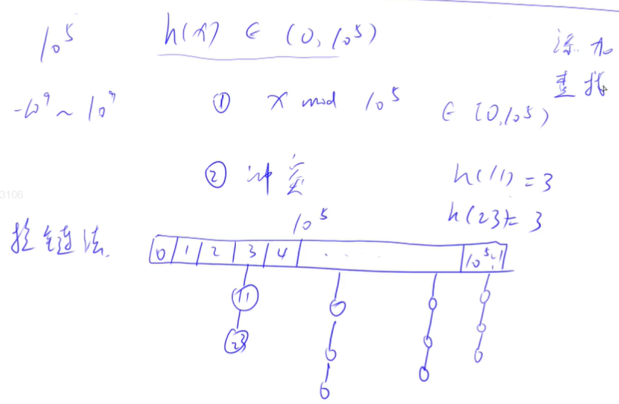
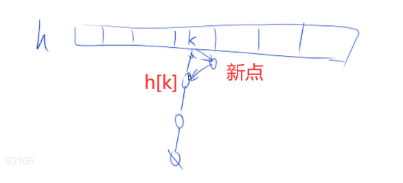
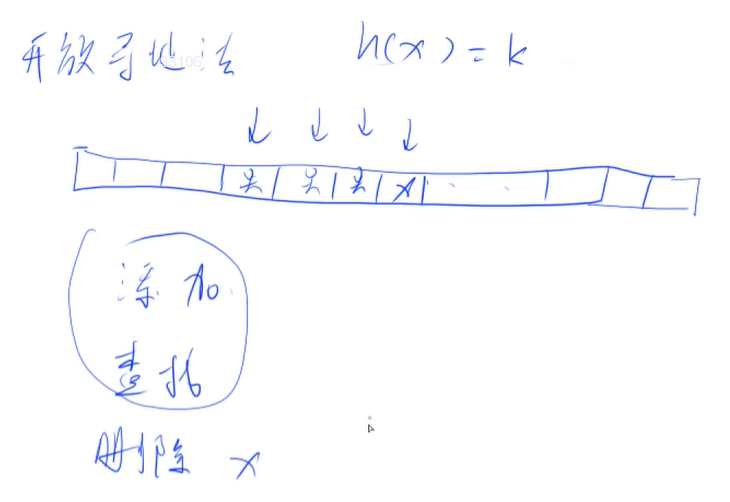
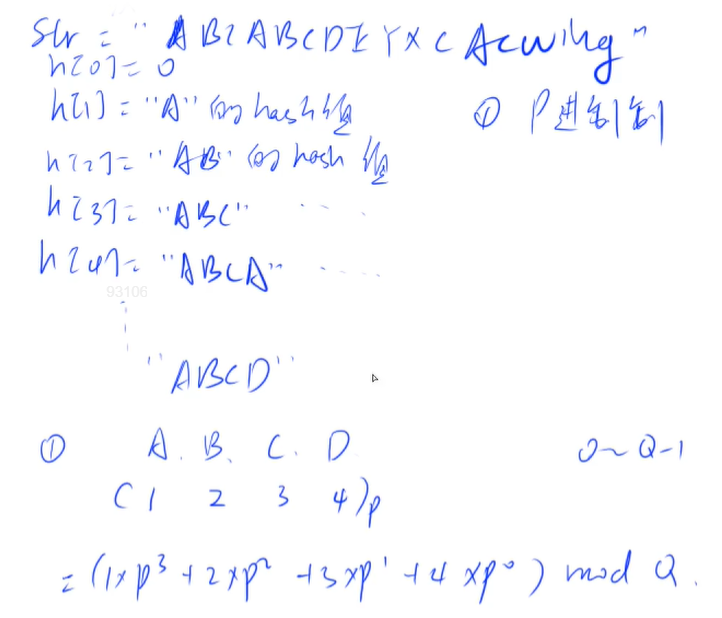
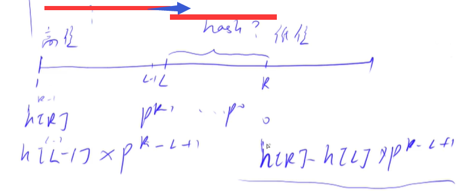

<!-- @import "[TOC]" {cmd="toc" depthFrom=1 depthTo=4 orderedList=false} -->

<!-- code_chunk_output -->

- [哈希表](#哈希表)
  - [模拟散列表模板](#模拟散列表模板)
  - [拉链法](#拉链法)
  - [开放寻址法](#开放寻址法)
- [字符串哈希](#字符串哈希)
  - [字符串前缀哈希法](#字符串前缀哈希法)
  - [字符串哈希模板](#字符串哈希模板)
- [Cpp的STL](#cpp的stl)
  - [vector, 变长数组，倍增的思想](#vector-变长数组倍增的思想)
  - [pair<int, int>](#pairint-int)
  - [string，字符串](#string字符串)
  - [queue, 队列](#queue-队列)
  - [priority_queue, 优先队列，默认是大根堆](#priority_queue-优先队列默认是大根堆)
  - [stack, 栈](#stack-栈)
  - [deque, 双端队列](#deque-双端队列)
  - [set, map, multiset, multimap, 基于平衡二叉树（红黑树），动态维护有序序列](#set-map-multiset-multimap-基于平衡二叉树红黑树动态维护有序序列)
  - [set/multiset](#setmultiset)
  - [map/multimap](#mapmultimap)
  - [unordered_set, unordered_map, unordered_multiset, unordered_multimap, 哈希表](#unordered_set-unordered_map-unordered_multiset-unordered_multimap-哈希表)
  - [bitset, 圧位](#bitset-圧位)

<!-- /code_chunk_output -->

### 哈希表
主要介绍：
- 哈希表的存储结构：开放寻址法、拉链法（处理冲突）
- 字符串哈希方式

#### 模拟散列表模板
- 维护一个集合，支持如下几种操作：
  - I x，插入一个数 x；
  - Q x，询问数 x 是否在集合中出现过；
现在要进行 N 次操作，对于每个询问操作输出对应的结果。

输入格式
- 第一行包含整数 N，表示操作数量。
- 接下来 N 行，每行包含一个操作指令，操作指令为 I x，Q x 中的一种。

输出格式
- 对于每个询问指令 Q x，输出一个询问结果，如果 x 在集合中出现过，则输出 Yes，否则输出 No。
- 每个结果占一行。

**思考：**
- 一般我们取模来做hash：`x mod 1e5`，其实我们的模一般取一个质数，这样冲突的概率是最小的
- 数的范围是 1e-9 到 1e9 的整数，有冲突怎么办？开放寻址法、拉链法

##### 求大于1e5的第一个质数
```cpp
int main()
{
  for (int i = 1e5; ; i++)
  {
    bool flag = true;
    for (int j = 2; j * j <= i; j ++)
    {
      if (i % j == 0)
      {
        flag = false;
        break;
      }
    }
    if (flag)
    {
      cout << i << endl;
      break;
    }
  }
}
```

是 `100003` 。

#### 拉链法


一般来讲，我们认为哈希表拉链的每条链长度是一个常数，因此拉链法时间复杂度是 O(1) 。

```cpp
#include <iostream>
#include <cstring>

using namespace std;

const int N = 1e5 + 3;  // 质数

int h[N], e[N], ne[N], idx;  // N 个链表，因为表头是 h[N] ，有 N 个

void insert(int x)
{
    int k = (x % N + N) % N;
    e[idx] = x;
    ne[idx] = h[k];
    h[k] = idx ++;  // h[k] = idx， idx ++ 后的值与本链表无关
}

bool find(int x)
{
    int k = (x % N + N) % N;
    for (int i = h[k]; i != -1; i = ne[i])
        if (e[i] == x)
            return true;
    return false;
}

int main()
{
    int n;
    scanf("%d", &n);
    
    memset(h, -1, sizeof h);
    
    int x;
    char op[2];
    while(n --)
    {
        scanf("%s", op);
        scanf("%d", &x);
        if (op[0] == 'I') insert(x);
        if (op[0] == 'Q')
        {
            if (find(x)) printf("Yes\n");
            else printf("No\n");
        }
    }
    return 0;
}
```



上述代码结合图片更好解释：
- 我们用 cstring 中的 memset 来把 h 中的每个值都初始化为 -1 ，因此，`h[N], e[N], ne[N], idx;`表示多个链表
- 对于新插入哈希表的点，我们将其插在那个哈希值 k 对应的链表的表头

**经验：**
- `memset` 在 `cstring` 中
- `% N` 可以取到负值，因此要 `(x % N + N) % N`

#### 开放寻址法



一般来讲，开放寻址法的数组大小是我们存储数字总数量的 2-3 倍。

```cpp
#include <iostream>
#include <cstring>

using namespace std;

const int N = 2e5 + 3;  // 质数
const int null = 0x3f3f3f3f;  // 0x3f3f3f3f 比 2e5 要大

int h[N];

int find(int x)
{
    int t = (x % N + N) % N;
    while (h[t] != null && h[t] != x)  // 有数了，并且不是 x
    {
        t ++;
        if (t == N) t = 0;
    }
    return t;
}

int main()
{
    memset(h, 0x3f, sizeof h);  // 注意 memset 按照字节赋值

    int n;
    scanf("%d", &n);
    
    int x;
    char op[2];
    while(n --)
    {
        scanf("%s", op);
        scanf("%d", &x);
        int k = find(x);
        if (*op == 'I') h[k] = x;
        if (*op == 'Q')
        {
            if (h[k] == null) printf("No\n");
            else printf("Yes\n");
        }
    }
    return 0;
}
```

此外，无论是拉链法还是开放寻址法，对于`删除`操作，我们都是给已有元素位置打个标记。

**经验：**
- memset按照字节赋值，而 0x3f3f3f3f 正好每个字节都是 0x3f
- 我们开始忘了修改 `bool find(int x)` 为 `int find(int x)` 导致其只返回 1
- 这里还用 `*op` 获取了 `char op[]` 的第一个值
### 字符串哈希
#### 字符串前缀哈希法



**方法：**
- 把前缀分别哈希，如何哈希呢？
- 把字符串视为一个 P 进制的数，则 `ABCD` 对应数字 `1234` ，十进制的值就是 `1 * P^3 + 2 * P^2 + 3 * P^1 + 4 * P^0`
- 接着，把这个值模 Q ，得到哈希值

**注意：**
- 不能映射成 `0` ，否则 `AA` 与 `AAA` 值相同
- 我们这里不处理哈希碰撞，假定不会冲突。经验值为：`P=131`或`P=13331`时，将`Q=2^64`，几乎不会冲突

**举例：求字符串L到R子串的哈希值**



- 已知：
  - 从 1 到 L-1 的哈希值
  - 从 1 到 R 的哈希值
- 因为我们将其看成 P 进制数，左边是高位，右边是低位
- 我们将 `1 到 L-1 的哈希值` 的哈希值与 `L 到 R 的哈希值`在低位对齐，比如（引用自[chocolate-emperor](https://www.acwing.com/solution/content/24738/)）：
  - ABCDE 与 ABC 的前三个字符值是一样，只差两位
  - 乘上P的2次方把 ABC 变为 ABC00，再用 ABCDE - ABC00 得到 DE 的哈希值

#### 字符串哈希模板
- 给定一个长度为 n 的字符串，再给定 m 个询问，每个询问包含四个整数 l1,r1,l2,r2，请你判断 [l1,r1] 和 [l2,r2] 这两个区间所包含的字符串子串是否完全相同。
- 字符串中只包含大小写英文字母和数字。

输入格式
- 第一行包含整数 n 和 m，表示字符串长度和询问次数。
- 第二行包含一个长度为 n 的字符串，字符串中只包含大小写英文字母和数字。
- 接下来 m 行，每行包含四个整数 l1,r1,l2,r2，表示一次询问所涉及的两个区间。
- 注意，字符串的位置从 1 开始编号。

输出格式
- 对于每个询问输出一个结果，如果两个字符串子串完全相同则输出 Yes，否则输出 No。
- 每个结果占一行。

```cpp
#include <iostream>
using namespace std;

typedef unsigned long long ULL;

const int N = 1e5 + 10, P = 131;
ULL p[N], h[N];  // 注意！是 ULL；h[i] 是前缀 i 的哈希值

ULL get(int l, int r)
{
    return h[r] - h[l - 1] * p[r - l + 1];  // p 的 [r - l + 1] 次方
}

int main()
{
    int n, m;
    char str[N];
    scanf("%d%d", &n, &m);
    scanf("%s", str + 1);  // str[0] 不赋值，因为题目下标从 1 开始
    
    // 先把 p 也初始化
    p[0] = 1;
    for (int i = 1; i <= n; i ++)
    {
        h[i] = h[i - 1] * P + str[i];  // str[i] 是低位
        p[i] = p[i - 1] * P;
    }
    
    while (m --)
    {
        int l1, r1, l2, r2;
        scanf("%d%d%d%d", &l1, &r1, &l2, &r2);

        if (get(l1, r1) == get(l2, r2)) puts("Yes");
        else puts("No");
    }
    
    return 0;
}
```

**经验：**
- 我们定义 `unsigned long long` 就相当于模 Q 了，因为溢出（超出 2^64）相当于自动取了模

本来字符串比较需要一个一个字符地比较，而哈希这里只需要 O(1) 。

### Cpp的STL
#### vector, 变长数组，倍增的思想
- size()  返回元素个数（所有容器都有，时间复杂度`O(1)`）
- empty()  返回是否为空（所有容器都有，时间复杂度`O(1)`）
- clear()  清空
- front()/back()
- push_back()/pop_back()
- begin()/end() 迭代器，返回指针
- []
- 支持比较运算，按字典序

```cpp
vector<int> a(n);  // 定义长度为 n 的 vector
vector<int> a(10, 3);  // 长度为 10 的 vector ，里面每个数都是 3
vector<int> a[10];  // 这是定义了 10 个 vector
```

**倍增思想：**
- 系统为某一个程序分配空间时，所需的时间与空间大小无关，而与申请次数有关
- 因此，变长数组要尽量减少申请空间的次数，但是可以浪费空间
- 对于 vector ，先开始给分配 32 的空间，32个元素满了，我们申请一个 64 的空间，把 32 copy 过去
- 对于 1e6 个元素，我们每次申请的空间为 $1 + 2 + 4 + 8 + ... + 5 \times 10^5 \approx 10^6$ ，我们申请长度 1e6 的空间，总共 copy 次数大概是 1e6 ，因此插入的平均时间复杂的 O(1)
- 开辟空间次数 log(n)

```cpp
// 遍历方式
for (int i = 0; i < a.size(); i++) a[i];

// 迭代器返回指针
for (vector<int>::iterator i = a.begin(); i != a.end(); i ++) *i;

for (auto x : a) x;
```

```cpp
// 支持比较运算
vector<int> a(4, 3), b(3, 4);

if (a < b) puts("a < b");
```
上述是支持的。

#### pair<int, int>
- first, 第一个元素
- second, 第二个元素
- 支持比较运算，以first为第一关键字，以second为第二关键字（字典序，长度为2的字符串）

```cpp
pair<int, string> p;

p = make_pair(10, "OK");
p = (20, "abc");

pair <int, pair<int, int>> p;
```

#### string，字符串
- size()/length()  返回字符串长度
- empty()
- clear()
- substr(起始下标，(子串长度))  返回子串
- c_str()  返回字符串所在字符数组的起始地址

#### queue, 队列
- size()
- empty()
- push()  向队尾插入一个元素
- front()  返回队头元素
- back()  返回队尾元素
- pop()  弹出队头元素

```cpp
#include <queue>
```

#### priority_queue, 优先队列，默认是大根堆
- size()
- empty()
- push()  插入一个元素
- top()  返回堆顶元素
- pop()  弹出堆顶元素

如何做小根堆？方法一是插入负值。

另一种方法，基于模板：
```cpp
#include <queue>  // 需要引入 queue
using namespace std;

// 定义小根堆
priority_queue<int, vector<int>, greater<int>> heap;
```

`greater<int>` 改为 `less<int>` ，就是大根堆。

#### stack, 栈
- size()
- empty()
- push()  向栈顶插入一个元素
- top()  返回栈顶元素
- pop()  弹出栈顶元素

#### deque, 双端队列
- size()
- empty()
- clear()
- front()/back()
- push_back()/pop_back()
- push_front()/pop_front()
- begin()/end()
- []

这其实是加强版 vector 。缺点是速度慢。

#### set, map, multiset, multimap, 基于平衡二叉树（红黑树），动态维护有序序列
- size()
- empty()
- clear()
- begin()/end()
- ++, -- 返回前驱和后继，时间复杂度 O(logn)

#### set/multiset
- insert()  插入一个数
- find()  查找一个数
- count()  返回某一个数的个数
- erase()
  - (1) 输入是一个数x，删除所有x   `O(k + logn)`，`k`是x的个数
  - (2) 输入一个迭代器，删除这个迭代器
- lower_bound()/upper_bound()
  - **lower_bound(x)  返回大于等于x的最小的数的迭代器**
  - **upper_bound(x)  返回大于x的最小的数的迭代器**

#### map/multimap
  - insert()  插入的数是一个pair
  - erase()  输入的参数是pair或者迭代器
  - find()
  - []  注意multimap不支持此操作。 时间复杂度是 O(logn)
  - lower_bound()/upper_bound()

```cpp
#include <map>
using namespace std;

map<string, int> a;

a["yxc"] = 1;
```

set里面不能有重复元素，multiset可以。

#### unordered_set, unordered_map, unordered_multiset, unordered_multimap, 哈希表
- 和上面类似，但是绝大部分增删改查的时间复杂度是 O(1)
- 不支持 lower_bound()/upper_bound()、迭代器的++，--

凡是和排序有关的操作都不支持。

#### bitset, 圧位
- `bitset<10000> s;`
- `~, &, |, ^`
- `>>, <<`
- `==, !=`
- `[]`
- count()  返回有多少个1
- any()  判断是否至少有一个1
- none()  判断是否全为0
- set()  把所有位置成1
- set(k, v)  将第k位变成v
- reset()  把所有位变成0
- flip()  等价于~
- flip(k) 把第k位取反

cpp 里一个 bool 是一个字节，因此 1024 个 bool 就是 1024 B 就是 1 KB 。如果用一个位表示布尔值，那就只需要 128 B 来表示 1024 个 bool 。

假设需要 10000*10000 的布尔矩阵，那就大概需要 1e8 的字节，也就是 100 MB 空间。

但是题目空间限制 64 MB ，我们用 bitset 来存，只需要 12 MB 空间就好。

