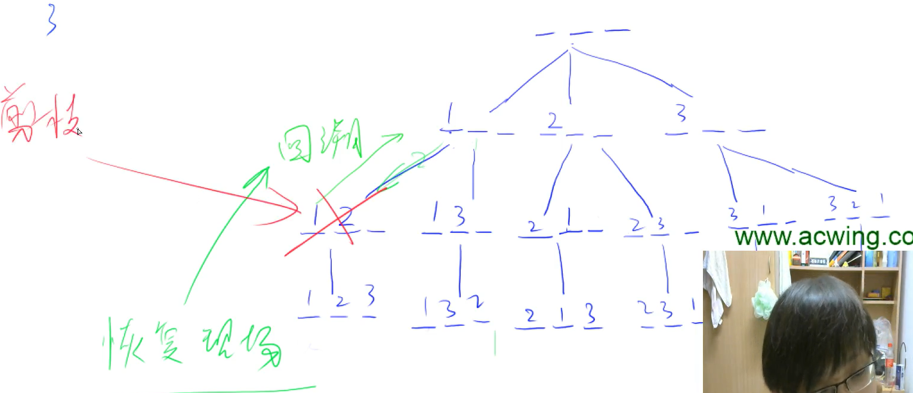

<!-- @import "[TOC]" {cmd="toc" depthFrom=1 depthTo=4 orderedList=false} -->

<!-- code_chunk_output -->

- [DFS与BFS对比](#dfs与bfs对比)
- [DFS](#dfs)
  - [DFS最简单模板](#dfs最简单模板)
  - [n皇后问题两种做法](#n皇后问题两种做法)
- [BFS](#bfs)
  - [走迷宫问题](#走迷宫问题)
  - [八数码](#八数码)

<!-- /code_chunk_output -->

### DFS与BFS对比
- DFS：深度优先搜索 Depth First Search
- BFS：广度优先搜索 Breadth First Search

对比：
- DFS 使用 stack 实现（也不一定），空间为 $O(h)$ ，因为只记录本条路径
- BFS 使用 queue 实现，空间为 $O(2^h)$ ，因为记录所有路径
- DFS 不具有最短性，BFS 得到的是最短路

### DFS
搜索流程从树的角度考虑。

DFS 俗称暴力搜索，最重要地考虑顺序。


最难的是“回溯”与“剪枝”。回溯时记得`恢复现场`。



#### DFS最简单模板
- 给定一个整数 n，将数字 1∼n 排成一排，将会有很多种排列方法。
- 现在，请你按照字典序将所有的排列方法输出。

输入格式
- 共一行，包含一个整数 n。

输出格式
- 按字典序输出所有排列方案，每个方案占一行。

```cpp
#include <iostream>
using namespace std;

const int N = 10;
int path[N], n;
bool state[N];

void dfs(int u)  // u 是在第几层
{
    if (u == n) 
    {
        for (int i = 0; i < n; i ++)
            printf("%d ", path[i]);
        puts("");
        return ;
    }
    
    for (int i = 0; i < n; i ++)
    {
        if (!state[i])  // 数字 i 还没被用过
        {
            state[i] = true;
            path[u] = i + 1;  // 题目中数值从 1 开始记录
            dfs(u + 1);
            state[i] = false;  // 回溯：恢复现场
        }
    }

    return;
}

int main()
{
    cin >> n;
    
    for (int i = 0; i < n; i ++) state[i] = false;

    dfs(0);
    return 0;
}
```

**经验：**
- 注意 `dfs();` 后，接着执行的语句属于回溯，要 “恢复现场” 

此外，还有一种方法，更优雅。

```cpp
#include <iostream>
using namespace std;

const int N = 10;
int path[N], n, state;

void dfs(int u, int state)  // u 是在第几层， state 每一个为代表是否用过数字
{
    if (u == n) 
    {
        for (int i = 0; i < n; i ++)
            printf("%d ", path[i]);
        puts("");
        return ;
    }
    
    for (int i = 0; i < n; i ++)
    {
        if (!(state & (1 << i)))  // 数字 i 还没被用过
        {
            path[u] = i + 1;  // 题目中数值从 1 开始记录
            dfs(u + 1, state + (1 << i));  // 传入状态表征，无需“恢复现场”
        }
    }

    return;
}

int main()
{
    cin >> n;

    dfs(0, 0);
    return 0;
}
```

#### n皇后问题两种做法
- n−皇后问题是指将 n 个皇后放在 n×n 的国际象棋棋盘上，使得皇后不能相互攻击到，即任意两个皇后都不能处于同一行、同一列或同一斜线上。


- 现在给定整数 n，请你输出所有的满足条件的棋子摆法。

输入格式
- 共一行，包含整数 n。

输出格式
- 每个解决方案占 n 行，每行输出一个长度为 n 的字符串，用来表示完整的棋盘状态。
- 其中 `.` 表示某一个位置的方格状态为空，`Q` 表示某一个位置的方格上摆着皇后。
- 每个方案输出完成后，输出一个空行。
- 注意：行末不能有多余空格。
- 输出方案的顺序任意，只要不重复且没有遗漏即可。

##### n皇后问题做法1

**思路：**
- `1324`可以表示第一行的第一列放一个皇后，第二行的第三列放一个皇后...
- 因此，我们把其变成了正整数排序问题


- 如上，我们用 `dg[]` 和 `udg[]` 记录各个对角线上是否已经有了皇后
- 已知皇后横纵坐标，如何确定其所在对角线呢？**用借据作为对角线编号** 相同方向的对角线，如果截距相同，则一定是同一个对角线
- 已知 `x, y` ，则其正对角线截距 `y-x` ，反对角线截距 `x-y` ，而正对角线截距可能为负值，因此编号向上偏移 `n` ，为 `y-x+n`


对角线计算如上图。

```cpp
#include <iostream>
using namespace std;

const int N = 20;
int n;
bool col[N], dg[N], udg[N];
char g[N][N];

void dfs(int u)
{
    if (u == n) {
        for (int i = 0; i < n; i ++)
        {
            puts(g[i]);
        }
        puts("");
        return ;  // 差点忘了 return ;
    }

    for (int i = 0; i < n; i ++)
    {
        if (!col[i] && !dg[u - i + n] && !udg[u + i])
        {
            col[i] = dg[u - i + n] = udg[u + i] = true;
            g[u][i] = 'Q';
            dfs(u + 1);
            col[i] = dg[u - i + n] = udg[u + i] = false;  // 恢复现场
            g[u][i] = '.';
        }
    }
    return ;
}

int main()
{
    cin >> n;
    
    for (int i = 0; i < n; i ++)
        for (int j = 0; j < n; j ++)
            g[i][j] = '.';
    
    dfs(0);
    return 0;
}
```

**经验：**
- `col[i] = dg[u - i + n] = udg[u + i] = true;` CPP 中多变量赋同值
- `bool[]` 数组的默认初始值是 false

时间复杂度（最坏）为 $O(n \cdot n!)$ 。

##### n皇后问题做法2


**思路：**
- 我们不按照行来枚举
- 而是按照格子枚举

```cpp
#include <iostream>
using namespace std;

const int N = 20;
int n;
bool row[N], col[N], dg[N], udg[N];
char g[N][N];

void dfs(int x, int y, int s)  // s 皇后数量
{
    if (y == n) y = 0, x ++ ;

    if (x == n)
    {
        if (s == n) {
            for (int i = 0; i < n; i ++)
            {
                puts(g[i]);
            }
            puts("");
        } 
        return ;  // 这个 return 位置要正确，否则死循环
    }

    
    // 不放皇后
    dfs(x, y + 1, s);

    // 符合条件的话，放皇后
    if (!row[x] && !col[y] && !dg[x - y + n] && !udg[x + y])  // 比按 row 的方法多了 row[] 的判断
    {
        row[x] = col[y] = dg[x - y + n] = udg[x + y] = true;
        g[x][y] = 'Q';
        dfs(x, y + 1, s + 1);
        row[x] = col[y] = dg[x - y + n] = udg[x + y] = false;  // 恢复现场
        g[x][y] = '.';
    }
    return ;
}

int main()
{
    cin >> n;
    
    for (int i = 0; i < n; i ++)
        for (int j = 0; j < n; j ++)
            g[i][j] = '.';
    
    dfs(0, 0, 0);
    return 0;
}
```

时间复杂度为 $O(2^{n^2})$ 。

### BFS
基本框架：维护一个队列。


#### 走迷宫问题
- 给定一个 $n\times m$ 的二维整数数组，用来表示一个迷宫，数组中只包含 0 或 1，其中 0 表示可以走的路，1 表示不可通过的墙壁。
- 最初，有一个人位于左上角 (1,1) 处，已知该人每次可以向上、下、左、右任意一个方向移动一个位置。
- 请问，该人从左上角移动至右下角 (n,m) 处，至少需要移动多少次。
- 数据保证 (1,1) 处和 (n,m) 处的数字为 0，且一定至少存在一条通路。

输入格式
- 第一行包含两个整数 n 和 m。
- 接下来 n 行，每行包含 m 个整数（0 或 1），表示完整的二维数组迷宫。

输出格式
- 输出一个整数，表示从左上角移动至右下角的最少移动次数。

**思考：**
- DFS 可以保证找到重点，但没法保证最短

```cpp
#include <iostream>
#include <queue>
#include <cstring>
using namespace std;

typedef pair<int, int> PII;
const int N = 110;

int n, m;
int g[N][N], d[N][N];
queue<PII> q;

int bfs()
{
    memset(d, -1, sizeof d);
    d[0][0] = 0;
    q.push({0, 0});
    
    int dx[4] = {0, 1, 0, -1};
    int dy[4] = {1, 0, -1, 0};
    
    while (q.size())
    {
        auto t = q.front();
        q.pop();
        
        for (int i = 0; i < 4; i ++)
        {
            int x = t.first + dx[i], y = t.second + dy[i];

            if (x >= 0 && x < n && y >= 0 && y < m && d[x][y] == -1 && g[x][y] == 0)  // 去 d[x][y] == -1 没经过的点
            {
                d[x][y] = d[t.first][t.second] + 1;
                q.push({x, y});
                // cout << x << " " << y << " " << d[x][y] << endl;
            }
        }
    }

    return d[n-1][m-1];
}

int main()
{
    cin >> n >> m;
    for (int i = 0; i < n; i ++)  // 很狗，这里写成 for(int i = 0; i ++ ; i < n) 了， Debug 半天
        for (int j = 0; j < m; j ++)
            cin >> g[i][j];

    cout << bfs();

    return 0;
}
```

#### 八数码
- 在一个 $3\times 3$ 的网格中，1∼8 这 8 个数字和一个 x 恰好不重不漏地分布在这 $3\times 3$ 的网格中。
- 例如：
```
1 2 3
x 4 6
7 5 8
```

- 在游戏过程中，可以把 x 与其上、下、左、右四个方向之一的数字交换（如果存在）。
- 我们的目的是通过交换，使得网格变为如下排列（称为正确排列）：
```
1 2 3
4 5 6
7 8 x
```
- 例如，示例中图形就可以通过让 x 先后与右、下、右三个方向的数字交换成功得到正确排列。
- 交换过程如下：
```
1 2 3   1 2 3   1 2 3   1 2 3
x 4 6   4 x 6   4 5 6   4 5 6
7 5 8   7 5 8   7 x 8   7 8 x
```
- 现在，给你一个初始网格，请你求出得到正确排列至少需要进行多少次交换。

输入格式
- 输入占一行，将 3×3 的初始网格描绘出来。
- 例如，如果初始网格如下所示：
```
1 2 3 
x 4 6 
7 5 8 
```
- 则输入为：1 2 3 x 4 6 7 5 8

输出格式
- 输出占一行，包含一个整数，表示最少交换次数。
- 如果不存在解决方案，则输出 −1。

**思考：**
- 把当前状态看成一个节点
- 难点在于：
  - 状态表示比较复杂（如何把状态放在 queue 里？）
  - 距离数组的下标如何表示？
- 一种简单的方式是，用字符串来表示；且距离用 `unordered_map<string, int> dist` 来记录

```cpp
#include <iostream>
#include <unordered_map>
#include <string>
#include <algorithm>
#include <queue>

using namespace std;

int bfs(string state)
{
    string end = "12345678x";
    unordered_map<string, int> d;
    queue<string> q;
    
    d[state] = 0;
    q.push(state);
    
    int dx[4] = {0, 1, 0, -1};
    int dy[4] = {1, 0, -1, 0};
    
    while (q.size())
    {
        auto t = q.front();
        q.pop();
        int dist = d[t];
        
        if (t == end) return dist;
        
        auto idx = t.find('x');  // 用 find 返回字符在 string 中位置
        int x = idx / 3, y = idx % 3;
        for (int i = 0; i < 4; i ++)
        {
            int a = x + dx[i], b = y + dy[i];
            if (a >= 0 && a < 3 && b >= 0 && b < 3)
            {
                swap(t[a * 3 + b], t[idx]);
                if (!d.count(t))  // 检查 map 的 key 里是否有 t
                {
                    q.push(t);
                    d[t] = dist + 1;
                }
                swap(t[a * 3 + b], t[idx]);  // 清理现场
            }
        }
    }
    
    return -1;
}

int main()
{
    string state;
    char s[2];
    for (int i = 0; i < 9; i ++)
    {
        cin >> s;
        state += *s;
    }

    cout << bfs(state);
    return 0;
}
```

**经验：**
- 获取字符串字符的方式如下
- 可以用 `string_obj.find('x')` 来返回字符在 string 中位置
- `if (!d.count(t))` 检查 map 的 key 里是否有 t

```cpp
string state;
char s[2];
for (int i = 0; i < 9; i ++)
{
    cin >> s;
    state += *s;
}
```

> 学到 1:15:29