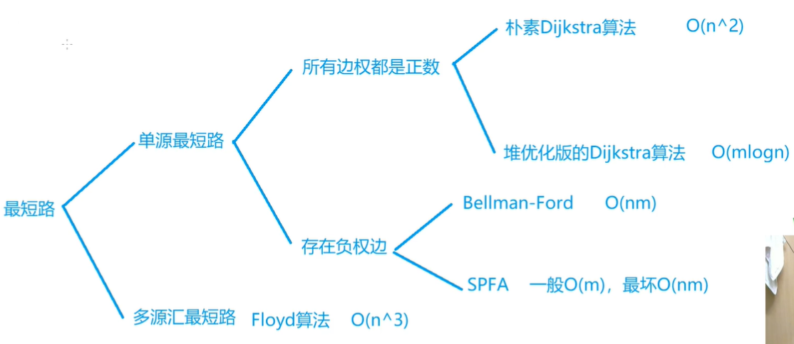
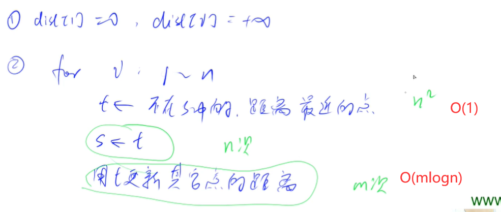
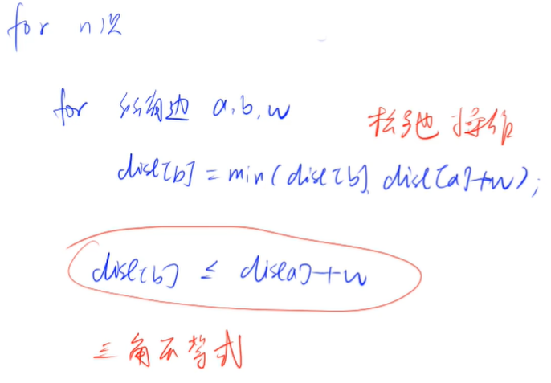
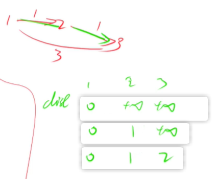

<!-- @import "[TOC]" {cmd="toc" depthFrom=1 depthTo=4 orderedList=false} -->

<!-- code_chunk_output -->

- [最短路](#最短路)
- [朴素 Dijkstra 算法](#朴素-dijkstra-算法)
  - [Dijkstra求最短路 I](#dijkstra求最短路-i)
- [堆优化版的 Dijkstra 算法](#堆优化版的-dijkstra-算法)
  - [Dijkstra求最短路 II](#dijkstra求最短路-ii)
- [bellman-ford（负权）](#bellman-ford负权)
  - [有边数限制的最短路](#有边数限制的最短路)

<!-- /code_chunk_output -->

### 最短路
最短路分为：
- 单源最短路（1点到n点的最短距离）
- 多源汇最短路
  - 源点就是起点、汇点就是终点
  - 多源汇就是多个起点终点

我们约定 `n` 为点个数， `m` 为边个数。

单元最短路又可分为：
- 所有边权都是正数：
  - 朴素 Dijkstra 算法（时间复杂度 $O(n^2)$）
  - 堆优化版的 Dijkstra 算法（时间复杂度 $O(m\log n)$）
  - 因此，朴素 Dijkstra 算法更适合稠密图，与边数量无关
- 存在负权边：
  - Bellman-Ford 时间复杂度 $O(nm)$
  - SPFA 一般为 $O(m)$ ，最坏 $O(nm)$

而多源汇最短路一般用 Floyd 算法 $O(n^3)$ 。



最短路一般考察：**建图** 。如何把问题抽象为图问题。

### 朴素 Dijkstra 算法

[Ni](https://www.acwing.com/solution/content/5806/)：进行n次迭代去确定每个点到起点的最小值，最后输出的终点的即为我们要找的最短路的距离。

[Dijkstra算法原理](https://blog.csdn.net/yalishadaa/article/details/55827681)：
- (1) 初始时，S只包含起点s；U包含除s外的其他顶点，且U中顶点的距离为"起点s到该顶点的距离"[例如，U中顶点v的距离为(s,v)的长度，然后s和v不相邻，则v的距离为∞]。
- (2) 从U中选出"距离最短的顶点k"，并将顶点k加入到S中；同时，从U中移除顶点k。
- (3) 更新U中各个顶点到起点s的距离。之所以更新U中顶点的距离，是由于上一步中确定了k是求出最短路径的顶点，从而可以利用k来更新其它顶点的距离；例如，(s,v)的距离可能大于(s,k)+(k,v)的距离。
- (4) 重复步骤(2)和(3)，直到遍历完所有顶点。

说白了，就是这个思想：
- 有两个集合，以及固定了最小距离的 A ，以及不知道的是不是最小距离的 B ；
- 每次都把 B 中 dist 最小的顶点 t 放进 A ，然后拿这个点去更新 B 中剩下的点的距离 `dist[j] = min(dist[j], dist[t] + g[t][j])`
- 如此往复

#### Dijkstra求最短路 I
- 给定一个 n 个点 m 条边的有向图，图中可能存在重边和自环，所有边权均为正值。
- 请你求出 1 号点到 n 号点的最短距离，如果无法从 1 号点走到 n 号点，则输出 −1。

输入格式
- 第一行包含整数 n 和 m。
- 接下来 m 行每行包含三个整数 x,y,z，表示存在一条从点 x 到点 y 的有向边，边长为 z。

输出格式
- 输出一个整数，表示 1 号点到 n 号点的最短距离。
- 如果路径不存在，则输出 −1。

**思考：**
- 稠密图，用邻接矩阵表达

```cpp
#include <iostream>
#include <cstring>
#include <algorithm>
using namespace std;

const int N = 501;

int n, m;
int a, b, c;
int g[N][N], d[N];
bool st[N];

void dijkstra()
{
    memset(d, 0x3f, sizeof d);
    d[1] = 0;
    
    for (int i = 0; i < n - 1; i ++ )  // 循环 n - 1 次
    {
        // 下面在找不属于 S 的距离最小值
        int t = -1;  // t = -1 保证至少取到一个点，配合下面的 t == -1
        for (int j = 1; j <= n; j ++ )
            if (!st[j] && (t == -1 || d[t] > d[j]))
                t = j;
        
        // 更新
        for (int j = 1; j <= n; j ++ )
            d[j] = min(d[j], d[t] + g[t][j]);
        
        st[t] = true;
    }
    
    if (d[n] == 0x3f3f3f3f) d[n] = -1;
}


int main()
{
    scanf("%d%d", &n, &m);
    
    memset(g, 0x3f, sizeof g);
    
    while (m -- )
    {
        scanf("%d%d%d", &a, &b, &c);
        g[a][b] = min(g[a][b], c);
    }
    
    dijkstra();
    
    printf("%d", d[n]);
    
    return 0;
}
```

### 堆优化版的 Dijkstra 算法
如果有 `n=1e5` ，则 `n**2 = 1e10` 会超时。

因此，思考如何优化。



如上，在朴素 Dijkstra 中，寻找最短的 `dist` 时间复杂度是 $O(n^2)$ ，因此，我们用堆来存储，让其时间复杂度为 $O(1)$ ；而这会导致更新各店的时间复杂度变为 $O(m \log n)$ 。

#### Dijkstra求最短路 II
- 给定一个 n 个点 m 条边的有向图，图中可能存在重边和自环，所有边权均为非负值。
- 请你求出 1 号点到 n 号点的最短距离，如果无法从 1 号点走到 n 号点，则输出 −1。

输入格式
- 第一行包含整数 n 和 m。
- 接下来 m 行每行包含三个整数 x,y,z，表示存在一条从点 x 到点 y 的有向边，边长为 z。

输出格式
- 输出一个整数，表示 1 号点到 n 号点的最短距离。
- 如果路径不存在，则输出 −1。

**分析**：
- 别忘了稀疏图用链表存（不需要处理重边）
- 堆有两种实现方式
  - 自己用数组，这样可以保证能修改堆中任一元素，保证堆的大小总是 `n`
  - 用 `priority_queue` ，这将导致无法修改堆中任意元素，因此使用 `冗余` 的方法插入，这样会导致堆的大小是 `m` ，时间复杂度为 $m \log m < m \log n^2 = 2m \log n$ ，和 $m\log n$ 也没数量级上的区别，因此我们用 `priority_queue`

```cpp
#include <iostream>
#include <cstring>
#include <algorithm>
#include <queue>
#include <vector>
using namespace std;

const int N = 2e5;

typedef pair<int, int> PII;

int h[N], e[N], ne[N], idx, w[N];
int n, m;
int d[N];
bool st[N];

void add(int a, int b, int c)
{
    e[idx] = b, w[idx] = c, ne[idx] = h[a], h[a] = idx ++;
}

void dijkstra()
{
    memset(d, 0x3f, sizeof d);
    d[1] = 0;
    priority_queue<PII, vector<PII>, greater<PII>> heap;
    heap.push({0, 1});  // {距离，点编号}
    
    while(heap.size())
    {
        auto t = heap.top();
        heap.pop();
        
        int ver = t.second, dist = t.first;
        
        if (st[ver]) continue;
        st[ver] = true;
        
        for (int i = h[ver]; i != -1; i = ne[i])
        {
            int j = e[i];
            if (d[j] > d[ver] + w[i])
                d[j] = d[ver] + w[i];
            heap.push({d[j], j});
        }
    }
    
    if (d[n] == 0x3f3f3f3f) d[n] = -1;
}


int main()
{
    scanf("%d%d", &n, &m);
    
    memset(h, -1, sizeof h);
    
    while (m -- )
    {
        int a, b, c;
        scanf("%d%d%d", &a, &b, &c);
        add(a, b, c);
    }
    
    dijkstra();
    
    printf("%d", d[n]);

    return 0;
}
```

### bellman-ford（负权）


遍历所有 `(a, b, w)` 边，之后进行松弛操作。为什么能收敛？利用了三角不等式。

**迭代 n 次，表示最多经管不超过 n 条边。**


注意：
- 不能处理负权回路
- Bellman-Ford算法还可以检测一个图是否含有负权回路，如果在进行n-1轮松弛之后，仍然可以继续松弛，那么次图必然存在负权回路

#### 有边数限制的最短路
- 给定一个 n 个点 m 条边的有向图，图中可能存在重边和自环， **边权可能为负数。**
- 请你求出从 1 号点到 n 号点的最多经过 k 条边的最短距离（**导致只能用**），如果无法从 1 号点走到 n 号点，输出 `impossible。`
- 注意：图中可能 **存在负权回路** 。

输入格式
- 第一行包含三个整数 n,m,k。
- 接下来 m 行，每行包含三个整数 x,y,z，表示存在一条从点 x 到点 y 的有向边，边长为 z。

输出格式
- 输出一个整数，表示从 1 号点到 n 号点的最多经过 k 条边的最短距离。
- 如果不存在满足条件的路径，则输出 `impossible`。

```cpp
#include <iostream>
#include <cstring>
#include <algorithm>
using namespace std;

const int M = 1e4 + 10;
const int N = 510;

int n, m, k;
int a, b, c;
int d[N];
int last[N];  // 备份上一次的 d[N]

struct Edge
{
    int a, b, c;
} edges[M];

void bellman_ford()
{
    memset(d, 0x3f, sizeof d);
    d[1] = 0;

    for (int i = 0; i < k; i ++)
    {
        memcpy(last, d, sizeof d);
        for (int j = 0; j < m; j ++)
        {
            auto e = edges[j];
            d[e.b] = min(d[e.b], last[e.a] + e.c);
        }
    }
}

int main()
{
    scanf("%d%d%d", &n, &m, &k);
    for (int i = 0; i < m; i ++)
    {
        scanf("%d%d%d", &a, &b, &c);
        edges[i] = {a, b, c};
    }
    
    bellman_ford();
    
    if (d[n] > 0x3f3f3f3f / 2) printf("impossible");
    else printf("%d", d[n]);
    
    return 0;
}
```

**经验：**
- 因为本算法中顺序不重要，用结构体保存边信息



**分析：**
- 备份很必要，如上图
- 假设我们 `k=1` ，如果不备份，在第一次迭代中，我们先更新了 `dist[2] = 1`
- 接下啦更新 `dist[3]` ，我们按理说应该是用 `(1, 3, 3)` 来 `dist[3] = 3`
- 然而，因为没有备份，所以本次迭代的结果导致了 `dist[2] = 1` 参与了进来，串联现象产生


为什么有 `dist[n] > 0x3f3f3f3f / 2`? **分析：**
- 我们这里的正无穷设置为 `0x3f3f3f3f` ，并不是数学意义上的正无穷
- 因此，如果减去常数，其数值会变小
- 但是数学意义上不会小，因此考虑计算次数，最后判断时，大于 `0x3f3f3f3f / 2` 都看作正无穷

此外，参考视频：
- [https://www.bilibili.com/video/BV1gb41137u4](https://www.bilibili.com/video/BV1gb41137u4)、[https://www.youtube.com/watch?v=lyw4FaxrwHg](https://www.youtube.com/watch?v=lyw4FaxrwHg)，不好的地方在于，没有备份，没法通过 k 次更新得到 k 次可达的最短路

> 学到1:30