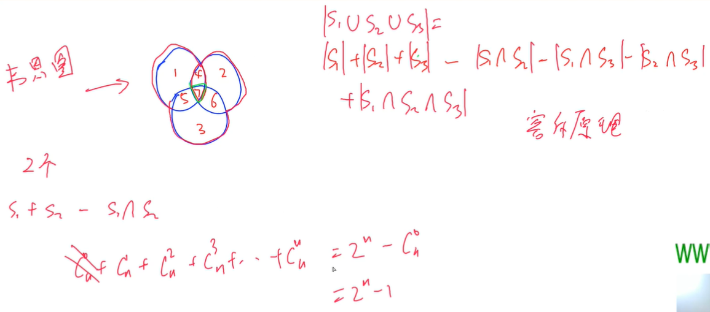
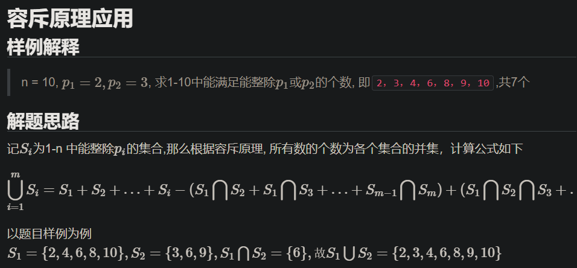
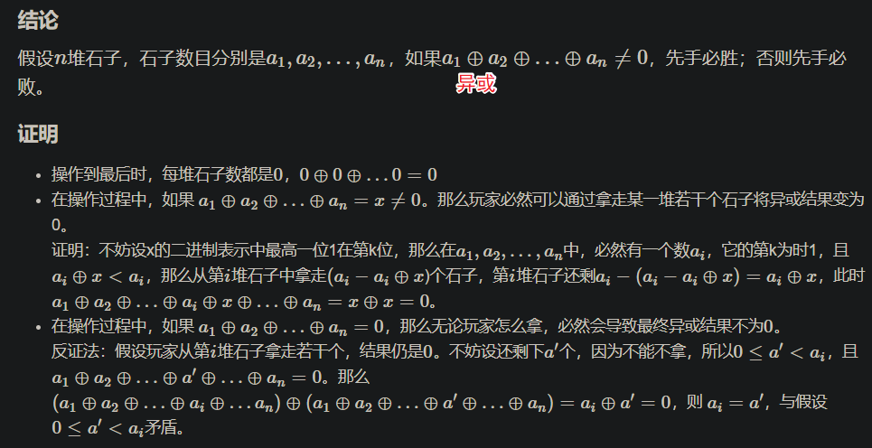
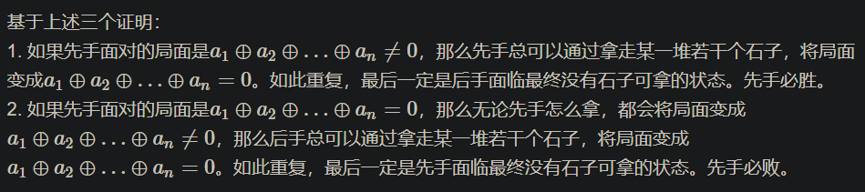
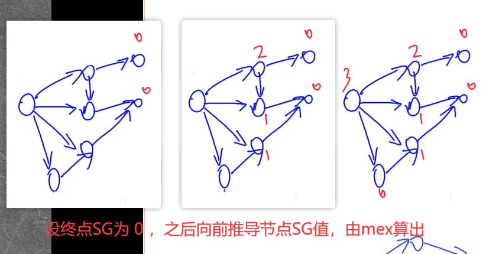
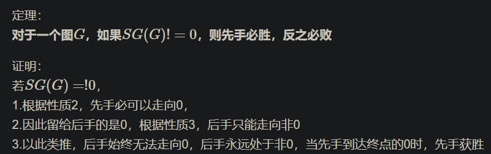
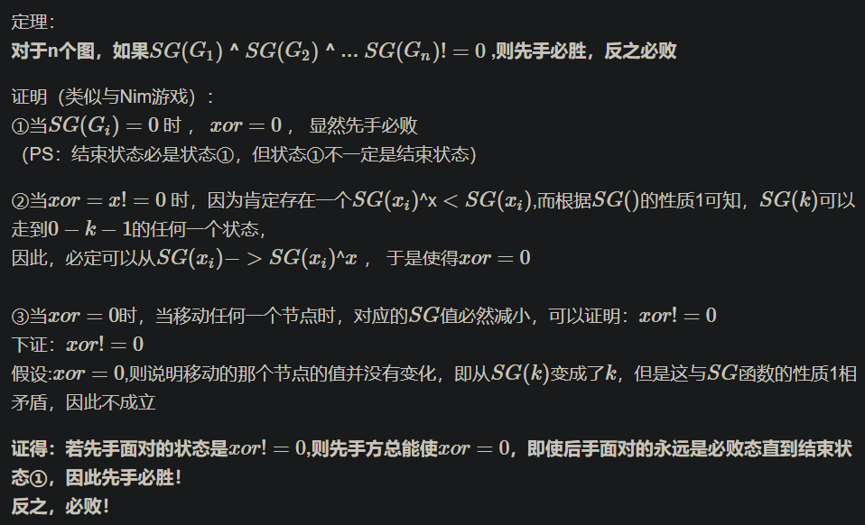
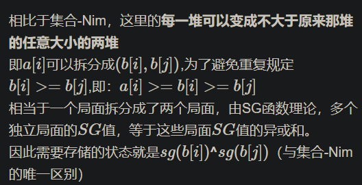
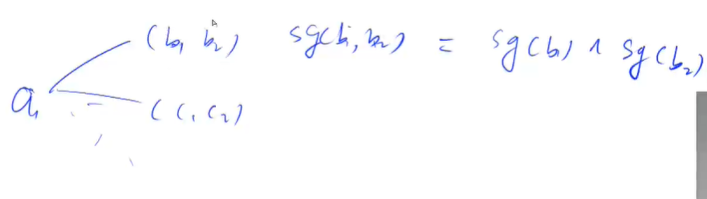

<!-- @import "[TOC]" {cmd="toc" depthFrom=1 depthTo=4 orderedList=false} -->

<!-- code_chunk_output -->

- [容斥原理](#容斥原理)
  - [例题：能被整除的数](#例题能被整除的数)
- [博弈论（公平组合游戏、Nim游戏）](#博弈论公平组合游戏-nim游戏)
  - [公平组合游戏](#公平组合游戏)
  - [基本例题：Nim游戏](#基本例题nim游戏)
  - [例题：台阶-Nim游戏](#例题台阶-nim游戏)
- [博弈论（Mex运算、SG函数等）](#博弈论mex运算-sg函数等)
  - [Mex运算、SG函数以及有向图游戏的和](#mex运算-sg函数以及有向图游戏的和)
  - [例题：集合-Nim游戏](#例题集合-nim游戏)
  - [例题：拆分-Nim游戏](#例题拆分-nim游戏)

<!-- /code_chunk_output -->

### 容斥原理

韦恩图就与容斥原理有关。

[百度百科](https://baike.baidu.com/item/%E5%AE%B9%E6%96%A5%E5%8E%9F%E7%90%86/10146840?fr=aladdin)：如果被计数的事物有A、B、C三类，那么，A类和B类和C类元素个数总和=A类元素个数+B类元素个数+C类元素个数—既是A类又是B类的元素个数—既是A类又是C类的元素个数—既是B类又是C类的元素个数+既是A类又是B类而且是C类的元素个数。（A∪B∪C = A+B+C - A∩B - B∩C - C∩A + A∩B∩C）



如上，$C_n^x$ 表示从 $n$ 个元素中选取 $x$ 的方案数。计算式子一共有 $2^n - 1$ 项，因此时间复杂度是 $O(2^n)$ 。

容斥原理公式：
$$|S_1 \cup S_2 \cup ... \cup S_n|$$
$$= \sum_i |S_i| - \sum_{i,j}|S_i \cap S_j| + \sum_{i,j,k} |S_i \cap S_j \cap S_k| - ...$$

#### 例题：能被整除的数

- 给定一个整数 n 和 m 个不同的质数 $p_1,p_2,…,p_m$。
- 请你求出 1∼n 中能被 $p_1,p_2,…,p_m$ 中的至少一个数整除的整数有多少个。

输入格式
- 第一行包含整数 n 和 m。
- 第二行包含 m 个质数。

输出格式
- 输出一个整数，表示满足条件的整数的个数。

数据范围
- $1≤m≤16$,
- $1≤n,p_i≤10^9$

分析，参考[抽象带师](https://www.acwing.com/solution/content/29702/)：




如上，这里使用了二进制表示状态，结合位运算很巧妙。

```cpp
#include <iostream>
#include <cstring>
#include <algorithm>

using namespace std;

typedef long long LL;

const int N = 16;
int p[N];

int main()
{
    int n, m;
    scanf("%d%d", &n, &m);
    for (int i = 0; i < m; i ++) scanf("%d", &p[i]);
    
    int res = 0;
    for (int i = 1; i < 1 << m; i ++)  // 遍历所有状态，注意是 i < 1 << m
    {
        int t = 1, s = 0;
        for (int j = 0; j < m; j ++)  // 遍历所有质数，抽取出本状态对应的质数
        {
            if (i >> j & 1)
            {
                if ((LL) t * p[j] > n)   // 都比 n 大了，肯定不能整除
                {
                    t = -1;
                    break;
                }
                t *= p[j];
                s ++ ;
            }
        }
        if (t != -1)
        {
            if (s % 2) res += n / t;  // 奇数个，加上
            else res -= n / t;  // 偶数个，减去
        }
    }
    printf("%d", res);
    return 0;
}
```

### 博弈论（公平组合游戏、Nim游戏）

#### 公平组合游戏

参考[qiaoxinwei](https://www.acwing.com/solution/content/14269/)：

若一个游戏满足：
1. 由两名玩家交替行动
2. 在游戏进行的任意时刻，可以执行的合法行动与轮到哪位玩家无关
3. 不能行动的玩家判负

则称该游戏为一个公平组合游戏。

尼姆游戏（NIM）属于公平组合游戏，但常见的棋类游戏，比如围棋就不是公平组合游戏，因为围棋交战双方分别只能落黑子和白子，胜负判定也比较复杂，不满足条件2和3。

##### 必胜状态和必败状态
来了解两个名词：
- 必胜状态，先手进行某一个操作，留给后手是一个必败状态时，对于先手来说是一个必胜状态。即先手可以走到某一个必败状态。
0 必败状态，先手无论如何操作，留给后手都是一个必胜状态时，对于先手来说是一个必败状态。即先手走不到任何一个必败状态。

#### 基本例题：Nim游戏

- 给定 n 堆石子，两位玩家轮流操作，每次操作可以从任意一堆石子中拿走任意数量的石子（可以拿完，但不能不拿），最后无法进行操作的人视为失败。
- 问如果两人都采用最优策略，先手是否必胜。

输入格式
- 第一行包含整数 n。
- 第二行包含 n 个数字，其中第 i 个数字表示第 i 堆石子的数量。

输出格式
- 如果先手方必胜，则输出 `Yes`。
- 否则，输出 `No`。

数据范围
- $1≤n≤10^5$
- $1≤每堆石子数≤10^9$

证明参考[qiaoxinwei](https://www.acwing.com/solution/content/14269/)：
例如：有两堆石子，第一堆有2个，第二堆有3个，先手必胜。

操作步骤：
1. 先手从第二堆拿走1个，此时第一堆和第二堆数目相同
2. 无论后手怎么拿，先手都在另外一堆石子中取走相同数量的石子即可。





```cpp
#include <iostream>
#include <cstring>
#include <algorithm>

int main()
{
    int n;
    scanf("%d", &n);
    
    int res = 0;
    while (n -- )
    {
        int x;
        scanf("%d", &x);
        res ^= x;
    }
    
    if (res) puts("Yes");
    else puts("No");
    return 0;
}
```

#### 例题：台阶-Nim游戏

- 现在，有一个 n 级台阶的楼梯，每级台阶上都有若干个石子，其中第 i 级台阶上有 $a_i$ 个石子(i≥1)。
- 两位玩家轮流操作，每次操作可以从任意一级台阶上拿若干个石子放到下一级台阶中（不能不拿）。
- 已经拿到地面上的石子不能再拿，最后无法进行操作的人视为失败。
- 问如果两人都采用最优策略，先手是否必胜。

输入格式
- 第一行包含整数 n。
- 第二行包含 n 个整数，其中第 i 个整数表示第 i 级台阶上的石子数 $a_i$。

输出格式
- 如果先手方必胜，则输出 `Yes`。
- 否则，输出 `No`。

数据范围
- $1≤n≤10^5$
- $1≤a_i≤10^9$

分析，参考[Anoxia_3](https://www.acwing.com/solution/content/13187/)：

此时我们需要将奇数台阶看做一个经典的Nim游戏，如果先手时奇数台阶上的值的异或值为0，则先手必败，反之必胜。

证明：
- 先手时，如果奇数台阶异或非0，根据经典Nim游戏，先手总有一种方式使奇数台阶异或为0，于是先手留了奇数台阶异或为0的状态给后手
- 于是轮到后手：
  - ①当后手移动偶数台阶上的石子时，先手只需将对手移动的石子继续移到下一个台阶，这样奇数台阶的石子相当于没变，于是留给后手的又是奇数台阶异或为0的状态
  - ②当后手移动奇数台阶上的石子时，留给先手的奇数台阶异或非0，根据经典Nim游戏，先手总能找出一种方案使奇数台阶异或为0
- 因此无论后手如何移动，先手总能通过操作把奇数异或为0的情况留给后手，当奇数台阶全为0时，只留下偶数台阶上有石子。**（核心就是：先手总是把奇数台阶异或为0的状态留给对面，即总是将必败态交给对面）**
- 因为偶数台阶上的石子要想移动到地面，必然需要经过偶数次移动，又因为奇数台阶全0的情况是留给后手的，因此先手总是可以将石子移动到地面，当将最后一个（堆）石子移动到地面时，后手无法操作，即后手失败。
- 因此如果先手时奇数台阶上的值的异或值为非0，则先手必胜，反之必败！

```cpp
#include <iostream>
#include <cstring>
#include <algorithm>

using namespace std;

int a;
int n;

int main()
{
    cin >> n;
    
    int res = 0;
    for (int i = 1; i < n + 1; i ++)
    {
        scanf("%d", &a);
        if (i & 1) res ^= a;  // i 是奇数台阶
    }
    
    if (res) printf("Yes");
    else printf("No");
    return 0;
}
```

### 博弈论（Mex运算、SG函数等）

#### Mex运算、SG函数以及有向图游戏的和

参考了[灰之魔女](https://www.acwing.com/solution/content/23435/)。

##### Mex运算
设S表示一个非负整数集合，定义`mex(S)`为求出不属于集合`S`的最小非负整数运算，即:
$$\text{mes}(S)=\min{x}, x \notin S$$

例如:`S={0,1,2,4}`，那么`mes(S)=3`;

##### SG函数
在有向图游戏中，对于每个节点$x$，设从$x$出发共有$k$条有向边，分别到达节点$y_1,y_2,····,y_k$，定义$SG(x)$的后记节点$y_1,y_2,····$
$y_k$的SG函数值构成的集合在执行mex运算的结果，即:

$$SG(x)=mex(\{SG(y_1),SG(y_2)····SG(y_k)\})$$

特别地，整个有向图游戏G的SG函数值被定义为有向图游戏起点s的SG函数值，即 $SG(G)=SG(s)$ 。



如上图：
- SG值是从后往前定义并由mex运算推导出来的， `SG(x) = mex(后继结点的SG)`
- 可以发现：如果当前值为0，则下一步一定不可以转换到0的状态；如果当前值不为0，则下一步一定可以转换到0的状态

所以有性质：
- 1.`SG(i)=k`，则`i`最大能到达的点的SG值至少为`k-1`
- 2.非`0`可以走向`0`
- 3.`0`只能走向非`0`

因此，对于一个图 $G$ ，如果 $SG(G)!=0$ ，则先手必胜。反之必败。证明参考[Anoxia_3](https://www.acwing.com/solution/content/13191/)：



**思考：** 在实际例题中，可能存在多个图。玩家每次选择任何一个图操作。多个图的 SG 值，可以用 SG 的异或运算直接得出。

##### 有向图游戏的和
设$G_1，G_2,····,G_m$是m个有向图游戏。定义有向图游戏G的行动规则是任选某个有向图游戏$G_i$,并在$G_i$上行动一步。G被称为有向图游戏$G_1,G_2,·····,G_m$的和。有向图游戏的和的SG函数值等于它包含的各个子游戏SG函数的异或和，即:

$$SG(G)=SG(G1)xorSG(G2)xor···xor SG(Gm)$$

证明：若先手面对的状态是$xor\;\neq\;0$,则先手方总能使$xor=0$，即使后手面对的永远是必败态直到结束状态①（所有图都到达重点，此时所有SG都是0，异或也是0），因此先手必胜！

证明过程参考[Anoxia_3](https://www.acwing.com/solution/content/13191/)：



如上：
- $xor$代表$SG(G_1) \oplus SG(G_2) \oplus SG(SG3) ...$ 异或和
- `!=`代表$\neq$

#### 例题：集合-Nim游戏

- 给定 n 堆石子以及一个由 k 个不同正整数构成的数字集合 S。
- 现在有两位玩家轮流操作，每次操作可以从任意一堆石子中拿取石子，每次拿取的石子数量必须包含于集合 S，最后无法进行操作的人视为失败。
问如果两人都采用最优策略，先手是否必胜。

输入格式
- 第一行包含整数 k，表示数字集合 S 中数字的个数。
- 第二行包含 k 个整数，其中第 i 个整数表示数字集合 S 中的第 i 个数 $s_i$。
- 第三行包含整数 n。
- 第四行包含 n 个整数，其中第 i 个整数表示第 i 堆石子的数量 $h_i$。

输出格式
- 如果先手方必胜，则输出 `Yes`。
- 否则，输出 `No`。

数据范围
- $1≤n,k≤100$
- $1≤s_i, h_i≤10000$

**分析：**
- 先把状态转移图画出来（记忆化搜索），画图过程中我们可以把各个点的 SG 值求出来

```cpp
#include <iostream>
#include <cstring>
#include <algorithm>
#include <unordered_set>

using namespace std;

const int N = 110, M = 1e5 + 10;

int f[M];  // 状态表征，f[i] 为当前石子堆中有 i 堆石子
int s[N];  // 操作数集合
int n, k;

int sg(int x)
{
    if (f[x] != -1) return f[x];
    
    unordered_set<int> S;
    for (int i = 0; i < k; i ++)
    {
        int sum = x - s[i];
        if (sum >= 0) S.insert(sg(sum));  // 传递到最后一层（不能再操作了）
        // 最后一层，因为没有 sum >= 0 ，所以不会进入 sg(sum)
        // 因此最后一层的 sg 值最下被计算出来，如下的 for
    }
    
    for (int i = 0; ; i ++)
        if (!S.count(i))
            return f[x] = i;
}

int main()
{
    cin >> k;
    for (int i = 0; i < k; i ++ ) scanf("%d", &s[i]);
    
    memset(f, -1, sizeof f);  // -1 表示没算过这个状态
    
    cin >> n;
    int res = 0;
    for (int i = 0; i < n; i ++ )
    {
        int x;
        cin >> x;  // 石子堆 i 初始石子数量
        res ^= sg(x);
    }
    
    if (res) puts("Yes");
    else puts("No");
    
    return 0;
}
```

**经验：**
- 与 JavaScript 一样， C++ 中 `return f[x] = i` 也是可以的；换句话说，赋值表达式返回赋的值

#### 例题：拆分-Nim游戏

- 给定 n 堆石子，两位玩家轮流操作，每次操作可以取走其中的一堆石子，然后放入两堆规模更小的石子（新堆规模可以为 0，且两个新堆的石子总数可以大于取走的那堆石子数），最后无法进行操作的人视为失败。
- 问如果两人都采用最优策略，先手是否必胜。

输入格式
- 第一行包含整数 n。
- 第二行包含 n 个整数，其中第 i 个整数表示第 i 堆石子的数量 $ai$。

输出格式
- 如果先手方必胜，则输出 `Yes`。
- 否则，输出 `No`。

数据范围
- $1≤n,a_i≤100$

分析，参考[Anoxia_3](https://www.acwing.com/solution/content/13193/)：





```cpp
#include <iostream>
#include <cstring>
#include <algorithm>
#include <unordered_set>

using namespace std;

const int N = 110, M = 1e5 + 10;

int f[M];  // 状态表征，f[i] 为当前石子堆中有 i 堆石子
int n;

int sg(int x)
{
    if (f[x] != -1) return f[x];
    
    unordered_set<int> S;
    for (int i = 0; i < x; i ++)
    {
        for (int j = 0; j <= i; j ++)
            S.insert(sg(i) ^ sg(j));
    }
    
    for (int i = 0; ; i ++)
        if (!S.count(i))
            return f[x] = i;
}

int main()
{
    memset(f, -1, sizeof f);  // -1 表示没算过这个状态
    
    cin >> n;
    int res = 0;
    for (int i = 0; i < n; i ++ )
    {
        int x;
        cin >> x;  // 石子堆 i 初始石子数量
        res ^= sg(x);
    }
    
    if (res) puts("Yes");
    else puts("No");
    
    return 0;
}
```
