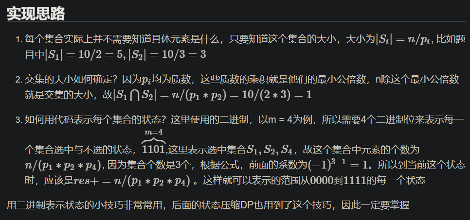

<!-- @import "[TOC]" {cmd="toc" depthFrom=1 depthTo=4 orderedList=false} -->

<!-- code_chunk_output -->

- [容斥原理](#容斥原理)
  - [例题：能被整除的数](#例题能被整除的数)
- [博弈论（公平组合游戏、Nim游戏）](#博弈论公平组合游戏-nim游戏)
  - [公平组合游戏](#公平组合游戏)
  - [基本例题：Nim游戏](#基本例题nim游戏)

<!-- /code_chunk_output -->

### 容斥原理

韦恩图就与容斥原理有关。

[百度百科](https://baike.baidu.com/item/%E5%AE%B9%E6%96%A5%E5%8E%9F%E7%90%86/10146840?fr=aladdin)：如果被计数的事物有A、B、C三类，那么，A类和B类和C类元素个数总和=A类元素个数+B类元素个数+C类元素个数—既是A类又是B类的元素个数—既是A类又是C类的元素个数—既是B类又是C类的元素个数+既是A类又是B类而且是C类的元素个数。（A∪B∪C = A+B+C - A∩B - B∩C - C∩A + A∩B∩C）


如上，$C_n^x$ 表示从 $n$ 个元素中选取 $x$ 的方案数。计算式子一共有 $2^n - 1$ 项，因此时间复杂度是 $O(2^n)$ 。

容斥原理公式：
$$|S_1 \cup S_2 \cup ... \cup S_n|$$
$$= \sum_i |S_i| - \sum_{i,j}|S_i \cap S_j| + \sum_{i,j,k} |S_i \cap S_j \cap S_k| - ...$$

#### 例题：能被整除的数

- 给定一个整数 n 和 m 个不同的质数 $p_1,p_2,…,p_m$。
- 请你求出 1∼n 中能被 $p_1,p_2,…,p_m$ 中的至少一个数整除的整数有多少个。

输入格式
- 第一行包含整数 n 和 m。
- 第二行包含 m 个质数。

输出格式
- 输出一个整数，表示满足条件的整数的个数。

数据范围
- $1≤m≤16$,
- $1≤n,p_i≤10^9$

分析，参考[抽象带师](https://www.acwing.com/solution/content/29702/)：




如上，这里使用了二进制表示状态，结合位运算很巧妙。

```cpp
#include <iostream>
#include <cstring>
#include <algorithm>

using namespace std;

typedef long long LL;

const int N = 16;
int p[N];

int main()
{
    int n, m;
    scanf("%d%d", &n, &m);
    for (int i = 0; i < m; i ++) scanf("%d", &p[i]);
    
    int res = 0;
    for (int i = 1; i < 1 << m; i ++)  // 遍历所有状态，注意是 i < 1 << m
    {
        int t = 1, s = 0;
        for (int j = 0; j < m; j ++)  // 遍历所有质数，抽取出本状态对应的质数
        {
            if (i >> j & 1)
            {
                if ((LL) t * p[j] > n)   // 都比 n 大了，肯定不能整除
                {
                    t = -1;
                    break;
                }
                t *= p[j];
                s ++ ;
            }
        }
        if (t != -1)
        {
            if (s % 2) res += n / t;  // 奇数个，加上
            else res -= n / t;  // 偶数个，减去
        }
    }
    printf("%d", res);
    return 0;
}
```

### 博弈论（公平组合游戏、Nim游戏）

#### 公平组合游戏

参考[qiaoxinwei](https://www.acwing.com/solution/content/14269/)：

若一个游戏满足：
1. 由两名玩家交替行动
2. 在游戏进行的任意时刻，可以执行的合法行动与轮到哪位玩家无关
3. 不能行动的玩家判负

则称该游戏为一个公平组合游戏。

尼姆游戏（NIM）属于公平组合游戏，但常见的棋类游戏，比如围棋就不是公平组合游戏，因为围棋交战双方分别只能落黑子和白子，胜负判定也比较复杂，不满足条件2和3。

##### 必胜状态和必败状态
来了解两个名词：
- 必胜状态，先手进行某一个操作，留给后手是一个必败状态时，对于先手来说是一个必胜状态。即先手可以走到某一个必败状态。
0 必败状态，先手无论如何操作，留给后手都是一个必胜状态时，对于先手来说是一个必败状态。即先手走不到任何一个必败状态。

#### 基本例题：Nim游戏

- 给定 n 堆石子，两位玩家轮流操作，每次操作可以从任意一堆石子中拿走任意数量的石子（可以拿完，但不能不拿），最后无法进行操作的人视为失败。
- 问如果两人都采用最优策略，先手是否必胜。

输入格式
- 第一行包含整数 n。
- 第二行包含 n 个数字，其中第 i 个数字表示第 i 堆石子的数量。

输出格式
- 如果先手方必胜，则输出 `Yes`。
- 否则，输出 `No`。

数据范围
- $1≤n≤10^5$
- $1≤每堆石子数≤10^9$

证明参考[qiaoxinwei](https://www.acwing.com/solution/content/14269/)：
例如：有两堆石子，第一堆有2个，第二堆有3个，先手必胜。

操作步骤：
1. 先手从第二堆拿走1个，此时第一堆和第二堆数目相同
2. 无论后手怎么拿，先手都在另外一堆石子中取走相同数量的石子即可。


```cpp
#include <iostream>
#include <cstring>
#include <algorithm>

int main()
{
    int n;
    scanf("%d", &n);
    
    int res = 0;
    while (n -- )
    {
        int x;
        scanf("%d", &x);
        res ^= x;
    }
    
    if (res) puts("Yes");
    else puts("No");
    return 0;
}
```

> 学到 1:32
