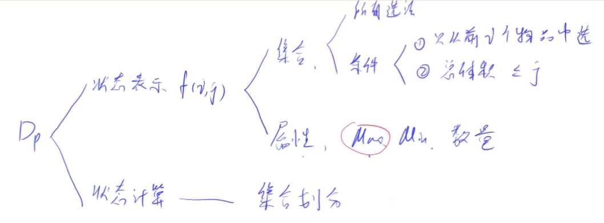
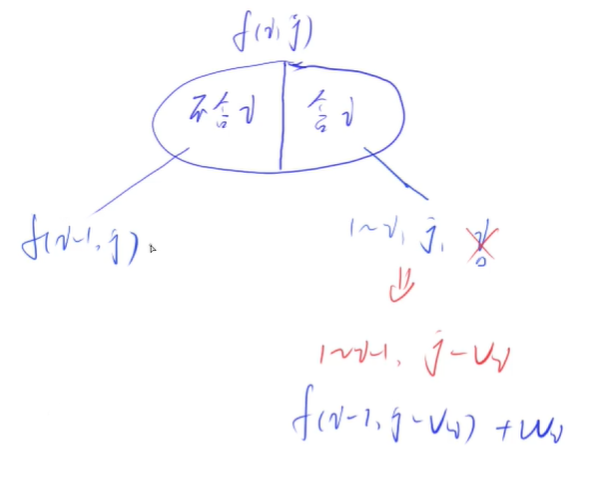
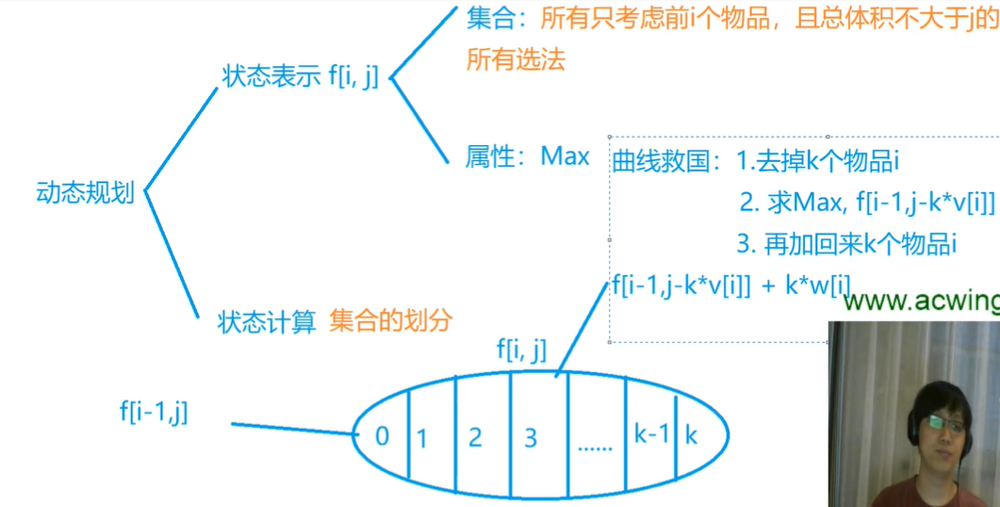

<!-- @import "[TOC]" {cmd="toc" depthFrom=1 depthTo=4 orderedList=false} -->

<!-- code_chunk_output -->

- [背包问题](#背包问题)
  - [DP问题一般思路：以背包问题为例](#dp问题一般思路以背包问题为例)
- [01背包问题](#01背包问题)
  - [例题：01背包问题](#例题01背包问题)
  - [二维版本](#二维版本)
  - [一维版本](#一维版本)
- [完全背包](#完全背包)
  - [例题：完全背包问题](#例题完全背包问题)
  - [优化完全背包问题（发现规律）](#优化完全背包问题发现规律)
  - [优化完全背包问题（变成一维）](#优化完全背包问题变成一维)
- [多重背包](#多重背包)
- [分组背包](#分组背包)

<!-- /code_chunk_output -->

### 背包问题

- 01背包问题：每件物品最多用一次。
- 完全背包：每件物品有无限个。
- 多重背包：每个物品的数量上限不同，$s_i$。
- 分组背包：每一组里面最多选一个物品。

#### DP问题一般思路：以背包问题为例

如下，DP问题一般考虑两点：状态表示和状态计算。



状态表示`f[i,j]`（表示集合的某种属性）：
- 需要考虑集合是怎么定义的？集合具体是什么与`i,j`有关
- 属性是怎么定义的？一般而言，属性无非是`Max`、`Min`、`数量`

状态计算：
- 说白了就是集合划分
- 应该不重不漏

背包问题中：
- 状态表示：`f[i,j]`就是，只从前`i`个物品中选择总体积小于等于`j`的集合中，各个方案中总价值的最大值（Max）
- 集合划分：是否含`i`，如下图



如上，`f(i,j)`可以分为含有`i`的和不含`i`的：
- 不含`i`方案中，其最大值一定是`f(i-1,j)`
- 含`i`方案中，如何计算其最大值？
  - 假设已经把 `i` 放进来了，那么体积的上限就是 `j-v_i` ，因此最大值为 `f(i-1,j-v_i) + w_i`
- 所以 $f(i,j) = \max\{f(i-1,j), f(i-1, j-v_i) + w_i\}$

### 01背包问题

每件物品最多用一次。

#### 例题：01背包问题

- 有 N 件物品和一个容量是 V 的背包。每件物品只能使用一次。
- 第 i 件物品的体积是 $v_i$，价值是 $w_i$。
- 求解将哪些物品装入背包，可使这些物品的总体积不超过背包容量，且总价值最大。
- 输出最大价值。

输入格式
- 第一行两个整数，N，V，用空格隔开，分别表示物品数量和背包容积。
- 接下来有 N 行，每行两个整数 $v_i,w_i$，用空格隔开，分别表示第 i 件物品的体积和价值。

输出格式
- 输出一个整数，表示最大价值。

数据范围
- $0<N,V≤1000$
- $0<v_i,w_i≤1000$

#### 二维版本

二维版本在本笔记开头讨论过。

```cpp
#include <iostream>
#include <cstring>
#include <algorithm>

using namespace std;

const int N = 1010;

int n, m;
int f[N][N];
int v[N], w[N];

int main()
{
    scanf("%d%d", &n, &m);
    
    for (int i = 1; i <= n; i ++) scanf("%d%d", &v[i], &w[i]);
    
    for (int i = 1; i <= n; i ++)
        for (int j = 0; j <= m; j ++)
        {
            f[i][j] = f[i-1][j];
            if (j >= v[i]) f[i][j] = max(f[i][j], f[i-1][j - v[i]] + w[i]);
        }
    
    printf("%d", f[n][m]);
    
    return 0;
}
```

**经验：**
- `f[0][0~m]` 都应该是 0 ，这里不用初始化，因为初始值就是 0
- 所以背包问题从 1 开始计算

#### 一维版本

```cpp
#include <iostream>
#include <cstring>
#include <algorithm>

using namespace std;

const int N = 1010;

int n, m;
int f[N];
int v[N], w[N];

int main()
{
    scanf("%d%d", &n, &m);
    
    for (int i = 1; i <= n; i ++) scanf("%d%d", &v[i], &w[i]);
    
    for (int i = 1; i <= n; i ++)
        for (int j = m; j >= v[i]; j --)
        {
            f[j] = max(f[j], f[j - v[i]] + w[i]);
        }
    
    printf("%d", f[m]);
    
    return 0;
}
```

参考[深蓝](https://www.acwing.com/solution/content/1374/)：

将状态`f[i][j]`优化到一维`f[j]`，实际上只需要做一个等价变形。

为什么可以这样变形呢？我们定义的状态`f[i][j]`可以求得任意合法的i与j最优解，但题目只需要求得最终状态`f[n][m]`，因此我们只需要一维的空间来更新状态。

（1）状态`f[j]`定义：`N`件物品，背包容量`j`下的最优解。

（2）注意枚举背包容量`j`必须从`m`开始。

（3）为什么一维情况下枚举背包容量需要逆序？在二维情况下，状态`f[i][j]`是由上一轮`i - 1`的状态得来的，`f[i][j]`与`f[i - 1][j]`是独立的。而优化到一维后，如果我们还是正序，则有`f[较小体积]`更新到`f[较大体积]`，则有可能本应该用第`i-1`轮的状态却用的是第`i`轮的状态。

（4）例如，一维状态第`i`轮对体积为 `3` 的物品进行决策，则`f[7]`由`f[4]`更新而来，这里的`f[4]`正确应该是`f[i - 1][4]`，但从小到大枚举`j`这里的`f[4]`在第`i`轮计算却变成了`f[i][4]`。当逆序枚举背包容量`j`时，我们求`f[7]`同样由`f[4]`更新，但由于是逆序，这里的`f[4]`还没有在第`i`轮计算，所以此时实际计算的`f[4]`仍然是`f[i - 1][4]`。

（5）简单来说，一维情况正序更新状态`f[j]`需要用到前面计算的状态已经被「污染」，逆序则不会有这样的问题。

状态转移方程为：`f[j] = max(f[j], f[j - v[i]] + w[i]` 。

```cpp
for(int i = 1; i <= n; i++) 
    for(int j = m; j >= 0; j--)
    {
        if(j < v[i]) 
            f[i][j] = f[i - 1][j];  // 优化前
            f[j] = f[j];            // 优化后，该行自动成立，可省略。
        else    
            f[i][j] = max(f[i - 1][j], f[i - 1][j - v[i]] + w[i]);  // 优化前
            f[j] = max(f[j], f[j - v[i]] + w[i]);                   // 优化后
    }
```

实际上，只有当枚举的 `背包容量 >= v[i]` 时才会更新状态，因此我们可以修改循环终止条件进一步优化。

```cpp
for(int i = 1; i <= n; i++)
{
    for(int j = m; j >= v[i]; j--)  
        f[j] = max(f[j], f[j - v[i]] + w[i]);
} 
```

关于状态`f[j]`的补充说明：二维下的状态定义`f[i][j]`是前 `i` 件物品，背包容量 `j` 下的最大价值。一维下，少了前 `i` 件物品这个维度，我们的代码中决策到第 `i` 件物品（循环到第`i`轮），`f[j]`就是前`i`轮已经决策的物品且背包容量 `j` 下的最大价值。

因此当执行完循环结构后，由于已经决策了所有物品，`f[j]`就是所有物品背包容量 `j` 下的最大价值。即一维`f[j]`等价于二维`f[n][j]`。

**优化输入** ：我们注意到在处理数据时，我们是一个物品一个物品，一个一个体积的枚举。因此我们可以不必开两个数组记录体积和价值，而是边输入边处理。

```cpp
#include<bits/stdc++.h>

using namespace std;

const int MAXN = 1005;
int f[MAXN];  // 

int main() 
{
    int n, m;   
    cin >> n >> m;

    for(int i = 1; i <= n; i++) {
        int v, w;
        cin >> v >> w;      // 边输入边处理
        for(int j = m; j >= v; j--)
            f[j] = max(f[j], f[j - v] + w);
    }

    cout << f[m] << endl;

    return 0;
}
```

这里我批注一下，其实这种时间效率未必比不优化输入的高。

### 完全背包

每件物品有无限个。

#### 例题：完全背包问题

- 有 N 种物品和一个容量是 V 的背包，每种物品都有无限件可用。
- 第 i 种物品的体积是 $v_i$，价值是 $w_i$。
- 求解将哪些物品装入背包，可使这些物品的总体积不超过背包容量，且总价值最大。
- 输出最大价值。

输入格式
- 第一行两个整数，N，V，用空格隔开，分别表示物品种数和背包容积。
- 接下来有 N 行，每行两个整数 $v_i,w_i$，用空格隔开，分别表示第 i 种物品的体积和价值。

输出格式
- 输出一个整数，表示最大价值。

数据范围
- $0<N,V≤1000$
- $0<v_i,w_i≤1000$



**分析：**
- 如上图，集合划分，可以按第 i 个物品选多少个来划分
- 所以朴素的状态转移方程为 `f[i,j] = f[i-1, j - v[i] * k] + w[i] * k`

```cpp
#include <iostream>
#include <cstring>
#include <algorithm>

using namespace std;

const int N = 1010;

int n, m;
int f[N][N];
int v[N], w[N];

int main()
{
    scanf("%d%d", &n, &m);
    for (int i = 1; i <= n; i ++) scanf("%d%d", &v[i], &w[i]);
    
    for (int i = 1; i <= n; i ++)
        for (int j = 0; j <= m; j ++)
            for (int k = 0; k * v[i] <= j; k ++)
                f[i][j] = max(f[i][j], f[i - 1][j - k * v[i]] + k * w[i]);
    
    printf("%d", f[n][m]);
    return 0;
}
```

三重循环，最坏情况：$O(N*V^2)$。

#### 优化完全背包问题（发现规律）

```cpp
#include <iostream>
#include <cstring>
#include <algorithm>

using namespace std;

const int N = 1010;

int n, m;
int f[N][N];
int v[N], w[N];

int main()
{
    scanf("%d%d", &n, &m);
    for (int i = 1; i <= n; i ++) scanf("%d%d", &v[i], &w[i]);
    
    for (int i = 1; i <= n; i ++)
        for (int j = 0; j <= m; j ++)
        {
            f[i][j] = f[i - 1][j];
            if (j >= v[i])
                f[i][j] = max(f[i][j], f[i][j - v[i]] + w[i]);
        }
    
    printf("%d", f[n][m]);
    return 0;
}
```

参考[Aniway](https://www.acwing.com/solution/content/5345/)：

我们列举一下更新次序的内部关系：

```
f[i , j ] = max( f[i-1,j] , f[i-1,j-v]+w ,  f[i-1,j-2*v]+2*w , f[i-1,j-3*v]+3*w , .....)
f[i , j-v]= max(            f[i-1,j-v]   ,  f[i-1,j-2*v] + w , f[i-1,j-2*v]+2*w , .....)
由上两式，可得出如下递推关系： 
                        f[i][j]=max(f[i,j-v]+w , f[i-1][j]) 
```

有了上面的关系，那么其实k循环可以不要了，核心代码优化成这样：

```cpp
for(int i = 1 ; i <=n ;i++)
for(int j = 0 ; j <=m ;j++)
{
    f[i][j] = f[i-1][j];
    if(j-v[i]>=0)
        f[i][j]=max(f[i][j],f[i][j-v[i]]+w[i]);
}
```

这个代码和01背包的非优化写法很像啊!!!我们对比一下，下面是01背包的核心代码

```cpp
for(int i = 1 ; i <= n ; i++)
for(int j = 0 ; j <= m ; j ++)
{
    f[i][j] = f[i-1][j];
    if(j-v[i]>=0)
        f[i][j] = max(f[i][j],f[i-1][j-v[i]]+w[i]);
}
```

两个代码其实只有一句不同（注意下标）

```cpp
f[i][j] = max(f[i][j],f[i-1][j-v[i]]+w[i]);//01背包

f[i][j] = max(f[i][j],f[i][j-v[i]]+w[i]);//完全背包问题
```

#### 优化完全背包问题（变成一维）

参考[深蓝](https://www.acwing.com/solution/content/1375/)：

状态转移方程：`f[j] = max(f[j], f[j - v[i]] + w[i])`

我们枚举体积 `j` 是从小到大的，那么我们在计算 `f[i][j]` 时，`f[i][较大体积]`总是由`f[i][较小体积]`更新而来。因此无需逆序更新 `j` 。

```cpp
#include <iostream>
#include <cstring>
#include <algorithm>

using namespace std;

const int N = 1010;

int n, m;
int f[N];
int v[N], w[N];

int main()
{
    scanf("%d%d", &n, &m);
    for (int i = 1; i <= n; i ++) scanf("%d%d", &v[i], &w[i]);
    
    for (int i = 1; i <= n; i ++)
        for (int j = v[i]; j <= m; j ++)
            f[j] = max(f[j], f[j - v[i]] + w[i]);
    
    printf("%d", f[m]);
    return 0;
}
```

> 学到 1:11

### 多重背包

每个物品的数量上限不同，$s_i$。

### 分组背包

每一组里面最多选一个物品。
