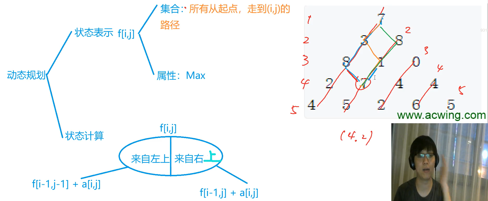

<!-- @import "[TOC]" {cmd="toc" depthFrom=1 depthTo=4 orderedList=false} -->

<!-- code_chunk_output -->

- [线性动态规划](#线性动态规划)
  - [基础例题：数字三角形](#基础例题数字三角形)
  - [例题：最长上升子序列](#例题最长上升子序列)
  - [例题：最长上升子序列II（优化）](#例题最长上升子序列ii优化)
  - [例题：最长公共子序列](#例题最长公共子序列)
  - [例题：最短编辑距离](#例题最短编辑距离)
  - [例题：编辑距离](#例题编辑距离)
- [区间动态规划](#区间动态规划)
  - [例题：石子合并](#例题石子合并)

<!-- /code_chunk_output -->

### 线性动态规划

递推犹如一条线。

#### 基础例题：数字三角形

给定一个如下图所示的数字三角形，从顶部出发，在每一结点可以选择移动至其左下方的结点或移动至其右下方的结点，一直走到底层，要求找出一条路径，使路径上的数字的和最大。

```
        7
      3   8
    8   1   0
  2   7   4   4
4   5   2   6   5
```

输入格式
- 第一行包含整数 n，表示数字三角形的层数。
- 接下来 n 行，每行包含若干整数，其中第 i 行表示数字三角形第 i 层包含的整数。

输出格式
- 输出一个整数，表示最大的路径数字和。

数据范围
- $1≤n≤500$
- $−10000≤三角形中的整数≤10000$



动态规划的时间复杂度一般是`状态 * 转移`。

```cpp
#include <iostream>
#include <cstring>
#include <algorithm>

using namespace std;

const int N = 510;
const int INF = 1e9;

int n;
int a[N][N];
int f[N][N];

int main()
{
    scanf("%d", &n);
    for (int i = 1; i <= n; i ++)
        for (int j = 1; j <= i; j ++)
            scanf("%d", &a[i][j]);
    
    // 因为求最短路径，把无效路径设为 -INF
    for (int i = 0; i <= n; i ++)
        for (int j = 0; j <= i + 1; j ++)  // 最右边的点的右上没有数，但可能被遍历到，因此取 i + 1
            f[i][j] = - INF;
    
    f[1][1] = a[1][1];
    for (int i = 2; i <= n; i ++)
        for (int j = 1; j <= i; j ++)
            f[i][j] = max(f[i - 1][j - 1] + a[i][j], f[i - 1][j] + a[i][j]);
    
    int res = -INF;
    for (int i = 1; i <= n; i ++) res = max(res, f[n][i]);
    
    printf("%d", res);
    return 0;
}
```

#### 例题：最长上升子序列

- 给定一个长度为 N 的数列，求数值严格单调递增的子序列的长度最长是多少。

输入格式
- 第一行包含整数 N。
- 第二行包含 N 个整数，表示完整序列。

输出格式
- 输出一个整数，表示最大长度。

数据范围
- $1≤N≤1000$
- $−10^9≤数列中的数≤10^9$

**分析：** （参考[VictorWu](https://www.acwing.com/solution/content/4807/)）
- 状态表示：`f[i]`表示从第一个数字开始算，以`a[i]`结尾的最大的上升序列。(以`a[i]`结尾的所有上升序列中属性为最大值的那一个)
- 状态计算（集合划分）：`j∈(0,1,2,..,i-1)` 在`a[i] > a[j]`时，`f[i] = max(f[i], f[j] + 1)`。
- 有一个边界，若前面没有比`i`小的，`f[i]`为`1`（自己为结尾，且元素只有自己）。
- 最后再找`f[i]`的最大值。

```cpp
#include <iostream>
#include <cstring>
#include <algorithm>

using namespace std;

const int N = 1e3 + 10;

int f[N];
int a[N];
int n;

int main()
{
    scanf("%d", &n);
    for (int i = 1; i <= n; i ++) scanf("%d", &a[i]);
    
    for (int i = 1; i <= n; i ++)
    {
        f[i] = 1;
        for (int j = 1; j <= i - 1; j ++)
        {
            if (a[i] > a[j])
                f[i] = max(f[i], f[j] + 1);
        }
    }
    
    int res = 0;
    for (int i = 1; i <= n; i ++ ) res = max(res, f[i]);
    
    printf("%d", res);
    return 0;
}
```

时间复杂度 `O(n^2)` 。

#### 例题：最长上升子序列II（优化）

- 给定一个长度为 N 的数列，求数值严格单调递增的子序列的长度最长是多少。

输入格式
- 第一行包含整数 N。
- 第二行包含 N 个整数，表示完整序列。

输出格式
- 输出一个整数，表示最大长度。

数据范围
- $1≤N≤100000$
- $−10^9≤数列中的数≤10^9$

**分析：**
- 之前的做法存在信息冗余
- 对于序列 `3 1 2 3 1` ，我们的 `f[1]` 和 `f[2]` 都是 `1` （以第一个元素 `3` 结尾的最长上升子序列是 `3` ，长度为 1 ；以第二个元素 1 结尾的最长上升子序列是 `1` ，长度也为 1）
- 那么，此时就可用抛弃 `f[1]` 这个信息，没有用了，因为 `1` 比 `3` 要小，适配性大于等于 `3` ，且两个子序列长度相等
- 所以我们维护一个列表 `q[]` ，表示目前最优的长度为 `k` 的最大上升子序列其对应的结尾元素是谁，记录在 `q[k]` 里 
- 我们可以知道 `q[]` 里面的元素是单调递增的（反证法可以证明，如果`q[k+1]`小于`q[k]`，那么必有`q[k+1]`对应的序列倒数第二个元素值也小于`q[k]`，那此时`q[k]`对应的长度为k的子序列就不是最优的了（适配性还不如`q[k+1]`对应的子序列中的长度为`k`的序列呢））
- 所以我们每次向后纳入一个元素`a[i]`，把`a[i]`对接到`q[]`中比其小的数的最大值，如果对接的是`q[]`的最后一个元素，说明找到了现有更长的子序列，`q[]`新增元素`length + 1`，且对应值为`q[length + 1] = a[i]`
- `q[]` 单调，则可以用二分法，状态转移数量从 `O(n)` 变为 `O(logn)`

```cpp
#include <iostream>
#include <cstring>
#include <algorithm>

using namespace std;

const int N = 1e5 + 10;

int n;
int a[N];
int q[N];

int main()
{
    scanf("%d", &n);
    for (int i = 1; i <= n; i ++) scanf("%d", &a[i]);
    
    int len = 0;
    for (int i = 1; i <= n; i ++)
    {
        int l = 0, r = len;
        while (l < r)
        {
            // 找到比 a[i] 小的最大值，所以取 mid 右边，即向上取整
            int mid = l + r + 1 >> 1;
            if (q[mid] < a[i]) l = mid;
            else r = mid - 1;
        }
        len = max(len, r + 1);  // 最终 l = r = mid， r + 1 等价于 mid ，但是 mid 不一定被赋值
        q[r + 1] = a[i];
    }
    
    printf("%d", len);
    return 0;
}
```

#### 例题：最长公共子序列

给定两个长度分别为 N 和 M 的字符串 A 和 B，求既是 A 的子序列又是 B 的子序列的字符串长度最长是多少。

输入格式
- 第一行包含两个整数 N 和 M。
- 第二行包含一个长度为 N 的字符串，表示字符串 A。
- 第三行包含一个长度为 M 的字符串，表示字符串 B。
- 字符串均由小写字母构成。

输出格式
- 输出一个整数，表示最大长度。

数据范围
- $1≤N,M≤1000$

分析参考了[Anoxia_3](https://www.acwing.com/solution/content/13254/)：
- 集合表示：`f[i][j]`表示`a`的前`i`个字母，和`b`的前`j`个字母的最长公共子序列长度
- 集合划分：以`a[i], b[j]`是否包含在子序列当中为依据，因此可以分成四类：
  - ①`a[i]`不在，`b[j]`不在 `max=f[i−1][j−1]`
  - ②`a[i]`不在，`b[j]`在：看似是`max=f[i−1][j]`，实际上无法用`f[i−1][j]`表示，因为`f[i−1][j]`表示的是在`a`的前`i-1`个字母中出现，并且在`b`的前`j`个字母中出现，此时`b[j]`不一定出现，这与条件不完全相等，条件给定是`a[i]`一定不在子序列中，`b[j]`一定在子序列当中，但仍可以用`f[i−1][j]`来表示，原因就在于条件给定的情况被包含在`f[i−1][j]`中，即条件的情况是`f[i−1][j]`的子集，而求的是`max`，所以对结果不影响。**@piper： 换句话说，①②两种情况合起来，才对应`f[i-1][j]`** 这不影响结果，因为例如：要求`a，b，c`的最大值可以这样求：`max(max(a,b),max(b,c))`虽然`b`被重复使用，但仍能求出`max`，求`max`只要保证不漏即可。
  - ③ `a[i]`在，`b[j]`不在 原理同 ②
  - ④ `a[i]`在，`b[j]`在 `max=f[i−1][j−1]+1`
  - 实际上，在计算时，①包含在②和③的情况中，所以①不用考虑

```cpp
#include <iostream>
#include <cstring>
#include <algorithm>

using namespace std;

const int N = 1010, M = 1010;

int n, m;
char a[N], b[M];
int f[N][M];

int main()
{
    scanf("%d%d", &n, &m);
    scanf("%s%s", a + 1, b + 1);  // 为了让 a[1] 是首字符


    for (int i = 1; i <= n; i ++)
        for (int j = 1; j <= m; j ++)
        {
            f[i][j] = max(f[i - 1][j], f[i][j - 1]);
            if (a[i] == b[j]) f[i][j] = max(f[i][j], f[i - 1][j - 1] + 1);
        }

    printf("%d", f[n][m]);
    return 0;
}
```

#### 例题：最短编辑距离

- 给定两个字符串 A 和 B，现在要将 A 经过若干操作变为 B，可进行的操作有：
  - 删除–将字符串 A 中的某个字符删除。
  - 插入–在字符串 A 的某个位置插入某个字符。
  - 替换–将字符串 A 中的某个字符替换为另一个字符。
  - 现在请你求出，将 A 变为 B 至少需要进行多少次操作。

输入格式
- 第一行包含整数 n，表示字符串 A 的长度
- 第二行包含一个长度为 n 的字符串 A。
- 第三行包含整数 m，表示字符串 B 的长度。
- 第四行包含一个长度为 m 的字符串 B。
- 字符串中均只包含大写字母。

输出格式
- 输出一个整数，表示最少操作次数。

数据范围
- $1≤n,m≤1000$

参考[Shadow](https://www.acwing.com/solution/content/5607/)：

1. 状态表示 ：`f[i][j]`
- 集合：将`a[1~i]`变成`b[1~j]`的操作方式
- 属性：min

2. 状态计算 ：从最后一步考虑

```
有三种操作，所以有三个子集
ok子集划分完了
考虑状态转移的时候
先考虑如果我没有进行这个操作应该是什么状态
然后考虑你进行这一步操作之后会对你下一个状态造成什么影响
然后再加上之前状态表示中你决策出来的那个DP属性
这样就可以自然而然地搞出来转移方程啦

1)删除操作：把a[i]删掉之后a[1~i]和b[1~j]匹配
            所以之前要先做到a[1~(i-1)]和b[1~j]匹配
            f[i-1][j] + 1
2)插入操作：插入之后a[i]与b[j]完全匹配，所以插入的就是b[j] 
            那填之前a[1~i]和b[1~(j-1)]匹配
            f[i][j-1] + 1 
3)替换操作：把a[i]改成b[j]之后想要a[1~i]与b[1~j]匹配 
            那么修改这一位之前，a[1~(i-1)]应该与b[1~(j-1)]匹配
            f[i-1][j-1] + 1
            但是如果本来a[i]与b[j]这一位上就相等，那么不用改，即
            f[i-1][j-1] + 0

好的那么f[i][j]就由以上三个可能状态转移过来，取个min
```

```
细节问题：初始化怎么搞
先考虑有哪些初始化嘛
1.你看看在for遍历的时候需要用到的但是你事先没有的
（往往就是什么0啊1啊之类的）就要预处理 
2.如果要找min的话别忘了INF
  要找有负数的max的话别忘了-INF

ok对应的： 
1.f[0][i]如果a初始长度就是0，那么只能用插入操作让它变成b
  f[i][0]同样地，如果b的长度是0，那么a只能用删除操作让它变成b
2.f[i][j] = INF //虽说这里没有用到，但是把考虑到的边界都写上还是保险（虽然这道题用不上）
```

```cpp
#include <iostream>
#include <cstring>
#include <algorithm>

using namespace std;

const int N = 1e3 + 10;

int n, m;
char a[N], b[N];
int f[N][N];

int main()
{
    scanf("%d%s", &n, a + 1);
    scanf("%d%s", &m, b + 1);
    
    for (int i = 1; i <= n; i ++ ) f[i][0] = i;
    for (int i = 1; i <= m; i ++ ) f[0][i] = i;

    for (int i = 1; i <= n; i ++ )
        for (int j = 1; j <= m; j ++)
        {
            f[i][j] = min(f[i - 1][j] + 1, f[i][j - 1] + 1);
            if (a[i] == b[j]) f[i][j] = min(f[i][j], f[i - 1][j - 1] + 0);
            else f[i][j] = min(f[i][j], f[i - 1][j - 1] + 1);
        }
    
    printf("%d", f[n][m]);
    return 0;
}
```

#### 例题：编辑距离

- 给定 n 个长度不超过 10 的字符串以及 m 次询问，每次询问给出一个字符串和一个操作次数上限。
- 对于每次询问，请你求出给定的 n 个字符串中有多少个字符串可以在上限操作次数内经过操作变成询问给出的字符串。
- 每个对字符串进行的单个字符的插入、删除或替换算作一次操作。

输入格式
- 第一行包含两个整数 n 和 m。
- 接下来 n 行，每行包含一个字符串，表示给定的字符串。
- 再接下来 m 行，每行包含一个字符串和一个整数，表示一次询问。
- 字符串中只包含小写字母，且长度均不超过 10。

输出格式
- 输出共 m 行，每行输出一个整数作为结果，表示一次询问中满足条件的字符串个数。

数据范围
- $1≤n,m≤1000$

分析：就是多次使用上一道题的算法。

```cpp
#include <iostream>
#include <cstring>
#include <algorithm>
#include <string>

using namespace std;

const int N = 11, M = 1e3 + 10;

int n, m;
int f[N][N];
char str[M][N];  // 目前字符串

int edit_distance(char a[], char b[])
{
    int la = strlen(a + 1), lb = strlen(b + 1);  // strlen 来自 string ，计算字符串长度
    
    for (int i = 1; i <= la; i ++) f[i][0] = i;
    for (int i = 1; i <= lb; i ++) f[0][i] = i;
    
    for (int i = 1; i <= la; i ++)
        for (int j = 1; j <= lb; j ++)
        {
            f[i][j] = min(f[i][j - 1] + 1, f[i - 1][j] + 1);
            // if (a[i] == b[j]) f[i][j] = min(f[i][j], f[i - 1][j - 1] + 0);
            // else f[i][j] = min(f[i][j], f[i - 1][j - 1] + 1);
            f[i][j] = min(f[i][j], f[i - 1][j - 1] + (a[i] != b[j]));
        }
    
    return f[la][lb];
}

int main()
{
    scanf("%d%d", &n, &m);
    for (int i = 0; i < n; i ++ ) scanf("%s", str[i] + 1);  // 从s[i][1]开始记字符
    
    while (m -- )
    {
        char s[N];
        int limit;
        scanf("%s%d", s + 1, &limit);
        
        // 寻找符合条件的字符串数量
        int res = 0;
        for (int i = 0; i < n; i ++ )
            if (edit_distance(str[i], s) <= limit)
                res ++;
        
        printf("%d\n", res);
    }
    return 0;
}
```

**经验：**
- `char[]` 长度用 `<string>` 的 `strlen(a)` 来求，其中 `a` 是首地址指针
- 上面强制转换了 `(a[i] != b[j])` 可还行

### 区间动态规划

`f[i, j]` 表示区间 `[i, j]` 。

#### 例题：石子合并

- 设有 N 堆石子排成一排，其编号为 $1，2，3，…，N$。
- 每堆石子有一定的质量，可以用一个整数来描述，现在要将这 N 堆石子合并成为一堆。
- 每次只能合并相邻的两堆，合并的代价为这两堆石子的质量之和，合并后与这两堆石子相邻的石子将和新堆相邻，合并时由于选择的顺序不同，合并的总代价也不相同。
- 例如有 4 堆石子分别为 1 3 5 2， 我们可以先合并 1、2 堆，代价为 4，得到 4 5 2， 又合并 1，2 堆，代价为 9，得到 9 2 ，再合并得到 11，总代价为 4+9+11=24；
- 如果第二步是先合并 2，3 堆，则代价为 7，得到 4 7，最后一次合并代价为 11，总代价为 4+7+11=22。
- 问题是：找出一种合理的方法，使总的代价最小，输出最小代价。

输入格式
- 第一行一个数 N 表示石子的堆数 N。
- 第二行 N 个数，表示每堆石子的质量(均不超过 1000)。

输出格式
- 输出一个整数，表示最小代价。

数据范围
- $1≤N≤300$

分析参考[Anish](https://www.acwing.com/solution/content/13945/)：

核心：最后一次合并一定是左边连续的一部分和右边连续的一部分进行合并

状态表示：`f[i][j]` 表示将 i 到 j 合并成一堆的方案的集合，属性 Min

状态计算：
(1) `i<j` 时，$f[i][j]=\min_{i≤k≤j−1}f[i][k]+f[k+1][j]+s[j]−s[i−1]$ `@piper：用前缀和表示合并这 j - i + 1 堆石子需要花费的代价（就是这些石子的重量和）` 这个状态转移就是把两堆石子合并，并且加上代价
(2) `i=j` 时， `f[i][i]=0` （合并一堆石子代价为 0）

该问题的答案是 `f[1][n]` 。

所有的区间dp问题，第一维都是枚举区间长度，一般 `len = 1` 用来初始化，枚举从 `len = 2` 开始，第二维枚举起点 i （右端点 j 自动获得，`j = i + len - 1`）

```cpp
#include <iostream>
#include <cstring>
#include <algorithm>

using namespace std;

const int N = 310;

int f[N][N];
int n;
int s[N];

int main()
{
    scanf("%d", &n);
    for (int i = 1; i <= n; i ++ ) scanf("%d", &s[i]);
    for (int i = 1; i <= n; i ++ ) s[i] += s[i - 1];

    for (int len = 2; len <= n; len ++ )
        for (int i = 1; i + len - 1 <= n; i ++ )
        {
            int l = i, r = i + len - 1;
            f[l][r] = 1e8;  // 未更新前，代价初始为很大
            for (int k = l; k < r; k ++ )
                f[l][r] = min(f[l][r], f[l][k] + f[k + 1][r] + s[r] - s[l - 1]);
        }
        
    printf("%d", f[1][n]);

    return 0;
}
```

 这道题有讲究，其转移从区间长度从小到大开始，`len = 2` ，而非从 `i` 开始。
 