<!-- @import "[TOC]" {cmd="toc" depthFrom=1 depthTo=4 orderedList=false} -->

<!-- code_chunk_output -->

- [数位统计动态规划](#数位统计动态规划)
  - [例题：计数问题](#例题计数问题)
- [状态压缩动态规划](#状态压缩动态规划)
  - [例题：蒙德里安的梦想](#例题蒙德里安的梦想)
  - [例题：最短Hamilton路径](#例题最短hamilton路径)
- [树形动态规划](#树形动态规划)
  - [例题：没有上司的舞会](#例题没有上司的舞会)
- [记忆化搜索](#记忆化搜索)
  - [例题：滑雪](#例题滑雪)

<!-- /code_chunk_output -->

### 数位统计动态规划

#### 例题：计数问题

- 给定两个整数 a 和 b，求 a 和 b 之间的所有数字中 0∼9 的出现次数。
- 例如，a=1024，b=1032，则 a 和 b 之间共有 9 个数如下：
  - `1024 1025 1026 1027 1028 1029 1030 1031 1032`
- 其中 0 出现 10 次，1 出现 10 次，2 出现 7 次，3 出现 3 次等等…

输入格式
- 输入包含多组测试数据。
- 每组测试数据占一行，包含两个整数 a 和 b。
- 当读入一行为 `0 0` 时，表示输入终止，且该行不作处理。

输出格式
- 每组数据输出一个结果，每个结果占一行。
每个结果包含十个用空格隔开的数字，第一个数字表示 0 出现- 的次数，第二个数字表示 1 出现的次数，以此类推。

数据范围
- $0<a,b<100000000$

参考：[aleihentai](https://www.acwing.com/solution/content/4934/)：

（说只在的这位朋友写的有点乱，不如直接看我代码）

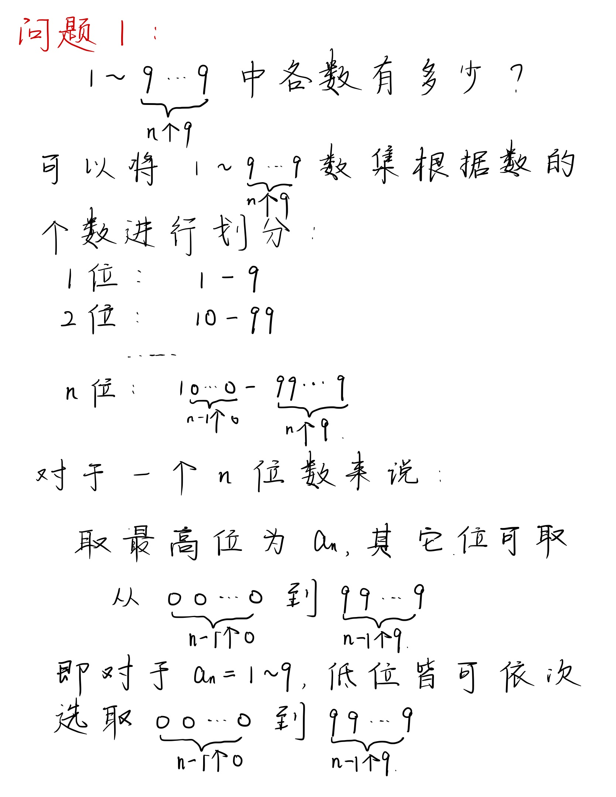
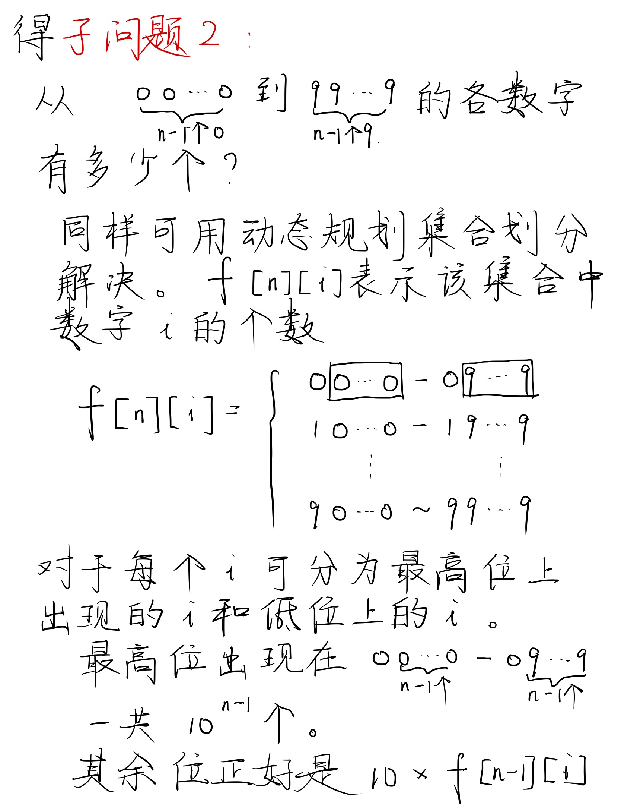
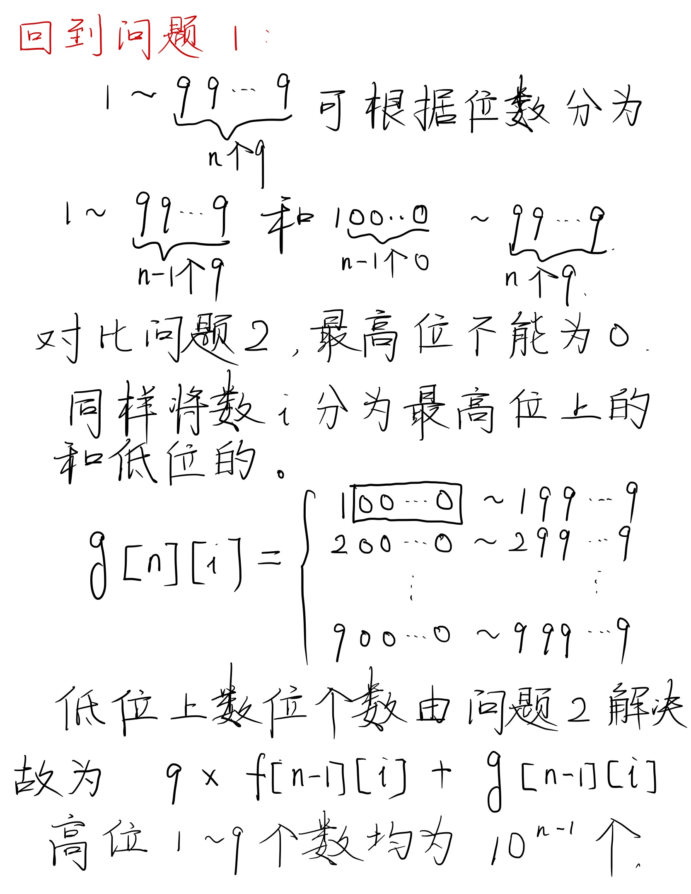
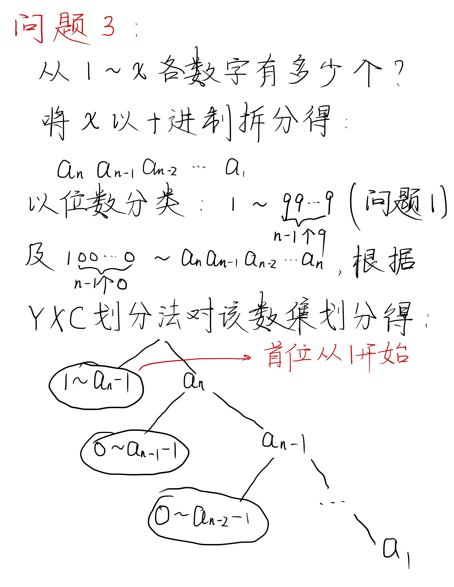
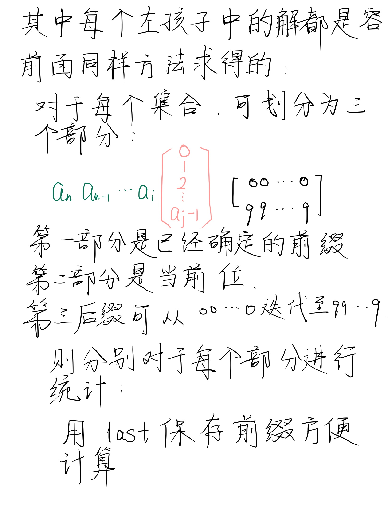

这题 y 总奋战了很久。最后还是在直播课把 bug 干没了。很牛逼。很牛逼的临场分析和 debug 技巧。

```cpp
#include <iostream>
#include <cstring>
#include <algorithm>
#include <vector>

using namespace std;

int get(vector<int> num, int l, int r)
{
    /*
    * 数字 12345
    *       ^ ^
    *       3 1
    *       l r
    * 取出 234
    */
    int  res = 0;
    for (int i = l; i >= r; i --) res = res * 10 + num[i];
    return res;
}

int power10(int x)
{
    // 10^x
    int res = 1;
    while (x -- ) res *= 10;
    return res;
}

int count(int n, int x)
{
    // 本题中 a > 0，因此如果传入 0 ，则不算范围内
    if (!n) return 0;
    
    // 12345 存入 num = {5, 4, 3, 2, 1}
    vector<int> num;
    while (n)
    {
        num.push_back(n % 10);
        n /= 10;
    }
    n = num.size();
    
    int res = 0;
    // x非0，则 i 从最高位开始；否则从最高位-1开始
    for (int i = n - 1 - !x; i >= 0; i --)
    {
        // 如果不是最高位
        if (i < n - 1)
        {
            // abcxyyy
            //    ^    现在求 x 在第 i 位出现的次数
            //    i    000~abc-1 yyy = 000 ~ 999
            res += get(num, n - 1, i + 1) * power10(i);
            // 如果 x 为 0 ，因为 abc=000 时，x=0，0yyy 不算个数，因此减去 1yyy
            if (!x) res -= power10(i);
        }
        
        // abcdefg
        // abcxyyy
        //    ^
        //    i
        // 刚才做了 前缀=000~abc-1 ，现在做 前缀=abc
        // 如果 x == d，则有 0 ~ efg 种方案
        if (num[i] == x) res += get(num, i - 1, 0) + 1;
        // 如果 x < d，则 yyy 取 000 ~ 999 都在 abcdefg 范围内
        else if (num[i] > x) res += power10(i);
    }
    
    return res;
}

int main()
{
    int a, b;
    while (cin >> a >> b, a)
    {
        // b 更大一点
        if (a > b) swap(a, b);
        
        for (int i = 0; i <= 9; i ++)
            // 可以视作集合的减法，注意 a~b 的数包含 a ，因此减去 count(a-1, i)
            cout << count(b, i) - count(a - 1, i) << ' ';
        cout << endl;
    }
    return 0;
}
```

**经验：**
- `while (cin >> a >> b , a)` 可以应对`输入包含多组测试数据`且`a`不会是`0`这种情况，最后放`a`还是别的变量来判断是否还有数据输入，视情况而定
- 强类型转换`i = n - 1 - !x;`省去了繁杂的判断`if (x) i = n - 1; else i = n - 2`

### 状态压缩动态规划

#### 例题：蒙德里安的梦想

- 求把 $N×M$ 的棋盘分割成若干个 $1×2$ 的的长方形，有多少种方案。
- 例如当 N=2，M=4 时，共有 5 种方案。当 N=2，M=3 时，共有 3 种方案。
- 如下图所示：

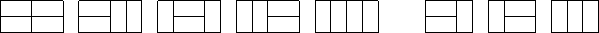

输入格式
- 输入包含多组测试用例。
- 每组测试用例占一行，包含两个整数 N 和 M。
- 当输入用例 $N=0$，$M=0$ 时，表示输入终止，且该用例无需处理。

输出格式
- 每个测试用例输出一个结果，每个结果占一行。

数据范围
- $1≤N,M≤11$

**分析：**
- $1≤N,M≤11$ 提示了我们可能用状态压缩来做
- 核心：先放横着的、再放竖着的
  - 总方案数，等于只放横着的小方块的合法方案数。
  - 如何判断，当前方案是否合法？
    - （合法：所有剩余位置能否填充慢竖着的小方块）
    - 可以按列来看，每一列内部所有连续的空着的小方块，需要偶数个

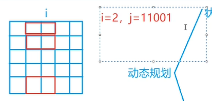

之后，考虑用动态规划做：
- 状态表示：`f[i, j]`表示已将前`i-1`列摆好，且从第`i-1`列，伸出到第`i`列（且第`i`列状态为`j`）的所有方案和
- 状态计算：前`i-2`列摆好，伸出到第`i-1`列，如下图，`f[i-1, k]`的`k`表示第`i-1`列中哪些位置由`i-2`探出头来，而这个`k`不应该与`j`矛盾，否则`f[i, j]`不能由`f[i-1, k]`转移而来

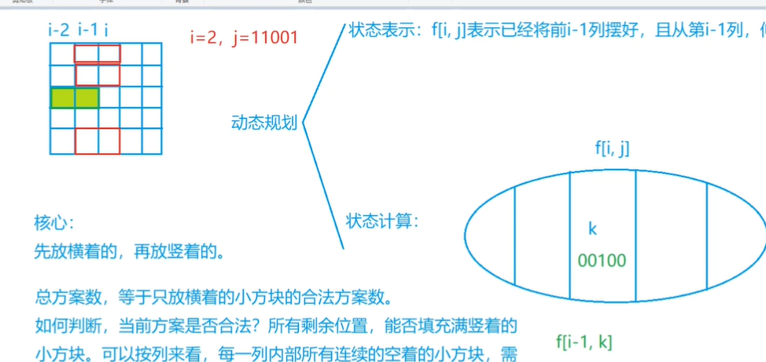

如何判断`j`与`k`是否相容呢？
- 首先，二者不能同时为1：`(j & k) == 0`
- 其次，对于`j`与`k`这类列，所有连续空着的位置的长度必须是偶数

下标从 0 开始，因此最终答案是 `f[m, 0]` 。

时间复杂度：`第一维度×第二维度×状态转移`，即`11×2^{11}×2^{11}`

不加优化：
```cpp

```

加优化（把对于状态`j`来说，其对应的合法`k`保存起来）：
```cpp

```

#### 例题：最短Hamilton路径

- 给定一张 n 个点的带权无向图，点从 0∼n−1 标号，求起点 0 到终点 n−1 的最短 Hamilton 路径。
- Hamilton 路径的定义是从 0 到 n−1 不重不漏地经过每个点恰好一次。

输入格式
- 第一行输入整数 n。
- 接下来 n 行每行 n 个整数，其中第 i 行第 j 个整数表示点 i 到 j 的距离（记为 `a[i,j]`）。
- 对于任意的 `x,y,z`，数据保证 `a[x,x]=0`，`a[x,y]=a[y,x]` 并且 `a[x,y]+a[y,z]≥a[x,z]`。

输出格式
- 输出一个整数，表示最短 Hamilton 路径的长度。

数据范围
- $1≤n≤20$
- $0≤a[i,j]≤10^7$

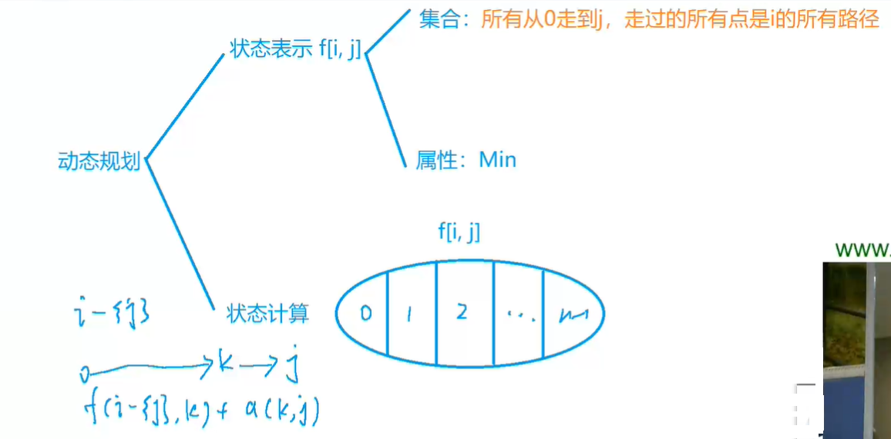

**分析：**
- 状态表示：`f[i, j]` 表示所有从 `0` 走到 `j` ，经过了 `i` 这些点的路径中，最短的路径长度（举例子：`n = 5, i = 0b01010`表示经过1、3点，计数从0开始）
- 状态计算：对于当前状态 `i, j` ，其上一个所在点是 `k` ，则经过的路径是 `i - {j}` （因为还没到达 `j` 点）比如`j = 3, k = 1`，则当前状态 `i = 0b01010` ，而上一步状态 `i - {j} = 0b00010` ，运算是 `i - 1 << j`

```cpp

```

### 树形动态规划

#### 例题：没有上司的舞会

- Ural 大学有 N 名职员，编号为 1∼N。
- 他们的关系就像一棵以校长为根的树，父节点就是子节点的直接上司。
- 每个职员有一个快乐指数，用整数 $H_i$ 给出，其中 $1≤i≤N$。
- 现在要召开一场周年庆宴会，不过，没有职员愿意和直接上司一起参会。
- 在满足这个条件的前提下，主办方希望邀请一部分职员参会，使得所有参会职员的快乐指数总和最大，求这个最大值。

输入格式
- 第一行一个整数 N。
- 接下来 N 行，第 i 行表示 i 号职员的快乐指数 Hi。
- 接下来 N−1 行，每行输入一对整数 L,K，表示 K 是 L 的直接上司。

输出格式
- 输出最大的快乐指数。

数据范围
- $1≤N≤6000$
- $−128≤H_i≤127$

**分析参考[Jayfeather](https://www.acwing.com/solution/content/4757/)：**


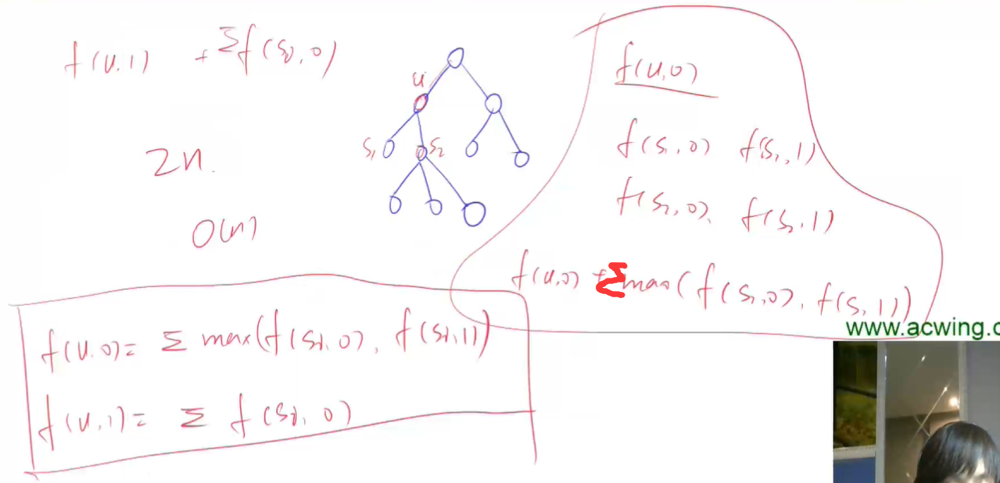
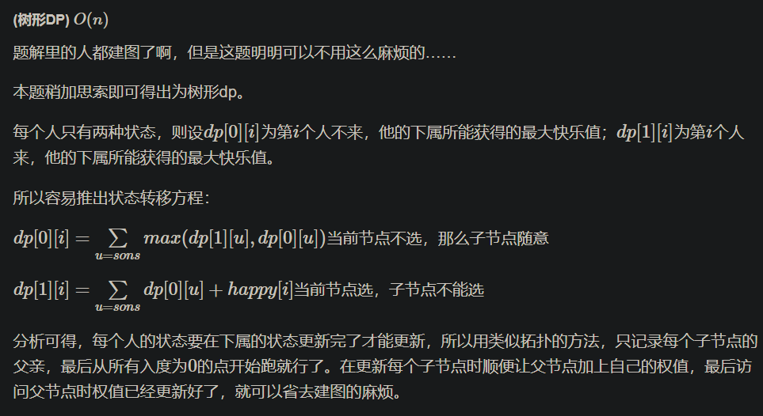

```cpp
```

### 记忆化搜索

#### 例题：滑雪

- 给定一个 R 行 C 列的矩阵，表示一个矩形网格滑雪场。
- 矩阵中第 i 行第 j 列的点表示滑雪场的第 i 行第 j 列区域的高度。
- 一个人从滑雪场中的某个区域内出发，每次可以向上下左右任意一个方向滑动一个单位距离。
- 当然，一个人能够滑动到某相邻区域的前提是该区域的高度低于自己目前所在区域的高度。
- 下面给出一个矩阵作为例子：

```
 1  2  3  4 5

16 17 18 19 6

15 24 25 20 7

14 23 22 21 8

13 12 11 10 9
```

- 在给定矩阵中，一条可行的滑行轨迹为 `24−17−2−1`。
- 在给定矩阵中，最长的滑行轨迹为 `25−24−23−…−3−2−1`，沿途共经过 25 个区域。
- 现在给定你一个二维矩阵表示滑雪场各区域的高度，请你找出在该滑雪场中能够完成的最长滑雪轨迹，并输出其长度(可经过最大区域数)。

输入格式
- 第一行包含两个整数 R 和 C。
- 接下来 R 行，每行包含 C 个整数，表示完整的二维矩阵。

输出格式
- 输出一个整数，表示可完成的最长滑雪长度。

数据范围
- $1≤R,C≤300$
- $0≤矩阵中整数≤10000$

**分析：**

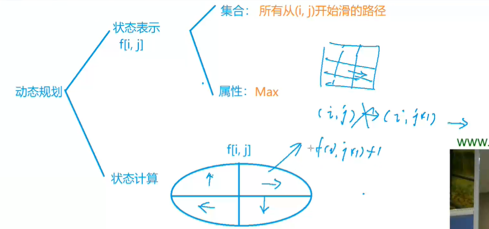

如上图：
- 状态表示中，集合为所有从`(i, j)`开始滑的路径，属性为路径的 `Max`
- 状态计算为 `f(i, j) = f(上下左右) + 1` ，前提是，要是行动应该是合法的
  - 不能撞墙
  - 不能走到更高或等高的坡上
- 本题可以用记忆化搜索是因为没有环形状态转移，因为`不能走到更高或等高的坡上`导致无法形成环

```cpp
```

**经验：**
- 用 `&v = f[i][j]` 表示 `f[i][j]` 的值，我的理解是，`&v = f[i][j]` 表示 `v` 的地址也是 `f[i][j]` 的地址
