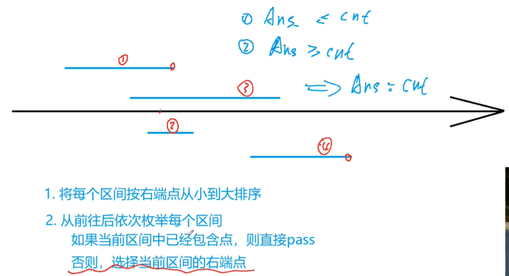
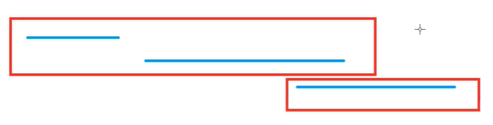
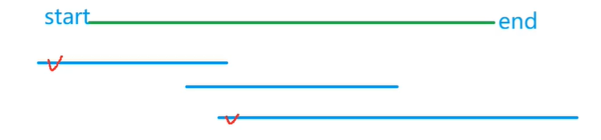
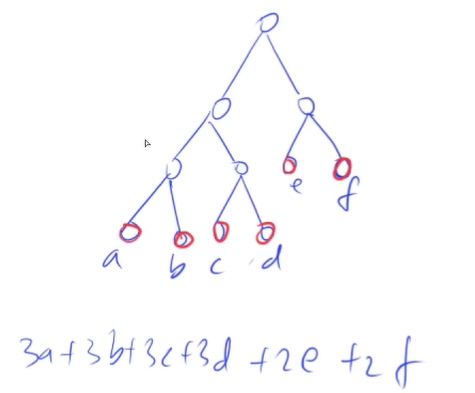

<!-- @import "[TOC]" {cmd="toc" depthFrom=1 depthTo=4 orderedList=false} -->

<!-- code_chunk_output -->

- [贪心算法](#贪心算法)
- [区间问题](#区间问题)
  - [例题：区间选点](#例题区间选点)
  - [例题：最大不相交区间数量](#例题最大不相交区间数量)
  - [例题：区间分组](#例题区间分组)
  - [例题：区间覆盖](#例题区间覆盖)
- [Huffman树](#huffman树)
  - [例题：合并果子](#例题合并果子)

<!-- /code_chunk_output -->

### 贪心算法

贪心不但没有模板，还没有套路。

算法虽然简单，但是想证明正确性很难。所以 y总 觉得最难。

### 区间问题

#### 例题：区间选点

- 给定 N 个闭区间 $[a_i,b_i]$，请你在数轴上选择尽量少的点，使得每个区间内至少包含一个选出的点。
- 输出选择的点的最小数量。
- 位于区间端点上的点也算作区间内。

输入格式
- 第一行包含整数 N，表示区间数。
- 接下来 N 行，每行包含两个整数 $a_i,b_i$，表示一个区间的两个端点。

输出格式
- 输出一个整数，表示所需的点的最小数量。

数据范围
- $1≤N≤10^5$
- $−10^9≤a_i≤b_i≤10^9$

**分析：**



如何证明上述贪心算法是对的？
- 假设 `cnt` 为我们的算法得出的一个方案
- `ans` 为答案，即所需的点的最小数量
- 则一定有 `ans = min({cnt}) <= cnt`
- 而考虑没有被 pass 的区间，这些区间一定两两不相交，则这些区间有 `cnt` 个，而要通过选点将其覆盖，则必须至少有 `ans` 个区间，即 `ans >= cnt`
- 所以 `ans=cnt` 得证

```cpp
```

#### 例题：最大不相交区间数量

- 给定 N 个闭区间 $[a_i,b_i]$，请你在数轴上选择若干区间，使得选中的区间之间互不相交（包括端点）。
- 输出可选取区间的最大数量。

输入格式
- 第一行包含整数 N，表示区间数。
- 接下来 N 行，每行包含两个整数 $a_i,b_i$，表示一个区间的两个端点。

输出格式
- 输出一个整数，表示可选取区间的最大数量。

数据范围
- $1≤N≤10^5$
- $−10^9≤a_i≤b_i≤10^9$

**分析：**
- 和上一道题一模一样
- 参考[Shadow](https://www.acwing.com/solution/content/5749/)：为什么最大不相交区间数==最少覆盖区间点数呢？因为如果几个区间能被同一个点覆盖，说明他们相交了，所以有几个点就是有几个不相交区间

```cpp

```

#### 例题：区间分组

- 给定 N 个闭区间 $[a_i,b_i]$，请你将这些区间分成若干组，使得每组内部的区间两两之间（包括端点）没有交集，并使得组数尽可能小。
- 输出最小组数。

输入格式
- 第一行包含整数 N，表示区间数。
- 接下来 N 行，每行包含两个整数 $a_i,b_i$，表示一个区间的两个端点。

输出格式
- 输出一个整数，表示最小组数。

数据范围
- $1≤N≤10^5$
- $−10^9≤a_i≤b_i≤10^9$

**分析：**



- 将所有区间按照左端点从小到大排序
- 从前往后处理每个区间 `i`
  - 判断能否将其放到某个现有的组中 `L[i] > Max_r[组]`
    - 如果存在能放进去的组，则将其放进去（随便挑一个能放的就行），并且更新当前组 `Mar_r`
    - 如果不存在这样的组，则开新组，将区间 `i` 放进去

**证明：**
- 首先，这种方式一定是合法方案
- `ans <= cnt` 因为 `ans` 是合法方案的最小值
- `ans >= cnt` 因为对于 `cnt` 个组来说，其有公共点，则必须至少有 `ans` 个区间

```cpp
```

##### 更妙的方式：活动安排教室

参考[未来](https://www.acwing.com/solution/content/8902/)：

看了一下，貌似是求最大区间厚度的问题。大家可以把这个问题想象成活动安排问题。

有若干个活动，第i个活动开始时间和结束时间是$[S_i,f_i]$，同一个教室安排的活动之间不能交叠，求要安排所有活动，少需要几个教室？

有时间冲突的活动不能安排在同一间教室，与该问题的限制条件相同，即最小需要的教室个数即为该题答案。

我们可以把所有开始时间和结束时间排序，遇到开始时间就把需要的教室加1，遇到结束时间就把需要的教室减1,在一系列需要的教室个数变化的过程中，峰值就是多同时进行的活动数，也是我们至少需要的教室数。

```cpp
```


#### 例题：区间覆盖

- 给定 N 个闭区间 $[a_i,b_i]$ 以及一个线段区间 $[s,t]$，请你选择尽量少的区间，将指定线段区间完全覆盖。
- 输出最少区间数，如果无法完全覆盖则输出 −1。

输入格式
- 第一行包含两个整数 s 和 t，表示给定线段区间的两个端点。
- 第二行包含整数 N，表示给定区间数。
- 接下来 N 行，每行包含两个整数 $a_i,b_i$，表示一个区间的两个端点。

输出格式
- 输出一个整数，表示所需最少区间数。
- 如果无解，则输出 −1。

数据范围
- $1≤N≤10^5$
- $−10^9≤a_i≤b_i≤10^9$
- $−10^9≤s≤t≤10^9$



**分析：**
- 将所有区间按左端点从小到大排序
- 从前往后依次枚举每个区间，在所有能覆盖 start 的区间中，选择右端点最大的区间，然后将 start 更新成右端点的最大值

证明：
- 我们的算法得出 `cnt` 个，一定是可行解，而一定有最优解 `ans <= cnt`
- 证明 `ans >= cnt` 反证法：假设 `ans < cnt` ，你会发现通过区间端点的大于等于关系，二者子区间一定能互换，导致有 `ans >= cnt` （这题 y总证明比较略）
- 所以有 `ans == cnt

```cpp
```

### Huffman树



Huffman树是完全二叉树。[百度百科](https://baike.baidu.com/item/%E5%93%88%E5%A4%AB%E6%9B%BC%E6%A0%91/2305769)：给定N个权值作为N个叶子结点，构造一棵二叉树，若该树的带权路径长度达到最小，称这样的二叉树为最优二叉树，也称为哈夫曼树(Huffman Tree)。哈夫曼树是带权路径长度最短的树，权值较大的结点离根较近。

因此：
- 挑两个最小的数，最为深度最深的点，且可以互为兄弟
  - 意味着可以在第一步合并
- 如此贪心，最后可以得到最优解

#### 例题：合并果子

- 在一个果园里，达达已经将所有的果子打了下来，而且按果子的不同种类分成了不同的堆。
- 达达决定把所有的果子合成一堆。
- 每一次合并，达达可以把两堆果子合并到一起，消耗的体力等于两堆果子的重量之和。
- 可以看出，所有的果子经过 n−1 次合并之后，就只剩下一堆了。
- 达达在合并果子时总共消耗的体力等于每次合并所耗体力之和。
- 因为还要花大力气把这些果子搬回家，所以达达在合并果子时要尽可能地节省体力。
- 假定每个果子重量都为 1，并且已知果子的种类数和每种果子的数目，你的任务是设计出合并的次序方案，使达达耗费的体力最少，并输出这个最小的体力耗费值。
- 例如有 3 种果子，数目依次为 1，2，9。
- 可以先将 1、2 堆合并，新堆数目为 3，耗费体力为 3。
- 接着，将新堆与原先的第三堆合并，又得到新的堆，数目为 12，耗费体力为 12。
- 所以达达总共耗费体力=3+12=15。
- 可以证明 15 为最小的体力耗费值。

输入格式
- 输入包括两行，第一行是一个整数 n，表示果子的种类数。
- 第二行包含 n 个整数，用空格分隔，第 i 个整数 $a_i$ 是第 i 种果子的数目。

输出格式
- 输出包括一行，这一行只包含一个整数，也就是最小的体力耗费值。
- 输入数据保证这个值小于 $2^{31}$。

数据范围
- $1≤n≤10000$
- $1≤a_i≤20000$

```cpp

```
