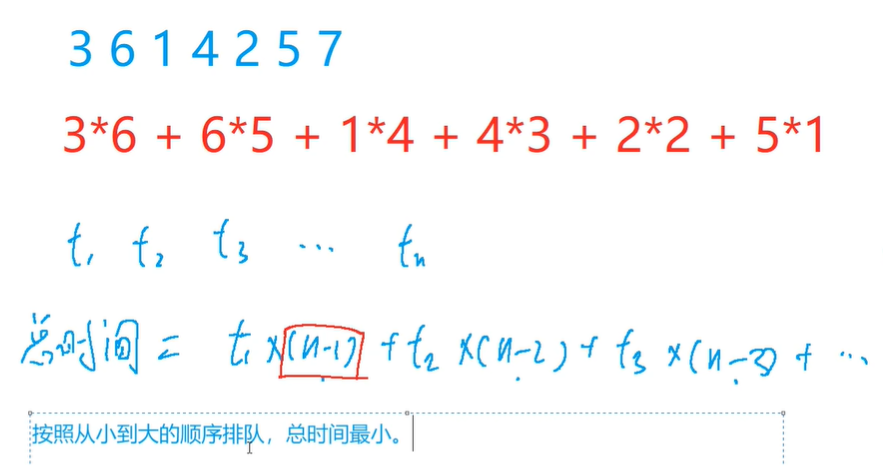
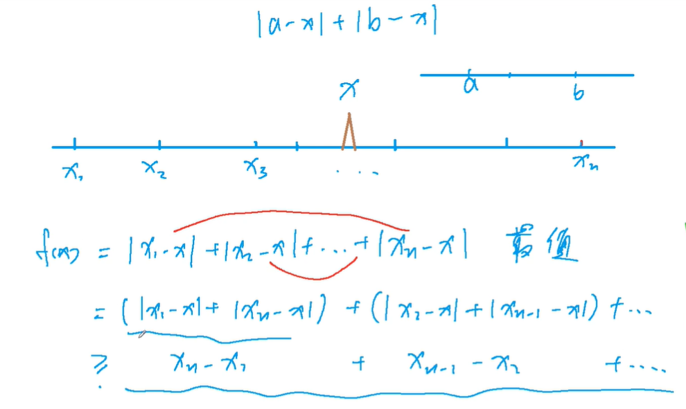
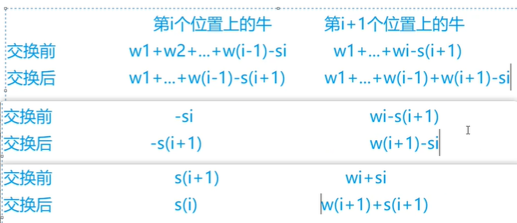

<!-- @import "[TOC]" {cmd="toc" depthFrom=1 depthTo=4 orderedList=false} -->

<!-- code_chunk_output -->

- [排序不等式](#排序不等式)
  - [例题：排队打水](#例题排队打水)
- [绝对值不等式](#绝对值不等式)
  - [例题：货仓选址](#例题货仓选址)
- [推公式](#推公式)
  - [例题：耍杂技的牛](#例题耍杂技的牛)

<!-- /code_chunk_output -->

### 排序不等式

#### 例题：排队打水

- 有 n 个人排队到 1 个水龙头处打水，第 i 个人装满水桶所需的时间是 $t_i$，请问如何安排他们的打水顺序才能使所有人的等待时间之和最小？

输入格式
- 第一行包含整数 n。
- 第二行包含 n 个整数，其中第 i 个整数表示第 i 个人装满水桶所花费的时间 $t_i$。

输出格式
- 输出一个整数，表示最小的等待时间之和。

数据范围
- $1≤n≤10^5$
- $1≤t_i≤10^4$



**分析：** 按照从小到大的顺序排队，总时间最小。证明可以用反证法（假设不是从小到大排序，而交换可以使总等待时间更短，则说明必须从小到大排序）。

```cpp
#include <iostream>
#include <cstring>
#include <algorithm>

using namespace std;

const int N = 1e5 + 10;
int n;
int t[N];

typedef long long LL;

int main()
{
    scanf("%d", &n);
    for (int i = 0; i < n; i ++ ) scanf("%d", &t[i]);
    
    sort(t, t + n);
    
    LL res = 0;
    for (int i = n - 1; i >= 0; i --) res += t[i] * (n - 1 - i);  // 最大的最后打，0 人等他；第二大的倒数第二个打，被 1 个人等

    printf("%lld", res);
    
    return 0;
}

```

**经验：**
- 比如累加这种情况需要用到 `long long` ，思维要严谨，把计算的全流程想一遍

### 绝对值不等式

#### 例题：货仓选址

- 在一条数轴上有 N 家商店，它们的坐标分别为 $A_1∼A_N$。
- 现在需要在数轴上建立一家货仓，每天清晨，从货仓到每家商店都要运送一车商品。
- 为了提高效率，求把货仓建在何处，可以使得货仓到每家商店的距离之和最小。

输入格式
- 第一行输入整数 N。
- 第二行 N 个整数 $A_1∼A_N$。

输出格式
- 输出一个整数，表示距离之和的最小值。

数据范围
- $1≤N≤100000$
- $0≤A_i≤40000$



取中位数就行，证明如上。

```cpp
#include <iostream>
#include <cstring>
#include <algorithm>

using namespace std;

int n ;
const int N = 1e5 + 10;
int a[N];

int main()
{
    scanf("%d", &n);
    for (int i = 0; i < n; i ++ ) scanf("%d", &a[i]);
    
    sort(a, a + n);
    
    int res = 0;
    for (int i = 0; i < n; i ++ ) res += abs(a[i] - a[n / 2]);
    
    printf("%d", res);
    
    return 0;
}
```

### 推公式

#### 例题：耍杂技的牛

- 农民约翰的 N 头奶牛（编号为 1..N）计划逃跑并加入马戏团，为此它们决定练习表演杂技。
- 奶牛们不是非常有创意，只提出了一个杂技表演：
- 叠罗汉，表演时，奶牛们站在彼此的身上，形成一个高高的垂直堆叠。
- 奶牛们正在试图找到自己在这个堆叠中应该所处的位置顺序。
- 这 N 头奶牛中的每一头都有着自己的重量 $W_i$ 以及自己的强壮程度 $S_i$。
- 一头牛支撑不住的可能性取决于它头上所有牛的总重量（不包括它自己）减去它的身体强壮程度的值，现在称该数值为风险值，风险值越大，这只牛撑不住的可能性越高。
- 您的任务是确定奶牛的排序，使得所有奶牛的风险值中的最大值尽可能的小。

输入格式
- 第一行输入整数 N，表示奶牛数量。
- 接下来 N 行，每行输入两个整数，表示牛的重量和强壮程度，第 i 行表示第 i 头牛的重量 $W_i$ 以及它的强壮程度 $S_i$。

输出格式
- 输出一个整数，表示最大风险值的最小可能值。

数据范围
- $1≤N≤50000$
- $1≤W_i≤10,000$
- $1≤S_i≤1,000,000,000$

**分析：**
- 按照 $w_i + s_i$ 从小到大的顺序排，最大的危险系数一定是最小的。



如上，一定有 $w_i + s_i > s_i$ 以及 $w_{i + 1} > s_{i + 1}$ ，因此这里我们比较 $w_i + s_i$ 和 $w_{i + 1} + s_{i + 1}$ 。

如果交换了，那么最大风险有可能从 $w_i + s_i$ 变为 $w_{i + 1} + s_{i + 1}$ ，即最大风险总是由低位（$\{ i, i + 1 \}$ 中的 $i$）的 $w + s$ 决定，我们这里需要最大风险越小越好，所以总是将低位的 $w + s$ 变小。

```cpp
#include <iostream>
#include <cstring>
#include <algorithm>

using namespace std;

typedef pair<int, int> PII;

const int N = 1e5 + 10;

int n;
PII cow[N];

int main()
{
    scanf("%d", &n);
    for (int i = 0; i < n; i ++ )
    {
        int w, s;
        scanf("%d%d", &w, &s);
        cow[i] = {w + s, s};
    }
    
    sort(cow, cow + n);
    
    int res = -2e9, sum = 0;
    for (int i = 0; i < n; i ++ )
    {
        int w = cow[i].first - cow[i].second, s = cow[i].second;
        res = max(res, sum - s);
        sum += w;
    }
    
    printf("%d", res);
    return 0 ;
}
```
