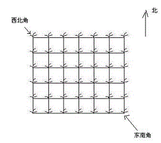

<!-- @import "[TOC]" {cmd="toc" depthFrom=1 depthTo=6 orderedList=false} -->

<!-- code_chunk_output -->

- [数字三角形模型](#数字三角形模型)
  - [摘花生](#摘花生)
  - [最低通行费](#最低通行费)
  - [方格取数](#方格取数)
  - [传纸条](#传纸条)

<!-- /code_chunk_output -->

### 数字三角形模型

#### 摘花生

<p>Hello Kitty想摘点花生送给她喜欢的米老鼠。</p>

<p>她来到一片有网格状道路的矩形花生地(如下图)，从西北角进去，东南角出来。</p>

<p>地里每个道路的交叉点上都有种着一株花生苗，上面有若干颗花生，经过一株花生苗就能摘走该它上面所有的花生。</p>

<p>Hello Kitty只能向东或向南走，不能向西或向北走。</p>

<p>问Hello Kitty最多能够摘到多少颗花生。</p>



<h4>输入格式</h4>

<p>第一行是一个整数T，代表一共有多少组数据。</p>

<p>接下来是T组数据。</p>

<p>每组数据的第一行是两个整数，分别代表花生苗的行数R和列数 C。</p>

<p>每组数据的接下来R行数据，从北向南依次描述每行花生苗的情况。每行数据有C个整数，按从西向东的顺序描述了该行每株花生苗上的花生数目M。</p>

<h4>输出格式</h4>

<p>对每组输入数据，输出一行，内容为Hello Kitty能摘到得最多的花生颗数。</p>

<h4>数据范围</h4>

- $1 \le T \le 100$,
- $1 \le R,C \le 100$,
- $0 \le M \le 1000$

<h4>输入样例：</h4>

<pre><code>
2
2 2
1 1
3 4
2 3
2 3 4
1 6 5
</code></pre>

<h4>输出样例：</h4>

<pre><code>
8
16
</code></pre>

```cpp
#include <iostream>
#include <algorithm>

using namespace std;

const int N = 110;

int n, m;
int w[N][N];
int f[N][N];

int main()
{
    int T;
    scanf("%d", &T);
    while (T -- )
    {
        scanf("%d%d", &n, &m);
        for (int i = 1; i <= n; i ++ )
            for (int j = 1; j <= m; j ++ )
                scanf("%d", &w[i][j]);

        for (int i = 1; i <= n; i ++ )
            for (int j = 1; j <= m; j ++ )
                f[i][j] = max(f[i - 1][j], f[i][j - 1]) + w[i][j];

        printf("%d\n", f[n][m]);
    }

    return 0;
}
```

#### 最低通行费

一个商人穿过一个 $N×N$ 的正方形的网格，去参加一个非常重要的商务活动。

他要从网格的左上角进，右下角出。

每穿越中间 $1$ 个小方格，都要花费 $1$ 个单位时间。

商人必须在 $(2N-1)$ 个单位时间穿越出去。

而在经过中间的每个小方格时，都需要缴纳一定的费用。

<p>这个商人期望在规定时间内用最少费用穿越出去。</p>
<p>请问至少需要多少费用？</p>

<p>注意：不能对角穿越各个小方格（即，只能向上下左右四个方向移动且不能离开网格）。</p>

<h4>输入格式</h4>

第一行是一个整数，表示正方形的宽度 $N$。

后面 $N$ 行，每行 $N$ 个不大于 $100$ 的正整数，为网格上每个小方格的费用。

<h4>输出格式</h4>

<p>输出一个整数，表示至少需要的费用。</p>

<h4>数据范围</h4>

$1 \le N \le 100$

<h4>输入样例：</h4>

<pre><code>
5
1  4  6  8  10
2  5  7  15 17
6  8  9  18 20
10 11 12 19 21
20 23 25 29 33
</code></pre>

<h4>输出样例：</h4>

<pre><code>
109
</code></pre>

<h4>样例解释</h4>

样例中，最小值为 $109=1+2+5+7+9+12+19+21+33$。

```cpp
#include <iostream>
#include <cstring>
#include <algorithm>
using namespace std;

const int N = 110, INF = 2e9;
int dp[N][N];
int w[N][N];
int n;

int main()
{
    scanf("%d", &n);
    for (int i = 1; i <= n; ++ i)
        for (int j = 1; j <= n; ++ j)
            scanf("%d", &w[i][j]);
    
    for (int i = 1; i <= n; ++ i)
        for (int j = 1; j <= n; ++ j)
            if (i == 1 && j == 1) dp[i][j] = w[i][j];  // 左上角特判
            else
            {
                dp[i][j] = INF;
                if (i > 1) dp[i][j] = min(dp[i][j], dp[i-1][j] + w[i][j]);  // 只有不在第1行，才可用从上一行状态转移到本状态
                if (j > 1) dp[i][j] = min(dp[i][j], dp[i][j-1] + w[i][j]);  // 只有不在第1列，才可用从上一列状态转移到本状态
            }
    
    printf("%d\n", dp[n][n]);
}
```

#### 方格取数

<p>设有 N×N 的方格图，我们在其中的某些方格中填入正整数，而其它的方格中则放入数字0。如下图所示：</p>


<p>某人从图中的左上角 A 出发，可以向下行走，也可以向右行走，直到到达右下角的 B 点。</p>

<p>在走过的路上，他可以取走方格中的数（取走后的方格中将变为数字0）。</p>

<p>此人从 A 点到 B 点共走了两次，试找出两条这样的路径，使得取得的数字和为最大。</p>

<h4>输入格式</h4>

<p>第一行为一个整数N，表示 N×N 的方格图。</p>

<p>接下来的每行有三个整数，第一个为行号数，第二个为列号数，第三个为在该行、该列上所放的数。</p>

行和列编号从 $1$ 开始。

<p>一行“0 0 0”表示结束。</p>

<h4>输出格式</h4>

<p>输出一个整数，表示两条路径上取得的最大的和。</p>

<h4>数据范围</h4>

$N \le 10$

<h4>输入样例：</h4>

<pre><code>
8
2 3 13
2 6 6
3 5 7
4 4 14
5 2 21
5 6 4
6 3 15
7 2 14
0 0 0
</code></pre>

<h4>输出样例：</h4>

<pre><code>
67
</code></pre>

```cpp
// 由于行走方向只能是右/下
// 因此，到达 (i, j) 点时，所经过的总步数 k 一定是确定的
// 因此，确定了 i 与 k ，则一定能得到 k
// 可以让两个小朋友同时走（递推性，可以保证最大目标），方程为 f[k][i1][j1][i2][j2]
// 而 j1 = k - i1 因此最终方程为 f[k][i1][i2]
#include <iostream>
#include <algorithm>

using namespace std;

const int N = 15;

int n;
int w[N][N];
int f[N * 2][N][N];

int main()
{
    scanf("%d", &n);

    int a, b, c;
    while (cin >> a >> b >> c, a || b || c) w[a][b] = c;

    for (int k = 2; k <= n + n; k ++ )
        for (int i1 = 1; i1 <= n; i1 ++ )
            for (int i2 = 1; i2 <= n; i2 ++ )
            {
                int j1 = k - i1, j2 = k - i2;
                if (j1 >= 1 && j1 <= n && j2 >= 1 && j2 <= n)
                {
                    int t = w[i1][j1];
                    if (i1 != i2) t += w[i2][j2];  // 不重合，则加上 i2 j2 上的点
                    // 问：如果 i1 j1 再次抵达 i2 j2 怎么办，岂不是重复加了这一点？
                    // 答：不会的，因为 i1 + j1 = k 时还没抵达 i2 j2 (i2+j2=k) ，以后也没机会了
                    int &x = f[k][i1][i2];
                    x = max(x, f[k - 1][i1 - 1][i2 - 1] + t);
                    x = max(x, f[k - 1][i1 - 1][i2] + t);
                    x = max(x, f[k - 1][i1][i2 - 1] + t);
                    x = max(x, f[k - 1][i1][i2] + t);
                }
            }

    printf("%d\n", f[n + n][n][n]);
    return 0;
}
```

#### 传纸条

<p>小渊和小轩是好朋友也是同班同学，他们在一起总有谈不完的话题。</p>

一次素质拓展活动中，班上同学安排坐成一个 $m$ 行 $n$ 列的矩阵，而小渊和小轩被安排在矩阵对角线的两端，因此，他们就无法直接交谈了。

<p>幸运的是，他们可以通过传纸条来进行交流。</p>

纸条要经由许多同学传到对方手里，小渊坐在矩阵的左上角，坐标 $(1,1)$，小轩坐在矩阵的右下角，坐标 $(m,n)$。

<p>从小渊传到小轩的纸条只可以向下或者向右传递，从小轩传给小渊的纸条只可以向上或者向左传递。 </p>

<p>在活动进行中，小渊希望给小轩传递一张纸条，同时希望小轩给他回复。</p>

<p>班里每个同学都可以帮他们传递，但只会帮他们一次，也就是说如果此人在小渊递给小轩纸条的时候帮忙，那么在小轩递给小渊的时候就不会再帮忙，反之亦然。 </p>

还有一件事情需要注意，全班每个同学愿意帮忙的好感度有高有低（注意：小渊和小轩的好心程度没有定义，输入时用 $0$ 表示），可以用一个 $0 \sim 100$ 的自然数来表示，数越大表示越好心。

<p>小渊和小轩希望尽可能找好心程度高的同学来帮忙传纸条，即找到来回两条传递路径，使得这两条路径上同学的好心程度之和最大。</p>

<p>现在，请你帮助小渊和小轩找到这样的两条路径。</p>

<h4>输入格式</h4>

第一行有 $2$ 个用空格隔开的整数 $m$ 和 $n$，表示学生矩阵有 $m$ 行 $n$ 列。

接下来的 $m$ 行是一个 $m \times n$ 的矩阵，矩阵中第 $i$ 行 $j$ 列的整数表示坐在第 $i$ 行 $j$ 列的学生的好心程度，每行的 $n$ 个整数之间用空格隔开。

<h4>输出格式</h4>

<p>输出一个整数，表示来回两条路上参与传递纸条的学生的好心程度之和的最大值。</p>

<h4>数据范围</h4>

$1 \le n,m \le 50$

<h4>输入样例：</h4>

<pre><code>
3 3
0 3 9
2 8 5
5 7 0
</code></pre>

<h4>输出样例：</h4>

<pre><code>
34
</code></pre>

```cpp
// 虽然小朋友2是从后往前，但算法上与两个小朋友从左上出发无差异
// 还是用步数和x轴坐标确定具体位置
#include <cstdio>
#include <cstring>
#include <iostream>
#include <algorithm>

using namespace std;

const int N = 55;

int n, m;
int g[N][N];
int f[N * 2][N][N];

int main()
{
    scanf("%d%d", &n, &m);
    for (int i = 1; i <= n; i ++ )
        for (int j = 1; j <= m; j ++ )
            scanf("%d", &g[i][j]);

    for (int k = 2; k <= n + m; k ++ )
        for (int i = max(1, k - m); i <= n && i < k; i ++ )  // 小朋友1横坐标
            for (int j = max(1, k - m); j <= n && j < k; j ++ )  // 小朋友2横坐标
                for (int a = 0; a <= 1; a ++ )
                    for (int b = 0; b <= 1; b ++ )
                    {
                        int t = g[i][k - i];
                        if (i != j || k == 2 || k == n + m) // 除了起点和终点之外，其余每个格子只能走一次
                        {
                            t += g[j][k - j];
                            f[k][i][j] = max(f[k][i][j], f[k - 1][i - a][j - b] + t);
                        }
                    }

    printf("%d\n", f[n + m][n][n]);

    return 0;
}
```
