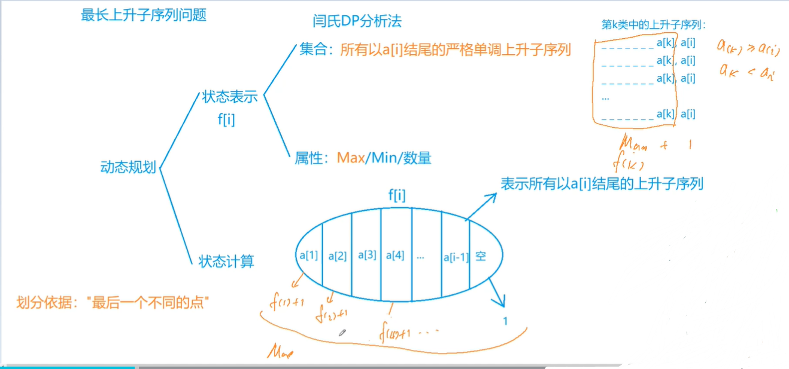
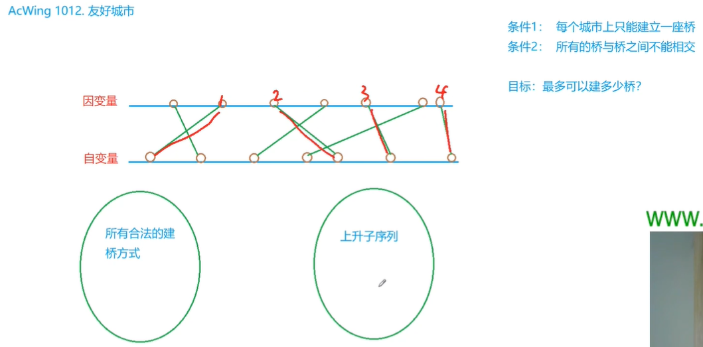

<!-- @import "[TOC]" {cmd="toc" depthFrom=1 depthTo=6 orderedList=false} -->

<!-- code_chunk_output -->

- [最长上升子序列模型](#最长上升子序列模型)
  - [怪盗基德的滑翔翼](#怪盗基德的滑翔翼)
  - [登山](#登山)
  - [合唱队形](#合唱队形)
  - [友好城市](#友好城市)
  - [最大上升子序列和](#最大上升子序列和)

<!-- /code_chunk_output -->

### 最长上升子序列模型

最长上升子序列（Longest  Increasing Subsequence），简称LIS。



如上，转移状态可分为 `i` 个，且不一定能转移到 `a[i]` （需要满足 `a[k] < a[i]`）。时间复杂度为 $O(n^2)$ 。

```cpp
#include <iostream>
#include <cstring>
#include <algorithm>

using namespace std;

const int N = 1e3 + 10;

int f[N];
int a[N];
int n;

int main()
{
    scanf("%d", &n);
    for (int i = 1; i <= n; i ++) scanf("%d", &a[i]);
    
    for (int i = 1; i <= n; i ++)
    {
        f[i] = 1;
        for (int j = 1; j <= i - 1; j ++)
        {
            if (a[i] > a[j])
                f[i] = max(f[i], f[j] + 1);
        }
    }
    
    int res = 0;
    for (int i = 1; i <= n; i ++ ) res = max(res, f[i]);
    
    printf("%d", res);
    return 0;
}
```

#### 怪盗基德的滑翔翼

怪盗基德是一个充满传奇色彩的怪盗，专门以珠宝为目标的超级盗窃犯。

而他最为突出的地方，就是他每次都能逃脱中村警部的重重围堵，而这也很大程度上是多亏了他随身携带的便于操作的滑翔翼。

有一天，怪盗基德像往常一样偷走了一颗珍贵的钻石，不料却被柯南小朋友识破了伪装，而他的滑翔翼的动力装置也被柯南踢出的足球破坏了。

不得已，怪盗基德只能操作受损的滑翔翼逃脱。

假设城市中一共有N幢建筑排成一条线，每幢建筑的高度各不相同。

初始时，怪盗基德可以在任何一幢建筑的顶端。

他可以选择一个方向逃跑，但是不能中途改变方向（因为中森警部会在后面追击）。

因为滑翔翼动力装置受损，他只能往下滑行（即：只能从较高的建筑滑翔到较低的建筑）。

他希望尽可能多地经过不同建筑的顶部，这样可以减缓下降时的冲击力，减少受伤的可能性。

请问，他最多可以经过多少幢不同建筑的顶部(包含初始时的建筑)？

<h4>输入格式</h4>

输入数据第一行是一个整数K，代表有K组测试数据。

每组测试数据包含两行：第一行是一个整数N，代表有N幢建筑。第二行包含N个不同的整数，每一个对应一幢建筑的高度h，按照建筑的排列顺序给出。

<h4>输出格式</h4>

对于每一组测试数据，输出一行，包含一个整数，代表怪盗基德最多可以经过的建筑数量。

<h4>数据范围</h4>

- $1 \le K \le 100$,
- $1 \le N \le 100$,
- $0 < h < 10000$

<h4>输入样例：</h4>

```
3
8
300 207 155 299 298 170 158 65
8
65 158 170 298 299 155 207 300
10
2 1 3 4 5 6 7 8 9 10
```

<h4>输出样例：</h4>

```
6
6
9
```

```cpp
// 选起点 a[i]
// 即以 a[i] 结尾的最长上升子序列
#include <cstring>
#include <iostream>
#include <algorithm>

using namespace std;

const int N = 110;

int n;
int h[N];
int f[N];

int main()
{
    int T;
    scanf("%d", &T);
    while (T -- )
    {
        scanf("%d", &n);
        for (int i = 0; i < n; i ++ ) scanf("%d", &h[i]);
        
        // 正向 LIS
        int res = 0;
        for (int i = 0; i < n; i ++ )
        {
            f[i] = 1;
            for (int j = 0; j < i; j ++ )
                if (h[i] < h[j])
                    f[i] = max(f[i], f[j] + 1);
            res = max(res, f[i]);
        }
        
        // 反向 LIS
        for (int i = n - 1; i >= 0; i -- )
        {
            f[i] = 1;
            for (int j = n - 1; j > i; j -- )
                if (h[i] < h[j])
                    f[i] = max(f[i], f[j] + 1);
            res = max(res, f[i]);
        }

        printf("%d\n", res);
    }

    return 0;
}
```

#### 登山

五一到了，ACM队组织大家去登山观光，队员们发现山上一共有N个景点，并且决定按照顺序来浏览这些景点，即每次所浏览景点的编号都要大于前一个浏览景点的编号。

同时队员们还有另一个登山习惯，就是不连续浏览海拔相同的两个景点，并且一旦开始下山，就不再向上走了。

队员们希望在满足上面条件的同时，尽可能多的浏览景点，你能帮他们找出最多可能浏览的景点数么？

<h4>输入格式</h4>

第一行包含整数N，表示景点数量。

第二行包含N个整数，表示每个景点的海拔。

<h4>输出格式</h4>

输出一个整数，表示最多能浏览的景点数。

<h4>数据范围</h4>

$2 \le N \le 1000$

<h4>输入样例：</h4>

```
8
186 186 150 200 160 130 197 220
```

<h4>输出样例：</h4>

```
4
```

```cpp
// 走过路线形状：先严格上升，再严格下降
#include <iostream>
#include <algorithm>

using namespace std;

const int N = 1010;

int n;
int h[N];
int f[N], g[N];

int main()
{
    scanf("%d", &n);
    for (int i = 0; i < n; i ++ ) scanf("%d", &h[i]);

    for (int i = 0; i < n; i ++ )  // 上升
    {
        f[i] = 1;
        for (int j = 0; j < i; j ++ )
            if (h[i] > h[j])
                f[i] = max(f[i], f[j] + 1);
    }

    for (int i = n - 1; i >= 0; i -- )  // 下降
    {
        g[i] = 1;
        for (int j = n - 1; j > i; j -- )
            if (h[i] > h[j])
                g[i] = max(g[i], g[j] + 1);
    }

    int res = 0;
    for (int i = 0; i < n; i ++ ) res = max(res, f[i] + g[i] - 1);  // -1 因为记了 i 点两次

    printf("%d\n", res);

    return 0;
}
```

#### 合唱队形

$N$ 位同学站成一排，音乐老师要请其中的 $(N-K)$ 位同学出列，使得剩下的 $K$ 位同学排成合唱队形。     

合唱队形是指这样的一种队形：设 $K$ 位同学从左到右依次编号为 $1，2…，K$，他们的身高分别为 $T_1，T_2，…，T_K$，  则他们的身高满足 $T_1 < ... < T_i > T_{i+1} > … > T_K(1 \le i \le K)$。     

你的任务是，已知所有 $N$ 位同学的身高，计算最少需要几位同学出列，可以使得剩下的同学排成合唱队形。

<h4>输入格式</h4>

输入的第一行是一个整数 $N$，表示同学的总数。

第二行有 $N$ 个整数，用空格分隔，第 $i$ 个整数 $T_i$ 是第 $i$ 位同学的身高(厘米)。

<h4>输出格式</h4>

输出包括一行，这一行只包含一个整数，就是最少需要几位同学出列。

<h4>数据范围</h4>

- $2 \le N \le 100$,
- $130 \le T_i \le 230$

<h4>输入样例：</h4>

```
8
186 186 150 200 160 130 197 220
```

<h4>输出样例：</h4>

```
4
```

```cpp
// 求最多能留多少同学就行
#include <iostream>
#include <algorithm>

using namespace std;

const int N = 1010;

int n;
int h[N];
int f[N], g[N];

int main()
{
    scanf("%d", &n);
    for (int i = 0; i < n; i ++ ) scanf("%d", &h[i]);

    for (int i = 0; i < n; i ++ )
    {
        f[i] = 1;
        for (int j = 0; j < i; j ++ )
            if (h[i] > h[j])
                f[i] = max(f[i], f[j] + 1);
    }

    for (int i = n - 1; i >= 0; i -- )
    {
        g[i] = 1;
        for (int j = n - 1; j > i; j -- )
            if (h[i] > h[j])
                g[i] = max(g[i], g[j] + 1);
    }

    int res = 0;
    for (int i = 0; i < n; i ++ ) res = max(res, f[i] + g[i] - 1);

    printf("%d\n", n - res);

    return 0;
}
```

#### 友好城市

Palmia国有一条横贯东西的大河，河有笔直的南北两岸，岸上各有位置各不相同的N个城市。

北岸的每个城市有且仅有一个友好城市在南岸，而且不同城市的友好城市不相同。

每对友好城市都向政府申请在河上开辟一条直线航道连接两个城市，但是由于河上雾太大，政府决定避免任意两条航道交叉，以避免事故。

编程帮助政府做出一些批准和拒绝申请的决定，使得在保证任意两条航线不相交的情况下，被批准的申请尽量多。

<h4>输入格式</h4>

第1行，一个整数N，表示城市数。

第2行到第n+1行，每行两个整数，中间用1个空格隔开，分别表示南岸和北岸的一对友好城市的坐标。

<h4>输出格式</h4>

仅一行，输出一个整数，表示政府所能批准的最多申请数。

<h4>数据范围</h4>

- $1 \le N \le 5000$,
- $0 \le x_i \le 10000$

<h4>输入样例：</h4>

```
7
22 4
2 6
10 3
15 12
9 8
17 17
4 2
```

<h4>输出样例：</h4>

```
4
```



如上，我们对南方的桥排序，则要求按这个顺序选出的北方的桥，应该是一个上升子序列，否则不是合法方案。

```cpp
#include <iostream>
#include <algorithm>

using namespace std;

typedef pair<int, int> PII;

const int N = 5010;

int n;
PII city[N];
int f[N];

int main()
{
    scanf("%d", &n);
    for (int i = 0; i < n; i ++ ) scanf("%d%d", &city[i].first, &city[i].second);
    sort(city, city + n);

    int res = 0;
    for (int i = 0; i < n; i ++ )
    {
        f[i] = 1;
        for (int j = 0; j < i; j ++ )
            if (city[i].second > city[j].second)
                f[i] = max(f[i], f[j] + 1);
        res = max(res, f[i]);
    }

    printf("%d\n", res);

    return 0;
}
```

#### 最大上升子序列和

一个数的序列 $b_i$，当 $b_1<b_2<...<b_S$ 的时候，我们称这个序列是上升的。

对于给定的一个序列($a_1,a_2,...,a_N$)，我们可以得到一些上升的子序列($a_{i_1},a_{i_2},...,a_{i_K}$)，这里$1≤i_1<i_2<...<i_K≤N$。

比如，对于序列(1,7,3,5,9,4,8)，有它的一些上升子序列，如(1,7),(3,4,8)等等。

这些子序列中和最大为18，为子序列(1,3,5,9)的和。

你的任务，就是对于给定的序列，求出最大上升子序列和。

注意，最长的上升子序列的和不一定是最大的，比如序列(100,1,2,3)的最大上升子序列和为100，而最长上升子序列为(1,2,3)。

<h4>输入格式</h4>

输入的第一行是序列的长度N。

第二行给出序列中的N个整数，这些整数的取值范围都在0到10000(可能重复)。

<h4>输出格式</h4>

输出一个整数，表示最大上升子序列和。

<h4>数据范围</h4>

$1 \le N \le 1000$

<h4>输入样例：</h4>

```
7
1 7 3 5 9 4 8
```

<h4>输出样例：</h4>

```
18
```

```cpp
// 改了目标函数而已
#include <iostream>
#include <algorithm>

using namespace std;

const int N = 1010;

int n;
int w[N];
int f[N];

int main()
{
    scanf("%d", &n);

    for (int i = 0; i < n; i ++ ) scanf("%d", &w[i]);

    int res = 0;
    for (int i = 0; i < n; i ++ )
    {
        f[i] = w[i];
        for (int j = 0; j < i; j ++ )
            if (w[i] > w[j])
                f[i] = max(f[i], f[j] + w[i]);
        res = max(res, f[i]);
    }

    printf("%d\n", res);

    return 0;
}
```
