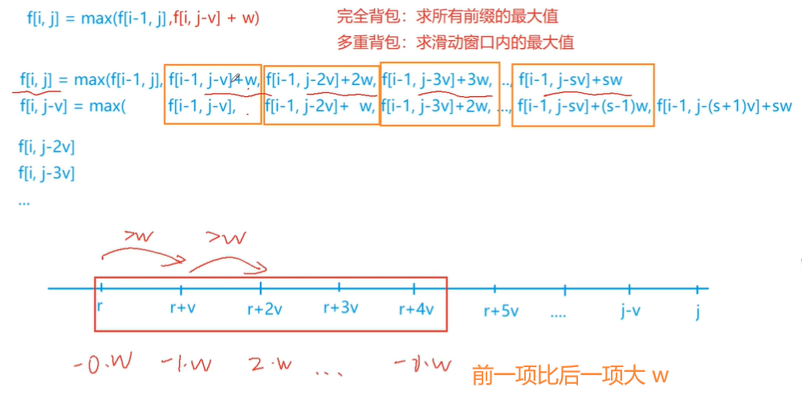

<!-- @import "[TOC]" {cmd="toc" depthFrom=1 depthTo=6 orderedList=false} -->

<!-- code_chunk_output -->

- [背包模型](#背包模型)
  - [多重背包问题 III](#多重背包问题-iii)
  - [采药](#采药)
  - [装箱问题](#装箱问题)
  - [宠物小精灵之收服](#宠物小精灵之收服)

<!-- /code_chunk_output -->

### 背包模型

#### 多重背包问题 III

有 $N$ 种物品和一个容量是 $V$ 的背包。

第 $i$ 种物品最多有 $s_i$ 件，每件体积是 $v_i$，价值是 $w_i$。

- 求解将哪些物品装入背包，可使物品体积总和不超过背包容量，且价值总和最大。
- 输出最大价值。

<h4>输入格式</h4>

第一行两个整数，$N，V$ $(0 \lt N \le 1000$, $0 \lt V \le 20000)$，用空格隔开，分别表示物品种数和背包容积。

接下来有 $N$ 行，每行三个整数 $v_i, w_i, s_i$，用空格隔开，分别表示第 $i$ 种物品的体积、价值和数量。

<h4>输出格式</h4>

输出一个整数，表示最大价值。

<h4>数据范围</h4>

- $0 \lt N \le 1000$
- $0 \lt V \le 20000$
- $0 \lt v_i, w_i, s_i \le 20000$

<h5>提示</h5>
本题考查多重背包的单调队列优化方法。

<h4>输入样例</h4>

```
4 5
1 2 3
2 4 1
3 4 3
4 5 2
```

<h4>输出样例：</h4>

```
10
```



这里再引用[lys的题解](https://www.acwing.com/solution/content/6500/)：
```
dp[i][j] 表示将前 i 种物品放入容量为 j 的背包中所得到的最大价值
dp[i][j] = max(不放入物品 i，放入1个物品 i，放入2个物品 i, ... , 放入k个物品 i)
这里 k 要满足：k <= s, j - k*v >= 0

不放物品  i = dp[i-1][j]
放k个物品 i = dp[i-1][j - k*v] + k*w

dp[i][j] = max(dp[i-1][j], dp[i-1][j-v] + w, dp[i-1][j-2*v] + 2*w,..., dp[i-1][j-k*v] + k*w)


实际上我们并不需要二维的dp数组，适当的调整循环条件，我们可以重复利用dp数组来保存上一轮的信息

我们令 dp[j] 表示容量为j的情况下，获得的最大价值
那么，针对每一类物品 i ，我们都更新一下 dp[m] --> dp[0] 的值，最后 dp[m] 就是一个全局最优值

dp[m] = max(dp[m], dp[m-v] + w, dp[m-2*v] + 2*w, dp[m-3*v] + 3*w, ...)

接下来，我们把 dp[0] --> dp[m] 写成下面这种形式
dp[0], dp[v],   dp[2*v],   dp[3*v],   ... , dp[k*v]
dp[1], dp[v+1], dp[2*v+1], dp[3*v+1], ... , dp[k*v+1]
dp[2], dp[v+2], dp[2*v+2], dp[3*v+2], ... , dp[k*v+2]
...
dp[j], dp[v+j], dp[2*v+j], dp[3*v+j], ... , dp[k*v+j]


显而易见，m 一定等于 k*v + j，其中  0 <= j < v
所以，我们可以把 dp 数组分成 j 个类，每一类中的值，都是在同类之间转换得到的
也就是说，dp[k*v+j] 只依赖于 { dp[j], dp[v+j], dp[2*v+j], dp[3*v+j], ... , dp[k*v+j] }

因为我们需要的是{ dp[j], dp[v+j], dp[2*v+j], dp[3*v+j], ... , dp[k*v+j] } 中的最大值，
可以通过维护一个单调队列来得到结果。这样的话，问题就变成了 j 个单调队列的问题


所以，我们可以得到
dp[j]    =     dp[j]
dp[j+v]  = max(dp[j] +  w,  dp[j+v])
dp[j+2v] = max(dp[j] + 2w,  dp[j+v] +  w, dp[j+2v])
dp[j+3v] = max(dp[j] + 3w,  dp[j+v] + 2w, dp[j+2v] + w, dp[j+3v])
...
但是，这个队列中前面的数，每次都会增加一个 w ，所以我们需要做一些转换


dp[j]    =     dp[j]
dp[j+v]  = max(dp[j], dp[j+v] - w) + w
dp[j+2v] = max(dp[j], dp[j+v] - w, dp[j+2v] - 2w) + 2w
dp[j+3v] = max(dp[j], dp[j+v] - w, dp[j+2v] - 2w, dp[j+3v] - 3w) + 3w
...
这样，每次入队的值是 dp[j+k*v] - k*w


单调队列问题，最重要的两点
1）维护队列元素的个数，如果不能继续入队，弹出队头元素
2）维护队列的单调性，即：尾值 >= dp[j + k*v] - k*w

本题中，队列中元素的个数应该为 s+1 个，即 0 -- s 个物品 i
```

```cpp
#include <cstring>
#include <iostream>
#include <algorithm>

using namespace std;

const int N = 20010;

int n, m;
int f[N], g[N], q[N];

int main()
{
    cin >> n >> m;
    for (int i = 0; i < n; i ++ )
    {
        int v, w, s;
        cin >> v >> w >> s;
        memcpy(g, f, sizeof f);
        for (int j = 0; j < v; j ++ )
        {
            // 单调队列，队列里存的是g/f下标（总体积）
            int hh = 0, tt = -1;
            for (int k = j; k <= m; k += v)
            {
                // 单调队列不为空，滑动窗口对应最小值小于了 k - s * v 
                // （则能装物品的比 s 多，即 q[hh] 加上 s * v 也没法转移到 k 这个体积呀）
                if (hh <= tt && q[hh] < k - s * v) hh ++ ;
                // 保证队列单调性，尾值对应的 g[q[尾值]] - (q[尾值] - j) / v * w （收益）应该是最小的
                // 即单调队列删除冗余元素过程
                while (hh <= tt && g[q[tt]] - (q[tt] - j) / v * w <= g[k] - (k - j) / v * w) tt -- ;
                q[ ++ tt] = k;  // 队尾放入元素
                f[k] = g[q[hh]] + (k - q[hh]) / v * w;  // 放入 k - q[hh] 个物品带来的收益（把最大的收益加上）
            }
        }
    }

    cout << f[m] << endl;

    return 0;
}
```

#### 采药

辰辰是个天资聪颖的孩子，他的梦想是成为世界上最伟大的医师。

为此，他想拜附近最有威望的医师为师。

医师为了判断他的资质，给他出了一个难题。

医师把他带到一个到处都是草药的山洞里对他说：“孩子，这个山洞里有一些不同的草药，采每一株都需要一些时间，每一株也有它自身的价值。我会给你一段时间，在这段时间里，你可以采到一些草药。如果你是一个聪明的孩子，你应该可以让采到的草药的总价值最大。”

如果你是辰辰，你能完成这个任务吗？

<h4>输入格式</h4>

输入文件的第一行有两个整数 $T$ 和 $M$，用一个空格隔开，$T$ 代表总共能够用来采药的时间，$M$ 代表山洞里的草药的数目。

接下来的 $M$ 行每行包括两个在 $1$ 到 $100$ 之间（包括 $1$ 和 $100$）的整数，分别表示采摘某株草药的时间和这株草药的价值。

<h4>输出格式</h4>

输出文件包括一行，这一行只包含一个整数，表示在规定的时间内，可以采到的草药的最大总价值。

<h4>数据范围</h4>

- $1 \le T \le 1000$,
- $1 \le M \le 100$

<h4>输入样例：</h4>

```
70 3
71 100
69 1
1 2
```

<h4>输出样例：</h4>

```
3
```

```cpp
// 01 背包
#include <iostream>
#include <algorithm>
using namespace std;

const int N = 1010, M = 110;
int n, m;
int f[N];

int main()
{
    cin >> m >> n;
    for (int i = 0; i < n; ++ i)
    {
        int v, w;
        cin >> v >> w;
        for (int j = m; j >= v; -- j) f[j] = max(f[j], f[j - v] + w);
    }
    
    cout << f[m] << endl;
}
```

#### 装箱问题

有一个箱子容量为 V，同时有 n 个物品，每个物品有一个体积（正整数）。

要求 n 个物品中，任取若干个装入箱内，使箱子的剩余空间为最小。

<h4>输入格式</h4>

第一行是一个整数 V，表示箱子容量。

第二行是一个整数 n，表示物品数。

接下来 n 行，每行一个正整数（不超过10000），分别表示这 n 个物品的各自体积。

<h4>输出格式</h4>

一个整数，表示箱子剩余空间。

<h4>数据范围</h4>

- $0 < V \le 20000$,
- $0 < n \le 30$

<h4>输入样例：</h4>

```
24
6
8
3
12
7
9
7
```

<h4>输出样例：</h4>

```
0
```

```cpp
#include <iostream>
#include <algorithm>

using namespace std;

const int M = 20010;

int n, m;
int f[M];

int main()
{
    cin >> m >> n;
    for (int i = 0; i < n; i ++ )
    {
        int v;
        cin >> v;
        for (int j = m; j >= v; j -- )
            f[j] = max(f[j], f[j - v] + v);
    }

    cout << m - f[m] << endl;

    return 0;
}
```

#### 宠物小精灵之收服

宠物小精灵是一部讲述小智和他的搭档皮卡丘一起冒险的故事。

一天，小智和皮卡丘来到了小精灵狩猎场，里面有很多珍贵的野生宠物小精灵。

小智也想收服其中的一些小精灵。

然而，野生的小精灵并不那么容易被收服。

对于每一个野生小精灵而言，小智可能需要使用很多个精灵球才能收服它，而在收服过程中，野生小精灵也会对皮卡丘造成一定的伤害（从而减少皮卡丘的体力）。

当皮卡丘的体力小于等于0时，小智就必须结束狩猎（因为他需要给皮卡丘疗伤），而使得皮卡丘体力小于等于0的野生小精灵也不会被小智收服。

当小智的精灵球用完时，狩猎也宣告结束。

我们假设小智遇到野生小精灵时有两个选择：收服它，或者离开它。

如果小智选择了收服，那么一定会扔出能够收服该小精灵的精灵球，而皮卡丘也一定会受到相应的伤害；如果选择离开它，那么小智不会损失精灵球，皮卡丘也不会损失体力。

小智的目标有两个：主要目标是收服尽可能多的野生小精灵；如果可以收服的小精灵数量一样，小智希望皮卡丘受到的伤害越小（剩余体力越大），因为他们还要继续冒险。

现在已知小智的精灵球数量和皮卡丘的初始体力，已知每一个小精灵需要的用于收服的精灵球数目和它在被收服过程中会对皮卡丘造成的伤害数目。

请问，小智该如何选择收服哪些小精灵以达到他的目标呢？

<h4>输入格式</h4>

输入数据的第一行包含三个整数：N，M，K，分别代表小智的精灵球数量、皮卡丘初始的体力值、野生小精灵的数量。

之后的K行，每一行代表一个野生小精灵，包括两个整数：收服该小精灵需要的精灵球的数量，以及收服过程中对皮卡丘造成的伤害。

<h4>输出格式</h4>

输出为一行，包含两个整数：C，R，分别表示最多收服C个小精灵，以及收服C个小精灵时皮卡丘的剩余体力值最多为R。

<h4>数据范围</h4>

- $0 < N \le 1000$,
- $0 < M \le 500$,
- $0 < K \le 100$

<h4>输入样例1：</h4>

```
10 100 5
7 10
2 40
2 50
1 20
4 20
```

<h4>输出样例1：</h4>

```
3 30
```

<h4>输入样例2：</h4>

```
10 100 5
8 110
12 10
20 10
5 200
1 110
```

<h4>输出样例2：</h4>

```
0 100
```

```cpp
#include <iostream>
#include <algorithm>

using namespace std;

const int N = 1010, M = 510;

int n, V1, V2;
int f[N][M];  // 精灵球与体力

int main()
{
    cin >> V1 >> V2 >> n;
    for (int i = 0; i < n; i ++ )
    {
        int v1, v2;
        cin >> v1 >> v2;
        for (int j = V1; j >= v1; j -- )
            for (int k = V2 - 1; k >= v2; k -- )  // V2 - 1 因为皮卡丘体力不能等于 0
                f[j][k] = max(f[j][k], f[j - v1][k - v2] + 1);
    }

    cout << f[V1][V2 - 1] << ' ';
    int k = V2 - 1;  // k 是花费体力
    while (k > 0 && f[V1][k - 1] == f[V1][V2 - 1]) k -- ;  // 同等收益，但是花费体力最少
    cout << V2 - k << endl;

    return 0;
}
```
