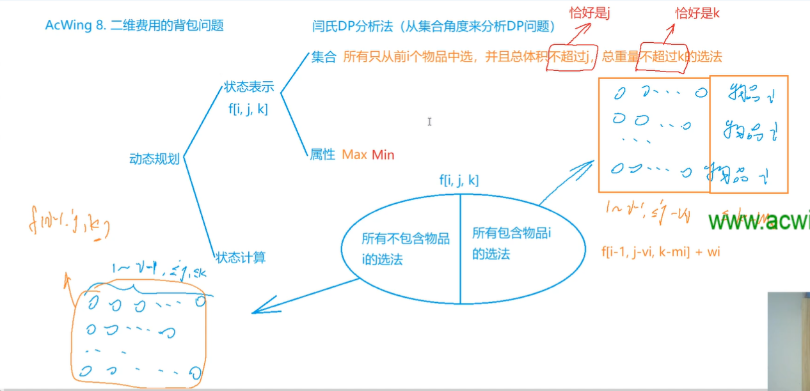
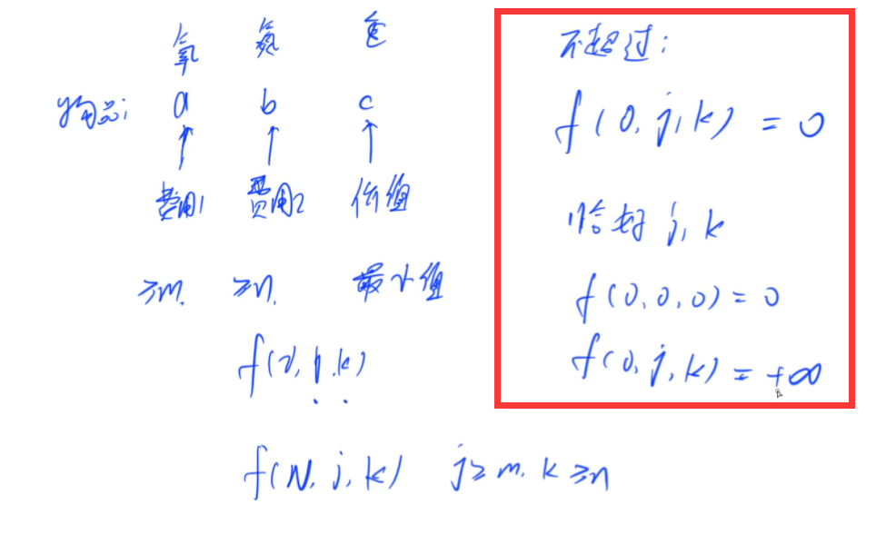
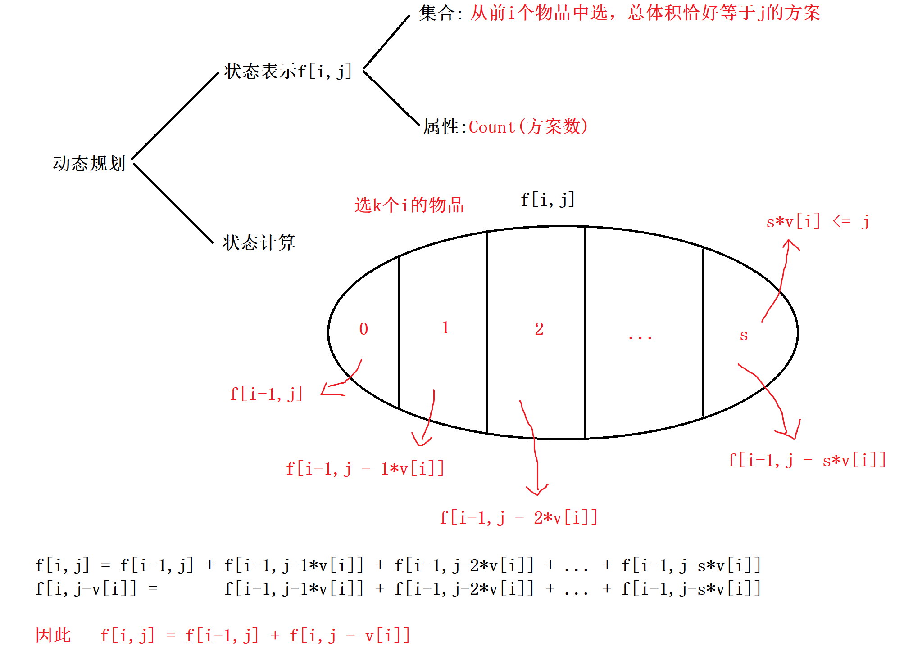

<!-- @import "[TOC]" {cmd="toc" depthFrom=1 depthTo=6 orderedList=false} -->

<!-- code_chunk_output -->

- [背包模型](#背包模型)
  - [二维费用的背包问题](#二维费用的背包问题)
  - [潜水员（二维背包+恰好是+最小值）](#潜水员二维背包恰好是最小值)
  - [数字组合（01背包体积M方案数）](#数字组合01背包体积m方案数)
  - [庆功会（多重背包朴素版）](#庆功会多重背包朴素版)
  - [买书（完全背包问题+求方案数）](#买书完全背包问题求方案数)

<!-- /code_chunk_output -->

### 背包模型

#### 二维费用的背包问题

有 $N$ 件物品和一个容量是 $V$ 的背包，背包能承受的最大重量是 $M$。

每件物品只能用一次。体积是 $v_i$，重量是 $m_i$，价值是 $w_i$。

- 求解将哪些物品装入背包，可使物品总体积不超过背包容量，总重量不超过背包可承受的最大重量，且价值总和最大。
- 输出最大价值。

<h4>输入格式</h4>

第一行三个整数，$N,V, M$，用空格隔开，分别表示物品件数、背包容积和背包可承受的最大重量。

接下来有 $N$ 行，每行三个整数 $v_i, m_i, w_i$，用空格隔开，分别表示第 $i$ 件物品的体积、重量和价值。

<h4>输出格式</h4>

输出一个整数，表示最大价值。

<h4>数据范围</h4>

- $0 \lt N \le 1000$
- $0 \lt V, M \le 100$
- $0 \lt v_i, m_i \le 100$
- $0 \lt w_i \le 1000$

<h4>输入样例</h4>

```
4 5 6
1 2 3
2 4 4
3 4 5
4 5 6
```

<h4>输出样例：</h4>

```
8
```

```cpp
#include <iostream>

using namespace std;

const int N = 110;

int n, V, M;
int f[N][N];

int main()
{
    cin >> n >> V >> M;

    for (int i = 0; i < n; i ++ )
    {
        int v, m, w;
        cin >> v >> m >> w;
        for (int j = V; j >= v; j -- )
            for (int k = M; k >= m; k -- )
                f[j][k] = max(f[j][k], f[j - v][k - m] + w);
    }

    cout << f[V][M] << endl;

    return 0;
}
```

#### 潜水员（二维背包+恰好是+最小值）

潜水员为了潜水要使用特殊的装备。

他有一个带2种气体的气缸：一个为氧气，一个为氮气。

让潜水员下潜的深度需要各种数量的氧和氮。

潜水员有一定数量的气缸。

每个气缸都有重量和气体容量。

潜水员为了完成他的工作需要特定数量的氧和氮。

他完成工作所需气缸的总重的最低限度的是多少？

例如：潜水员有5个气缸。每行三个数字为：氧，氮的（升）量和气缸的重量：

```
3 36 120

10 25 129

5 50 250

1 45 130

4 20 119
```

如果潜水员需要5升的氧和60升的氮则总重最小为249（1，2或者4，5号气缸）。

你的任务就是计算潜水员为了完成他的工作需要的气缸的重量的最低值。

<h4>输入格式</h4>

第一行有2个整数 $m，n$。它们表示氧，氮各自需要的量。

第二行为整数 $k$ 表示气缸的个数。

此后的 $k$ 行，每行包括$a_i，b_i，c_i$，3个整数。这些各自是：第 $i$ 个气缸里的氧和氮的容量及气缸重量。

<h4>输出格式</h4>

仅一行包含一个整数，为潜水员完成工作所需的气缸的重量总和的最低值。

<h4>数据范围</h4>

- $1 \le m \le 21$,
- $1 \le n \le 79$,
- $1 \le k \le 1000$,
- $1 \le a_i \le 21$,
- $1 \le b_i \le 79$,
- $1 \le c_i \le 800$

<h4>输入样例：</h4>

```
5 60
5
3 36 120
10 25 129
5 50 250
1 45 130
4 20 119
```

<h4>输出样例：</h4>

```
249
```



如上，相对于模板：
- 把状态中的“不超过”改为“恰好为”
- 属性改为 `Min`



这里需要注意 **如何设计不合法的状态** ：
- 在我们用 `f(i, j, k)` 表示前 `i` 个物品总重总体积不超过 `j` 和 `k` 时， `f(0, j, k)` 自然是 0 （方案中最大价值为0）
- 然而，在我们用 `f(i, j, k)` 表示前 `i` 个物品总重总体积恰好为 `j` 和 `k` 时， `f(0, 0, 0)` 自然是 0 （方案中最大价值为0），但 `f(0, j, k)` （`j, k` 不同时为 `0`）应该设置为正无穷，因为不存在这样的方案

```cpp
#include <cstring>
#include <iostream>

using namespace std;

const int N = 22, M = 80;

int n, m, K;
int f[N][M];

int main()
{
    cin >> n >> m >> K;

    memset(f, 0x3f, sizeof f);
    f[0][0] = 0;

    while (K -- )
    {
        int v1, v2, w;
        cin >> v1 >> v2 >> w;
        for (int i = n; i >= 0; i -- )
            for (int j = m; j >= 0; j -- )
                // 前提是一定有解，但不需要恰好有满足 n, m 的方案
                // 因为这里是 max(0, i - v1) max(0, j - v2)
                // 这个处理很艺术，即对于氧气为 10 ，重量为 5 的物品
                // f[0] ~ f[10] 都可以被赋值，认为其氧气恰好为 0 ~ 10 时重量为 5
                f[i][j] = min(f[i][j], f[max(0, i - v1)][max(0, j - v2)] + w);
    }

    cout << f[n][m] << endl;

    return 0;
}
```

#### 数字组合（01背包体积M方案数）

给定 $N$ 个正整数 $A_1,A_2,...,A_N$，从中选出若干个数，使它们的和为 $M$，求有多少种选择方案。

<h4>输入格式</h4>

第一行包含两个整数 $N$ 和 $M$。

第二行包含 $N$ 个整数，表示 $A_1,A_2,...,A_N$。

<h4>输出格式</h4>

包含一个整数，表示可选方案数。

<h4>数据范围</h4>

- $1 \le N \le 100$,
- $1 \le M \le 10000$,
- $1 \le A_i \le 1000$,
- 答案保证在 int 范围内。

<h4>输入样例：</h4>

```
4 4
1 1 2 2
```

<h4>输出样例：</h4>

```
3
```

```cpp
// 01背包总体积 M 方案数
#include <iostream>
#include <algorithm>

using namespace std;

const int N = 10010;

int n, m;
int f[N];  // f 为方案数，f[i, j] 前 i 个物品总体积恰好为 j 的方案数的结合

int main()
{
    cin >> n >> m;

    f[0] = 1;
    for (int i = 0; i < n; i ++ )
    {
        int v;
        cin >> v;
        for (int j = m; j >= v; j -- )
            f[j] += f[j - v];  // f[j] = f[j] （不选 v） + f[j - v] （选 v）
    }

    cout << f[m] << endl;

    return 0;
}
```

#### 庆功会（多重背包朴素版）

为了庆贺班级在校运动会上取得全校第一名成绩，班主任决定开一场庆功会，为此拨款购买奖品犒劳运动员。

期望拨款金额能购买最大价值的奖品，可以补充他们的精力和体力。

<h4>输入格式</h4>

第一行二个数n，m，其中n代表希望购买的奖品的种数，m表示拨款金额。

接下来n行，每行3个数，v、w、s，分别表示第I种奖品的价格、价值（价格与价值是不同的概念）和能购买的最大数量（买0件到s件均可）。

<h4>输出格式</h4>

一行：一个数，表示此次购买能获得的最大的价值（注意！不是价格）。

<h4>数据范围</h4>

- $n \le 500, m \le 6000$,
- $v \le 100, w \le 1000, s \le 10$

<h4>输入样例：</h4>

```
5 1000
80 20 4
40 50 9
30 50 7
40 30 6
20 20 1
```

<h4>输出样例：</h4>

```
1040
```

```cpp
// 多重背包：朴素版 500 * 6000 * 11 二进制优化、单调队列优化都不用了
#include <iostream>

using namespace std;

const int N = 6010;

int n, m;
int f[N];

int main()
{
    cin >> n >> m;

    for (int i = 0; i < n; i ++ )
    {
        int v, w, s;
        cin >> v >> w >> s;
        for (int j = m; j >= 0; j -- )
            for (int k = 0; k <= s && k * v <= j; k ++ )
                f[j] = max(f[j], f[j - k * v] + k * w);
    }

    cout << f[m] << endl;

    return 0;
}
```

#### 买书（完全背包问题+求方案数）

小明手里有n元钱全部用来买书，书的价格为10元，20元，50元，100元。

问小明有多少种买书方案？（每种书可购买多本）

<h4>输入格式</h4>

一个整数 n，代表总共钱数。

<h4>输出格式</h4>

一个整数，代表选择方案种数。

<h4>数据范围</h4>

$0 \le n \le 1000$

<h4>输入样例1：</h4>

```
20
```

<h4>输出样例1：</h4>

```
2
```

<h4>输入样例2：</h4>

```
15
```

<h4>输出样例2：</h4>

```
0
```

<h4>输入样例3：</h4>

```
0
```

<h4>输出样例3：</h4>

```
1
```

参考[小呆呆](https://www.acwing.com/solution/content/7449/)：



```cpp
#include <iostream>

using namespace std;

const int N = 1010;

int n;
int v[4] = {10, 20, 50, 100};
int f[N];

int main()
{
    cin >> n;

    f[0] = 1;
    for (int i = 0; i < 4; i ++ )  // 前 i 个物品
        for (int j = v[i]; j <= n; j ++ )
            f[j] += f[j - v[i]];

    cout << f[n] << endl;

    return 0;
}
```
