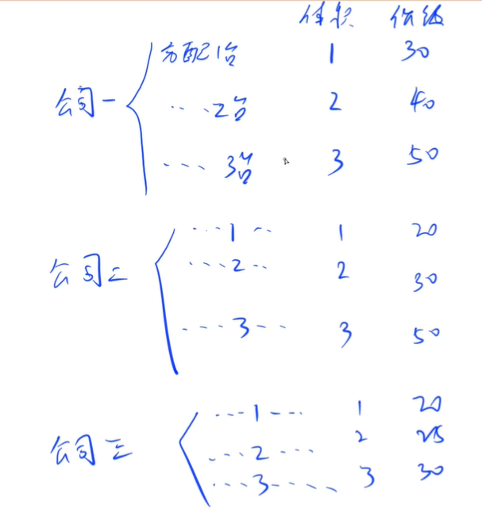
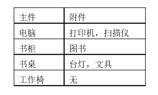

<!-- @import "[TOC]" {cmd="toc" depthFrom=1 depthTo=6 orderedList=false} -->

<!-- code_chunk_output -->

- [背包模型](#背包模型)
  - [背包问题求具体方案](#背包问题求具体方案)
  - [机器分配（分组背包+具体方案）](#机器分配分组背包具体方案)
  - [金明的预算方案](#金明的预算方案)
  - [开心的金明](#开心的金明)

<!-- /code_chunk_output -->

### 背包模型

#### 背包问题求具体方案

有 $N$ 件物品和一个容量是 $V$ 的背包。每件物品只能使用一次。

第 $i$ 件物品的体积是 $v_i$，价值是 $w_i$。

求解将哪些物品装入背包，可使这些物品的总体积不超过背包容量，且总价值最大。

输出 <strong>字典序最小的方案</strong>。这里的字典序是指：所选物品的编号所构成的序列。物品的编号范围是 $1 ... N$。

<h4>输入格式</h4>

第一行两个整数，$N，V$，用空格隔开，分别表示物品数量和背包容积。

接下来有 $N$ 行，每行两个整数 $v_i, w_i$，用空格隔开，分别表示第 $i$ 件物品的体积和价值。

<h4>输出格式</h4>

输出一行，包含若干个用空格隔开的整数，表示最优解中所选物品的编号序列，且该编号序列的字典序最小。

物品编号范围是 $1 ... N$。

<h4>数据范围</h4>

- $0 \lt N, V \le 1000$
- $0\lt v_i, w_i \le 1000$

<h4>输入样例</h4>

```
4 5
1 2
2 4
3 4
4 6
```

<h4>输出样例：</h4>

```
1 4
```

求具体方案，实际上就是求最短路。反推一下具体从哪个方案过来的。

题目中，有 **字典序最小** 这一限制。这其实是出题人为了保证答案统一、便于判断对错。一般来讲，我们通过贪心得到的答案，都会在字典序上满足出题人要求，只要我们从字典序开始循环：
- 对于一个物品，只能选，则必选
- 对于一个物品，只能不选，必不选
- 可选可不选，一定要选

```cpp
#include <iostream>

using namespace std;

const int N = 1010;

int n, m;
int v[N], w[N];
int f[N][N];  // 为了字典序最小，这里特殊设计了 f[i][j] 
// f[i][j] 表示从第i个元素到最后一个元素总容量为j的最优解
// 这样输出可行方案时，才可用从 i = 1 开始判断

int main()
{
    cin >> n >> m;
    for (int i = 1; i <= n; i ++ ) cin >> v[i] >> w[i];

    for (int i = n; i >= 1; i -- )
        for (int j = 0; j <= m; j ++ )
        {
            f[i][j] = f[i + 1][j];
            if (j >= v[i]) f[i][j] = max(f[i][j], f[i + 1][j - v[i]] + w[i]);
        }

    int j = m;
    for (int i = 1; i <= n; i ++ )
        if (j >= v[i] && f[i][j] == f[i + 1][j - v[i]] + w[i])
        {
            cout << i << ' ';
            j -= v[i];
        }

    return 0;
}
```

#### 机器分配（分组背包+具体方案）

总公司拥有M台 <strong>相同</strong> 的高效设备，准备分给下属的N个分公司。

各分公司若获得这些设备，可以为国家提供一定的盈利。盈利与分配的设备数量有关。

问：如何分配这M台设备才能使国家得到的盈利最大？

求出最大盈利值。

分配原则：每个公司有权获得任意数目的设备，但总台数不超过设备数M。

<h4>输入格式</h4>

第一行有两个数，第一个数是分公司数N，第二个数是设备台数M；

接下来是一个N*M的矩阵，矩阵中的第 i 行第 j 列的整数表示第 i 个公司分配 j 台机器时的盈利。

<h4>输出格式</h4>

第一行输出最大盈利值；

接下N行，每行有2个数，即分公司编号和该分公司获得设备台数。

答案不唯一，输出任意合法方案即可。

<h4>数据范围</h4>

- $1 \le N \le 10$,
- $1 \le M \le 15$

<h4>输入样例：</h4>

```
3 3
30 40 50
20 30 50
20 25 30
```

<h4>输出样例：</h4>

```
70
1 1
2 1
3 1
```

首先可以转换为分组背包问题。



如上，可以转换为分组背包问题。

```cpp
#include <iostream>
#include <algorithm>

using namespace std;

const int N = 11, M = 16;

int n, m;
int w[N][M];
int f[N][M];
int way[N];

int main()
{
    cin >> n >> m;

    for (int i = 1; i <= n; i ++ )
        for (int j = 1; j <= m; j ++ )
            cin >> w[i][j];

    for (int i = 1; i <= n; i ++ )
        for (int j = 0; j <= m; j ++ )
            for (int k = 0; k <= j; k ++ )
                f[i][j] = max(f[i][j], f[i - 1][j - k] + w[i][k]);

    cout << f[n][m] << endl;

    int j = m;
    for (int i = n; i; i -- )
        for (int k = 0; k <= j; k ++ )
            if (f[i][j] == f[i - 1][j - k] + w[i][k])
            {   // 第 i 个物品已经确定装多少
                way[i] = k;
                j -= k;
                break;
            }

    for (int i = 1; i <= n; i ++ ) cout << i << ' ' << way[i] << endl;

    return 0;
}
```

#### 金明的预算方案

金明今天很开心，家里购置的新房就要领钥匙了，新房里有一间金明自己专用的很宽敞的房间。

更让他高兴的是，妈妈昨天对他说：“你的房间需要购买哪些物品，怎么布置，你说了算，只要不超过N元钱就行”。

今天一早，金明就开始做预算了，他把想买的物品分为两类：主件与附件，附件是从属于某个主件的，下表就是一些主件与附件的例子：



如果要买归类为附件的物品，必须先买该附件所属的主件。

每个主件可以有0个、1个或2个附件。

附件不再有从属于自己的附件。

金明想买的东西很多，肯定会超过妈妈限定的N元。

于是，他把每件物品规定了一个重要度，分为5等：用整数1~5表示，第5等最重要。

他还从因特网上查到了每件物品的价格（都是10元的整数倍）。

他希望在不超过N元（可以等于N元）的前提下，使每件物品的价格与重要度的乘积的总和最大。

设第j件物品的价格为v[j]，重要度为w[j]，共选中了k件物品，编号依次为$j_1，j_2，…，j_k$，则所求的总和为：

$ v[j_1] * w[j_1]+v[j_2] * w[j_2]+…+v[j_k] * w[j_k] $（其中*为乘号）

请你帮助金明设计一个满足要求的购物单。

<h4>输入格式</h4>

输入文件的第1行，为两个正整数，用一个空格隔开：N m，其中N表示总钱数，m为希望购买物品的个数。

从第2行到第m+1行，第j行给出了编号为j-1的物品的基本数据，每行有3个非负整数v p q，其中v表示该物品的价格，p表示该物品的重要度（1~5），q表示该物品是主件还是附件。

如果q=0，表示该物品为主件，如果q>0，表示该物品为附件，q是所属主件的编号。

<h4>输出格式</h4>

输出文件只有一个正整数，为不超过总钱数的物品的价格与重要度乘积的总和的最大值（<200000）。

<h4>数据范围</h4>

$ N < 32000, m < 60, v < 10000$

<h4>输入样例：</h4>

```
1000 5
800 2 0
400 5 1
300 5 1
400 3 0
500 2 0
```

<h4>输出样例：</h4>

```
2200
```

还是分组背包问题，对于主件1，假设岂有2个附件，则一共有4中购买方式：`(0,0), (0,1), (1,0), (1,1)` 。

```cpp
#include <cstring>
#include <iostream>
#include <algorithm>
#include <vector>

#define v first
#define w second

using namespace std;

typedef pair<int, int> PII;

const int N = 60, M = 32010;

int n, m;
PII master[N];
vector<PII> servent[N];
int f[M];

int main()
{
    cin >> m >> n;

    for (int i = 1; i <= n; i ++ )
    {
        int v, p, q;
        cin >> v >> p >> q;
        p *= v;
        if (!q) master[i] = {v, p};  // 记录主件
        else servent[q].push_back({v, p});
    }

    for (int i = 1; i <= n; i ++ )
        for (int u = m; u >= 0; u -- )
        {
            for (int j = 0; j < 1 << servent[i].size(); j ++ )  // 对于每一个主件，有 2^{附件数量} 种组合
            {
                int v = master[i].v, w = master[i].w;  // 别忘了把主件的体积与价值加上
                for (int k = 0; k < servent[i].size(); k ++ )
                    if (j >> k & 1)
                    {
                        v += servent[i][k].v;
                        w += servent[i][k].w;
                    }
                if (u >= v) f[u] = max(f[u], f[u - v] + w);
            }
    }

    cout << f[m] << endl;

    return 0;
}
```

#### 开心的金明

金明今天很开心，家里购置的新房就要领钥匙了，新房里有一间他自己专用的很宽敞的房间。

更让他高兴的是，妈妈昨天对他说：“你的房间需要购买哪些物品，怎么布置，你说了算，只要不超过 $N$ 元钱就行”。

今天一早金明就开始做预算，但是他想买的东西太多了，肯定会超过妈妈限定的 $N$ 元。

于是，他把每件物品规定了一个重要度，分为 $5$ 等：用整数 $1 \sim 5$ 表示，第 $5$ 等最重要。

他还从因特网上查到了每件物品的价格（都是整数元）。

他希望在不超过 $N$ 元（可以等于 $N$ 元）的前提下，使每件物品的价格与重要度的乘积的总和最大。 

设第 $j$ 件物品的价格为 $v[j]$，重要度为 $w[j]$，共选中了 $k$ 件物品，编号依次为 $j_1，j_2，...，j_k$，则所求的总和为： 

$$ v[j_1] \times w[j_1]+v[j_2] \times w[j_2]+...+v[j_k] \times w[j_k] $$

请你帮助金明设计一个满足要求的购物单。

<h4>输入格式</h4>

输入文件的第 $1$ 行，为两个正整数 $N$ 和 $m$，用一个空格隔开。（其中 $N$ 表示总钱数，$m$ 为希望购买物品的个数） 

从第 $2$ 行到第 $m+1$ 行，第 $j$ 行给出了编号为 $j-1$ 的物品的基本数据，每行有 $2$ 个非负整数 $v$ 和 $p$。（其中 $v$ 表示该物品的价格，$p$ 表示该物品的重要度）

<h4>输出格式</h4>

输出文件只有一个正整数，为不超过总钱数的物品的价格与重要度乘积的总和的最大值（数据保证结果不超过 $10^8$）。

<h4>数据范围</h4>

- $1 \le N < 30000$,
- $1 \le m < 25$,
- $0 \le v \le 10000$,
- $1 \le p \le 5$

<h4>输入样例：</h4>

```
1000 5
800 2
400 5
300 5
400 3
200 2
```

<h4>输出样例：</h4>

```
3900
```

```cpp
// 01 背包
#include <iostream>
#include <algorithm>

using namespace std;

const int N = 30010, M = 30;
int f[N];

int main()
{
    int n, m;
    cin >> n >> m;
    for (int i = 1; i <= m; ++ i)
    {
        int v, w;
        cin >> v >> w;
        for (int j = n; j >= 0; -- j)
            if (j >= v) f[j] = max(f[j], f[j - v] + w * v);
    }
    
    cout << f[n] << endl;
}
```
