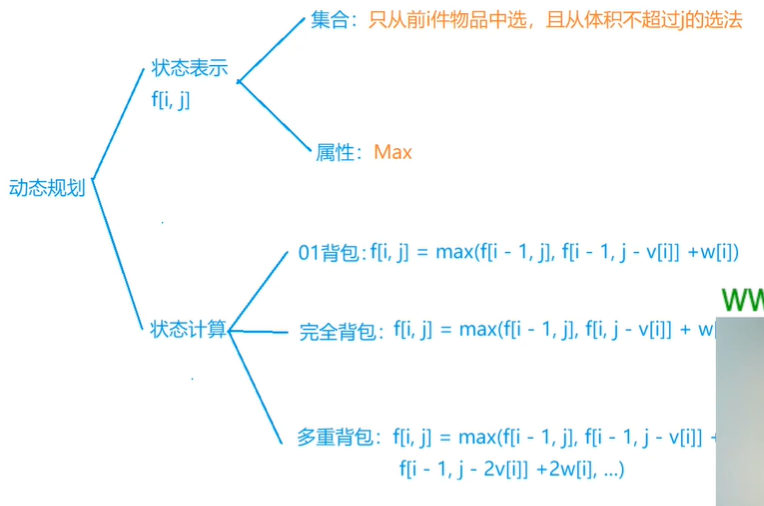
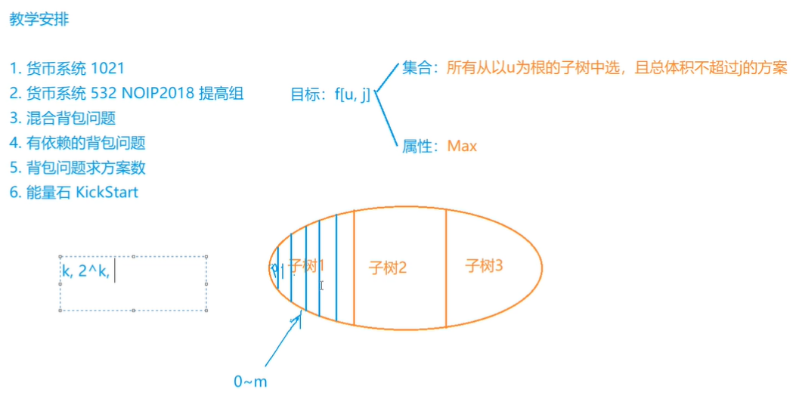
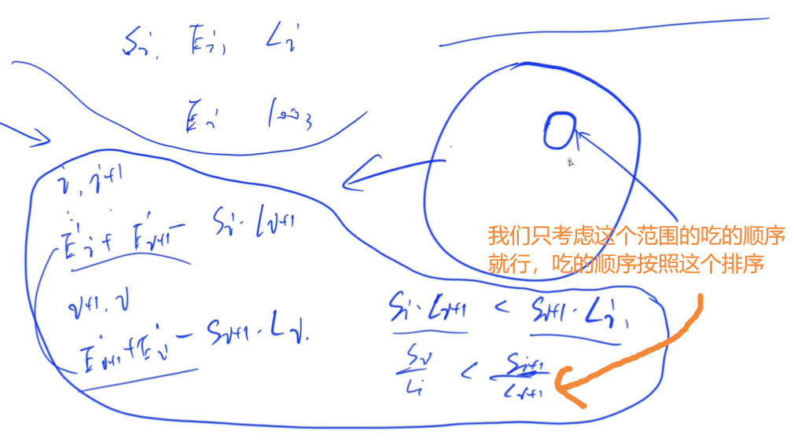
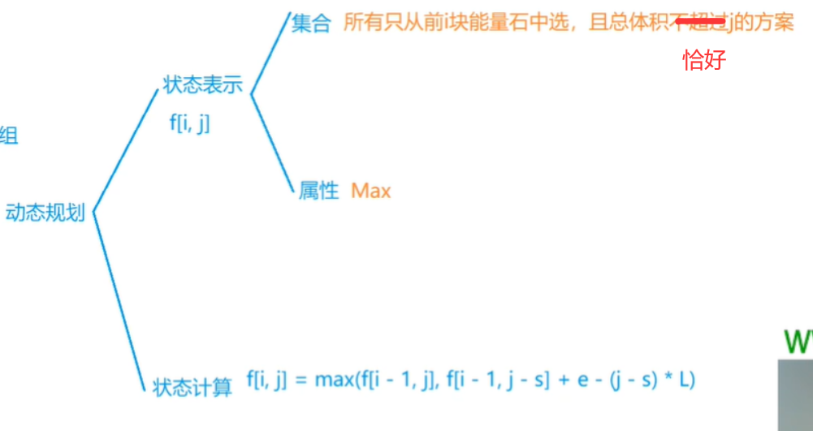

<!-- @import "[TOC]" {cmd="toc" depthFrom=1 depthTo=6 orderedList=false} -->

<!-- code_chunk_output -->

- [背包模型](#背包模型)
  - [货币系统（完全背包求方案数）](#货币系统完全背包求方案数)
  - [货币系统（分析+完全背包）](#货币系统分析完全背包)
  - [混合背包问题](#混合背包问题)
  - [有依赖的背包问题（树形+分组背包）](#有依赖的背包问题树形分组背包)
  - [背包问题求方案数（类似最短路方案数）](#背包问题求方案数类似最短路方案数)
  - [能量石（邻项交换贪心+DP）](#能量石邻项交换贪心dp)

<!-- /code_chunk_output -->

### 背包模型

#### 货币系统（完全背包求方案数）

给你一个n种面值的货币系统，求组成面值为m的货币有多少种方案。

<h4>输入格式</h4>

第一行，包含两个整数n和m。

接下来n行，每行包含一个整数，表示一种货币的面值。

<h4>输出格式</h4>

共一行，包含一个整数，表示方案数。

<h4>数据范围</h4>

$n \le 15, m \le 3000$

<h4>输入样例：</h4>

```
3 10
1
2
5
```

<h4>输出样例：</h4>

```
10
```

```cpp
#include <iostream>

using namespace std;

typedef long long LL;

const int M = 3010;

int n, m;
LL f[M];  // 这题不好判断具体多少方案，用 LL 保险

int main()
{
    cin >> n >> m;

    f[0] = 1;
    for (int i = 0; i < n; i ++ )
    {
        int v;
        cin >> v;  // 完全背包从小到大
        for (int j = v; j <= m; j ++ )
            f[j] += f[j - v];
    }

    cout << f[m] << endl;

    return 0;
}
```

#### 货币系统（分析+完全背包）

在网友的国度中共有 $n$ 种不同面额的货币，第 $i$ 种货币的面额为 $a[i]$，你可以假设每一种货币都有无穷多张。

为了方便，我们把货币种数为 $n$、面额数组为 $a[1..n]$ 的货币系统记作 $(n,a)$。 

在一个完善的货币系统中，每一个非负整数的金额 $x$ 都应该可以被表示出，即对每一个非负整数 $x$，都存在 $n$ 个非负整数 $t[i]$ 满足 $a[i] × t[i]$ 的和为 $x$。

然而，在网友的国度中，货币系统可能是不完善的，即可能存在金额 $x$ 不能被该货币系统表示出。

例如在货币系统 $n=3, a=[2,5,9]$ 中，金额 $1,3$ 就无法被表示出来。 

两个货币系统 $(n,a)$ 和 $(m,b)$ 是等价的，当且仅当对于任意非负整数 $x$，它要么均可以被两个货币系统表出，要么不能被其中任何一个表出。 

现在网友们打算简化一下货币系统。

他们希望找到一个货币系统 $(m,b)$，满足 $(m,b)$ 与原来的货币系统 $(n,a)$ 等价，且 $m$ 尽可能的小。

他们希望你来协助完成这个艰巨的任务：找到最小的 $m$。

<h4>输入格式</h4>

输入文件的第一行包含一个整数 $T$，表示数据的组数。

接下来按照如下格式分别给出 $T$ 组数据。 

每组数据的第一行包含一个正整数 $n$。

接下来一行包含 $n$ 个由空格隔开的正整数 $a[i]$。

<h4>输出格式</h4>

输出文件共有 $T$ 行，对于每组数据，输出一行一个正整数，表示所有与 $(n,a)$ 等价的货币系统 $(m,b)$ 中，最小的 $m$。

<h4>数据范围</h4>

- $1 \le n \le 100$,
- $1 \le a[i] \le 25000$,
- $1 \le T \le 20$

<h4>输入样例：</h4>

```
2 
4 
3 19 10 6 
5 
11 29 13 19 17 
```

<h4>输出样例：</h4>

```
2
5
```

```cpp
// 对于 3 19 10 6
// 6 没有用因为 3 + 3 = 6 ； 19 也是 19 = 10 + 3 + 3
// 因此输出 2 就好
// 如何做？首先寻找性质
// - 性质1：a1,a2,...,an一定都可以被表示出来
// - 性质2：在最优解中，b1,b2,...,bm一定都是从a1,a2,...,an中选择的
//   - 反证一下性质2：假设有 bi 不是从 {ai} 中选择的
//     由货币系统性质，bi 可以由 {ai} 中数表示
//     而 ai 又可以由 {bi} 中数表示，则 bi 可以由 {bi} 中序列数表示
//     即 bi = t1b1 + ... + tmbm 则这个 bi 没有必要存在了，否则系统不是最简的
// - 性质3：b1,b2,...,bm一定不能被其他bi表示（否则不是最简的）
// 因此本题，排序，从小往大看，看 ai 能不能被其他 ai 表示出来
// 则转换为完全背包问题，对于 ai ，看 {a1~ai-1} 是否能表示它
#include <cstring>
#include <iostream>
#include <algorithm>

using namespace std;

const int N = 25010;

int n;
int a[N];
bool f[N];

int main()
{
    int T;
    cin >> T;
    while (T -- )
    {
        cin >> n;
        for (int i = 0; i < n; i ++ ) cin >> a[i];
        sort(a, a + n);

        int m = a[n - 1];  // 最大面值为最大货币
        memset(f, 0, sizeof f);
        f[0] = true;  // 注意面值为 0 要是 true ，这样 dp 才可以往下传递

        int k = 0;
        for (int i = 0; i < n; i ++ )
        {
            if (!f[a[i]]) k ++ ;  // 如果没有能组成 a[i] 的，把 a[i] 算上
            for (int j = a[i]; j <= m; j ++ )  // 看看前 i 个货币可以组成多少面值
                f[j] |= f[j - a[i]];
        }

        cout << k << endl;
    }

    return 0;
}
```

#### 混合背包问题

有 $N$ 种物品和一个容量是 $V$ 的背包。

物品一共有三类：

- 第一类物品只能用1次（01背包）；
- 第二类物品可以用无限次（完全背包）；
- 第三类物品最多只能用 $s_i$ 次（多重背包）；

每种体积是 $v_i$，价值是 $w_i$。

- 求解将哪些物品装入背包，可使物品体积总和不超过背包容量，且价值总和最大。
- 输出最大价值。

<h4>输入格式</h4>

第一行两个整数，$N，V$，用空格隔开，分别表示物品种数和背包容积。

接下来有 $N$ 行，每行三个整数 $v_i, w_i, s_i$，用空格隔开，分别表示第 $i$ 种物品的体积、价值和数量。

- $s_i = -1$ 表示第 $i$ 种物品只能用1次；
- $s_i = 0$ 表示第 $i$ 种物品可以用无限次；
- $s_i >0$ 表示第 $i$ 种物品可以使用 $s_i$ 次；

<h4>输出格式</h4>

输出一个整数，表示最大价值。

<h4>数据范围</h4>

- $0 \lt N, V \le 1000$
- $0 \lt v_i, w_i \le 1000$
- $-1 \le s_i \le 1000$

<h4>输入样例</h4>

```
4 5
1 2 -1
2 4 1
3 4 0
4 5 2
```

<h4>输出样例：</h4>

```
8
```



01背包、完全背包、多重背包状态表示是一样的。

这里需要二进制优化一下多重背包。

```cpp
#include <iostream>

using namespace std;

const int N = 1010;

int n, m;
int f[N];

int main()
{
    cin >> n >> m;

    for (int i = 0; i < n; i ++ )
    {
        int v, w, s;
        cin >> v >> w >> s;
        if (!s)  // 0 的话，完全背包
        {
            for (int j = v; j <= m; j ++ )
                f[j] = max(f[j], f[j - v] + w);
        }
        else
        {
            if (s == -1) s = 1;
            for (int k = 1; k <= s; k *= 2)  // 二进制优化
            {
                for (int j = m; j >= k * v; j -- )
                    f[j] = max(f[j], f[j - k * v] + k * w);
                s -= k;
            }
            if (s)  // 二进制优化还剩个尾巴
            {
                for (int j = m; j >= s * v; j -- )
                    f[j] = max(f[j], f[j - s * v] + s * w);
            }
        }
    }

    cout << f[m] << endl;

    return 0;
}
```

#### 有依赖的背包问题（树形+分组背包）

有 $N$ 个物品和一个容量是 $V$ 的背包。

物品之间具有依赖关系，且依赖关系组成一棵树的形状。如果选择一个物品，则必须选择它的父节点。

如下图所示：


如果选择物品5，则必须选择物品1和2。这是因为2是5的父节点，1是2的父节点。

每件物品的编号是 $i$，体积是 $v_i$，价值是 $w_i$，依赖的父节点编号是 $p_i$。物品的下标范围是 $1 ... N$。

求解将哪些物品装入背包，可使物品总体积不超过背包容量，且总价值最大。

输出最大价值。

<h4>输入格式</h4>

第一行有两个整数 $N，V$，用空格隔开，分别表示物品个数和背包容量。

- 接下来有 $N$ 行数据，每行数据表示一个物品。
- 第 $i$ 行有三个整数 $v_i, w_i, p_i$，用空格隔开，分别表示物品的体积、价值和依赖的物品编号。
- 如果 $p_i = -1$，表示根节点。 <strong>数据保证所有物品构成一棵树。</strong>

<h4>输出格式</h4>

输出一个整数，表示最大价值。

<h4>数据范围</h4>

- $1 \le N, V \le 100$
- $1 \le v_i, w_i\le 100$

父节点编号范围：

- 内部结点：$1 \le p_i \le N$;
- 根节点 $p_i = -1$;

<h4>输入样例</h4>

```
5 7
2 3 -1
2 2 1
3 5 1
4 7 2
3 6 2
```

<h4>输出样例：</h4>

```
11
```



如上，我们假设子树有 k 个节点，如果按照方案划分，则需要枚举 2^k 次；因此这里不按照方案划分，按照子树使用体积划分。

```cpp
// 不再是线性物品，而是树形的
// f[u, j] 所有以 u 为根的子树中选，且总体积不超过 j 的方案
// 因为我们选择一棵子树时，一定会选择其根节点
#include <cstring>
#include <iostream>
#include <algorithm>

using namespace std;

const int N = 110;

int n, m;
int v[N], w[N];
int h[N], e[N], ne[N], idx;
int f[N][N];

void add(int a, int b)
{
    e[idx] = b, ne[idx] = h[a], h[a] = idx ++ ;
}

void dfs(int u)
{
    for (int i = h[u]; ~i; i = ne[i])   // 循环物品组（根节点的子节点们）
    {
        // 先把子树的 f 搞明白了
        int son = e[i];
        dfs(e[i]);

        // 分组背包
        for (int j = m - v[u]; j >= 0; j -- )  // 循环体积
            for (int k = 0; k <= j; k ++ )  // 循环决策（用体积代表决策的集合）
                f[u][j] = max(f[u][j], f[u][j - k] + f[son][k]);
    }

    // 将物品u加进去
    for (int i = m; i >= v[u]; i -- ) f[u][i] = f[u][i - v[u]] + w[u];
    for (int i = 0; i < v[u]; i ++ ) f[u][i] = 0;  // 根节点都放不进去，则整棵子树都没法放
}

int main()
{
    cin >> n >> m;

    memset(h, -1, sizeof h);
    int root;
    for (int i = 1; i <= n; i ++ )
    {
        int p;
        cin >> v[i] >> w[i] >> p;
        if (p == -1) root = i;
        else add(p, i);
    }

    dfs(root);

    cout << f[root][m] << endl;

    return 0;
}
```

#### 背包问题求方案数（类似最短路方案数）

有 $N$ 件物品和一个容量是 $V$ 的背包。每件物品只能使用一次。

第 $i$ 件物品的体积是 $v_i$，价值是 $w_i$。

求解将哪些物品装入背包，可使这些物品的总体积不超过背包容量，且总价值最大。

输出 <strong>最优选法的方案数</strong>。注意答案可能很大，请输出答案模 $10^9 + 7$ 的结果。

<h4>输入格式</h4>

第一行两个整数，$N，V$，用空格隔开，分别表示物品数量和背包容积。

接下来有 $N$ 行，每行两个整数 $v_i, w_i$，用空格隔开，分别表示第 $i$ 件物品的体积和价值。

<h4>输出格式</h4>

输出一个整数，表示 <strong>方案数</strong> 模 $10^9 + 7$ 的结果。

<h4>数据范围</h4>

- $0 \lt N, V \le 1000$
- $0\lt v_i, w_i \le 1000$

<h4>输入样例</h4>

```
4 5
1 2
2 4
3 4
4 6
```

<h4>输出样例：</h4>

```
2
```

涉及到最短路的方案数：累加能抵达终点的方案数，然后对连接终点的点累加到达其的方案数。

```cpp
#include <cstring>
#include <iostream>

using namespace std;

const int N = 1010, mod = 1e9 + 7;

int n, m;
int f[N], g[N];
// f[i] 用来存储背包容积为 i 时的最佳方案的总价值
// g[i] 为背包容积为 i 时总价值为最佳的方案数

int main()
{
    cin >> n >> m;

    memset(f, -0x3f, sizeof f);
    f[0] = 0;
    g[0] = 1;

    for (int i = 0; i < n; i ++ )
    {
        int v, w;
        cin >> v >> w;
        for (int j = m; j >= v; j -- )
        {   // 这里累加用最短路的想象方法来理解
            int maxv = max(f[j], f[j - v] + w);  // 目前体积为 j ，能带来最大的价值是 maxv
            int s = 0;
            if (f[j] == maxv) s = g[j];  // 如果这条路径抵达 j 且价值是 maxv ，累加起来
            if (f[j - v] + w == maxv) s = (s + g[j - v]) % mod;  // 这条路径可抵达，也累加起来
            f[j] = maxv, g[j] = s;
        }
    }

    int res = 0;
    for (int i = 1; i <= m; i ++ )
        if (f[i] > f[res])
            res = i;  // f[m] 下的价值未必是最大的

    int sum = 0;
    for (int i = 0; i <= m; i ++ )
        if (f[i] == f[res])  // 终点未必有 1 个
            sum = (sum + g[i]) % mod;

    cout << sum << endl;

    return 0;
}
```

#### 能量石（邻项交换贪心+DP）

岩石怪物杜达生活在魔法森林中，他在午餐时收集了 $N$ 块能量石准备开吃。 

由于他的嘴很小，所以一次只能吃一块能量石。 

能量石很硬，吃完需要花不少时间。

吃完第 $i$ 块能量石需要花费的时间为 $S_i$ 秒。

杜达靠吃能量石来获取能量。 

不同的能量石包含的能量可能不同。 

此外，能量石会随着时间流逝逐渐失去能量。 

第 $i$ 块能量石最初包含 $E_i$ 单位的能量，并且每秒将失去 $L_i$ 单位的能量。 

当杜达开始吃一块能量石时，他就会立即获得该能量石所含的全部能量（无论实际吃完该石头需要多少时间）。 

能量石中包含的能量最多降低至 $0$。

请问杜达通过吃能量石可以获得的最大能量是多少？

<h4>输入格式</h4>

第一行包含整数 $T$，表示共有 $T$ 组测试数据。

每组数据第一行包含整数 $N$，表示能量石的数量。

接下来 $N$ 行，每行包含三个整数 $S_i,E_i,L_i$。

<h3>输出格式</h3>
每组数据输出一个结果，每个结果占一行。

结果表示为 `Case #x: y`，其中 $x$ 是组别编号（从 $1$ 开始），$y$ 是可以获得的最大能量值。

<h4>数据范围</h4>

- $1 \le T \le 10$,
- $1 \le N \le 100$,
- $1 \le S_i \le 100$,
- $1 \le E_i \le 10^5$,
- $0 \le L_i \le 10^5$

<h4>输入样例：</h4>

```
3
4
20 10 1
5 30 5
100 30 1
5 80 60
3
10 4 1000
10 3 1000
10 8 1000
2
12 300 50
5 200 0
```

<h4>输出样例：</h4>

```
Case #1: 105
Case #2: 8
Case #3: 500
```

<h4>样例解释</h4>

在样例＃1中，有 $N = 4$ 个宝石。杜达可以选择的一个吃石头顺序是：

- 吃第四块石头。这需要 $5$ 秒，并给他 $80$ 单位的能量。
- 吃第二块石头。这需要 $5$ 秒，并给他 $5$ 单位的能量（第二块石头开始时具有 $30$ 单位能量，$5$ 秒后失去了 $25$ 单位的能量）。
- 吃第三块石头。这需要 $100$ 秒，并给他 $20$ 单位的能量（第三块石头开始时具有 $30$ 单位能量，$10$ 秒后失去了 $10$ 单位的能量）。
- 吃第一块石头。这需要 $20$ 秒，并给他 $0$ 单位的能量（第一块石头以 $10$ 单位能量开始，$110$ 秒后已经失去了所有的能量）。

他一共获得了 $105$ 单位的能量，这是能获得的最大值，所以答案是 $105$。

在样本案例＃2中，有 $N = 3$ 个宝石。

无论杜达选择吃哪块石头，剩下的两个石头的能量都会耗光。

所以他应该吃第三块石头，给他提供 $8$ 单位的能量。

在样本案例＃3中，有 $N = 2$ 个宝石。杜达可以：

- 吃第一块石头。这需要 $12$ 秒，并给他 $300$ 单位的能量。
- 吃第二块石头。这需要 $5$ 秒，并给他 $200$ 单位的能量（第二块石头随着时间的推移不会失去任何能量！）。

<p>所以答案是 $500$。</p>



如上，我们用邻项交换贪心确定了顺序。



如上，体积即时间，现在被转换为了一个 01背包问题。

```cpp
#include <iostream>
#include <algorithm>

using namespace std;

const int N = 110, M = 10010;

int n;
struct Stone
{
    int s, e, l;
}stones[N];

bool cmp(Stone a, Stone b)
{
    return a.s * b.l < b.s * a.l;
}

int f[N][M];

int main()
{
    int T;
    cin >> T;
    for (int C = 1; C <= T; C ++ )
    {
        cin >> n;
        int m = 0;
        for (int i = 1; i <= n; i ++ )
        {
            int s, e, l;
            cin >> s >> e >> l;
            stones[i] = {s, e, l};
            m += s;
        }

        sort(stones + 1, stones + 1 + n, cmp);

        // 01 背包
        for (int i = 1; i <= n; i ++ )
            for (int j = 0; j <= m; j ++ )
            {
                f[i][j] = f[i - 1][j];
                if (j >= stones[i].s)
                {
                    int s = stones[i].s, e = stones[i].e, l = stones[i].l;
                    f[i][j] = max(f[i][j], f[i - 1][j - s] + max(0, e - l * (j - s)));
                }
            }

        int res = 0;
        for (int i = 0; i <= m; i ++ ) res = max(res, f[n][i]);

        printf("Case #%d: %d\n", C, res);
    }

    return 0;
}
```
