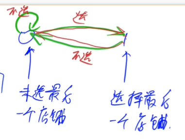
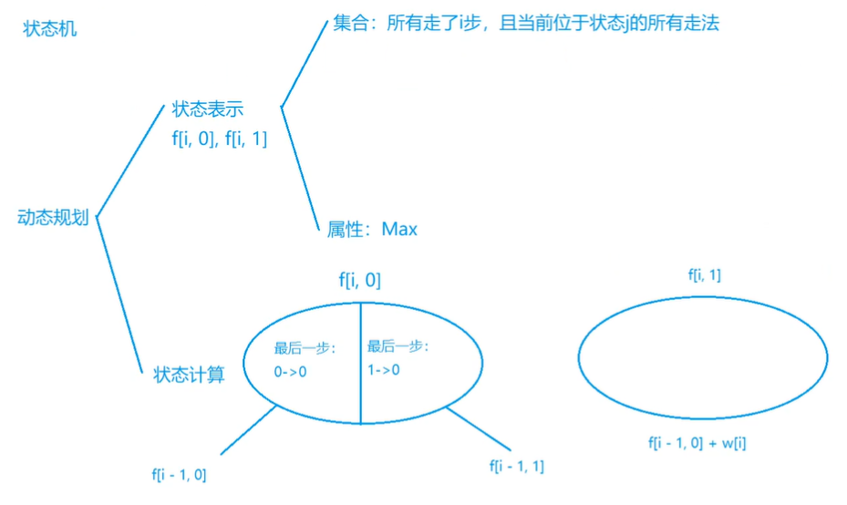
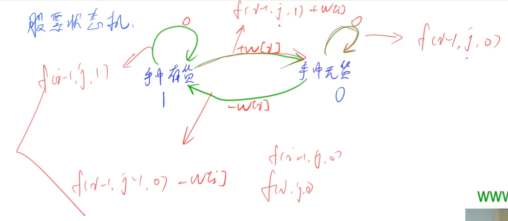
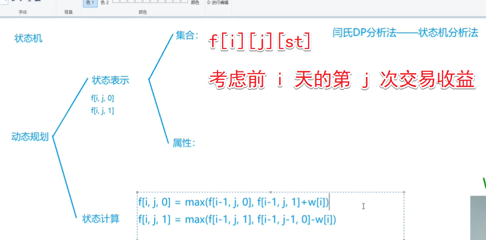
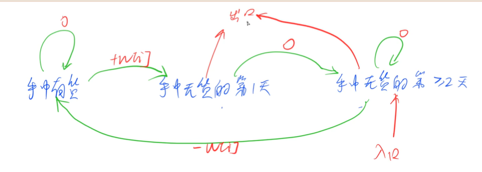
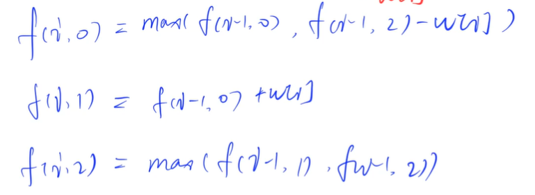
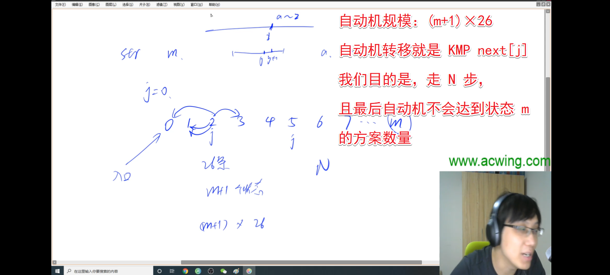

<!-- @import "[TOC]" {cmd="toc" depthFrom=1 depthTo=6 orderedList=false} -->

<!-- code_chunk_output -->

- [状态机模型](#状态机模型)
  - [大盗阿福](#大盗阿福)
  - [股票买卖 IV](#股票买卖-iv)
  - [股票买卖 V（3个状态）](#股票买卖-v3个状态)
  - [设计密码（KMP+多个状态自动机）](#设计密码kmp多个状态自动机)

<!-- /code_chunk_output -->

### 状态机模型

#### 大盗阿福

阿福是一名经验丰富的大盗。趁着月黑风高，阿福打算今晚洗劫一条街上的店铺。

这条街上一共有 $N$ 家店铺，每家店中都有一些现金。

阿福事先调查得知，只有当他同时洗劫了两家相邻的店铺时，街上的报警系统才会启动，然后警察就会蜂拥而至。

作为一向谨慎作案的大盗，阿福不愿意冒着被警察追捕的风险行窃。

他想知道，在不惊动警察的情况下，他今晚最多可以得到多少现金？

<h4>输入格式</h4>

输入的第一行是一个整数 $T$，表示一共有 $T$ 组数据。

接下来的每组数据，第一行是一个整数 $N$ ，表示一共有 $N$ 家店铺。

第二行是 $N$ 个被空格分开的正整数，表示每一家店铺中的现金数量。

每家店铺中的现金数量均不超过1000。

<h4>输出格式</h4>

对于每组数据，输出一行。

该行包含一个整数，表示阿福在不惊动警察的情况下可以得到的现金数量。

<h4>数据范围</h4>

- $1 \le T \le 50$,
- $1 \le N \le 10^5$

<h4>输入样例：</h4>

```
2
3
1 8 2
4
10 7 6 14
```

<h4>输出样例：</h4>

```
8
24
```

<h4>样例解释</h4>

对于第一组样例，阿福选择第2家店铺行窃，获得的现金数量为8。

<p>对于第二组样例，阿福选择第1和4家店铺行窃，获得的现金数量为10+14=24。</p>

传统方法：
- `f[i]` 表示考虑前 `i` 家店铺的最大收益
- `f[i] = max(f[i-2] + w[i], f[i-1])` 即在“抢劫第i家店铺”和“不抢第i家店铺”中取最大值

还可以用状态机来做，如下。



状态机模型如上。



如上，根据状态机可以对状态转移进行分析。

注意，状态机初始化也是有讲究的，这里初始化时不可能是 1 状态，因此 1 状态为负无穷。

```cpp
#include <iostream>
#include <algorithm>

using namespace std;

const int N = 100010, INF = 0x3f3f3f3f;

int n;
int w[N], f[N][2];

int main()
{
    int T;
    scanf("%d", &T);
    while (T -- )
    {
        scanf("%d", &n);
        for (int i = 1; i <= n; i ++ ) scanf("%d", &w[i]);
        
        f[0][0] = 0, f[0][1] = - INF;

        for (int i = 1; i <= n; i ++ )
        {
            f[i][0] = max(f[i - 1][0], f[i - 1][1]);
            f[i][1] = f[i - 1][0] + w[i];
        }

        printf("%d\n", max(f[n][0], f[n][1]));
    }

    return 0;
}
```

#### 股票买卖 IV

给定一个长度为 $N$ 的数组，数组中的第 $i$ 个数字表示一个给定股票在第 $i$ 天的价格。

设计一个算法来计算你所能获取的最大利润，你最多可以完成 $k$ 笔交易。

注意：你不能同时参与多笔交易（你必须在再次购买前出售掉之前的股票）。一次买入卖出合为一笔交易。

<h4>输入格式</h4>

第一行包含整数 $N$ 和 $k$，表示数组的长度以及你可以完成的最大交易数量。

第二行包含 $N$ 个不超过 $10000$ 的正整数，表示完整的数组。

<h4>输出格式</h4>

输出一个整数，表示最大利润。

<h4>数据范围</h4>

- $1 \le N \le 10^5$,
- $1 \le k \le 100$

<h4>输入样例1：</h4>

```
3 2
2 4 1
```

<h4>输出样例1：</h4>

```
2
```

<h4>输入样例2：</h4>

```
6 2
3 2 6 5 0 3
```

<h4>输出样例2：</h4>

```
7
```

<h4>样例解释</h4>

样例1：在第 1 天 (股票价格 = 2) 的时候买入，在第 2 天 (股票价格 = 4) 的时候卖出，这笔交易所能获得利润 = 4-2 = 2 。

样例2：在第 2 天 (股票价格 = 2) 的时候买入，在第 3 天 (股票价格 = 6) 的时候卖出, 这笔交易所能获得利润 = 6-2 = 4 。随后，在第 5 天 (股票价格 = 0) 的时候买入，在第 6 天 (股票价格 = 3) 的时候卖出, 这笔交易所能获得利润 = 3-0 = 3 。共计利润 4+3 = 7.





```cpp
#include <cstring>
#include <iostream>
#include <algorithm>

using namespace std;

const int N = 100010, M = 110, INF = 0x3f3f3f3f;

int n, m;
int w[N];
int f[N][M][2];  // f[i][j][s]  考虑前 i 个股票，第 j 次交易

int main()
{
    scanf("%d%d", &n, &m);
    for (int i = 1; i <= n; i ++ ) scanf("%d", &w[i]);

    memset(f, -0x3f, sizeof f);
    for (int i = 0; i <= n; i ++ ) f[i][0][0] = 0;  // 一次交易都没有进行

    for (int i = 1; i <= n; i ++ )
        for (int j = 1; j <= m; j ++ )
        {
            f[i][j][0] = max(f[i - 1][j][0], f[i - 1][j][1] + w[i]);
            f[i][j][1] = max(f[i - 1][j][1], f[i - 1][j - 1][0] - w[i]);
        }

    int res = 0;
    for (int i = 0; i <= m; i ++ ) res = max(res, f[n][i][0]);

    printf("%d\n", res);

    return 0;
}
```

#### 股票买卖 V（3个状态）

给定一个长度为 $N$ 的数组，数组中的第 $i$ 个数字表示一个给定股票在第 $i$ 天的价格。

设计一个算法计算出最大利润。在满足以下约束条件下，你可以尽可能地完成更多的交易（多次买卖一支股票）:

- 你不能同时参与多笔交易（你必须在再次购买前出售掉之前的股票）。
- 卖出股票后，你无法在第二天买入股票 (即冷冻期为 $1$ 天)。

<h4>输入格式</h4>

第一行包含整数 $N$，表示数组长度。

第二行包含 $N$ 个不超过 $10000$ 的正整数，表示完整的数组。

<h4>输出格式</h4>

输出一个整数，表示最大利润。

<h4>数据范围</h4>

$1 \le N \le 10^5$

<h4>输入样例：</h4>

```
5
1 2 3 0 2
```

<h4>输出样例：</h4>

```
3
```

<h4>样例解释</h4>

<p>对应的交易状态为: [买入, 卖出, 冷冻期, 买入, 卖出]，第一笔交易可得利润 2-1 = 1，第二笔交易可得利润 2-0 = 2，共得利润 1+2 = 3。</p>





如上，注意：整理入口出口很重要。

```cpp
#include <cstring>
#include <iostream>
#include <algorithm>

using namespace std;

const int N = 100010, INF = 0x3f3f3f3f;

int n;
int w[N];
int f[N][3];

int main()
{
    scanf("%d", &n);

    for (int i = 1; i <= n; i ++ ) scanf("%d", &w[i]);

    f[0][0] = f[0][1] = -INF, f[0][2] = 0;
    for (int i = 1; i <= n; i ++ )
    {
        f[i][0] = max(f[i - 1][0], f[i - 1][2] - w[i]);
        f[i][1] = f[i - 1][0] + w[i];
        f[i][2] = max(f[i - 1][2], f[i - 1][1]);
    }

    printf("%d\n", max(f[n][1], f[n][2]));  // 注意，整理入口出口很重要

    return 0;
}
```

#### 设计密码（KMP+多个状态自动机）

你现在需要设计一个密码 $S$，$S$ 需要满足：

- $S$ 的长度是 $N$；
- $S$ 只包含小写英文字母；
- $S$ 不包含子串 $T$；

例如：$abc$ 和 $abcde$ 是 $abcde$ 的子串，$abd$ 不是 $abcde$ 的子串。

请问共有多少种不同的密码满足要求？

由于答案会非常大，请输出答案模 $10^9+7$ 的余数。

<h4>输入格式</h4>

第一行输入整数N，表示密码的长度。

第二行输入字符串T，T中只包含小写字母。

<h4>输出格式</h4>

输出一个<strong>正整数</strong>，表示总方案数模 $10^9+7$ 后的结果。

<h4>数据范围</h4>

- $1 \le N \le 50$,
- $1 \le |T| \le N$，$|T|$是$T$的长度。

<h4>输入样例1：</h4>

```
2
a
```

<h4>输出样例1：</h4>

```
625
```

<h4>输入样例2：</h4>

```
4
cbc
```

<h4>输出样例2：</h4>

```
456924
```



`f[i, j]` 是表示当前已经填到了字符串的第 `i` 位， `j` 是状态。

这里因为 N 是 50 ，所以不建图，直接暴力枚举每条边。

```cpp
#include <cstring>
#include <iostream>
#include <algorithm>

using namespace std;

const int N = 55, mod = 1e9 + 7;

int n, m;
char str[N];
int nxt[N];
int f[N][N];

int main()
{
    cin >> n >> str + 1;

    m = strlen(str + 1);

    for (int i = 2, j = 0; i <= m; i ++ )
    {
        while (j && str[i] != str[j + 1]) j = nxt[j];
        if (str[i] == str[j + 1]) j ++ ;
        nxt[i] = j;
    }

    f[0][0] = 1;
    for (int i = 0; i < n; i ++ )
        for (int j = 0; j < m; j ++ )
            for (char k = 'a'; k <= 'z'; k ++ )
            {
                int u = j;
                while (u && k != str[u + 1]) u = nxt[u];
                if (k == str[u + 1]) u ++ ;
                if (u < m) f[i + 1][u] = (f[i + 1][u] + f[i][j]) % mod;  // 前驱算后继
            }

    int res = 0;
    for (int i = 0; i < m; i ++ ) res = (res + f[n][i]) % mod;

    cout << res << endl;

    return 0;
}
```
