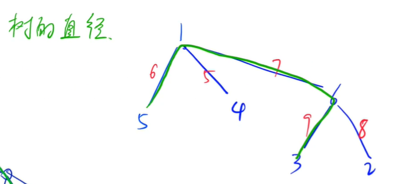
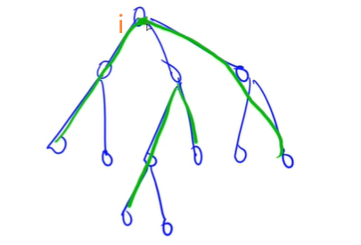
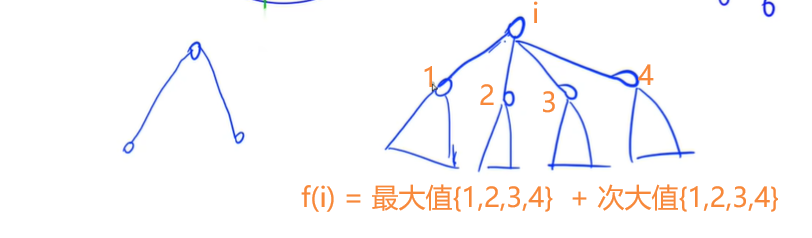
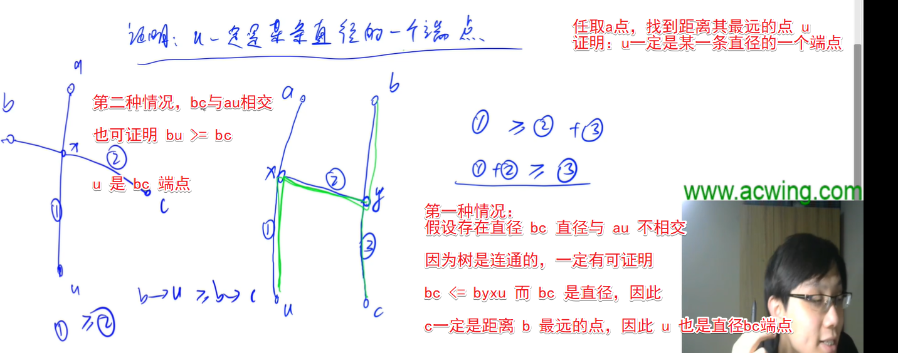
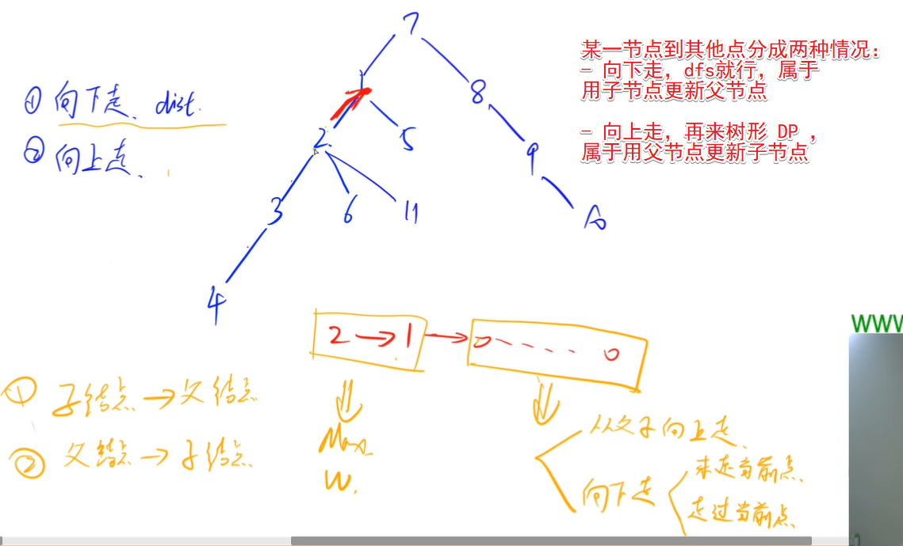
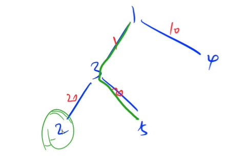
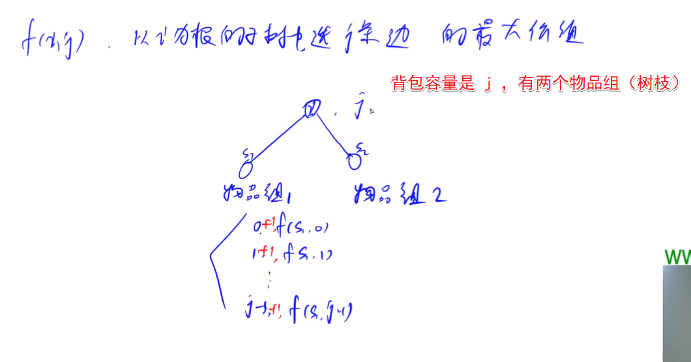
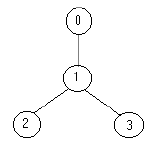
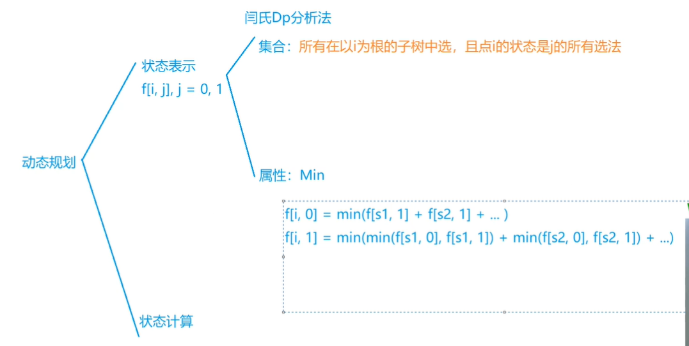

<!-- @import "[TOC]" {cmd="toc" depthFrom=1 depthTo=6 orderedList=false} -->

<!-- code_chunk_output -->

- [树形DP](#树形dp)
  - [树的最长路径（树的直径）](#树的最长路径树的直径)
  - [穿插知识点：无权树的直径怎么求？](#穿插知识点无权树的直径怎么求)
  - [树的中心（两次dfs，向上用到递推关系）](#树的中心两次dfs向上用到递推关系)
  - [数字转换](#数字转换)
  - [二叉苹果树（有依赖背包问题）](#二叉苹果树有依赖背包问题)
  - [战略游戏](#战略游戏)

<!-- /code_chunk_output -->

### 树形DP

#### 树的最长路径（树的直径）

给定一棵树，树中包含 $n$ 个结点（编号$1$~$n$）和 $n-1$ 条无向边，每条边都有一个权值。

现在请你找到树中的一条最长路径。

换句话说，要找到一条路径，使得使得路径两端的点的距离最远。

注意：路径中可以只包含一个点。

<h4>输入格式</h4>

第一行包含整数 $n$。

接下来 $n-1$ 行，每行包含三个整数 $a_i,b_i,c_i$，表示点 $a_i$ 和 $b_i$ 之间存在一条权值为 $c_i$ 的边。

<h4>输出格式</h4>

输出一个整数，表示树的最长路径的长度。

<h4>数据范围</h4>

- $1 \le n \le 10000$,
- $1 \le a_i,b_i \le n$,
- $-10^5 \le c_i \le 10^5$

<h4>输入样例：</h4>

```
6
5 1 6
1 4 5
6 3 9
2 6 8
6 1 7
```

<h4>输出样例：</h4>

```
22
```



本题要求的值，可以理解为求树的直径。

如何把集合分类呢？

类别 `i` ：路径中，高度为高的点为 `i` 的路径集合。



如何求集合最优目标值呢？如下。



```cpp
#include <cstring>
#include <iostream>
#include <algorithm>

using namespace std;

const int N = 10010, M = N * 2;

int n;
int h[N], e[M], w[M], ne[M], idx;
int ans;

void add(int a, int b, int c)
{
    e[idx] = b, w[idx] = c, ne[idx] = h[a], h[a] = idx ++ ;
}

int dfs(int u, int father)
{
    int dist = 0; // 表示从当前点往下走的最大长度
    int d1 = 0, d2 = 0;  // 最大距离与次大距离

    for (int i = h[u]; i != -1; i = ne[i])
    {
        int j = e[i];
        if (j == father) continue;  // 跳过父节点
        int d = dfs(j, u) + w[i];
        dist = max(dist, d);

        if (d >= d1) d2 = d1, d1 = d;
        else if (d > d2) d2 = d; // 更新最大距离与次大距离
    }

    ans = max(ans, d1 + d2);

    return dist;
}

int main()
{
    cin >> n;

    memset(h, -1, sizeof h);
    for (int i = 0; i < n - 1; i ++ )
    {
        int a, b, c;
        cin >> a >> b >> c;
        add(a, b, c), add(b, a, c);
    }

    // 随便找 1 节点作为根节点
    // 这里最优路径未必带上根节点
    // 但是如果最优路径里有根节点
    // 则一定会在 dfs(1, -1) 中更新 ans
    dfs(1, -1);  // 为什么传入第二个参数父节点？防止死循环，遍历我们的父节点

    cout << ans << endl;

    return 0;
}
```

#### 穿插知识点：无权树的直径怎么求？
- 任取一点作为起点，找其距离该点最远的一个点 `u` （BFS）
- 再找到距离 `u` 最远的一点 `v` （BFS）
- `u` 与 `v` 之间的路径就是一条直径（距离最远的两点）

证明一下这个的正确性：



#### 树的中心（两次dfs，向上用到递推关系）

给定一棵树，树中包含 $n$ 个结点（编号$1$~$n$）和 $n-1$ 条无向边，每条边都有一个权值。

请你在树中找到一个点，使得该点到树中其他结点的最远距离最近。

<h4>输入格式</h4>

第一行包含整数 $n$。

接下来 $n-1$ 行，每行包含三个整数 $a_i,b_i,c_i$，表示点 $a_i$ 和 $b_i$ 之间存在一条权值为 $c_i$ 的边。

<h4>输出格式</h4>

输出一个整数，表示所求点到树中其他结点的最远距离。

<h4>数据范围</h4>

- $1 \le n \le 10000$,
- $1 \le a_i,b_i \le n$,
- $1 \le c_i \le 10^5$

<h4>输入样例：</h4>

```
5 
2 1 1 
3 2 1 
4 3 1 
5 1 1
```

<h4>输出样例：</h4>

```
2
```



```cpp
#include <cstring>
#include <iostream>
#include <algorithm>

using namespace std;

const int N = 10010, M = N * 2, INF = 0x3f3f3f3f;

int n;
int h[N], e[M], w[M], ne[M], idx;
int d1[N], d2[N], p1[N], up[N];  // i 子树中与 i 点最大、次大距离
// i子结点中p1[i]是哪个点在与 i 最远的路径上；up[i]
bool is_leaf[N];

void add(int a, int b, int c)
{
    e[idx] = b, w[idx] = c, ne[idx] = h[a], h[a] = idx ++ ;
}

int dfs_d(int u, int father)
{
    d1[u] = d2[u] = -INF;  // 与 u 点最大的与次大的距离
    for (int i = h[u]; i != -1; i = ne[i])
    {
        int j = e[i];
        if (j == father) continue;
        int d = dfs_d(j, u) + w[i];
        if (d >= d1[u])
        {
            d2[u] = d1[u], d1[u] = d;
            p1[u] = j;
        }
        else if (d > d2[u]) d2[u] = d;
    }

    if (d1[u] == -INF)
    {
        d1[u] = d2[u] = 0;
        is_leaf[u] = true;
    }

    return d1[u];
}

void dfs_u(int u, int father)
{
    for (int i = h[u]; i != -1; i = ne[i])
    {
        int j = e[i];
        if (j == father) continue;

        // 子节点就处在最大值路径上，因此用次大值来更新
        // 为什么 max(up[u], d1/d2[u]) + w[i] 就可以？
        // 因为这是递推的，对于其父节点 u ，之前以及计算过，距离其最远的点
        //     分为两类：向上走第一步是 up[u] ，向下走第一步是 d2[u]
        // 而最先枚举到的根节点的子节点，其 up 值一定等于 d1/d2 值
        if (p1[u] == j) up[j] = max(up[u], d2[u]) + w[i];
        else up[j] = max(up[u], d1[u]) + w[i];

        dfs_u(j, u);
    }
}

int main()
{
    cin >> n;
    memset(h, -1, sizeof h);
    for (int i = 0; i < n - 1; i ++ )
    {
        int a, b, c;
        cin >> a >> b >> c;
        add(a, b, c), add(b, a, c);
    }

    dfs_d(1, -1);
    dfs_u(1, -1);

    int res = d1[1];
    for (int i = 2; i <= n; i ++ )
        if (is_leaf[i]) res = min(res, up[i]);
        else res = min(res, max(d1[i], up[i]));

    printf("%d\n", res);

    return 0;
}
```

#### 数字转换

如果一个数 $x$ 的约数之和 $y$（不包括他本身）比他本身小，那么 $x$ 可以变成 $y$，$y$ 也可以变成 $x$。

例如，$4$ 可以变为 $3$，$1$ 可以变为 $7$。

限定所有数字变换在不超过 $n$ 的正整数范围内进行，求不断进行数字变换且不出现重复数字的最多变换步数。

<h4>输入格式</h4>

输入一个正整数 $n$。

<h4>输出格式</h4>

输出不断进行数字变换且不出现重复数字的最多变换步数。

<h4>数据范围</h4>

$1 \le n \le 50000$

<h4>输入样例：</h4>

```
7
```

<h4>输出样例：</h4>

```
3
```

<h4>样例解释</h4>

一种方案为：$4 \to 3 \to 1 \to 7$。

分析一下：对于每一个 $y$ ，其作为 $x$ 的父节点，因为 $x$ 的父节点是唯一的。因此我们就会得到一堆树。现在问题成了找到树中的最长的路径。

#### 二叉苹果树（有依赖背包问题）

有一棵二叉苹果树，如果树枝有分叉，一定是分两叉，即没有只有一个儿子的节点。

这棵树共 $N$ 个节点，编号为 $1$ 至 $N$，树根编号一定为 $1$。

我们用一根树枝两端连接的节点编号描述一根树枝的位置。

一棵苹果树的树枝太多了，需要剪枝。但是一些树枝上长有苹果，给定需要保留的树枝数量，求最多能留住多少苹果。

这里的保留是指最终与1号点连通。

<h4>输入格式</h4>

第一行包含两个整数 $N$ 和 $Q$，分别表示树的节点数以及要保留的树枝数量。

接下来 $N-1$ 行描述树枝信息，每行三个整数，前两个是它连接的节点的编号，第三个数是这根树枝上苹果数量。

<h4>输出格式</h4>

输出仅一行，表示最多能留住的苹果的数量。

<h4>数据范围</h4>

- $1 \le Q \lt N \le 100$.
- $N \neq 1$,
- 每根树枝上苹果不超过 $30000$ 个。

<h4>输入样例：</h4>

```
5 2
1 3 1
1 4 10
2 3 20
3 5 20
```

<h4>输出样例：</h4>

```
21
```

题意：根节点一定是 1  且是完全二叉树。





参考[彩色铅笔](https://www.acwing.com/solution/content/65600/):

分组背包集合划分会超时，因此采用体积集合划分方案。

- <strong>状态表示—集合 $f_{i,j}$</strong>: 以 $i$ 为根节点的子树，包含 $i$ 的连通块的边数不超过 $j$ 的方案
- <strong>状态表示—属性 $f_{i,j}$</strong>: 方案的边权之和最大 $Max$
- <strong>状态计算—$f_{i,j}$</strong>

$$
f_{i,j} = \max\Big\{{
    f_{i,j-1-k} + f_{son_i,k} + w_{edge_i}
}\Big\} \quad k\in[0,j-1]
$$

【注】这里 $k$ 最大枚举到 $j-1$ 是因为如果计算 <strong>该节点</strong> 对 <strong>父节点</strong> 的 <strong>贡献</strong>，必须保留他到 <strong>父节点</strong> 的 <strong>入边</strong>

<h1>Code</h1>
<p><strong>时间复杂度：</strong> $O(N \times V \times V)$</p>

```cpp
#include <cstring>
#include <iostream>
#include <algorithm>

using namespace std;

const int N = 110, M = N * 2;

int n, m;
int h[N], e[M], w[M], ne[M], idx;
int f[N][N];

void add(int a, int b, int c)
{
    e[idx] = b, w[idx] = c, ne[idx] = h[a], h[a] = idx ++ ;
}

void dfs(int u, int father)
{
    // 有依赖背包
    // 因为优化了一维空间，所以顺序必须是
    // 先枚举物品组，再体积，再决策
    for (int i = h[u]; ~i; i = ne[i])  // 物品组
    {
        if (e[i] == father) continue;
        dfs(e[i], u);
        for (int j = m; j; j -- )  // 体积
            for (int k = 0; k + 1 <= j; k ++ )  // 决策
                f[u][j] = max(f[u][j], f[u][j - k - 1] + f[e[i]][k] + w[i]);
    }
}

int main()
{
    cin >> n >> m;
    memset(h, -1, sizeof h);
    for (int i = 0; i < n - 1; i ++ )
    {
        int a, b, c;
        scanf("%d%d%d", &a, &b, &c);
        add(a, b, c), add(b, a, c);
    }

    dfs(1, -1);

    printf("%d\n", f[1][m]);

    return 0;
}
```

#### 战略游戏

鲍勃喜欢玩电脑游戏，特别是战略游戏，但有时他找不到解决问题的方法，这让他很伤心。

现在他有以下问题。

他必须保护一座中世纪城市，这条城市的道路构成了一棵树。

每个节点上的士兵可以观察到所有和这个点相连的边。

他必须在节点上放置最少数量的士兵，以便他们可以观察到所有的边。

你能帮助他吗？

例如，下面的树：



只需要放置 $1$ 名士兵（在节点 $1$ 处），就可观察到所有的边。

<h4>输入格式</h4>

输入包含多组测试数据，每组测试数据用以描述一棵树。

对于每组测试数据，第一行包含整数 $N$，表示树的节点数目。

接下来 $N$ 行，每行按如下方法描述一个节点。

节点编号：(子节点数目) 子节点 子节点 ...

节点编号从 $0$ 到 $N-1$，每个节点的子节点数量均不超过 $10$，每个边在输入数据中只出现一次。

<h4>输出格式</h4>

对于每组测试数据，输出一个占据一行的结果，表示最少需要的士兵数。

<h4>数据范围</h4>

$0 < N \le 1500$

<h4>输入样例：</h4>

```
4
0:(1) 1
1:(2) 2 3
2:(0)
3:(0)
5
3:(3) 1 4 2
1:(1) 0
2:(0)
0:(0)
4:(0)
```

<h4>输出样例：</h4>

```
1
2
```

这题与没有[上司的舞会](../../算法基础课/ybase16.md)思路相仿。



