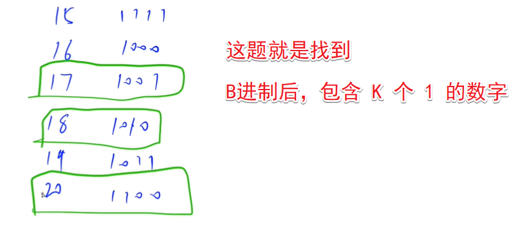
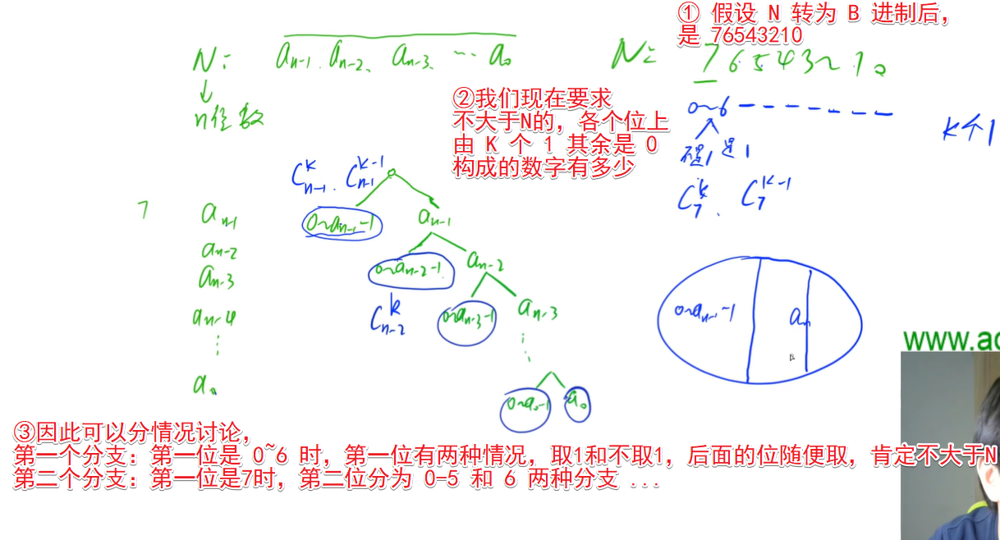

<!-- @import "[TOC]" {cmd="toc" depthFrom=1 depthTo=6 orderedList=false} -->

<!-- code_chunk_output -->

- [数位DP](#数位dp)
  - [度的数量](#度的数量)

<!-- /code_chunk_output -->

### 数位DP

**技巧1：**

把 `f(x, y)` 转换为 `f(x)` ，比如遇到了 `[X, Y]` 可以思考能否转换为 `f(y) - f(x - 1)`

**技巧2:**

尽量用树的形式考虑。

#### 度的数量

求给定区间 $[X,Y]$ 中满足下列条件的整数个数：这个数恰好等于 $K$ 个互不相等的 $B$ 的整数次幂之和。

例如，设 $X = 15, Y = 20, K = 2, B = 2$，则有且仅有下列三个数满足题意：

- $17 = 2^4 + 2^0$
- $18 = 2^4 + 2^1$
- $20 = 2^4 + 2^2$

<h4>输入格式</h4>

第一行包含两个整数 $X$ 和 $Y$，接下来两行包含整数 $K$ 和 $B$。

<h4>输出格式</h4>

只包含一个整数，表示满足条件的数的个数。

<h4>数据范围</h4>

- $1 \le X \le Y \le 2^{31}-1$,
- $1 \le K \le 20$,
- $2 \le B \le 10$

<h4>输入样例：</h4>

```
15 20
2
2
```

<h4>输出样例：</h4>

```
3
```

分析：

这道题可以先求 $0~N$ 的数字数量。





组合数求和：$C_a^b = C_{a-1}^{b-1} + C_{a-1}^b$

```cpp
#include <cstring>
#include <iostream>
#include <algorithm>
#include <vector>

using namespace std;

const int N = 35;  // 转为 B 进制后可能有 31 位

int K, B;
int f[N][N];

void init()
{   // 预处理 C_a^b
    for (int i = 0; i < N; i ++ )
        for (int j = 0; j <= i; j ++ )
            if (!j) f[i][j] = 1;
            else f[i][j] = f[i - 1][j] + f[i - 1][j - 1];
}

int dp(int n)
{
    if (!n) return 0;

    vector<int> nums;
    while (n) nums.push_back(n % B), n /= B;  // 转为 B 进制

    int res = 0;
    int last = 0;  // 已经有多少 1 被分配
    for (int i = nums.size() - 1; i >= 0; i -- )
    {   // 从高位开始，对应咱们上面画的树
        int x = nums[i];
        if (x)  // 求左边分支中的数的个数（只有当 i 位不是 0 时才有必要枚举）
        {
            res += f[i][K - last];  // 第 i 位不是1是0时，比 i 低的位（共 i 位）随便填，共 K - last 个 1 
            if (x > 1)  // 只要当 i 位大于 1 时才有必要枚举
            {   // 第 i 位放 1 ，剩下的位随便填，共 K - last - 1 个 1 
                if (K - last - 1 >= 0) res += f[i][K - last - 1];
                break;  // 如果第 i 位放 1 ，则与上图不同，本题没必要继续枚举了，因为每位上只能0/1
            }
            else
            {
                last ++ ;  // 表示进入右边的分支，且这个分支表示 i 位为 1
                if (last > K) break;
            }
        }

        if (!i && last == K) res ++ ;   // 最右侧分支上的方案（最下面的，只有当 i == 0 且 所有 1 都用掉才合法）
    }

    return res;
}

int main()
{
    init();

    int l, r;
    cin >> l >> r >> K >> B;

    cout << dp(r) - dp(l - 1) << endl;

    return 0;
}
```

