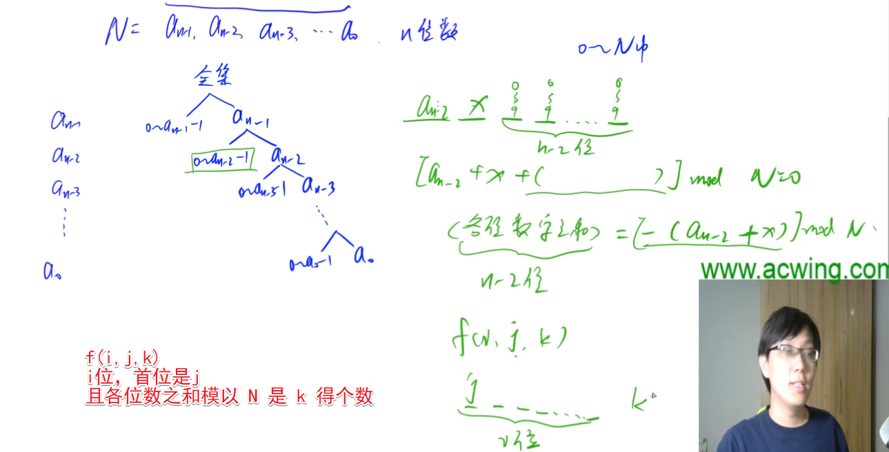
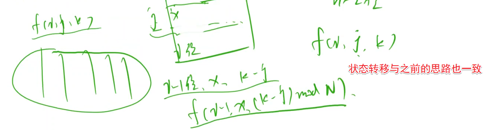
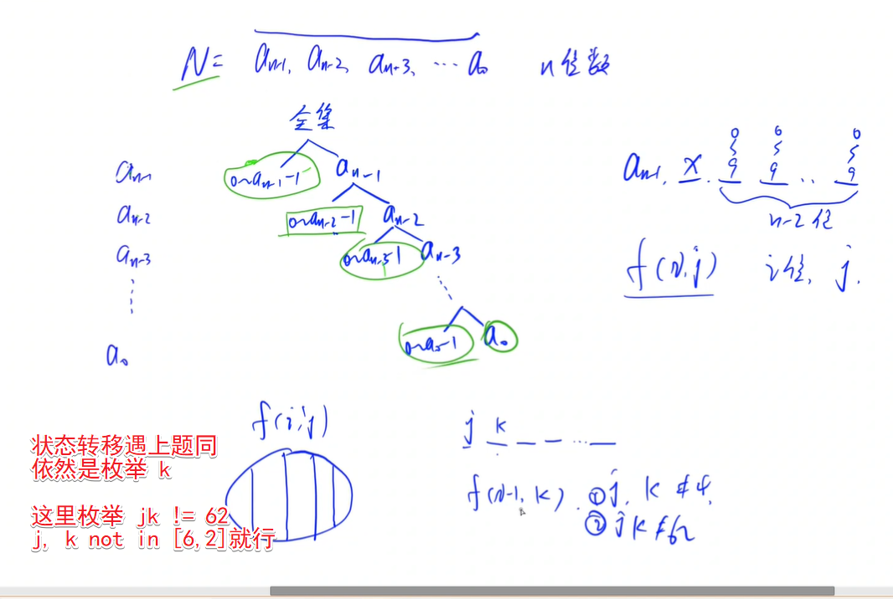
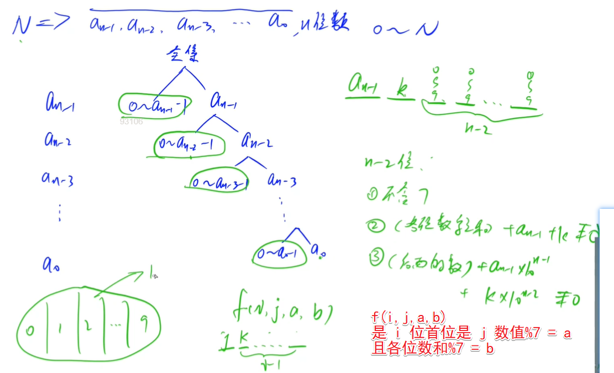
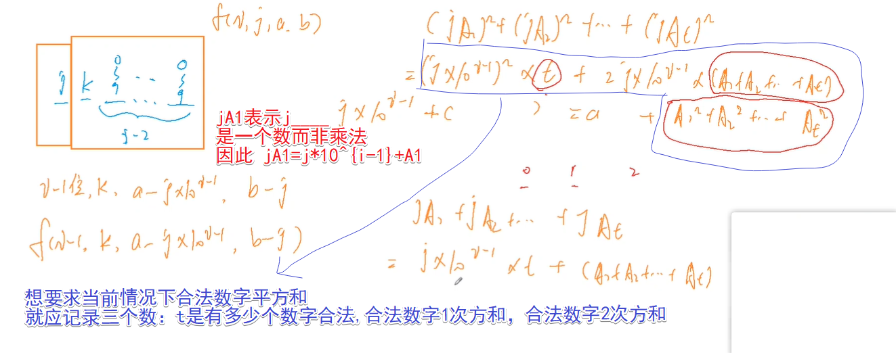
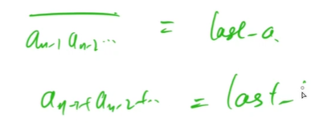

<!-- @import "[TOC]" {cmd="toc" depthFrom=1 depthTo=6 orderedList=false} -->

<!-- code_chunk_output -->

- [数位DP](#数位dp)
  - [度的数量](#度的数量)
  - [数字游戏](#数字游戏)
  - [Windy数](#windy数)
  - [数字游戏 II](#数字游戏-ii)
  - [不要62](#不要62)
  - [恨7不成妻](#恨7不成妻)

<!-- /code_chunk_output -->

### 数位DP

**技巧1：**

把 `f(x, y)` 转换为 `f(x)` ，比如遇到了 `[X, Y]` 可以思考能否转换为 `f(y) - f(x - 1)`

**技巧2:**

尽量用树的形式考虑。

#### 度的数量

求给定区间 $[X,Y]$ 中满足下列条件的整数个数：这个数恰好等于 $K$ 个互不相等的 $B$ 的整数次幂之和。

例如，设 $X = 15, Y = 20, K = 2, B = 2$，则有且仅有下列三个数满足题意：

- $17 = 2^4 + 2^0$
- $18 = 2^4 + 2^1$
- $20 = 2^4 + 2^2$

<h4>输入格式</h4>

第一行包含两个整数 $X$ 和 $Y$，接下来两行包含整数 $K$ 和 $B$。

<h4>输出格式</h4>

只包含一个整数，表示满足条件的数的个数。

<h4>数据范围</h4>

- $1 \le X \le Y \le 2^{31}-1$,
- $1 \le K \le 20$,
- $2 \le B \le 10$

<h4>输入样例：</h4>

```
15 20
2
2
```

<h4>输出样例：</h4>

```
3
```

分析：

这道题可以先求 $0~N$ 的数字数量。


组合数求和：$C_a^b = C_{a-1}^{b-1} + C_{a-1}^b$

```cpp
#include <cstring>
#include <iostream>
#include <algorithm>
#include <vector>

using namespace std;

const int N = 35;  // 转为 B 进制后可能有 31 位

int K, B;
int f[N][N];

void init()
{   // 预处理 C_a^b
    for (int i = 0; i < N; i ++ )
        for (int j = 0; j <= i; j ++ )
            if (!j) f[i][j] = 1;
            else f[i][j] = f[i - 1][j] + f[i - 1][j - 1];
}

int dp(int n)
{
    if (!n) return 0;

    vector<int> nums;
    while (n) nums.push_back(n % B), n /= B;  // 转为 B 进制

    int res = 0;
    int last = 0;  // 已经有多少 1 被分配
    for (int i = nums.size() - 1; i >= 0; i -- )
    {   // 从高位开始，对应咱们上面画的树
        int x = nums[i];
        if (x)  // 求左边分支中的数的个数（只有当 i 位不是 0 时才有必要枚举）
        {
            res += f[i][K - last];  // 第 i 位不是1是0时，比 i 低的位（共 i 位）随便填，共 K - last 个 1 
            if (x > 1)  // 只要当 i 位大于 1 时才有必要枚举
            {   // 第 i 位放 1 ，剩下的位随便填，共 K - last - 1 个 1 
                if (K - last - 1 >= 0) res += f[i][K - last - 1];
                break;  // 如果第 i 位放 1 ，则与上图不同，本题没必要继续枚举了，因为每位上只能0/1
            }
            else
            {
                last ++ ;  // 表示进入右边的分支，且这个分支表示 i 位为 1
                if (last > K) break;
            }
        }

        if (!i && last == K) res ++ ;   // 最右侧分支上的方案（最下面的，只有当 i == 0 且 所有 1 都用掉才合法）
    }

    return res;
}

int main()
{
    init();

    int l, r;
    cin >> l >> r >> K >> B;

    cout << dp(r) - dp(l - 1) << endl;

    return 0;
}
```

#### 数字游戏

科协里最近很流行数字游戏。

某人命名了一种不降数，这种数字必须满足从左到右各位数字呈非下降关系，如 $123$，$446$。

现在大家决定玩一个游戏，指定一个整数闭区间 $[a,b]$，问这个区间内有多少个不降数。

<h4>输入格式</h4>

输入包含多组测试数据。

每组数据占一行，包含两个整数 $a$ 和 $b$。

<h4>输出格式</h4>

每行给出一组测试数据的答案，即 $[a,b]$ 之间有多少不降数。

<h4>数据范围</h4>

$1 \le a \le b \le 2^{31}-1$

<h4>输入样例：</h4>

```
1 9
1 19
```

<h4>输出样例：</h4>

```
9
18
```


和上一题思路基本一样。但是用递推而非组合数求左侧叶子节点。

```cpp
#include <cstring>
#include <iostream>
#include <algorithm>
#include <vector>

using namespace std;

const int N = 15;

int f[N][N];    // f[i, j]表示一共有i位，且最高位填j的数的个数

void init()
{
    for (int i = 0; i <= 9; i ++ ) f[1][i] = 1;

    for (int i = 2; i < N; i ++ )
        for (int j = 0; j <= 9; j ++ )
            for (int k = j; k <= 9; k ++ )
                f[i][j] += f[i - 1][k];
}

int dp(int n)
{
    if (!n) return 1;  // 0 要特判

    vector<int> nums;
    while (n) nums.push_back(n % 10), n /= 10;

    int res = 0;
    int last = 0;
    for (int i = nums.size() - 1; i >= 0; i -- )
    {
        int x = nums[i];  // 从高位开始
        for (int j = last; j < x; j ++ )  // 最高位不能填 x 剩下情况都行
            res += f[i + 1][j];  // 因为如果填 x 则可能比 n 大

        if (x < last) break;  // 如果 x 比上一位还小，则枚举 0~i 位的情况已经被上面的循环涵盖
        last = x;  // 否则， x 大于等于 last ，则接下来枚举第 i+1 位是 last ，第 0~i 位的情况

        if (!i) res ++ ;  // 能抵达最后，说明之前的数都是合法的
    }

    return res;
}

int main()
{
    init();

    int l, r;
    while (cin >> l >> r) cout << dp(r) - dp(l - 1) << endl;

    return 0;
}
```

#### Windy数

Windy 定义了一种 Windy 数：不含前导零且相邻两个数字之差至少为 $2$ 的正整数被称为 Windy 数。

Windy 想知道，在 $A$ 和 $B$ 之间，包括 $A$ 和 $B$，总共有多少个 Windy 数？

<h4>输入格式</h4>

共一行，包含两个整数 $A$ 和 $B$。

<h4>输出格式</h4>

输出一个整数，表示答案。

<h4>数据范围</h4>

$1 \le A \le B \le 2 \times 10^9$

<h4>输入样例1：</h4>

```
1 10
```

<h4>输出样例1：</h4>

```
9
```

<h4>输入样例2：</h4>

```
25 50
```

<h4>输出样例2：</h4>

```
20
```


如上，还是和上题差不多。

```cpp
#include <cstring>
#include <iostream>
#include <algorithm>
#include <vector>

using namespace std;

const int N = 11;

int f[N][10];

void init()
{
    for (int i = 0; i <= 9; i ++ ) f[1][i] = 1;

    for (int i = 2; i < N; i ++ )
        for (int j = 0; j <= 9; j ++ )
            for (int k = 0; k <= 9; k ++ )
                if (abs(j - k) >= 2)
                    f[i][j] += f[i - 1][k];
}

int dp(int n)
{
    if (!n) return 0;

    vector<int> nums;
    while (n) nums.push_back(n % 10), n /= 10;

    int res = 0;
    int last = -2;  // last 初始值是一个和 0~9 距离大于等于 2 的数就好
    for (int i = nums.size() - 1; i >= 0; i -- )
    {
        int x = nums[i];
        for (int j = i == nums.size() - 1; j < x; j ++ )  // 如果 i 是最高位，枚举 [1, x) 否则 [0, x)
            if (abs(j - last) >= 2)
                res += f[i + 1][j];

        if (abs(x - last) >= 2) last = x;
        else break;  // i 位定为 x 的情况都被 i + 1 位时枚举了， break

        if (!i) res ++ ;
    }

    // 特殊处理有前导零的数
    for (int i = 1; i < nums.size(); i ++ )
        for (int j = 1; j <= 9; j ++ )
            res += f[i][j];

    return res;
}

int main()
{
    init();

    int l, r;
    cin >> l >> r;
    cout << dp(r) - dp(l - 1) << endl;

    return 0;
}
```

#### 数字游戏 II

由于科协里最近真的很流行数字游戏。

某人又命名了一种取模数，这种数字必须满足各位数字之和 $mod\ N$ 为 $0$。

现在大家又要玩游戏了，指定一个整数闭区间 $[a.b]$，问这个区间内有多少个取模数。

<h4>输入格式</h4>

输入包含多组测试数据，每组数据占一行。

每组数据包含三个整数 $a,b,N$。

<h4>输出格式</h4>

对于每个测试数据输出一行结果，表示区间内各位数字和 $mod\ N$ 为 $0$ 的数的个数。

<h4>数据范围</h4>

- $1 \le a,b \le 2^{31}-1$,
- $1 \le N < 100$

<h4>输入样例：</h4>

```
1 19 9
```

<h4>输出样例：</h4>

```
2
```





```cpp
#include <cstring>
#include <iostream>
#include <algorithm>
#include <vector>

using namespace std;

const int N = 11, M = 110;

int P;
int f[N][10][M];

int mod(int x, int y)
{   // x % y 如果 x 是负数的话会不对
    return (x % y + y) % y;
}

void init()
{
    memset(f, 0, sizeof f);

    for (int i = 0; i <= 9; i ++ ) f[1][i][i % P] ++ ;

    for (int i = 2; i < N; i ++ )
        for (int j = 0; j <= 9; j ++ )
            for (int k = 0; k < P; k ++ )  // k 取不到 P， P % P = 0
                for (int x = 0; x <= 9; x ++ )
                    f[i][j][k] += f[i - 1][x][mod(k - j, P)];
}

int dp(int n)
{
    if (!n) return 1;

    vector<int> nums;
    while (n) nums.push_back(n % 10), n /= 10;

    int res = 0;
    int last = 0;  // 左边数之和
    for (int i = nums.size() - 1; i >= 0; i -- )
    {
        int x = nums[i];
        for (int j = 0; j < x; j ++ )
            res += f[i + 1][j][mod(-last, P)];  // 未确定位和 + last % P == 0 即这里的未确定位和 = - last % P

        last += x;

        if (!i && last % P == 0) res ++ ;  // 抵达最后一个节点且合法
    }

    return res;
}

int main()
{
    int l, r;
    while (cin >> l >> r >> P)
    {
        init();

        cout << dp(r) - dp(l - 1) << endl;
    }

    return 0;
}
```

**经验：**
- C++ 中防止负数取模出现负数：`(x % y + y) % y` 

#### 不要62

杭州人称那些傻乎乎粘嗒嗒的人为 $62$（音：laoer）。

杭州交通管理局经常会扩充一些的士车牌照，新近出来一个好消息，以后上牌照，不再含有不吉利的数字了，这样一来，就可以消除个别的士司机和乘客的心理障碍，更安全地服务大众。

不吉利的数字为所有含有 $4$ 或 $62$ 的号码。例如：$62315,73418,88914$ 都属于不吉利号码。但是，$61152$ 虽然含有 $6$ 和 $2$，但不是  连号，所以不属于不吉利数字之列。

你的任务是，对于每次给出的一个牌照号区间 $[n,m]$，推断出交管局今后又要实际上给多少辆新的士车上牌照了。

<h4>输入格式</h4>

输入包含多组测试数据，每组数据占一行。

每组数据包含一个整数对 $n$ 和 $m$。

当输入一行为“0 0”时，表示输入结束。

<h4>输出格式</h4>

对于每个整数对，输出一个不含有不吉利数字的统计个数，该数值占一行位置。

<h4>数据范围</h4>

$1 \le n \le m \le 10^9$

<h4>输入样例：</h4>

```
1 100
0 0
```

<h4>输出样例：</h4>

```
80
```



```cpp
#include <cstring>
#include <iostream>
#include <algorithm>
#include <vector>

using namespace std;

const int N = 35;

int f[N][10];

void init()
{
    for (int i = 0; i <= 9; i ++ )
        if (i != 4)
            f[1][i] = 1;  // 处理个位数

    for (int i = 1; i < N; i ++ )
        for (int j = 0; j <= 9; j ++ )
        {
            if (j == 4) continue;
            for (int k = 0; k <= 9; k ++ )
            {
                if (k == 4 || j == 6 && k == 2) continue;
                f[i][j] += f[i - 1][k];
            }
        }
}

int dp(int n)
{
    if (!n) return 1;

    vector<int> nums;
    while (n) nums.push_back(n % 10), n /= 10;

    int res = 0;
    int last = 0;
    for (int i = nums.size() - 1; i >= 0; i -- )
    {
        int x = nums[i];
        for (int j = 0; j < x; j ++ )
        {
            if (j == 4 || last == 6 && j == 2) continue;
            res += f[i + 1][j];
        }

        if (x == 4 || last == 6 && x == 2) break;  // 说明接下来的分支都不可取
        last = x;  // 上一位数

        if (!i) res ++ ;  // 如果能抵达最后一个节点，则是有效的
    }

    return res;
}

int main()
{
    init();

    int l, r;
    while (cin >> l >> r, l || r)
    {
        cout << dp(r) - dp(l - 1) << endl;
    }

    return 0;
}
```

#### 恨7不成妻

单身！

依然单身！

吉哥依然单身！

DS 级码农吉哥依然单身！

所以，他平生最恨情人节，不管是 $214$ 还是 $77$，他都讨厌！

吉哥观察了 $214$ 和 $77$ 这两个数，发现：

- $2 + 1 + 4 = 7$
- $7 + 7 = 7 \times 2$
- $77 = 7 \times 11$

最终，他发现原来这一切归根到底都是因为和 $7$ 有关！

所以，他现在甚至讨厌一切和 $7$ 有关的数！

什么样的数和 $7$ 有关呢？

如果一个整数符合下面三个条件之一，那么我们就说这个整数和 $7$ 有关：

<ol>
<li>整数中某一位是 $7$；</li>
<li>整数的每一位加起来的和是 $7$ 的整数倍；</li>
<li>这个整数是 $7$ 的整数倍。</li>
</ol>
现在问题来了：吉哥想知道在一定区间内和 $7$ 无关的整数的平方和。

<h4>输入格式</h4>

第一行包含整数 $T$，表示共有 $T$ 组测试数据。

每组数据占一行，包含两个整数 $L$ 和 $R$。

<h4>输出格式</h4>

对于每组数据，请计算 $[L,R]$ 中和 $7$ 无关的数字的平方和，并将结果对 $10^9+7$ 取模后输出。

<h4>数据范围</h4>

- $1 \le T \le 50$,
- $1 \le L \le R \le 10^{18}$

<h4>输入样例：</h4>

```
3
1 9
10 11
17 17
```

<h4>输出样例：</h4>

```
236
221
0
```

依旧是数位DP+预处理。







```cpp
#include <cstring>
#include <iostream>
#include <algorithm>
#include <vector>

using namespace std;

typedef long long LL;

const int N = 20, P = 1e9 + 7;

struct F
{
    int s0, s1, s2;  // 数量（0次方和） 1次方和 2次方和
}f[N][10][7][7];

int power7[N], power9[N];

int mod(LL x, int y)
{
    return (x % y + y) % y;
}

void init()
{
    for (int i = 0; i <= 9; i ++ )
    {
        if (i == 7) continue;
        auto& v = f[1][i][i % 7][i % 7];
        v.s0 ++, v.s1 += i, v.s2 += i * i;
    }

    LL power = 10;
    for (int i = 2; i < N; i ++, power *= 10)
        for (int j = 0; j <= 9; j ++ )
        {
            if (j == 7) continue;
            for (int a = 0; a < 7; a ++ )
                for (int b = 0; b < 7; b ++ )
                    for (int k = 0; k <= 9; k ++ )
                    {
                        if (k == 7) continue;
                        // v1 是要更新的值， v2 是 v1 更新所依赖的值
                        auto &v1 = f[i][j][a][b], &v2 = f[i - 1][k][mod(a - j * power, 7)][mod(b - j, 7)];
                        v1.s0 = mod(v1.s0 + v2.s0, P);
                        v1.s1 = mod(v1.s1 + v2.s1 + j * (power % P) % P * v2.s0, P);
                        v1.s2 = mod(v1.s2 + j * j * (power % P) % P * (power % P) % P * v2.s0 + v2.s2 + 2 * j * power % P * v2.s1, P);
                    }   // 注意多多取模，每做一次乘法就要取模
        }

    power7[0] = 1;
    for (int i = 1; i < N; i ++ ) power7[i] = power7[i - 1] * 10 % 7;

    power9[0] = 1;
    for (int i = 1; i < N; i ++ ) power9[i] = power9[i - 1] * 10ll % P;  // 10^i
}

F get(int i, int j, int a, int b)  // 不是 a 和 b 的情况
{
    int s0 = 0, s1 = 0, s2 = 0;
    for (int x = 0; x < 7; x ++ )
        for (int y = 0; y < 7; y ++ )
            if (x != a && y != b)
            {
                auto v = f[i][j][x][y];
                s0 = (s0 + v.s0) % P;
                s1 = (s1 + v.s1) % P;
                s2 = (s2 + v.s2) % P;
            }
    return {s0, s1, s2};
}

int dp(LL n)
{
    if (!n) return 0;

    LL backup_n = n % P;
    vector<int> nums;
    while (n) nums.push_back(n % 10), n /= 10;

    int res = 0;
    LL last_a = 0, last_b = 0;  // 已确定位数值、各位数之和
    for (int i = nums.size() - 1; i >= 0; i -- )
    {
        int x = nums[i];
        for (int j = 0; j < x; j ++ )
        {
            if (j == 7) continue;
            int a = mod(-last_a * power7[i + 1], 7);
            int b = mod(-last_b, 7);
            auto v = get(i + 1, j, a, b);
            res = mod(
                res + 
                (last_a % P) * (last_a % P) % P * power9[i + 1] % P * power9[i + 1] % P * v.s0 % P + 
                v.s2 + 
                2 * last_a % P * power9[i + 1] % P * v.s1,
            P);
        }

        if (x == 7) break;  // 这里 break ，之后的分支都不等于
        last_a = last_a * 10 + x;
        last_b += x;

        if (!i && last_a % 7 && last_b % 7) res = (res + backup_n * backup_n) % P;  // 加上原数平方和
    }

    return res;
}

int main()
{
    int T;
    cin >> T;

    init();

    while (T -- )
    {
        LL l, r;
        cin >> l >> r;
        cout << mod(dp(r) - dp(l - 1), P) << endl;
    }

    return 0;
}
```
