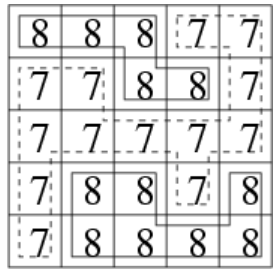

<!-- @import "[TOC]" {cmd="toc" depthFrom=1 depthTo=6 orderedList=false} -->

<!-- code_chunk_output -->

- [Flood Fill](#flood-fill)
  - [池塘计数](#池塘计数)
  - [城堡问题](#城堡问题)
  - [山峰和山谷](#山峰和山谷)
- [最短路模型](#最短路模型)
  - [迷宫问题](#迷宫问题)
  - [武士风度的牛](#武士风度的牛)
  - [抓住那头牛](#抓住那头牛)

<!-- /code_chunk_output -->

### Flood Fill

#### 池塘计数

农夫约翰有一片 $N*M$ 的矩形土地。

<p>最近，由于降雨的原因，部分土地被水淹没了。</p>

<p>现在用一个字符矩阵来表示他的土地。</p>

<p>每个单元格内，如果包含雨水，则用“W“表示，如果不含雨水，则用“.“表示。</p>

<p>现在，约翰想知道他的土地中形成了多少片池塘。</p>

<p>每组相连的积水单元格集合可以看作是一片池塘。</p>

<p>每个单元格视为与其上、下、左、右、左上、右上、左下、右下八个邻近单元格相连。</p>

<p>请你输出共有多少片池塘，即矩阵中共有多少片相连的“W“块。</p>

<h4>输入格式</h4>

第一行包含两个整数 $N$ 和 $M$。

接下来 $N$ 行，每行包含 $M$ 个字符，字符为“W“或“.“，用以表示矩形土地的积水状况，字符之间没有空格。

<h4>输出格式</h4>

<p>输出一个整数，表示池塘数目。</p>

<h4>数据范围</h4>

$1 \le N,M \le 1000$

<h4>输入样例：</h4>

<pre><code>
10 12
W........WW.
.WWW.....WWW
....WW...WW.
.........WW.
.........W..
..W......W..
.W.W.....WW.
W.W.W.....W.
.W.W......W.
..W.......W.
</code></pre>

<h4>输出样例：</h4>

<pre><code>
3
</code></pre>

```cpp
#include <iostream>
#include <cstring>
#include <algorithm>
using namespace std;

typedef pair<int, int> PII;

const int N = 1010;
int n, m;
bool st[N][N];
char g[N][N];
PII q[N * N];
int dx[8] = {0, 1, 1, 1, 0, -1, -1, -1};
int dy[8] = {1, 1, 0, -1, -1, -1, 0, 1};

void bfs(int sx, int sy)
{
    int hh = 0, tt = 0;
    
    q[0] = {sx, sy};
    st[sx][sy] = true;

    while (hh <= tt)
    {
        PII t = q[hh ++];
        int x = t.first, y = t.second;
        
        for (int i = 0; i < 8; ++ i)
        {
            int a = x + dx[i], b = y + dy[i];
            if (a >= 0 && a < n && b >= 0 && b < m && !st[a][b] && g[a][b] == 'W')
            {
                q[++ tt] = {a, b};
                st[a][b] = true;
            }
        }
    }
}

int main()
{
    cin >> n >> m;
    for (int i = 0; i < n; ++ i) scanf("%s", g[i]);
    
    int cnt = 0;
    for (int i = 0; i < n; ++ i)
        for (int j = 0; j < m; ++ j)
        {
            if (!st[i][j] && g[i][j] == 'W')
            {
                cnt ++ ;
                bfs(i, j);
            }
        }
        
    printf("%d", cnt);
}
```

#### 城堡问题

<pre><code>
    1   2   3   4   5   6   7  
   #############################
 1 #   |   #   |   #   |   |   #
   #####---#####---#---#####---#
 2 #   #   |   #   #   #   #   #
   #---#####---#####---#####---#
 3 #   |   |   #   #   #   #   #
   #---#########---#####---#---#
 4 #   #   |   |   |   |   #   #
   #############################
           (图 1)

   #  = Wall   
   |  = No wall
   -  = No wall

   方向：上北下南左西右东。
</code></pre>

<p>图1是一个城堡的地形图。</p>

<p>请你编写一个程序，计算城堡一共有多少房间，最大的房间有多大。</p>

<p>城堡被分割成 $m*n$个方格区域，每个方格区域可以有0~4面墙。</p>

<p>注意：墙体厚度忽略不计。</p>

<h4>输入格式</h4>

第一行包含两个整数 $m$ 和 $n$，分别表示城堡南北方向的长度和东西方向的长度。

接下来 $m$ 行，每行包含 $n$ 个整数，每个整数都表示平面图对应位置的方块的墙的特征。

每个方块中墙的特征由数字 $P$ 来描述，我们用1表示西墙，2表示北墙，4表示东墙，8表示南墙，$P$ 为该方块包含墙的数字之和。

例如，如果一个方块的 $P$ 为3，则 3 = 1 + 2，该方块包含西墙和北墙。

<p>城堡的内墙被计算两次，方块(1,1)的南墙同时也是方块(2,1)的北墙。</p>

<p>输入的数据保证城堡至少有两个房间。</p>

<h4>输出格式</h4>

<p>共两行，第一行输出房间总数，第二行输出最大房间的面积（方块数）。</p>

<h4>数据范围</h4>

- $1 \le m,n \le 50$,
- $0 \le P \le 15$

<h4>输入样例：</h4>

<pre><code>
4 7 
11 6 11 6 3 10 6 
7 9 6 13 5 15 5 
1 10 12 7 13 7 5 
13 11 10 8 10 12 13 
</code></pre>

<h4>输出样例：</h4>

<pre><code>
5
9
</code></pre>

```cpp
#include <iostream>
#include <cstring>
#include <algorithm>
using namespace std;

// 题目中是 西北东南 1 2 4 8
// 即 左 上 右 下
// dx 是行 +1 为下 dy 是列 +1 为右
int dx[4] = {0, -1, 0, 1};
int dy[4] = {-1, 0, 1, 0};

const int N = 55;
typedef pair<int, int> PII;

int n, m;
int g[N][N];
PII q[N * N];
bool st[N][N];

int bfs(int sx, int sy)
{
    int res = 0;

    int hh = 0, tt = -1;

    q[++ tt] = {sx, sy};
    st[sx][sy] = true;

    while (hh <= tt)
    {
        PII t = q[hh ++];
        int x = t.first, y = t.second;
        res ++;

        for (int i = 0; i < 4; ++ i)
        {
            int a = x + dx[i], b = y + dy[i];
            if (a < 0 || a >= n || b < 0 || b >= m) continue;
            if (st[a][b]) continue;
            if (g[x][y] >> i & 1) continue;

            q[++ tt] = {a, b};
            st[a][b] = true;
        }
    }

    return res;
}

int main()
{
    cin >> n >> m;
    for (int i = 0; i < n; ++ i)
        for (int j = 0; j < m; ++ j)
            scanf("%d", &g[i][j]);
    
    int ans = 0;
    int cnt = 0;
    for (int i = 0; i < n; ++ i)
        for (int j = 0; j < m; ++ j)
        {
            if (!st[i][j])
            {
                ans = max(ans, bfs(i, j));
                cnt ++ ;
            }
        }

    printf("%d\n", cnt);
    printf("%d\n", ans);
}
```

#### 山峰和山谷

<p>FGD小朋友特别喜欢爬山，在爬山的时候他就在研究山峰和山谷。</p>

<p>为了能够对旅程有一个安排，他想知道山峰和山谷的数量。</p>

给定一个地图，为FGD想要旅行的区域，地图被分为 $n \times n$ 的网格，每个格子 $(i,j)$ 的高度 $w(i,j)$ 是给定的。

若两个格子有公共顶点，那么它们就是相邻的格子，如与 $(i,j)$ 相邻的格子有$(i-1, j-1),(i-1,j),(i-1,j+1),(i,j-1),(i,j+1),(i+1,j-1),(i+1,j),(i+1,j+1)$。

我们定义一个格子的集合 $S$ 为山峰（山谷）当且仅当：

- $S$ 的所有格子都有相同的高度。
- $S$ 的所有格子都连通。
- 对于 $s$ 属于 $S$，与 $s$ 相邻的 $s’$ 不属于 $S$，都有 $w_s > w_{s’}$（山峰），或者 $w_s < w_{s’}$（山谷）。
- 如果周围不存在相邻区域，则同时将其视为山峰和山谷。

<p>你的任务是，对于给定的地图，求出山峰和山谷的数量，如果所有格子都有相同的高度，那么整个地图即是山峰，又是山谷。</p>

<h4>输入格式</h4>

第一行包含一个正整数 $n$，表示地图的大小。

接下来一个 $n \times n$ 的矩阵，表示地图上每个格子的高度 $w$。

<h4>输出格式</h4>

<p>共一行，包含两个整数，表示山峰和山谷的数量。</p>

<h4>数据范围</h4>

- $1 \le n \le 1000$
- $0 \le w \le 10^9$

<h4>输入样例1：</h4>

<pre><code>
5
8 8 8 7 7
7 7 8 8 7
7 7 7 7 7
7 8 8 7 8
7 8 8 8 8
</code></pre>

<h4>输出样例1：</h4>

<pre><code>
2 1
</code></pre>

<h4>输入样例2：</h4>

<pre><code>
5
5 7 8 3 1
5 5 7 6 6
6 6 6 2 8
5 7 2 5 8
7 1 0 1 7
</code></pre>

<h4>输出样例2：</h4>

<pre><code>
3 3
</code></pre>

<h4>样例解释</h4>

<p>样例1：</p>



<p>样例2：</p>


```cpp
// 反向判断，有一个边界比我高了，那就不是山峰
// 有一个边界比我低了，那就不是山谷
#include <iostream>
#include <cstring>
#include <algorithm>
using namespace std;

const int N = 1010;

typedef pair<int, int> PII;

int n;
int h[N][N];
PII q[N * N];
bool st[N][N];
int dx[8] = {-1, -1, -1, 0, 1, 1, 1, 0};
int dy[8] = {-1, 0, 1, 1, 1, 0, -1, -1};

void bfs(int sx, int sy, bool& has_higher, bool& has_lower)
{
    int hh = 0, tt = 0;
    q[0] = {sx, sy};
    st[sx][sy] = true;
    
    while (hh <= tt)
    {
        PII t = q[hh ++];
        int x = t.first, y = t.second;
        
        for (int i = 0; i < 8; ++ i)
        {
            int a = x + dx[i], b = y + dy[i];
            if (a < 0 || a >= n || b < 0 || b >= n) continue;
            if (h[a][b] != h[x][y])
            {
                if (h[a][b] > h[x][y]) has_higher = true;
                if (h[a][b] < h[x][y]) has_lower = true;
            }
            else if (!st[a][b])
            {
                st[a][b] = true;
                q[++ tt] = {a, b};
            }
        }
    }
}

int main()
{
    cin >> n;
    for (int i = 0; i < n; ++ i)
        for (int j = 0; j < n; ++ j)
            scanf("%d", &h[i][j]);
    
    int peak = 0, valley = 0;
    for (int i = 0; i < n; ++ i)
        for (int j = 0; j < n; ++ j)
            if (!st[i][j])
            {
                bool has_higher = false, has_lower = false;
                bfs(i, j, has_higher, has_lower);
                if (!has_higher) peak ++;
                if (!has_lower) valley ++;
            }
    
    printf("%d\n", peak);
    printf("%d\n", valley);
}
```

### 最短路模型

#### 迷宫问题

给定一个 $n \times n$ 的二维数组，如下所示：

<pre><code>
int maze[5][5] = {

0, 1, 0, 0, 0,

0, 1, 0, 1, 0,

0, 0, 0, 0, 0,

0, 1, 1, 1, 0,

0, 0, 0, 1, 0,

};
</code></pre>

<p>它表示一个迷宫，其中的1表示墙壁，0表示可以走的路，只能横着走或竖着走，不能斜着走，要求编程序找出从左上角到右下角的最短路线。</p>

<p>数据保证至少存在一条从左上角走到右下角的路径。</p>

<h4>输入格式</h4>

<p>第一行包含整数 n。</p>

接下来 $n$ 行，每行包含 $n$ 个整数 0 或 1，表示迷宫。

<h4>输出格式</h4>

<p>输出从左上角到右下角的最短路线，如果答案不唯一，输出任意一条路径均可。</p>

按顺序，每行输出一个路径中经过的单元格的坐标，左上角坐标为 $(0,0)$，右下角坐标为 $(n-1,n-1)$。

<h4>数据范围</h4>

$0 \le n \le 1000$

<h4>输入样例：</h4>

<pre><code>
5
0 1 0 0 0
0 1 0 1 0
0 0 0 0 0
0 1 1 1 0
0 0 0 1 0
</code></pre>

<h4>输出样例：</h4>

<pre><code>
0 0
1 0
2 0
2 1
2 2
2 3
2 4
3 4
4 4
</code></pre>

```cpp
#include <iostream>
#include <cstring>
#include <algorithm>
#include <queue>
#include <unordered_map>
using namespace std;

const int N = 1010;

typedef pair<int, int> PII;

int n;
int g[N][N];
bool st[N][N];
PII pre[N][N];
int dx[4] = {-1, 0, 1, 0}, dy[4] = {0, 1, 0, -1};

void bfs(int sx, int sy)
{
    queue<PII> q;
    
    q.push({sx, sy});
    st[sx][sy] = true;

    while (q.size())
    {
        auto t = q.front();
        q.pop();
        int x = t.first, y = t.second;

        if (x == 0 && y == 0) break;

        for (int i = 0; i < 4; ++ i)
        {
            int a = x + dx[i], b = y + dy[i];
            if (a < 0 || a >= n || b < 0 || b >= n) continue;
            if (g[a][b] == 1) continue;
            if (st[a][b]) continue;
            q.push({a, b});
            pre[a][b] = {x, y};
            st[a][b] = true;
        }
    }
}

int main()
{
    cin >> n;
    for (int i = 0; i < n; i ++ )
        for (int j = 0; j < n; j ++ )
            scanf("%d", &g[i][j]);
    
    bfs(n - 1, n - 1);
    
    PII end(0, 0);
    
    while (true)
    {
        printf("%d %d\n", end.first, end.second);
        if (end.first == n - 1 && end.second == n - 1) break;
        end = pre[end.first][end.second];
    }
}
```

#### 武士风度的牛

<p>农民 John 有很多牛，他想交易其中一头被 Don 称为 The Knight 的牛。</p>

<p>这头牛有一个独一无二的超能力，在农场里像 Knight 一样地跳（就是我们熟悉的象棋中马的走法）。</p>

虽然这头神奇的牛不能跳到树上和石头上，但是它可以在牧场上随意跳，我们把牧场用一个 $x，y$ 的坐标图来表示。

<p>这头神奇的牛像其它牛一样喜欢吃草，给你一张地图，上面标注了 The Knight 的开始位置，树、灌木、石头以及其它障碍的位置，除此之外还有一捆草。</p>

<p>现在你的任务是，确定 The Knight 要想吃到草，至少需要跳多少次。</p>

<p>The Knight 的位置用 <code>K</code> 来标记，障碍的位置用 <code>*</code> 来标记，草的位置用 <code>H</code> 来标记。</p>

<p>这里有一个地图的例子：</p>

<pre><code>
             11 | . . . . . . . . . .
             10 | . . . . * . . . . . 
              9 | . . . . . . . . . . 
              8 | . . . * . * . . . . 
              7 | . . . . . . . * . . 
              6 | . . * . . * . . . H 
              5 | * . . . . . . . . . 
              4 | . . . * . . . * . . 
              3 | . K . . . . . . . . 
              2 | . . . * . . . . . * 
              1 | . . * . . . . * . . 
              0 ----------------------
                                    1 
                0 1 2 3 4 5 6 7 8 9 0 
</code></pre>

The Knight 可以按照下图中的 $A,B,C,D...$ 这条路径用 $5$ 次跳到草的地方（有可能其它路线的长度也是 $5$）：

```
             11 | . . . . . . . . . .
             10 | . . . . * . . . . .
              9 | . . . . . . . . . .
              8 | . . . * . * . . . .
              7 | . . . . . . . * . .
              6 | . . * . . * . . . F<
              5 | * . B . . . . . . .
              4 | . . . * C . . * E .
              3 | .>A . . . . D . . .
              2 | . . . * . . . . . *
              1 | . . * . . . . * . .
              0 ----------------------
                                    1
                0 1 2 3 4 5 6 7 8 9 0
```

<p><strong>注意：</strong> 数据保证一定有解。</p>

<h4>输入格式</h4>

第 $1$ 行： 两个数，表示农场的列数 $C$ 和行数 $R$。

第 $2..R+1$ 行: 每行一个由 $C$ 个字符组成的字符串，共同描绘出牧场地图。

<h4>输出格式</h4>

<p>一个整数，表示跳跃的最小次数。</p>

<h4>数据范围</h4>

$1 \le R,C \le 150$

<h4>输入样例：</h4>

<pre><code>
10 11
..........
....*.....
..........
...*.*....
.......*..
..*..*...H
*.........
...*...*..
.K........
...*.....*
..*....*..
</code></pre>

<h4>输出样例：</h4>

<pre><code>
5
</code></pre>

```cpp
#include <iostream>
#include <cstring>
#include <algorithm>
using namespace std;

typedef pair<int, int> PII;

const int N = 155;
PII q[N * N];
int n, m;
int dist[N][N];
char g[N][N];
int dx[8] = {1, 2, 2, 1, -1, -2, -2, -1};
int dy[8] = {2, 1, -1, -2, -2, -1, 1, 2};

int bfs(PII start, PII end)
{
    memset(dist, -1, sizeof dist);

    int tt = 0, hh = 0;
    q[0] = start;
    dist[start.first][start.second] = 0;

    while (hh <= tt)
    {
        auto t = q[hh ++];
        int x = t.first, y = t.second;
        
        for (int i = 0; i < 8; ++ i)
        {
            int a = x + dx[i], b = y + dy[i];
            if (a < 0 || a >= n || b < 0 || b >= m) continue;
            if (g[a][b] == '*') continue;
            if (dist[a][b] != -1) continue;
            dist[a][b] = dist[x][y] + 1;
            if (a == end.first && b == end.second) return dist[a][b];
            q[++ tt] = {a, b};
        }
    }
    
    return -1;
}

int main()
{
    cin >> m >> n;
    for (int i = 0; i < n; i ++ ) scanf("%s", g[i]);
    
    PII start, end;
    for (int i = 0; i < n; i ++ )
        for (int j = 0; j < m; j ++ )
        {
            if (g[i][j] == 'K') start = {i, j};
            if (g[i][j] == 'H') end   = {i, j};
        }

    cout << bfs(start, end);
}
```

#### 抓住那头牛

<p>农夫知道一头牛的位置，想要抓住它。</p>

农夫和牛都位于数轴上，农夫起始位于点 $N$，牛位于点 $K$。

<p>农夫有两种移动方式：</p>

- 从 $X$ 移动到 $X-1$ 或 $X+1$，每次移动花费一分钟
- 从 $X$ 移动到 $2*X$，每次移动花费一分钟

<p>假设牛没有意识到农夫的行动，站在原地不动。</p>

<p>农夫最少要花多少时间才能抓住牛？</p>

<h4>输入格式</h4>

<p>共一行，包含两个整数N和K。</p>

<h4>输出格式</h4>

<p>输出一个整数，表示抓到牛所花费的最少时间。</p>

<h4>数据范围</h4>

$0 \le N,K \le 10^5$

<h4>输入样例：</h4>

<pre><code>
5 17
</code></pre>

<h4>输出样例：</h4>

<pre><code>
4
</code></pre>

```cpp
#include <iostream>
#include <cstring>
#include <algorithm>
using namespace std;

const int N = 1e5 + 10;
int n, k;
int dist[N];
int q[N];

int bfs()
{
    memset(dist, -1, sizeof dist);
    
    int tt = 0, hh = 0;
    q[0] = n;
    dist[n] = 0;
    
    while (hh <= tt)
    {
        int t = q[hh ++];
        if (t == k) return dist[t];
        
        if (t - 1 >= 0 && dist[t - 1] == -1)
        {
            q[++ tt] = t - 1;
            dist[t - 1] = dist[t] + 1;
        }
        if (t + 1 < N && dist[t + 1] == -1)
        {
            q[++ tt] = t + 1;
            dist[t + 1] = dist[t] + 1;
        }
        if (t * 2 <= N && dist[t * 2] == -1)
        {
            q[++ tt] = t * 2;
            dist[t * 2] = dist[t] + 1;
        }
    }
    
    return -1;
}

int main()
{
    cin >> n >> k;
    
    cout << bfs();
}
```
