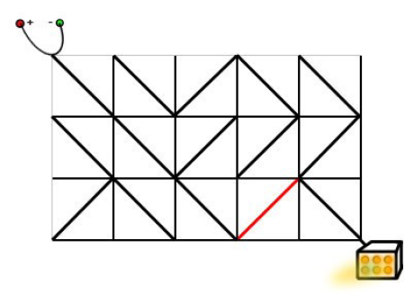

<!-- @import "[TOC]" {cmd="toc" depthFrom=1 depthTo=6 orderedList=false} -->

<!-- code_chunk_output -->

- [多源BFS](#多源bfs)
  - [矩阵距离](#矩阵距离)
- [最小步数模型](#最小步数模型)
  - [魔板](#魔板)
- [双端队列广搜](#双端队列广搜)
  - [电路维修](#电路维修)

<!-- /code_chunk_output -->

### 多源BFS

#### 矩阵距离

给定一个 $N$ 行 $M$ 列的 $01$ 矩阵 $A$，$A[i][j]$ 与 $A[k][l]$ 之间的曼哈顿距离定义为：

$$dist(A[i][j],A[k][l])=|i-k|+|j-l|$$

输出一个 $N$ 行 $M$ 列的整数矩阵 $B$，其中：

$$ B[i][j]=min_{1≤x≤N,1≤y≤M,A[x][y]=1}⁡{dist(A[i][j],A[x][y])}$$

<h4>输入格式</h4>

第一行两个整数 $N,M$。

接下来一个 $N$ 行 $M$ 列的 $01$ 矩阵，数字之间没有空格。

<h4>输出格式</h4>

一个 $N$ 行 $M$ 列的矩阵 $B$，相邻两个整数之间用一个空格隔开。

<h4>数据范围</h4>

- $1 \le N,M \le 1000$

<h4>输入样例：</h4>

<pre><code>
3 4
0001
0011
0110
</code></pre>

<h4>输出样例：</h4>

<pre><code>
3 2 1 0
2 1 0 0
1 0 0 1
</code></pre>

```cpp
/*
* 多源 bfs
* 题意说白了，就是各个点和『值为1的点』的最小曼哈顿距离是多少
* 那就把所有『值为1的点』推入 queue （作为起点，d[][] = 0），然后 bfs
*/
#include <iostream>
#include <cstring>
#include <algorithm>
// #include <queue>  这道题咱试试数组实现队列
using namespace std;

const int N = 1010;
int d[N][N];
char g[N][N];  // 题目中每行没有空格
pair<int, int> q[N * N];

int n, m;

void bfs()
{
    int hh = 0, tt = -1;
    memset(d, -1, sizeof d);
    
    for (int i = 1; i <= n; ++ i)
        for (int j = 1; j <= m; ++ j)
        {
            if (g[i][j] == '1')
            {
                q[++ tt] = {i, j};
                d[i][j] = 0;
            }
        }
    
    int dx[4] = {-1, 0, 1, 0}, dy[4] = {0, 1, 0, -1};
    while (hh <= tt)
    {
        auto t = q[hh ++];
        int x = t.first, y = t.second;
        for (int i = 0; i < 4; ++ i)
        {
            int a = x + dx[i], b = y + dy[i];
            if (a > 0 && a <= n && b > 0 && b <= m && d[a][b] == -1)
            {
                d[a][b] = d[x][y] + 1;
                q[++ tt] = {a, b};
            }
        }
    }
}

int main()
{
    cin >> n >> m;
    // 这里 i 从 1 开始记数，代表第 1 行
    // g[i] + 1 表示从该列的第 1 个地址开始，而非第 0 个
    for (int i = 1; i <= n; ++ i) scanf("%s", g[i] + 1);
    
    bfs();
    
    for (int i = 1; i <= n; ++ i)
    {
        for (int j = 1; j <= m; ++ j)
            printf("%d ", d[i][j]);
        puts("");
    }
}
```

### 最小步数模型

#### 魔板

<p>Rubik 先生在发明了风靡全球的魔方之后，又发明了它的二维版本——魔板。</p>

这是一张有 $8$ 个大小相同的格子的魔板：

<pre><code>
1 2 3 4
8 7 6 5
</code></pre>

<p>我们知道魔板的每一个方格都有一种颜色。</p>

这 $8$ 种颜色用前 $8$ 个正整数来表示。

<p>可以用颜色的序列来表示一种魔板状态，规定从魔板的左上角开始，沿顺时针方向依次取出整数，构成一个颜色序列。</p>

对于上图的魔板状态，我们用序列 $(1,2,3,4,5,6,7,8)$ 来表示，这是基本状态。

<p>这里提供三种基本操作，分别用大写字母 A，B，C 来表示（可以通过这些操作改变魔板的状态）：</p>

<p>A：交换上下两行；<br />

B：将最右边的一列插入到最左边；<br />

C：魔板中央对的4个数作顺时针旋转。</p>

<p>下面是对基本状态进行操作的示范：</p>

<p>A：</p>

<pre><code>
8 7 6 5
1 2 3 4
</code></pre>

<p>B：</p>

<pre><code>
4 1 2 3
5 8 7 6
</code></pre>

<p>C：</p>

<pre><code>
1 7 2 4
8 6 3 5
</code></pre>

<p>对于每种可能的状态，这三种基本操作都可以使用。</p>

<p>你要编程计算用最少的基本操作完成基本状态到特殊状态的转换，输出基本操作序列。</p>

<p><strong>注意</strong>：数据保证一定有解。</p>

<h4>输入格式</h4>

输入仅一行，包括 $8$ 个整数，用空格分开，表示目标状态。

<h4>输出格式</h4>

<p>输出文件的第一行包括一个整数，表示最短操作序列的长度。 </p>

<p>如果操作序列的长度大于0，则在第二行输出字典序最小的操作序列。</p>

<h4>数据范围</h4>

输入数据中的所有数字均为 $1$ 到 $8$ 之间的整数。

<h4>输入样例：</h4>

<pre><code>
2 6 8 4 5 7 3 1
</code></pre>

<h4>输出样例：</h4>

<pre><code>
7
BCABCCB
</code></pre>

```cpp
#include <iostream>
#include <string>
#include <unordered_map>
#include <queue>
#include <algorithm>
using namespace std;

const string START = "12345678";
const char opts[4] = {'A', 'B', 'C'};

string A(string t)
{
    for (int i = 0; i < 4; ++ i)
    {
        swap(t[i], t[7 - i]);
    }
    
    return t;
}

string B(string t)
{
    for (int i = 0; i < 3; ++ i) swap(t[i], t[3]);
    for (int i = 4; i < 7; ++ i) swap(t[i], t[i + 1]);
    return t;
}

string C(string t)
{
    swap(t[1], t[2]);
    swap(t[5], t[6]);
    swap(t[5], t[1]);
    return t;
}

unordered_map<string, pair<string, char>> bfs(string target)
{
    unordered_map<string, pair<string, char>> pre;
    queue<string> q;
    
    q.push(START);
    
    while (q.size())
    {
        auto t = q.front();
        q.pop();
        
        if (t == target) return pre;
        
        string ne;
        for (int i = 0; i < 3; ++ i)
        {
            if (i == 0) ne = A(t);
            else if (i == 1) ne = B(t);
            else ne = C(t);
            
            if (!pre.count(ne))
            {
                pre[ne] = {t, opts[i]};
                q.push(ne);
            }
        }
    }
}

int main()
{
    string target;
    char s[2];
    for (int i = 0; i < 8; ++ i)
    {
        cin >> s;
        target += *s;
    }
    
    auto pre = bfs(target);
    
    int ans = 0;
    string res;
    while (target != START)
    {
        ans ++;
        res += pre[target].second;
        target = pre[target].first;
    }
    
    reverse(res.begin(), res.end());
    
    cout << ans << endl;
    cout << res;
}
```

**经验：**
- 务必仔细读题！这道题要求从基本状态到目标状态！这个逻辑没搞正确的话， `while(){pre}` 里面会死循环！

### 双端队列广搜

#### 电路维修

<p>达达是来自异世界的魔女，她在漫无目的地四处漂流的时候，遇到了善良的少女翰翰，从而被收留在地球上。</p>

<p>翰翰的家里有一辆飞行车。</p>

<p>有一天飞行车的电路板突然出现了故障，导致无法启动。</p>

电路板的整体结构是一个 $R$ 行 $C$ 列的网格（$R,C≤500$），如下图所示。


<p>每个格点都是电线的接点，每个格子都包含一个电子元件。</p>

<p>电子元件的主要部分是一个可旋转的、连接一条对角线上的两个接点的短电缆。</p>

<p>在旋转之后，它就可以连接另一条对角线的两个接点。</p>

<p>电路板左上角的接点接入直流电源，右下角的接点接入飞行车的发动装置。</p>

<p>达达发现因为某些元件的方向不小心发生了改变，电路板可能处于断路的状态。</p>

<p>她准备通过计算，旋转最少数量的元件，使电源与发动装置通过若干条短缆相连。</p>

<p>不过，电路的规模实在是太大了，达达并不擅长编程，希望你能够帮她解决这个问题。</p>

<p><strong>注意</strong>：只能走斜向的线段，水平和竖直线段不能走。</p>

<h4>输入格式</h4>

<p>输入文件包含多组测试数据。</p>

第一行包含一个整数 $T$，表示测试数据的数目。

对于每组测试数据，第一行包含正整数 $R$ 和 $C$，表示电路板的行数和列数。

之后 $R$ 行，每行 $C$ 个字符，字符是<code>"/"</code>和<code>"\"</code>中的一个，表示标准件的方向。

<h4>输出格式</h4>

<p>对于每组测试数据，在单独的一行输出一个正整数，表示所需的缩小旋转次数。</p>

<p>如果无论怎样都不能使得电源和发动机之间连通，输出 <code>NO SOLUTION</code>。</p>

<h4>数据范围</h4>

- $1 \le R,C \le 500$,
- $1 \le T \le 5$

<h4>输入样例：</h4>

<pre><code>
1
3 5
\\/\\
\\///
/\\\\
</code></pre>

<h4>输出样例：</h4>

<pre><code>
1
</code></pre>

<h4>样例解释</h4>

<p>样例的输入对应于题目描述中的情况。</p>

<p>只需要按照下面的方式旋转标准件，就可以使得电源和发动机之间连通。</p>



```cpp
/*
* 建模：以网格中节点为搜索节点
*       顺着走，则成本是 0 ，否则是 1
*       如例题中图，有 3 * 5 个格子，则有 4 * 6 个节点
* 双端队列，我们不一定把新节点放到队尾，
*       如果到新节点成本是 0 ，那就放到队头，
*       反正走了和没走一样（成本不会增加），
*       因此要比成本是 1 的节点优先级高，要先走，
*       这样得到的才是各个节点的最短路径
*/

#include <iostream>
#include <cstring>
#include <algorithm>
#include <deque>
using namespace std;

typedef pair<int, int> PII;

const int N = 510;

int n, m;
char g[N][N];  // 格子信息
int d[N][N];  // 节点距离
bool st[N][N];  // 是否以该节点为中心搜索过四周

int bfs()
{
    memset(st, 0, sizeof st);
    memset(d, 0x3f, sizeof d);
    
    deque<PII> q;
    q.push_back({0, 0});
    d[0][0] = 0;

    // 依次顺时针枚举左上、右上、右下、左下四个方向的路径方向，
    // 即：'\', '/', '\', '/'
    // 左上，右上，右下，左下 的节点（注意原点在左上而非左下！！）
    int dx[4] = {-1, 1, 1, -1}, dy[4] = {-1, -1, 1, 1};
    // 左上，右上，右下，左下 的格子
    int ix[4] = {-1, 0, 0, -1}, iy[4] = {-1, -1, 0, 0};
    char cs[] = "\\/\\/";

    while (q.size())
    {
        auto t = q.front();
        q.pop_front();

        int x = t.first, y = t.second;
        // 由于每个点可能会入队多次，
        // 但第一次出来的时候就已经取到最小值了（dijkstra算法的性质），
        // 因此后面重复出队的点应该直接忽略。当忽略重复出队的点后，
        // 就能保证每个点只会更新其他点一次，从而总共更新的次数等于总边数，
        // 这样时间复杂度就能保证是 O(RC) 了。
        if (st[x][y]) continue;
        st[x][y] = true;

        for (int i = 0; i < 4; ++ i)
        {
            int a = x + dx[i], b = y + dy[i];
            int j = x + ix[i], k = y + iy[i];
            if (a >= 0 && a <= n && b >= 0 && b <= m)
            {
                int w = 0;
                if (g[j][k] != cs[i]) w = 1;
                if (d[a][b] > d[x][y] + w)
                {
                    d[a][b] = d[x][y] + w;
                    if (w) q.push_back({a, b});
                    else q.push_front({a, b});
                }
            }
        }
    }
    
    if (d[n][m] == 0x3f3f3f3f) return -1;
    return d[n][m];
    
}

int main()
{
    int T;
    cin >> T;
    while (T --)
    {
        scanf("%d%d", &n, &m);
        for (int i = 0; i < n; ++ i) scanf("%s", g[i]);
        
        int t = bfs();
        
        if (t == -1) printf("NO SOLUTION\n");
        else printf("%d\n", t);
    }
}
```

有这么几点需要注意：
- 以往的 bfs 遍历到终点就退出循环，但是这里不是，因为这里路权不同，有些路成本是 1 ，有些则是 0
- 双端队列，我们不一定把新节点放到队尾，如果到新节点成本是 0 ，那就放到队头，反正走了和没走一样（成本不会增加），因此要比成本是 1 的节点优先级高，要先走，这样得到的才是各个节点的最短路径
- 这里是把队头吐出来
