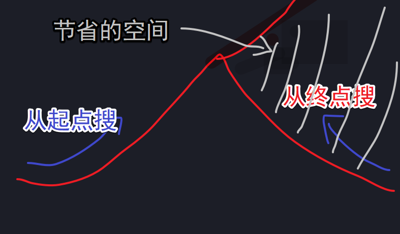
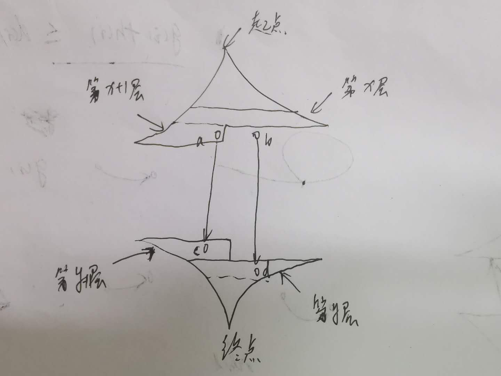

<!-- @import "[TOC]" {cmd="toc" depthFrom=1 depthTo=6 orderedList=false} -->

<!-- code_chunk_output -->

- [双向广搜](#双向广搜)
  - [字串变换](#字串变换)

<!-- /code_chunk_output -->

### 双向广搜

朴素的宽搜可能导致 TLE 或者 MLE ，因为朴素 bfs 每一层元素数量呈指数增加。



双向广搜：从起点和终点同时搜索，二者会在中间相遇。

**双向广搜适合总的搜索空间极大的问题，比如最小步数模型。**

**双向广搜小优化：每次选择当前队列当中元素数量较少的一方扩展。**

#### 字串变换

已知有两个字串 $A$, $B$ 及一组字串变换的规则（至多 $6$ 个规则）:
- $A_1 \to B_1$
- $A_2 \to B_2$
- ...

规则的含义为：在 $A$ 中的子串 $A_1$ 可以变换为 $B_1$、$A_2$ 可以变换为 $B_2…$。

例如：$A$＝<code>abcd</code> $B$＝<code>xyz</code>

<p>变换规则为：</p>

- <code>abc</code> $\to$ <code>xu</code>
- <code>ud</code> $\to$ <code>y</code>
- <code>y</code> $\to$ <code>yz</code>

则此时，$A$ 可以经过一系列的变换变为 $B$，其变换的过程为：

<code>abcd</code> $\to$ <code>xud</code> $\to$ <code>xy</code> $\to$ <code>xyz</code>

共进行了三次变换，使得 $A$ 变换为 $B$。

<h4>输入格式</h4>

<p>输入格式如下：</p>

- $A$   $B$
- $A_1$ $B_1$
- $A_2$ $B_2$
- ...

第一行是两个给定的字符串 $A$ 和 $B$。

接下来若干行，每行描述一组字串变换的规则。

所有字符串长度的上限为 $20$。 

<h4>输出格式</h4>

若在 $10$ 步（包含 $10$ 步）以内能将 $A$ 变换为 $B$ ，则输出最少的变换步数；否则输出 <code>NO ANSWER!</code>。

<h4>输入样例：</h4>

<pre><code>
abcd xyz
abc xu
ud y
y yz
</code></pre>

<h4>输出样例：</h4>

<pre><code>
3
</code></pre>

y总：在本题的视频讲解中，我想当然地每次每一边只扩展一个点了，但这样是不正确的。正确做法应该是每次每边扩展完整一层。

反例如下图所示：



如上图，如果每次不是扩展完整一层，而是只扩展一个点。此时上面该扩展点 $a$ 了，点 $a$ 搜到了下半部分的点 $c$，此时算出的最短路长度是 $x+1+y+1+1=x+y+3$ 。但是最优解可能是后面还没扩展到的点 $b$ 和点 $d$ 之间的路径，这条路径的长度是 $x+1+y+1=x+y+2$ 。

```cpp
#include <cstring>
#include <iostream>
#include <algorithm>
#include <unordered_map>
#include <queue>

using namespace std;

const int N = 6;

int n;
string a[N], b[N];  // 转换规则

int extend(queue<string>& q, unordered_map<string, int>& da, unordered_map<string, int>& db, string a[], string b[])
{
    // 每次扩展完整一层
    for (int k = 0, sk = q.size(); k < sk; k ++ )
    {
        string t = q.front();
        q.pop();

        // 对每个字符进行变换
        for (int i = 0; i < t.size(); i ++ )
            // 查看每个规则
            for (int j = 0; j < n; j ++ )
                if (t.substr(i, a[j].size()) == a[j])
                {
                    string state = t.substr(0, i) + b[j] + t.substr(i + a[j].size());
                    if (da.count(state)) continue;  // 咱已经走过这个字符串了，就不看了
                    if (db.count(state)) return da[t] + 1 + db[state];  // 与另一端交汇了
                    da[state] = da[t] + 1;
                    q.push(state);
                }
    }

    return 11;
}

int bfs(string A, string B)
{
    queue<string> qa, qb;
    unordered_map<string, int> da, db;
    qa.push(A), da[A] = 0;
    qb.push(B), db[B] = 0;

    while (qa.size() && qb.size())
    {
        int t;
        // 一个小优化，有限扩展队列小的
        if (qa.size() <= qb.size()) t = extend(qa, da, db, a, b);
        else t= extend(qb, db, da, b, a);

        if (t <= 10) return t;
    }

    return 11;
}

int main()
{
    string A, B;
    cin >> A >> B;
    while (cin >> a[n] >> b[n]) n ++ ;

    int step = bfs(A, B);
    if (step > 10) puts("NO ANSWER!");
    else printf("%d\n", step);

    return 0;
}
```


**经验：**
- `while (cin >> a[n] >> b[n]) n ++ ;` 记一下这种录入
- `for (int k = 0, sk = q.size(); k < sk; k ++ )` 在 for 里初始化作用域变量 `sk`
- 字符串切片：`t.substr(i, a[j].size()) == a[j]`