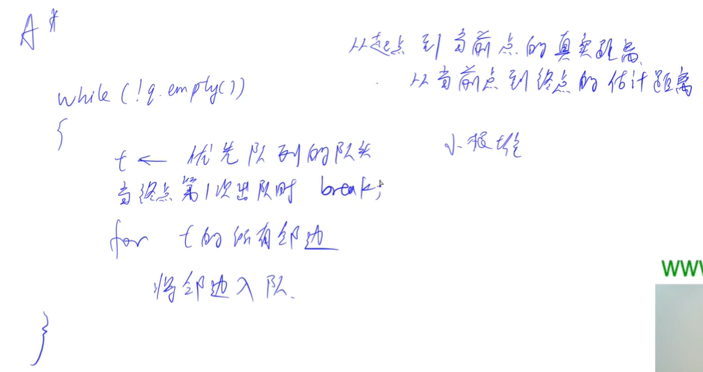
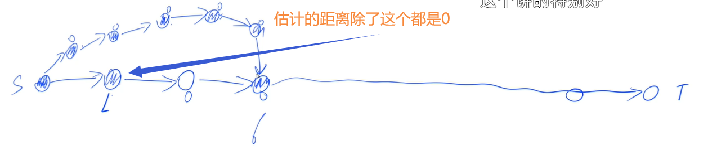

<!-- @import "[TOC]" {cmd="toc" depthFrom=1 depthTo=6 orderedList=false} -->

<!-- code_chunk_output -->

- [双向广搜](#双向广搜)
  - [字串变换](#字串变换)
- [A*](#a)
  - [A-star / A星算法讲解](#a-star-a星算法讲解)
  - [八数码](#八数码)
  - [第K短路](#第k短路)

<!-- /code_chunk_output -->

### 双向广搜

朴素的宽搜可能导致 TLE 或者 MLE ，因为朴素 bfs 每一层元素数量呈指数增加。


双向广搜：从起点和终点同时搜索，二者会在中间相遇。

**双向广搜适合总的搜索空间极大的问题，比如最小步数模型。**

**双向广搜小优化：每次选择当前队列当中元素数量较少的一方扩展。**

#### 字串变换

已知有两个字串 $A$, $B$ 及一组字串变换的规则（至多 $6$ 个规则）:
- $A_1 \to B_1$
- $A_2 \to B_2$
- ...

规则的含义为：在 $A$ 中的子串 $A_1$ 可以变换为 $B_1$、$A_2$ 可以变换为 $B_2…$。

例如：$A$＝<code>abcd</code> $B$＝<code>xyz</code>

<p>变换规则为：</p>

- <code>abc</code> $\to$ <code>xu</code>
- <code>ud</code> $\to$ <code>y</code>
- <code>y</code> $\to$ <code>yz</code>

则此时，$A$ 可以经过一系列的变换变为 $B$，其变换的过程为：

<code>abcd</code> $\to$ <code>xud</code> $\to$ <code>xy</code> $\to$ <code>xyz</code>

共进行了三次变换，使得 $A$ 变换为 $B$。

<h4>输入格式</h4>

<p>输入格式如下：</p>

- $A$   $B$
- $A_1$ $B_1$
- $A_2$ $B_2$
- ...

第一行是两个给定的字符串 $A$ 和 $B$。

接下来若干行，每行描述一组字串变换的规则。

所有字符串长度的上限为 $20$。 

<h4>输出格式</h4>

若在 $10$ 步（包含 $10$ 步）以内能将 $A$ 变换为 $B$ ，则输出最少的变换步数；否则输出 <code>NO ANSWER!</code>。

<h4>输入样例：</h4>

<pre><code>
abcd xyz
abc xu
ud y
y yz
</code></pre>

<h4>输出样例：</h4>

<pre><code>
3
</code></pre>

y总：在本题的视频讲解中，我想当然地每次每一边只扩展一个点了，但这样是不正确的。正确做法应该是每次每边扩展完整一层。

反例如下图所示：


如上图，如果每次不是扩展完整一层，而是只扩展一个点。此时上面该扩展点 $a$ 了，点 $a$ 搜到了下半部分的点 $c$，此时算出的最短路长度是 $x+1+y+1+1=x+y+3$ 。但是最优解可能是后面还没扩展到的点 $b$ 和点 $d$ 之间的路径，这条路径的长度是 $x+1+y+1=x+y+2$ 。

```cpp
#include <cstring>
#include <iostream>
#include <algorithm>
#include <unordered_map>
#include <queue>

using namespace std;

const int N = 6;

int n;
string a[N], b[N];  // 转换规则

int extend(queue<string>& q, unordered_map<string, int>& da, unordered_map<string, int>& db, string a[], string b[])
{
    // 每次扩展完整一层
    for (int k = 0, sk = q.size(); k < sk; k ++ )
    {
        string t = q.front();
        q.pop();

        // 对每个字符进行变换
        for (int i = 0; i < t.size(); i ++ )
            // 查看每个规则
            for (int j = 0; j < n; j ++ )
                if (t.substr(i, a[j].size()) == a[j])
                {
                    string state = t.substr(0, i) + b[j] + t.substr(i + a[j].size());
                    if (da.count(state)) continue;  // 咱已经走过这个字符串了，就不看了
                    if (db.count(state)) return da[t] + 1 + db[state];  // 与另一端交汇了
                    da[state] = da[t] + 1;
                    q.push(state);
                }
    }

    return 11;
}

int bfs(string A, string B)
{
    queue<string> qa, qb;
    unordered_map<string, int> da, db;
    qa.push(A), da[A] = 0;
    qb.push(B), db[B] = 0;

    while (qa.size() && qb.size())
    {
        int t;
        // 一个小优化，有限扩展队列小的
        if (qa.size() <= qb.size()) t = extend(qa, da, db, a, b);
        else t= extend(qb, db, da, b, a);

        if (t <= 10) return t;
    }

    return 11;
}

int main()
{
    string A, B;
    cin >> A >> B;
    while (cin >> a[n] >> b[n]) n ++ ;

    int step = bfs(A, B);
    if (step > 10) puts("NO ANSWER!");
    else printf("%d\n", step);

    return 0;
}
```


**经验：**
- `while (cin >> a[n] >> b[n]) n ++ ;` 记一下这种录入
- `for (int k = 0, sk = q.size(); k < sk; k ++ )` 在 for 里初始化作用域变量 `sk`
- 字符串切片：`t.substr(i, a[j].size()) == a[j]`

### A*

#### A-star / A星算法讲解



如上图，就是魔改了的 bfs ，只不过：
- 不再是队列了，是小根堆
- 每次出队的依据（小根堆的排序依据），是 **起点到当前点的真是距离 + 从当前点到重点的估计距离**

dijkstra 是 A星 的魔改，只不过 **从当前点到重点的估计距离** 这个值总是 0 。

注意，A星算法合理有两个条件：
- 估计的距离（现在与终点的距离）必须小于等于真实的距离（现在与终点的距离）
    - 估计值越接近，算法求解越快
- 必须有解，才能用（没有解的话，其会把整个空间搜索一遍，其出队一次是最小堆出队，复杂度 $log(n)$ ，而 bfs 则是 $O(1)$ 的出队，因此还不如 bfs）

证明 A星 算法：
- 假设我们的终点 T 出队时，其距离不是最小值，即 $dist_T > dist_{optim}$
- 因为我们一定存在一条最短路径，假设 $u$ 是最短路径上的一个点（在优先队列中），一定有 `u与起点距离 + u与终点估计距离` 小于等于 `u与起点距离 + u与终点真实距离 = 最优距离`
- 这就导致 $dist_T > dist_{optim}$ 就是说 $dist_T > $ `u与起点距离 + u与终点估计距离`
- 这就产生矛盾了，因为我们让 T 出队时，必然是因为其处于最小堆的队头，而此时优先队列中还有值更加小，这矛盾了

注意：
- **第一次出队就取到最小距离这个性质，只对终点成立** 这也是 《算法竞赛进阶指南》 有错误的地方
- 反例如下



那么，如上图的例子， A-star 是如何找到最优解呢？不会找打错误的路径吗？

因为估计距离一定小于等真实距离，所以在错误路径走到终点前（在终点出队前），一定会有 L 点发现自己的 `距离原点距离+距离终点估计距离` 在终点前弹出优先队列。

因此，A星的点除了终点也未必扩展一次。

#### 八数码

在一个 $3×3$ 的网格中，$1 \sim 8$ 这 $8$ 个数字和一个 <code>X</code> 恰好不重不漏地分布在这 $3×3$ 的网格中。

<p>例如：</p>

<pre><code>
1 2 3
X 4 6
7 5 8
</code></pre>

<p>在游戏过程中，可以把 <code>X</code> 与其上、下、左、右四个方向之一的数字交换（如果存在）。</p>

<p>我们的目的是通过交换，使得网格变为如下排列（称为正确排列）：</p>

<pre><code>
1 2 3
4 5 6
7 8 X
</code></pre>

<p>例如，示例中图形就可以通过让 <code>X</code> 先后与右、下、右三个方向的数字交换成功得到正确排列。</p>

<p>交换过程如下：</p>

<pre><code>
1 2 3   1 2 3   1 2 3   1 2 3
X 4 6   4 X 6   4 5 6   4 5 6
7 5 8   7 5 8   7 X 8   7 8 X
</code></pre>

<p>把 <code>X</code> 与上下左右方向数字交换的行动记录为 <code>u</code>、<code>d</code>、<code>l</code>、<code>r</code>。</p>

<p>现在，给你一个初始网格，请你通过最少的移动次数，得到正确排列。</p>

<h4>输入格式</h4>

输入占一行，将 $3×3$ 的初始网格描绘出来。

<p>例如，如果初始网格如下所示：</p>

<pre><code>
1 2 3 
x 4 6 
7 5 8 
</code></pre>

<p>则输入为：<code>1 2 3 x 4 6 7 5 8</code></p>

<h4>输出格式</h4>

<p>输出占一行，包含一个字符串，表示得到正确排列的完整行动记录。</p>

<p>如果答案不唯一，输出任意一种合法方案即可。</p>

<p>如果不存在解决方案，则输出 <code>unsolvable</code>。</p>

<h4>输入样例：</h4>

<pre><code>
2  3  4  1  5  x  7  6  8 
</code></pre>

<h4>输出样例</h4>

<pre><code>
ullddrurdllurdruldr
</code></pre>

```cpp
#include <cstring>
#include <iostream>
#include <algorithm>
#include <queue>
#include <unordered_map>

using namespace std;

int f(string state)
{
    int res = 0;
    for (int i = 0; i < state.size(); i ++ )
        if (state[i] != 'x')
        {
            // 估计距离的函数：与应该在的地方的曼哈顿距离
            int t = state[i] - '1';
            res += abs(i / 3 - t / 3) + abs(i % 3 - t % 3);
        }
    return res;
}

string bfs(string start)
{
    int dx[4] = {-1, 0, 1, 0}, dy[4] = {0, 1, 0, -1};
    char op[4] = {'u', 'r', 'd', 'l'};

    string end = "12345678x";
    unordered_map<string, int> dist;
    unordered_map<string, pair<string, char>> prev;  // 当前状态：{上一个状态，做了什么操作}
    priority_queue<pair<int, string>, vector<pair<int, string>>, greater<pair<int, string>>> heap;

    heap.push({f(start), start});
    dist[start] = 0;

    while (heap.size())
    {
        auto t = heap.top();
        heap.pop();

        string state = t.second;

        if (state == end) break;

        int step = dist[state];
        int x, y;
        for (int i = 0; i < state.size(); i ++ )
            if (state[i] == 'x')
            {
                x = i / 3, y = i % 3;
                break;
            }
        string source = state;
        for (int i = 0; i < 4; i ++ )
        {
            int a = x + dx[i], b = y + dy[i];
            if (a >= 0 && a < 3 && b >= 0 && b < 3)
            {
                swap(state[x * 3 + y], state[a * 3 + b]);
                if (!dist.count(state) || dist[state] > step + 1)
                {
                    dist[state] = step + 1;
                    prev[state] = {source, op[i]};
                    heap.push({dist[state] + f(state), state});
                }
                swap(state[x * 3 + y], state[a * 3 + b]);
            }
        }
    }

    string res;
    while (end != start)
    {
        res += prev[end].second;
        end = prev[end].first;
    }
    reverse(res.begin(), res.end());
    return res;
}

int main()
{
    string g, c, seq;
    while (cin >> c)
    {
        g += c;
        if (c != "x") seq += c;
    }

    // 先求逆序对，判断是否有解(偶数对有解，奇数对无解)
    int t = 0;
    for (int i = 0; i < seq.size(); i ++ )
        for (int j = i + 1; j < seq.size(); j ++ )
            if (seq[i] > seq[j])
                t ++ ;

    if (t % 2) puts("unsolvable");
    else cout << bfs(g) << endl;

    return 0;
}
```

#### 第K短路

给定一张 $N$ 个点（编号 $1,2,..,N$），$M$ 条边的有向图，求从起点 $S$ 到终点 $T$ 的第 $K$ 短路的长度，路径允许重复经过点或边。

<p><strong>注意：</strong> 每条最短路中至少要包含一条边。</p>

<h4>输入格式</h4>

第一行包含两个整数 $N$ 和 $M$。

接下来 $M$ 行，每行包含三个整数 $A,B$ 和 $L$，表示点 $A$ 与点 $B$ 之间存在有向边，且边长为 $L$。

最后一行包含三个整数 $S,T$ 和 $K$，分别表示起点 $S$，终点 $T$ 和第 $K$ 短路。

<h4>输出格式</h4>

输出占一行，包含一个整数，表示第 $K$ 短路的长度，如果第 $K$ 短路不存在，则输出 $-1$。

<h4>数据范围</h4>

- $1 \le S,T \le N \le 1000$,
- $0 \le M \le 10^5$,
- $1 \le K \le 1000$,
- $1 \le L \le 100$

<h4>输入样例：</h4>

<pre><code>
2 2
1 2 5
2 1 4
1 2 2
</code></pre>

<h4>输出样例：</h4>

<pre><code>
14
</code></pre>

注：每条最短路中至少包含一条边，所以当 `S == T` 的时候，需要让 `K ++`。

```cpp
#include <cstring>
#include <iostream>
#include <algorithm>
#include <queue>

#define x first
#define y second

using namespace std;

typedef pair<int, int> PII;
typedef pair<int, PII> PIII;

const int N = 1010, M = 200010;

int n, m, S, T, K;
int h[N], rh[N], e[M], w[M], ne[M], idx;
int dist[N], cnt[N];
bool st[N]; // 用于狄克斯拉

void add(int h[], int a, int b, int c)
{
    e[idx] = b, w[idx] = c, ne[idx] = h[a], h[a] = idx ++ ;
}

// 求估计函数 dist ，利用反向边
void dijkstra()
{
    priority_queue<PII, vector<PII>, greater<PII>> heap;
    heap.push({0, T});

    memset(dist, 0x3f, sizeof dist);
    dist[T] = 0;

    while (heap.size())
    {
        auto t = heap.top();
        heap.pop();

        int ver = t.y;
        if (st[ver]) continue;
        st[ver] = true;

        for (int i = rh[ver]; ~i; i = ne[i])
        {
            int j = e[i];
            if (dist[j] > dist[ver] + w[i])
            {
                dist[j] = dist[ver] + w[i];
                heap.push({dist[j], j});
            }
        }
    }
}

int astar()
{
    // {真实距离+估计距离, {当前路径与原点距离, 点}}
    priority_queue<PIII, vector<PIII>, greater<PIII>> heap;
    heap.push({dist[S], {0, S}});

    while (heap.size())
    {
        auto t = heap.top();
        heap.pop();

        int ver = t.y.y, distance = t.y.x;
        cnt[ver] ++ ;
        if (cnt[T] == K) return distance;

        for (int i = h[ver]; ~i; i = ne[i])
        {
            int j = e[i];
            if (cnt[j] < K)
                heap.push({distance + w[i] + dist[j], {distance + w[i], j}});
        }
    }

    return -1;
}

int main()
{
    scanf("%d%d", &n, &m);
    memset(h, -1, sizeof h);
    memset(rh, -1, sizeof rh);

    for (int i = 0; i < m; i ++ )
    {
        int a, b, c;
        scanf("%d%d%d", &a, &b, &c);
        add(h, a, b, c);
        add(rh, b, a, c);
    }
    scanf("%d%d%d", &S, &T, &K);
    if (S == T) K ++ ;

    dijkstra();
    printf("%d\n", astar());

    return 0;
}
```

A* 第 k 次终点弹出一定是第 k 小值。
