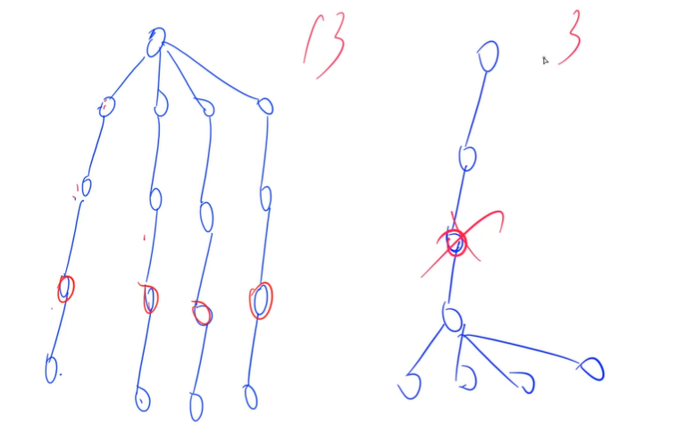
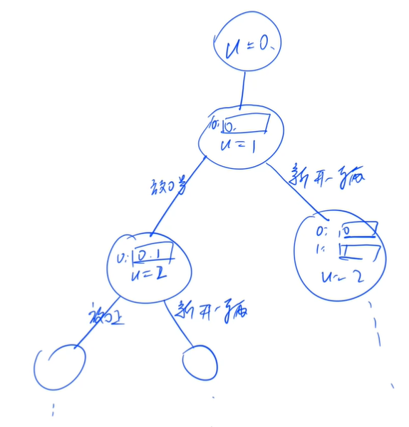
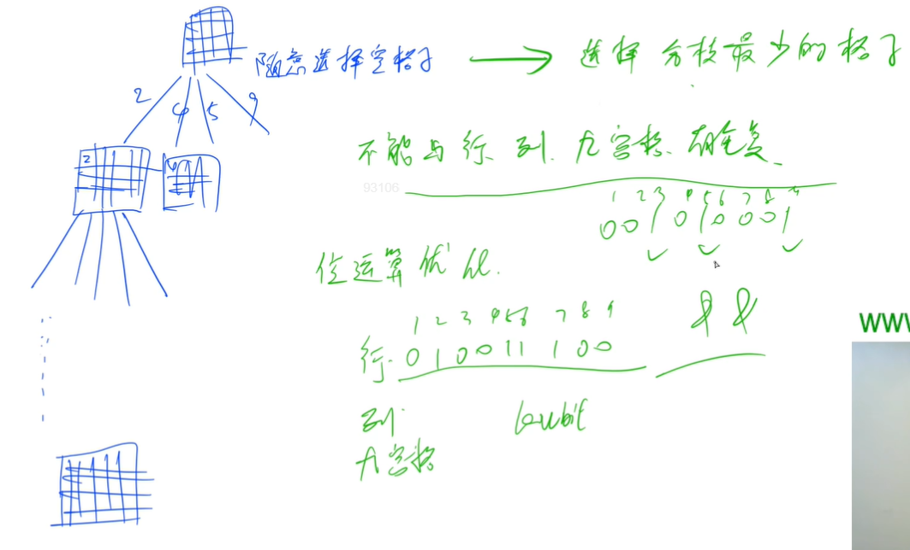

<!-- @import "[TOC]" {cmd="toc" depthFrom=1 depthTo=6 orderedList=false} -->

<!-- code_chunk_output -->

- [DFS之剪枝与优化](#dfs之剪枝与优化)
  - [小猫爬山](#小猫爬山)
  - [数独](#数独)
  - [木棒](#木棒)
  - [生日蛋糕](#生日蛋糕)

<!-- /code_chunk_output -->

### DFS之剪枝与优化

提前预知，哪个分支接下来的结点都不会是我们想要的。于是剪掉。

有如下4个优化参考：
- 优化搜索顺序（大部分情况下，我们应该搜索分支较少的节点）
- 排除等效冗余（不要搜索重复状态）
- 可行性剪枝（不可行就没必要接着探索了）
- 最优性剪枝（上限不如当前找到的最优）



如上图，在枚举问题中，应该有限搜索分支较少的节点。

#### 小猫爬山

翰翰和达达饲养了 $N$ 只小猫，这天，小猫们要去爬山。

<p>经历了千辛万苦，小猫们终于爬上了山顶，但是疲倦的它们再也不想徒步走下山了（呜咕&gt;_&lt;）。</p>

翰翰和达达只好花钱让它们坐索道下山。

索道上的缆车最大承重量为 $W$，而 $N$ 只小猫的重量分别是 $C_1、C_2……C_N$。

当然，每辆缆车上的小猫的重量之和不能超过 $W$。

每租用一辆缆车，翰翰和达达就要付 $1$ 美元，所以他们想知道，最少需要付多少美元才能把这 $N$ 只小猫都运送下山？

<h4>输入格式</h4>

第 $1$ 行：包含两个用空格隔开的整数，$N$ 和 $W$。

第 $2..N+1$ 行：每行一个整数，其中第 $i+1$ 行的整数表示第 $i$ 只小猫的重量 $C_i$。

<h4>输出格式</h4>

<p>输出一个整数，表示最少需要多少美元，也就是最少需要多少辆缆车。</p>

<h4>数据范围</h4>

- $1 \le N \le 18$,
- $1 \le C_i \le W \le 10^8$

<h4>输入样例：</h4>

<pre><code>
5 1996
1
2
1994
12
29
</code></pre>

<h4>输出样例：</h4>

<pre><code>
2
</code></pre>



```cpp
// 类似 leetcode 周赛256T3 状压DP
// 这里用 dfs ，优化的点在于：
//     一、优化搜索顺序，先放重的，这样分支少
//     二、可行性剪枝
//     三、最优性剪枝

#include <iostream>
#include <cstring>
#include <algorithm>

using namespace std;

const int N = 18;

int n, m;
int w[N], sum[N];
int ans = N + 1;

void dfs(int u, int k)  // 分配第 u 只小猫，现有 k 量车，将其 dfs 将其放在那辆车上，或者新开一辆
{
    if (k >= ans) return ;  // 最优性剪枝
    if (u == n)
    {
        ans = k;
        return ;
    }

    for (int i = 0; i < k; ++ i)
    {
        if (sum[i] + w[u] <= m)  // 可行性剪枝
        {
            sum[i] += w[u];
            dfs(u + 1, k);
            sum[i] -= w[u];  // 恢复现场
        }
    }
    
    // 或者新开一辆
    sum[k] = w[u];
    dfs(u + 1, k + 1);
    sum[k] = 0;  // 恢复现场
}

int main()
{
    cin >> n >> m;
    for (int i = 0; i < n; ++ i) cin >> w[i];

    // 优化搜索顺序
    sort(w, w + n);
    reverse(w, w + n);
    
    dfs(0, 0);  // 现有 0 辆车，第 0 只小猫开始分配
    
    cout << ans << endl;
}
```

#### 数独

数独是一种传统益智游戏，你需要把一个 $9 \times 9$ 的数独补充完整，使得图中每行、每列、每个 $3 \times 3$ 的九宫格内数字 $1 \sim 9$ 均恰好出现一次。

<p>请编写一个程序填写数独。</p>

<h4>输入格式</h4>

<p>输入包含多组测试用例。</p>

每个测试用例占一行，包含 $81$ 个字符，代表数独的 $81$ 个格内数据（顺序总体由上到下，同行由左到右）。

每个字符都是一个数字（$1-9$）或一个 <code>.</code>（表示尚未填充）。

<p>您可以假设输入中的每个谜题都只有一个解决方案。 </p>

<p>文件结尾处为包含单词 <code>end</code> 的单行，表示输入结束。</p>

<h4>输出格式</h4>

<p>每个测试用例，输出一行数据，代表填充完全后的数独。</p>

<h4>输入样例：</h4>

<pre><code>
4.....8.5.3..........7......2.....6.....8.4......1.......6.3.7.5..2.....1.4......
......52..8.4......3...9...5.1...6..2..7........3.....6...1..........7.4.......3.
end
</code></pre>

<h4>输出样例：</h4>

<pre><code>
417369825632158947958724316825437169791586432346912758289643571573291684164875293
416837529982465371735129468571298643293746185864351297647913852359682714128574936
</code></pre>



用到了优化搜索顺序与可行性剪枝，此外还用到了位运算：
- 用 `&` 进行交集
- 枚举可选方案用 `lowbit` 而非枚举 9 次

```cpp
#include <cstring>
#include <iostream>
#include <algorithm>

using namespace std;

const int N = 9, M = 1 << N;

int ones[M], map[M];  // 用来优化打表
int row[N], col[N], cell[3][3];
char str[100];

void init()
{
    for (int i = 0; i < N; i ++ )
        row[i] = col[i] = (1 << N) - 1;  // 每行每列都没填，都是 1

    for (int i = 0; i < 3; i ++ )
        for (int j = 0; j < 3; j ++ )
            cell[i][j] = (1 << N) - 1;  // 每个 cell 都没填，都是 1
}

void draw(int x, int y, int t, bool is_set)  // is_set 填，否则是扣掉
{
    if (is_set) str[x * N + y] = '1' + t;  // t 取值 0 到 8
    else str[x * N + y] = '.';

    int v = 1 << t;  // 把相应的二级制状态处理了
    if (!is_set) v = -v;

    row[x] -= v;
    col[y] -= v;
    cell[x / 3][y / 3] -= v;
}

int lowbit(int x)
{
    return x & -x;
}

int get(int x, int y)
{
    return row[x] & col[y] & cell[x / 3][y / 3];  // x y 点能填哪些数
}

bool dfs(int cnt)
{
    if (!cnt) return true;  // 没空格了，返回

    int minv = 10;  // 找一个分支数量最小的空格
    int x, y;
    for (int i = 0; i < N; i ++ )
        for (int j = 0; j < N; j ++ )
            if (str[i * N + j] == '.')  // 是空格
            {
                int state = get(i, j);
                if (ones[state] < minv)  // 当前这个点有多少个备选数（多少个分支）
                {
                    minv = ones[state];
                    x = i, y = j;
                }
            }

    int state = get(x, y);
    for (int i = state; i; i -= lowbit(i))
    {
        int t = map[lowbit(i)];  // lowbit 返回的是 2^k ，这里取 k
        draw(x, y, t, true);
        if (dfs(cnt - 1)) return true;
        draw(x, y, t, false);
    }

    return false;
}

int main()
{
    for (int i = 0; i < N; i ++ ) map[1 << i] = i;  // map[i] 是 log_2{i}
    for (int i = 0; i < 1 << N; i ++ )
        for (int j = 0; j < N; j ++ )
            ones[i] += i >> j & 1;  // 每个数的二进制表示里有多少个 1

    while (cin >> str, str[0] != 'e')
    {
        init();

        int cnt = 0;
        for (int i = 0, k = 0; i < N; i ++ )
            for (int j = 0; j < N; j ++, k ++ )
                if (str[k] != '.')
                {
                    int t = str[k] - '1';
                    draw(i, j, t, true);
                }
                else cnt ++ ;  // 有多少个数需要填（还剩多少个空格）

        dfs(cnt);

        puts(str);
    }

    return 0;
}
```

#### 木棒

乔治拿来一组等长的木棒，将它们随机地砍断，使得每一节木棍的长度都不超过 $50$ 个长度单位。

<p>然后他又想把这些木棍恢复到为裁截前的状态，但忘记了初始时有多少木棒以及木棒的初始长度。</p>

<p>请你设计一个程序，帮助乔治计算木棒的可能最小长度。</p>

<p>每一节木棍的长度都用大于零的整数表示。</p>

<h4>输入格式</h4>

<p>输入包含多组数据，每组数据包括两行。</p>

第一行是一个不超过 $64$ 的整数，表示砍断之后共有多少节木棍。

<p>第二行是截断以后，所得到的各节木棍的长度。</p>

<p>在最后一组数据之后，是一个零。</p>

<h4>输出格式</h4>

<p>为每组数据，分别输出原始木棒的可能最小长度，每组数据占一行。</p>

<h4>数据范围</h4>

数据保证每一节木棍的长度均不大于 $50$。

<h4>输入样例：</h4>

<pre><code>
9
5 2 1 5 2 1 5 2 1
4
1 2 3 4
0
</code></pre>

<h4>输出样例：</h4>

<pre><code>
6
5
</code></pre>

```cpp

```

#### 生日蛋糕

$7$ 月 $17$ 日是 Mr.W 的生日，ACM-THU 为此要制作一个体积为 $Nπ$ 的 $M$ 层生日蛋糕，每层都是一个圆柱体。

设从下往上数第 $i$ 层蛋糕是半径为 $R_i$，高度为 $H_i$ 的圆柱。

当 $i < M$ 时，要求 $R_i > R_{i+1}$ 且 $H_i > H_{i+1}$。

由于要在蛋糕上抹奶油，为尽可能节约经费，我们希望蛋糕外表面（最下一层的下底面除外）的面积 $Q$ 最小。 

令 $Q = Sπ$ ，请编程对给出的 $N$ 和 $M$，找出蛋糕的制作方案（适当的 $R_i$ 和 $H_i$ 的值），使 $S$ 最小。

除 $Q$ 外，以上所有数据皆为正整数。

<h4>输入格式</h4>

输入包含两行，第一行为整数 $N$，表示待制作的蛋糕的体积为 $Nπ$。

第二行为整数 $M$，表示蛋糕的层数为 $M$。

<h4>输出格式</h4>

输出仅一行，是一个正整数 $S$（若无解则 $S = 0$）。

<h4>数据范围</h4>

- $1 \le N \le 10000$,
- $1 \le M \le 20$

<h4>输入样例：</h4>

<pre><code>
100
2
</code></pre>

<h4>输出样例：</h4>

<pre><code>
68
</code></pre>

```cpp

```
