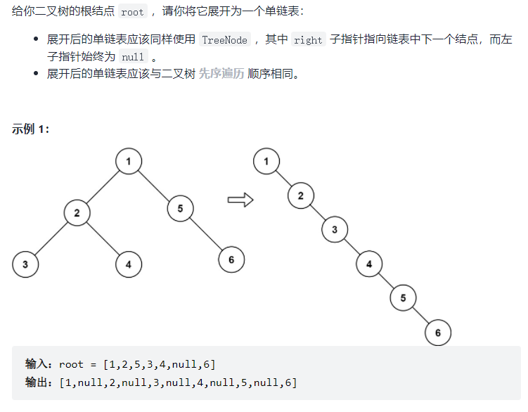

https://leetcode-cn.com/problemset/all/?topicSlugs=linked-list&page=1


<!-- @import "[TOC]" {cmd="toc" depthFrom=1 depthTo=6 orderedList=false} -->

<!-- code_chunk_output -->

- [114. 二叉树展开为链表（前序遍历树转链表）](#114-二叉树展开为链表前序遍历树转链表)
- [简单题不详记](#简单题不详记)

<!-- /code_chunk_output -->

### 114. 二叉树展开为链表（前序遍历树转链表）



就是一道普通的递归，但本题难点在于，左子树的最后一个节点指向右子树的第一个节点，因此让 dfs 返回本树的最后一个节点。

还应该注意一点，本题中 `treeNode->left` 最终没用了，需要赋值 `nullptr` ，否则报错 `AddressSanitizer: heap-use-after-free on address` 。

```cpp
/**
 * Definition for a binary tree node.
 * struct TreeNode {
 *     int val;
 *     TreeNode *left;
 *     TreeNode *right;
 *     TreeNode() : val(0), left(nullptr), right(nullptr) {}
 *     TreeNode(int x) : val(x), left(nullptr), right(nullptr) {}
 *     TreeNode(int x, TreeNode *left, TreeNode *right) : val(x), left(left), right(right) {}
 * };
 */

 // 进阶：你可以使用原地算法（O(1) 额外空间）展开这棵树吗？
class Solution {
public:
    void flatten(TreeNode* root) {
        // 难点在于，左子树的最后一个节点指向右子树的第一个节点
        // 让 dfs 返回本树的最后一个节点
        function<TreeNode*(TreeNode*)> dfs = [&](TreeNode* u) -> TreeNode*
        {
            TreeNode *left = u, *right = u, *leftRes = u, *rightRes = u;
            if (u->left)  // 左子树存在
            {
                left = u->left;
                leftRes = dfs(u->left);
                rightRes = leftRes;  // rightRes 是树 u 的最后一个节点
            }
            if (u->right)  // 右子树存在
            {
                right = u->right;
                rightRes = dfs(u->right);
            }

            if (u != left) u->right = left;  // 左子树存在
            if (u != right) leftRes->right = right;

            u->left = nullptr;  // 一定要有这句
            // 否则 AddressSanitizer: heap-use-after-free on address

            return rightRes;
        };

        if (root) dfs(root);  // 可能是空树
    }
};
```

**经验：**
- C++ 中如果类似 `treeNode->left` 的指针最终没用了，需要赋值 `nullptr` ，否则报错 `AddressSanitizer: heap-use-after-free on address`


执行用时：
- `0 ms`, 在所有 C++ 提交中击败了 $100.00\%$的用户

内存消耗：
- `12.2 MB`, 在所有 C++ 提交中击败了 $98.35\%$ 的用户

### 简单题不详记
- 138. 复制带随机指针的链表 https://leetcode-cn.com/problems/copy-list-with-random-pointer/ 和 [48. 复杂链表的复刻（不用哈希表可以节省空间）](../../acwings/offers/drafts/20211115.md#48-复杂链表的复刻不用哈希表可以节省空间) 一样的
