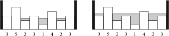
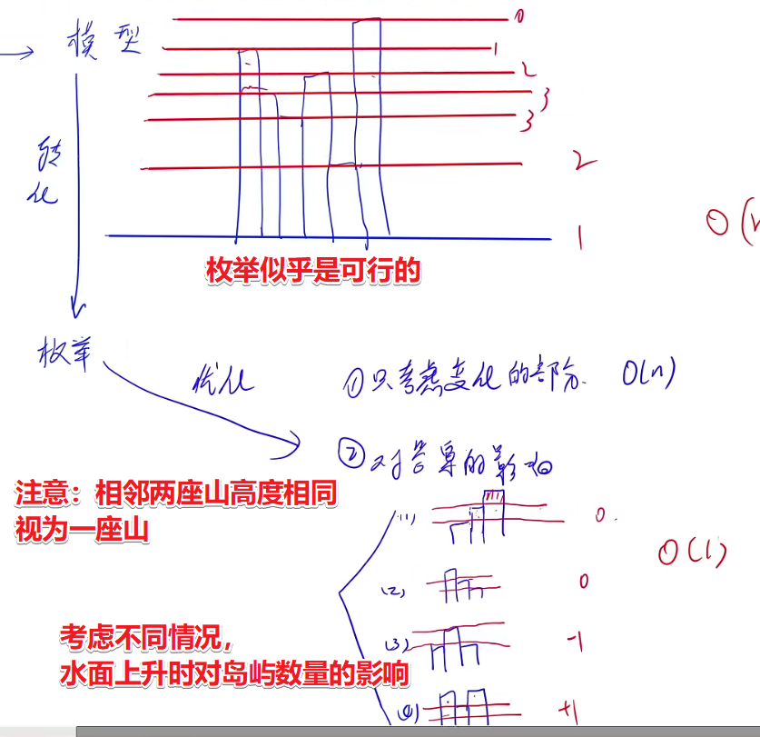

<!-- @import "[TOC]" {cmd="toc" depthFrom=1 depthTo=6 orderedList=false} -->

<!-- code_chunk_output -->

- [2058. 笨拙的手指（秦九韶）](#2058-笨拙的手指秦九韶)
- [2041. 干草堆（差分与`nth_element`）](#2041-干草堆差分与nth_element)
- [2060. 奶牛选美（两个连通块）](#2060-奶牛选美两个连通块)
- [2019. 拖拉机（双端队列广搜）](#2019-拖拉机双端队列广搜)
- [2014. 岛（优化分析/unique）](#2014-岛优化分析unique)
- [2005. 马蹄铁（状态机DFS）](#2005-马蹄铁状态机dfs)
- [1996. 打乱字母（分析+二分）](#1996-打乱字母分析二分)

<!-- /code_chunk_output -->

### 2058. 笨拙的手指（秦九韶）

奶牛贝茜正在学习如何在不同进制之间转换数字。

但是她总是犯错误，因为她无法轻易的用两个前蹄握住笔。

每当贝茜将数字转换为一个新的进制并写下结果时，她总是将其中的某一位数字写错。

例如，如果她将数字 $14$ 转换为二进制数，那么正确的结果应为 $1110$，但她可能会写下 $0110$ 或 $1111$。

贝茜不会额外添加或删除数字，但是可能会由于写错数字的原因，写下包含前导 $0$ 的数字。

给定贝茜将数字 $N$ 转换为二进制数字以及三进制数字的结果，请确定 $N$ 的正确初始值（十进制表示）。

<h4>输入格式</h4>

第一行包含 $N$ 的二进制表示，其中一位是错误的。

第二行包含 $N$ 的三进制表示，其中一位是错误的。

<h4>输出格式</h4>

输出正确的 $N$ 的值。

<h4>数据范围</h4>

$0 \le N \le 10^9$，且存在唯一解。

<h4>输入样例：</h4>

```
1010
212
```

<h4>输出样例：</h4>

```
14
```

<h4>样例解释</h4>

$14$ 在二进制下的正确表示为 $1110$，在三进制下的正确表示为 $112$。

```cpp
#include <iostream>
#include <cstring>
#include <algorithm>
#include <unordered_set>

using namespace std;

// 经验：进制转换可以用秦九韶算法
int get(string s, int b)  // 将b进制的数转化成十进制
{
    int res = 0;
    // 秦九韶算法
    for (auto c: s)
        res = res * b + c - '0';
    return res;
}

int main()
{
    string a, b;
    cin >> a >> b;

    unordered_set<int> S;

    // 先把所有二进制对应的可能枚举出来，放到集合 S
    for (auto&& c: a)  // 这里用引用，以改变 c
    {
        c ^= 1;
        S.insert(get(a, 2));
        c ^= 1;  // 恢复现场
    }

    // 再把三进制对应的可能枚举，如果和 S 有交集，输出
    for (auto&& c: b)
    {
        char t = c;
        for (int i = 0; i < 3; i ++ )
            if (i + '0' != t)
            {
                c = i + '0';
                int x = get(b, 3);
                if (S.count(x))
                {  // 取集合的交集
                    cout << x << endl;
                    return 0;
                }
            }
        c = t;  // 恢复 c
    }

    return 0;
}
```

**经验：**
- 进制转换可以用秦九韶算法

### 2041. 干草堆（差分与`nth_element`）

贝茜对她最近在农场周围造成的一切恶作剧感到抱歉，她同意帮助农夫约翰把一批新到的干草捆堆起来。

开始时，共有 $N$ 个空干草堆，编号 $1 \sim N$。

约翰给贝茜下达了 $K$ 个指令，每条指令的格式为 `A B`，这意味着贝茜要在 $A..B$ 范围内的每个干草堆的顶部添加一个新的干草捆。

例如，如果贝茜收到指令 `10 13`，则她应在干草堆 $10,11,12,13$ 中各添加一个干草捆。

在贝茜完成了所有指令后，约翰想知道 $N$ 个干草堆的中值高度——也就是说，如果干草堆按照高度从小到大排列，位于中间的干草堆的高度。

方便起见，$N$ 一定是奇数，所以中间堆是唯一的。

请帮助贝茜确定约翰问题的答案。

<h4>输入格式</h4>

第一行包含 $N$ 和 $K$。

接下来 $K$ 行，每行包含两个整数 $A,B$，用来描述一个指令。

<h4>输出格式</h4>

输出完成所有指令后，$N$ 个干草堆的中值高度。

<h4>数据范围</h4>

- $1 \le N \le 10^6$,
- $1 \le K \le 25000$,
- $1 \le A \le B \le N$

<h4>输入样例：</h4>

```
7 4
5 5
2 4
4 6
3 5
```

<h4>输出样例：</h4>

```
1
```

<h4>样例解释</h4>

贝茜完成所有指令后，各堆高度为 $0,1,2,3,3,1,0$。

将各高度从小到大排序后，得到 $0,0,1,1,2,3,3$，位于中间的是 $1$。

```cpp
#include <iostream>
#include <cstring>
#include <algorithm>

using namespace std;

const int N = 1000010;

int n, m;
int b[N];

int main()
{
    scanf("%d%d", &n, &m);

    while (m -- )
    {
        int l, r;
        scanf("%d%d", &l, &r);
        b[l] ++, b[r + 1] -- ;
    }

    for (int i = 1; i <= n; i ++ ) b[i] += b[i - 1];

    // nth_element 期望是 O(n)
    nth_element(b + 1, b + n / 2 + 1, b + n + 1);

    printf("%d\n", b[n / 2 + 1]);

    return 0;
}
```
**经验：**
- `void nth_element (RandomAccessIterator first, RandomAccessIterator nth, RandomAccessIterator last, Compare comp);` 中， `first` 和 `last` 都是随机访问迭代器， `[first, last)` 用于指定该函数的作用范围（即要处理哪些数据）； `nth` 也是随机访问迭代器，其功能是令函数查找“第 `nth` 大”的元素，并将其移动到 `nth` 指向的位置； `comp` 用于自定义排序规则。

### 2060. 奶牛选美（两个连通块）

听说最近两斑点的奶牛最受欢迎，约翰立即购进了一批两斑点牛。

不幸的是，时尚潮流往往变化很快，当前最受欢迎的牛变成了一斑点牛。

约翰希望通过给每头奶牛涂色，使得它们身上的两个斑点能够合为一个斑点，让它们能够更加时尚。

牛皮可用一个 $N \times M$ 的字符矩阵来表示，如下所示：

```
................
..XXXX....XXX...
...XXXX....XX...
.XXXX......XXX..
........XXXXX...
.........XXX....
```

其中，$X$ 表示斑点部分。

如果两个 $X$ 在垂直或水平方向上相邻（对角相邻不算在内），则它们属于同一个斑点，由此看出上图中恰好有两个斑点。

约翰牛群里<strong>所有的牛都有两个斑点</strong>。

约翰希望通过使用油漆给奶牛尽可能少的区域内涂色，将两个斑点合为一个。

在上面的例子中，他只需要给三个 $.$ 区域内涂色即可（新涂色区域用 $*$ 表示）：

```
................
..XXXX....XXX...
...XXXX*...XX...
.XXXX..**..XXX..
........XXXXX...
.........XXX....
```

请帮助约翰确定，为了使两个斑点合为一个，他需要涂色区域的最少数量。

<h4>输入格式</h4>

第一行包含两个整数 $N$ 和 $M$。

接下来 $N$ 行，每行包含一个长度为 $M$ 的由 $X$ 和 $.$ 构成的字符串，用来表示描述牛皮图案的字符矩阵。

<h4>输出格式</h4>

输出需要涂色区域的最少数量。

<h4>数据范围</h4>

$1 \le N,M \le 50$

<h4>输入样例：</h4>

```
6 16
................
..XXXX....XXX...
...XXXX....XX...
.XXXX......XXX..
........XXXXX...
.........XXX....
```

<h4>输出样例：</h4>

```
3
```

```cpp
#include <iostream>
#include <cstring>
#include <algorithm>
#include <vector>

#define x first
#define y second

using namespace std;

typedef pair<int, int> PII;

const int N = 55;

int n, m;
char g[N][N];
vector<PII> points[2];

int dx[4] = {-1, 0, 1, 0}, dy[4] = {0, 1, 0, -1};

void dfs(int x, int y, vector<PII>& ps)
{
    g[x][y] = '.';
    ps.push_back({x, y});

    for (int i = 0; i < 4; i ++ )
    {
        int a = x + dx[i], b = y + dy[i];
        if (a >= 0 && a < n && b >= 0 && b < m && g[a][b] == 'X')
            dfs(a, b, ps);
    }
}

int main()
{
    cin >> n >> m;
    for (int i = 0; i < n; i ++ ) cin >> g[i];

    // 用 flood fill
    for (int i = 0, k = 0; i < n; i ++ )
        for (int j = 0; j < m; j ++ )
            if (g[i][j] == 'X')
                dfs(i, j, points[k ++ ]);  // 一定存在两个连通块，因此可以用 k++ 区别

    int res = 1e8;
    for (auto& a: points[0])
        for (auto& b: points[1])  // 枚举两个连通块中的点，用曼哈顿距离
            res = min(res, abs(a.x - b.x) + abs(a.y - b.y) - 1);

    cout << res << endl;
    return 0;
}
```

### 2019. 拖拉机（双端队列广搜）

干了一整天的活，农夫约翰完全忘记了他把拖拉机落在田地中央了。

他的奶牛非常调皮，决定对约翰来场恶作剧。

她们在田地的不同地方放了 $N$ 捆干草，这样一来，约翰想要开走拖拉机就必须先移除一些干草捆。

拖拉机的位置以及 $N$ 捆干草的位置都是二维平面上的整数坐标点。

拖拉机的初始位置上没有干草捆。

当约翰驾驶拖拉机时，他只能沿平行于坐标轴的方向（北，南，东和西）移动拖拉机，并且拖拉机必须每次移动整数距离。

例如，驾驶拖拉机先向北移动 $2$ 单位长度，然后向东移动 $3$ 单位长度。

拖拉机无法移动到干草捆占据的位置。

请帮助约翰确定他需要移除的干草捆的最小数量，以便他能够将拖拉机开到二维平面的原点。

<h4>输入格式</h4>

第一行包含三个整数：$N$ 以及拖拉机的初始位置 $(x,y)$。

接下来 $N$ 行，每行包含一个干草捆的位置坐标 $(x,y)$。

<h4>输出格式</h4>

输出约翰需要移除的干草捆的最小数量。

<h4>数据范围</h4>

- $1 \le N \le 50000$,
- $1 \le x,y \le 1000$

<h4>输入样例：</h4>

```
7 6 3
6 2
5 2
4 3
2 1
7 3
5 4
6 4
```

<h4>输出样例：</h4>

```
1
```

```cpp
#include <iostream>
#include <cstring>
#include <algorithm>
#include <deque>

#define x first
#define y second

using namespace std;

typedef pair<int, int> PII;
const int N = 1010;

bool g[N][N], st[N][N];
int dist[N][N];

int bfs(int sx, int sy)
{
    deque<PII> q;
    q.push_back({sx, sy});
    memset(dist, 0x3f, sizeof dist);
    dist[sx][sy] = 0;

    int dx[4] = {-1, 0, 1, 0}, dy[4] = {0, 1, 0, -1};

    while (q.size())
    {
        auto t = q.front();
        q.pop_front();

        if (st[t.x][t.y]) continue;
        st[t.x][t.y] = true;

        if (!t.x && !t.y) break;

        for (int i = 0; i < 4; i ++ )
        {
            int x = t.x + dx[i], y = t.y + dy[i];
            if (x >= 0 && x < N && y >= 0 && y < N)
            {   // 小于 N 是因为可以走出 n * n 矩阵
                int w = 0;
                if (g[x][y]) w = 1;
                if (dist[x][y] > dist[t.x][t.y] + w)
                {
                    dist[x][y] = dist[t.x][t.y] + w;
                    if (!w) q.push_front({x, y});
                    else q.push_back({x, y});
                }
            }
        }
    }

    return dist[0][0];
}

int main()
{
    int n, sx, sy;
    scanf("%d%d%d", &n, &sx, &sy);
    while (n -- )
    {
        int x, y;
        scanf("%d%d", &x, &y);
        g[x][y] = true;
    }

    printf("%d\n", bfs(sx, sy));

    return 0;
}
```

### 2014. 岛（优化分析/unique）

每当下雨时，农夫约翰的田地总是被洪水淹没。

由于田地不是完全水平的，所以一些地方充满水后，留下了许多被水隔开的“岛”。

约翰的田地被描述为由 $N$ 个连续高度值 $H_1,...,H_N$ 指定的一维场景。

假设该场景被无限高的围墙包围着，请考虑暴雨期间发生的情况：

最低处首先被水覆盖，形成一些不连贯的岛，随着水位的不断上升，这些岛最终都会被覆盖。

一旦水位等于一块田地的高度，那块田地就被认为位于水下。



上图显示了一个示例：在左图中，我们只加入了刚好超过 $1$ 单位的水，此时剩下 $4$ 个岛（最大岛屿剩余数量），而在右图中，我们共加入了 $7$ 单位的水，此时仅剩下 $2$ 个岛。

请计算，暴风雨期间我们能在某个时间点看到的最大岛屿数量。

水会一直上升到所有田地都在水下。

<h4>输入格式</h4>

第一行包含整数 $N$。

接下来 $N$ 行，每行包含一个整数表示 $H_i$。

<h4>输出格式</h4>

输出暴风雨期间我们能在某个时间点看到的最大岛屿数量。

<h4>数据范围</h4>

- $1 \le N \le 10^5$,
- $1 \le H_i \le 10^9$

<h4>输入样例：</h4>

```
8
3
5
2
3
1
4
2
3
```

<h4>输出样例：</h4>

```
4
```



```cpp
#include <iostream>
#include <cstring>
#include <algorithm>

#define x first
#define y second

using namespace std;

typedef pair<int, int> PII;

const int N = 100010;

int n;
int h[N];
PII q[N];

int main()
{
    scanf("%d", &n);
    for (int i = 1; i <= n; i ++ ) scanf("%d", &h[i]);

    // 经验： unique 是去除相邻重复项的
    n = unique(h + 1, h + n + 1) - h - 1;  // 判重

    for (int i = 1; i <= n; i ++ ) q[i] = {h[i], i};

    sort(q + 1, q + n + 1);

    int res = 1, cnt = 1;
    for (int i = 1; i <= n; i ++ )
    {
        int k = q[i].y;
        if (h[k - 1] < h[k] && h[k + 1] < h[k]) cnt -- ;  // 情况 (3)
        else if (h[k - 1] > h[k] && h[k + 1] > h[k]) cnt ++ ;  // 情况 (4)

        if (q[i].x != q[i + 1].x)  // 如果下一个高度相同，则不能更新答案
            res = max(res, cnt);
    }

    printf("%d\n", res);

    return 0;
}
```

**经验：**
- C++ 中 `unique` 是去除 **相邻** 重复项的

### 2005. 马蹄铁（状态机DFS）

尽管奶牛贝茜发现每个平衡括号字符串都很美观，但她特别喜欢被她称为“完全”平衡的括号字符串----一个由 `(` 构成的字符串后接一个长度相同的 `)` 构成的字符串。

例如：

```
(((())))
```

有一天，当贝茜穿过牛棚时，她发现地面上有一个 $N \times N$ 的马蹄铁矩阵。每个马蹄铁的方向都看上去像 `(` 或 `)`。

从矩阵的左上角开始，贝茜希望四处走动以拾起马蹄铁，使得她捡起的马蹄铁按顺序构成的括号字符串是完全平衡的。

请计算她能得到的最长完全平衡括号字符串的长度。

每一步中，贝茜可以沿上下左右四个方向移动。

她只能移动到包含马蹄铁的方格区域内，当她进入该区域时就会拿起那里的马蹄铁，并无法再次回到该位置（因为该位置没有马蹄铁了）。

她首先拿起的是左上角的马蹄铁。

由于她拿起的马蹄铁要形成一个完全平衡的字符串，因此她可能无法将所有马蹄铁都拿起来。

<h4>输入格式</h4>

第一行包含整数 $N$。

接下来 $N$ 行，每行包含一个长度为 $N$ 的括号字符串，用来表示括号矩阵。

<h4>输出格式</h4>

输出她能得到的最长完全平衡括号字符串的长度。

如果无法得到完全平衡括号字符串（例如，左上角马蹄铁形如 `)`），则输出 $0$。

<h4>数据范围</h4>

$2 \le N \le 5$

<h4>输入样例：</h4>

```
4
(())
()((
(()(
))))
```

<h4>输出样例：</h4>

```
8
```

<h4>样例解释</h4>

贝茜的移动步骤如下：

```
1())
2)((
345(
876)
```

```cpp
#include <iostream>
#include <cstring>
#include <algorithm>

using namespace std;

const int N = 10;

int n;
char g[N][N];
bool st[N][N];
int ans;

int dx[4] = {-1, 0, 1, 0}, dy[4] = {0, 1, 0, -1};

void dfs(int x, int y, int l, int r)
{
    st[x][y] = true;

    if (l == r)
    {
        ans = max(ans, l + r);
        st[x][y] = false;  // return 前别忘了恢复现场
        return;
    }

    for (int i = 0; i < 4; i ++ )
    {
        int a = x + dx[i], b = y + dy[i];
        if (a >= 0 && a < n && b >= 0 && b < n && !st[a][b])
        {
            if (g[x][y] == ')' && g[a][b] == '(') continue;
            if (g[a][b] == '(') dfs(a, b, l + 1, r);
            else dfs(a, b, l, r + 1);
        }
    }

    st[x][y] = false;
}

int main()
{
    cin >> n;
    for (int i = 0; i < n; i ++ ) cin >> g[i];

    if (g[0][0] == '(')
        dfs(0, 0, 1, 0);  // 把恢复现场放在了 DFS 开头结尾

    cout << ans << endl;
    return 0;
}
```

### 1996. 打乱字母（分析+二分）

农夫约翰将按字典序排列的 $N$ 头奶牛的名字列表贴在了牛棚的门上。

每个奶牛的名字都由一个长度介于 $1$ 到 $20$ 之间的由小写字母构成的唯一字符串表示。

麻烦制造者贝茜将列表中的奶牛名字重新排序打乱了列表。

此外，她还对每头奶牛的名字中的字母顺序进行了重新排列（也可能保持不变）。

给定修改过后的列表，请帮助约翰确定列表中的每个名字可能出现在原始列表中的最低和最高位置。

<h4>输入格式</h4>

第一行包含整数 $N$。

接下来 $N$ 行，按照修改过后列表的顺序，给出了修改过后的奶牛的名字。

<h4>输出格式</h4>

共 $N$ 行，第 $i$ 行输出给定的第 $i$ 个字符串在原始列表中可能的最低和最高位置。

<h4>数据范围</h4>

$1 \le N \le 50000$

<h4>输入样例：</h4>

```
4
essieb
a
xzy
elsie
```

<h4>输出样例：</h4>

```
2 3
1 1
4 4
2 3
```

<h4>样例解释</h4>

无论如何，字符串 "a" 必然出现在原始列表中第一个，类似的，字符串 "xzy" 必然出现在原始列表中的最后一个。

而字符串 "essieb" 和 "elsie" 都有可能位于原始列表的第 $2$ 位或第 $3$ 位，这取决于它们的原始字母顺序。

例如，"bessie" 和 "elsie" 分别位于 $2,3$ 位，"sisbee" 和 "ilees" 分别位于 $3,2$ 位。

```cpp
/**
 * 每个字符串，转换为最小数 x 和最大数 y 
 * > 求 i 最靠前的位置：所有字符串以“最大数”的形式出现 y1 y2 ... yi ...
 *   - 在 {y} 中找到第一个大于等于 xi 的数，其所在位置就是 i 能处于的最靠前的位置
 *   - 解释：相当于在 {y} 中把 yi 删除，把 xi 插入，其插入位置恰好是第一个大于等于 xi 的数的位置
 * > 求 i 最靠后的位置：所有字符串以“最小数”的形式出现 x1 x2 ... xi ...
 *   - 在 {x} 中找到最靠后小于等于 yi 的数，其所在位置就是 i 能处于的最靠后的位置
 *   - 解释：相当于在 {x} 中把 xi 删除，导致 xi 后面的数都必须前移一位
 *   -   此时再将 yi 插入“最靠后小于等于 yi 的数”后，其位置恰好是“最靠后小于等于 yi 的数”之前的位置
 * 
 * 边界条件：无需考虑，因为比如我们在 {y} 中找 xi 时，有 yi 堵着最大值
 */
#include <iostream>
#include <cstring>
#include <algorithm>
using namespace std;

const int N = 5e4 + 10;

int n;
string a[N], x[N], y[N];

int main()
{
    cin >> n;
    for (int i = 1; i <= n; ++ i)
    {
        cin >> a[i];
        x[i] = y[i] = a[i];
        sort(x[i].begin(), x[i].end());
        sort(y[i].begin(), y[i].end(), greater<char>());
    }
    
    sort(x + 1, x + n + 1);
    sort(y + 1, y + n + 1);
    
    for (int i = 1; i <= n; ++ i)
    {
        sort(a[i].begin(), a[i].end());
        int idx = lower_bound(y + 1, y + n + 1, a[i]) - y;  // 编号从 1 开始
        cout << idx << " ";
        reverse(a[i].begin(), a[i].end());
        idx = upper_bound(x + 1, x + n + 1, a[i]) - x - 1;
        cout << idx << endl;
    }
}
```
