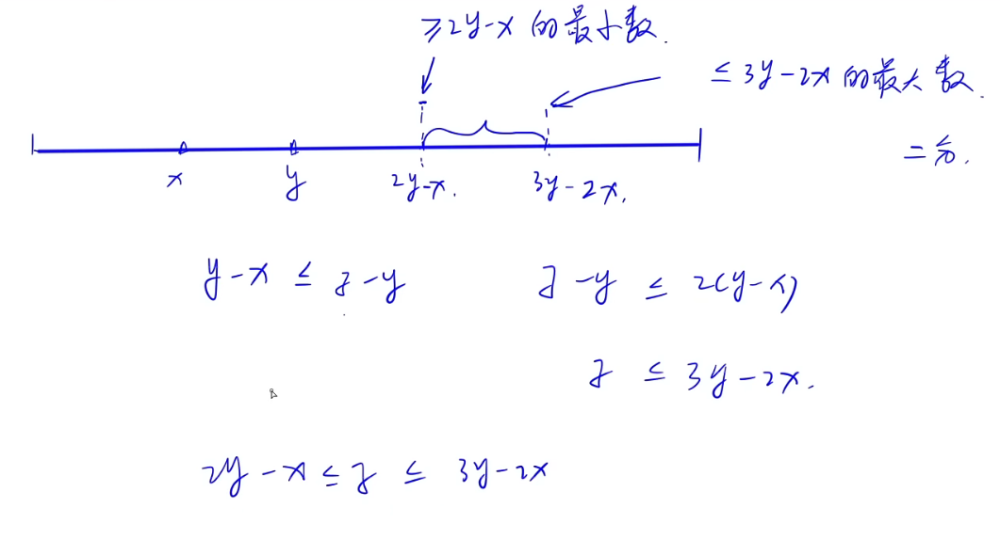

<!-- @import "[TOC]" {cmd="toc" depthFrom=1 depthTo=6 orderedList=false} -->

<!-- code_chunk_output -->

- [1987. 粉刷栅栏（差分+离散化）](#1987-粉刷栅栏差分离散化)
- [1978. 奶牛过马路（前缀和最值/双向遍历）](#1978-奶牛过马路前缀和最值双向遍历)
- [品种邻近（哈希表/滑动窗口）](#品种邻近哈希表滑动窗口)
- [1960. 闪烁（状态压缩/找规律/陷入循环/抽屉原理）](#1960-闪烁状态压缩找规律陷入循环抽屉原理)
- [AcWing 1952. 金发姑娘和 N 头牛（差分）](#acwing-1952-金发姑娘和-n-头牛差分)
- [1945. 奶牛棒球（简单推导/双指针/二分）](#1945-奶牛棒球简单推导双指针二分)

<!-- /code_chunk_output -->

### 1987. 粉刷栅栏（差分+离散化）

农夫约翰发明了一种绝妙的方法来粉刷牛棚旁边的长栅栏（把栅栏想象成一维的数轴）。

他只需要在他最喜欢的奶牛贝茜身上挂一个刷子，然后在一旁悠闲的喝凉水就行了。

贝茜沿着栅栏来回走动时，会将她走过的栅栏部分涂上油漆。

贝茜从栅栏上的位置 $0$ 处开始，共进行 $N$ 次移动。

移动可能形如 `10 L`，表示向左移动 $10$ 单位距离，也可能形如 `15 R`，表示向右移动 $15$ 单位距离。

给定贝茜的 $N$ 次移动列表，约翰想知道至少被涂抹了 $2$ 层油漆的区域的总长度。

整个行进过程中，贝茜距离出发地的距离不会超过 $10^9$。

<h4>输入格式</h4>

第一行包含一个整数 $N$。

接下来 $N$ 行，每一行包含一个行动指令，诸如 `10 L` 或 `15 R`。

<h4>输出格式</h4>

输出至少被涂抹了 $2$ 层油漆的区域的总长度。

<h4>数据范围</h4>

- $1 \le N \le 10^5$
- 整个行进过程中，贝茜距离出发地的距离不会超过 $10^9$。
- 每次指令移动距离的取值范围是 $[1,2 \times 10^9]$。

<h4>输入样例：</h4>

```
6
2 R
6 L
1 R
8 L
1 R
2 R
```

<h4>输出样例：</h4>

```
6
```

<h4>样例解释</h4>

共有 $6$ 单位长度的区域至少被涂抹 $2$ 层油漆。

这些区域为 $(-11,-8), (-4,-3), (0,2)$。

```cpp
/**
 * 差分记录变化
 * 数值大于等于 2 的区域长度加进 ans
 */
#include <iostream>
#include <cstring>
#include <algorithm>
#include <map>
using namespace std;

map<int, int> diff;

int main()
{
    int n;
    cin >> n;
    int x = 0;
    for (int i = 0; i < n; ++ i)
    {
        char o;
        int d;
        cin >> d >> o;
        if (o == 'R') d = - d;
        int newx = x + d;
        diff[min(newx, x)] ++ ;
        diff[max(newx, x)] -- ; 
        x = newx;
    }

    // 差分转数值
    int ans = 0;
    int s = 0, p = -2e9;
    for (auto&& [k, v]: diff)
    {
        if (s > 1) ans += (k - p);
        s = s + v;
        p = k;
    }
    
    cout << ans << endl;
}
```

### 1978. 奶牛过马路（前缀和最值/双向遍历）

每天，农夫约翰的 $N$ 头奶牛都会穿过农场中间的马路。

考虑约翰的农场在二维平面的地图，马路沿水平方向延伸，马路的一侧由直线 $y=0$ 描述，另一侧由直线 $y=1$ 描述。

奶牛 $i$ 从马路一侧的位置 $(a_i,0)$ 沿直线过马路到达另一侧的位置 $(b_i,1)$。

所有 $a_i$ 互不相同，所有 $b_i$ 互不相同。

尽管他的奶牛们行动敏捷，他还是担心行动路径交叉的两头奶牛在过马路时发生碰撞。

约翰认为，如果一头奶牛的行动路径没有跟其他任何奶牛的行动路径相交，则该奶牛是安全的。

请帮助约翰计算安全奶牛的数量。

<h4>输入格式</h4>

第一行包含整数 $N$。

接下来 $N$ 行，每行包含两个整数 $a_i,b_i$，用来描述一头牛的行动路径。

<h4>输出格式</h4>

输出安全奶牛的数量。

<h4>数据范围</h4>

- $1 \le N \le 10^5$,
- $-10^6 \le a_i,b_i \le 10^6$

<h4>输入样例：</h4>

```
4
-3 4
7 8
10 16
3 9
```

<h4>输出样例：</h4>

```
2
```

<h4>样例解释</h4>

第一头牛和第三头牛的行动路线不与其他奶牛的路线相交。

第二头牛和第四头牛的行动路线相交。

```cpp
/**
 * (ai, bi)
 * 按照 ai 排序
 * 如果 i 不与其他线段相交，当且仅当
 * bi 大于 max(b1, ..., b_{i-1})
 * bi 小于 min(b_{i+1}, ..., bn)
 */
#include <iostream>
#include <cstring>
#include <algorithm>

using namespace std;

typedef pair<int, int> PII;

const int N = 1e5 + 10;
int Smax[N], Smin[N];
PII a[N];

int main()
{
    int n;
    scanf("%d", &n);
    for (int i = 1; i <= n; ++ i) scanf("%d %d", &a[i].first, &a[i].second);
    
    sort(a + 1, a + n + 1);
    
    Smax[0] = -2e9;
    for (int i = 1; i <= n; ++ i) Smax[i] = max(Smax[i - 1], a[i].second);

    Smin[n + 1] = 2e9;
    for (int i = n; i >= 1; -- i) Smin[i] = min(Smin[i + 1], a[i].second);

    int res = 0;
    for (int i = 1; i <= n; ++ i)
        if (a[i].second > Smax[i - 1] && a[i].second < Smin[i + 1])
            ++ res;
    
    printf("%d\n", res);
}
```

### 品种邻近（哈希表/滑动窗口）

农夫约翰的 $N$ 头奶牛排成一排，每头奶牛都用其品种 $ID$ 进行描述。

如果两头相同品种的牛靠得太近，它们就会吵架。

具体的说，如果同一品种的两头奶牛在队列中的位置相差不超过 $K$，我们就称这是一对拥挤的牛。

请计算品种 $ID$ 最大的拥挤奶牛对的品种 $ID$。

<h4>输入格式</h4>

第一行包含两个整数 $N$ 和 $K$。

接下来 $N$ 行，每行包含一个整数表示队列中一头奶牛的品种 $ID$。

<h4>输出格式</h4>

输出品种 $ID$ 最大的拥挤奶牛对的品种 $ID$。

如果不存在拥挤奶牛队，则输出 $-1$。

<h4>数据范围</h4>

- $1 \le N \le 50000$,
- $1 \le K < N$,
- 品种 $ID$ 范围 $[0,10^6]$。

<h4>输入样例：</h4>

```
6 3
7
3
4
2
3
4
```

<h4>输出样例：</h4>

```
4
```

<h4>样例解释</h4>

一对品种 $ID$ 为 $3$ 的奶牛以及一对品种 $ID$ 为 $4$ 的奶牛属于拥挤奶牛对。

所以，最大拥挤奶牛对的品种 $ID$ 为 $4$。

```cpp
#include <iostream>
#include <cstring>
#include <algorithm>
#include <map>
using namespace std;

map<int, int> id2pos;

int main()
{
    int n, k;
    cin >> n >> k;
    int res = -1;
    for (int i = 0; i < n; ++ i)
    {
        int id;
        cin >> id;
        if (!id2pos.count(id)) id2pos[id] = i;
        else
        {
            if (i - id2pos[id] <= k) res = max(res, id);
            id2pos[id] = i;
        }
    }
    cout << res << endl;
}
```

如上，我是用枚举做的。

y 总用滑动窗口做的。

```cpp
#include <iostream>
#include <cstring>
#include <algorithm>
#include <queue>

using namespace std;

const int M = 1000010;

int n, k;
int cnt[M];

int main()
{
    scanf("%d%d", &n, &k);

    int res = -1;
    queue<int> q;
    for (int i = 0; i < n; i ++ )
    {
        int id;
        scanf("%d", &id);

        if (cnt[id] > 0) res = max(res, id);
        cnt[id] ++ ;
        q.push(id);
        if (q.size() > k)
        {
            cnt[q.front()] -- ;
            q.pop();
        }
    }

    printf("%d\n", res);
    return 0;
}
```

### 1960. 闪烁（状态压缩/找规律/陷入循环/抽屉原理）

农夫约翰对牛棚里昏暗的灯光感到不满，刚刚安装了一个新吊灯。

新吊灯由 $N$ 个灯泡组成，这 $N$ 个灯泡围成一圈，编号为 $0 \sim N - 1$。

奶牛对这个新吊灯非常着迷，并且喜欢玩以下游戏：

对于第 $i$ 个灯泡，如果在 $T-1$ 时刻，它左侧的灯泡（当 $i > 0$ 时，为第 $i - 1$ 个灯泡；当 $i = 0$ 时，为第 $N - 1$ 个灯泡）是开着，那么在 $T$ 时刻，就切换这个灯泡的状态。

这个游戏将持续 $B$ 单位时间。

给定灯泡的初始状态，请确定在 $B$ 单位时间后，它们的最终状态。

<h4>输入格式</h4>

第一行包含两个整数 $N$ 和 $B$。

接下来 $N$ 行，按顺序描述每个灯泡的初始状态，每行包含一个整数 $1$ （表示开）或 $0$（表示关）。

<h4>输出格式</h4>

共 $N$ 行，按顺序每行输出一个灯泡的最终状态。

<h4>数据范围</h4>

- $3 \le N \le 16$,
- $1 \le B \le 10^{15}$

<h4>输入样例：</h4>

```
5 6
1
0
0
0
0
```

<h4>输出样例：</h4>

```
1
1
1
0
1
```

<h4>样例解释</h4>

灯泡状态如下：

```
时刻 T=0: 1 0 0 0 0
时刻 T=1: 1 1 0 0 0
时刻 T=2: 1 0 1 0 0
时刻 T=3: 1 1 1 1 0
时刻 T=4: 1 0 0 0 1
时刻 T=5: 0 1 0 0 1
时刻 T=6: 1 1 1 0 1
```

```cpp
/**
 * 因为只有 16 位，所以类似“抽屉原理”的思考方式
 * 只有 2^{16} = 65536 种可能
 * 因此在 B = 10^{15} 次的模拟中，一定会陷入循环
 * 我们在发现自己进入循环后，只需要用剩余步数对循环取余就能大大优化掉重复的步骤
 */
#include <iostream>
#include <cstring>
#include <algorithm>

using namespace std;

typedef long long LL;

const int N = 1 << 16;

int n;
LL m;
int p[N];

// 注意我们把第 0 个灯泡存在 state 的第 0 位上
int update(int state)
{
    int res = 0;
    for (int i = 0; i < n; i ++ )
    {
        int j = (i - 1 + n) % n;  // 取左边的灯泡
        int x = state >> i & 1, y = state >> j & 1;
        res |= (x ^ y) << i;
    }
    return res;
}

void print(int state)
{
    for (int i = 0; i < n; i ++ )
        cout << (state >> i & 1) << endl;
}

int main()
{
    cin >> n >> m;

    int state = 0;
    for (int i = 0; i < n; i ++ )
    {
        int x;
        cin >> x;
        state |= x << i;
    }

    memset(p, -1, sizeof p);
    p[state] = 0;

    for (int i = 1;; i ++ )
    {
        state = update(state);
        if (i == m)
        {
            print(state);
            break;
        }
        else if (!~p[state]) p[state] = i;
        else
        {
            int len = i - p[state];  // 循环圈的长度
            int r = (m - i) % len;
            while (r -- ) state = update(state);
            print(state);
            break;
        }
    }

    return 0;
}
```

### AcWing 1952. 金发姑娘和 N 头牛（差分）

你可能听过关于金发姑娘和三只熊的经典故事。

然而，鲜为人知的是，金发姑娘最终成了一个农民。

在她的农场中，她的牛棚里有 $N$ 头奶牛。

不幸的是，她的奶牛对温度相当敏感。

对于奶牛 $i$，使其感到舒适的温度为 $A_i...B_i$。

如果金发姑娘将牛棚的恒温器的温度 $T$ 设置为 $T < A_i$，奶牛就会觉得冷，并会产出 $X$ 单位的牛奶。

如果她将恒温器的温度 $T$ 设置在 $A_i \le T \le B_i$，奶牛就会感到舒适，并会产出 $Y$ 单位的牛奶。

如果她将恒温器的温度 $T$ 设置为 $T > B_i$，奶牛就会觉得热，并会产出 $Z$ 单位的牛奶。

正如所期望的那样，$Y$ 的值始终大于 $X$ 和 $Z$。

给定 $X,Y,Z$ 以及每头奶牛感到舒适的温度范围，请计算通过合理设定恒温器温度，金发姑娘可获得的最大产奶量。

恒温器温度可设置为任何整数。

<h4>输入格式</h4>

第一行包含四个整数 $N,X,Y,Z$。

接下来 $N$ 行，每行包含两个整数 $A_i$ 和 $B_i$。

<h4>输出格式</h4>

输出可获得的最大产奶量。

<h4>数据范围</h4>

- $1 \le N \le 20000$,
- $0 \le X,Y,Z \le 1000$,
- $0 \le A_i \le B_i \le 10^9$

<h4>输入样例：</h4>

```
4 7 9 6
5 8
3 4
13 20
7 10
```

<h4>输出样例：</h4>

```
31
```

<h4>样例解释</h4>

金发姑娘可以将恒温器温度设置为 $7$ 或 $8$，这样会让奶牛 $1$ 和 $4$ 感到舒适，奶牛 $2$ 感到热，奶牛 $3$ 感到冷。

共可获得 $31$ 单位牛奶。

```cpp
/**
 * 这道题简单就简单在 X Y Z 一样
 * 找被覆盖的最多的点就行
 */
#include <iostream>
#include <cstring>
#include <algorithm>
#include <map>
using namespace std;

typedef pair<int, int> PII;

const int N = 20010, INF = 2e9;
PII a[N];
map<int, long long> d;

int n, x, y, z;

int main()
{
    cin >> n >> x >> y >> z;
    for (int i = 0; i < n; ++ i)
    {
        int A, B;
        cin >> A >> B;
        a[i] = {A, B};
        d[- INF] += x;
        d[a[i].first] += y - x;
        d[a[i].second + 1] += z - y;
        d[INF] -= z;
    }

    long long s = 0, ans = 0;
    for (auto&& [k, v] : d)
    {
        s += v;
        ans = max(ans, s);
    }
    
    cout << ans << endl;
}
```

### 1945. 奶牛棒球（简单推导/双指针/二分）

农夫约翰的 $N$ 头奶牛排成一排，每头奶牛都位于数轴中的不同位置上。

它们正在练习投掷棒球。

农夫约翰观看时，观察到一组三头牛 $(X,Y,Z)$ 完成了两次成功的投掷。

牛 $X$ 把球扔给她右边的牛 $Y$，然后牛 $Y$ 把球扔给她右边的牛 $Z$。

约翰指出，第二次投掷的距离不少于第一次投掷的距离，也不超过第一次投掷的距离的两倍。

请计算共有多少组牛 $(X,Y,Z)$ 可能是约翰所看到的。

<h4>输入格式</h4>

第一行包含整数 $N$。

接下来 $N$ 行，每行描述一头牛的位置。

<h4>输出格式</h4>

输出奶牛三元组 $(X,Y,Z)$ 的数量。

$(X,Y,Z)$ 需满足，$Y$ 在 $X$ 的右边，$Z$ 在 $Y$ 的右边，并且从 $Y$ 到 $Z$ 的距离在 $[XY,2XY]$ 之间，其中 $XY$ 表示从 $X$ 到 $Y$ 的距离。

<h4>数据范围</h4>

- $3 \le N \le 1000$,
- 奶牛所在的位置坐标范围 $[0,10^8]$。

<h4>输入样例：</h4>

```
5
3
1
10
7
4
```

<h4>输出样例：</h4>

```
4
```

<h4>样例解释</h4>

四个可能的奶牛三元组为：$1-3-7, 1-4-7, 4-7-10, 1-4-10$。

分析见图：



如下是双指针方法。

```cpp
#include <iostream>
#include <cstring>
#include <algorithm>

using namespace std;

const int N = 1010;

int n;
int p[N];

int main()
{
    scanf("%d", &n);
    for (int i = 0; i < n; i ++ ) scanf("%d", &p[i]);
    sort(p, p + n);

    int res = 0;
    for (int i = 0; i + 2 < n; i ++ )  // x
        for (int j = i + 1, l = j + 1, r = j + 1; j + 1 < n; j ++ )  // y
        {   // l 是大于等于 2y-x 最小数
            while (l < n && p[l] - p[j] < p[j] - p[i]) l ++ ;
            // r 是大于 3y-2x 最小数
            while (r < n && p[r] - p[j] <= 2 * (p[j] - p[i])) r ++ ;
            res += r - l;
        }

    printf("%d\n", res);
    return 0;
}
```

如下是二分算法：

```cpp
#include <iostream>
#include <cstring>
#include <algorithm>

using namespace std;

const int N = 1010;

int n;
int p[N];

int main()
{
    scanf("%d", &n);
    vector<int> p;
    for (int i = 0; i < n; i ++ )
    {
        int a;
        scanf("%d", &a);
        p.push_back(a);
    }
    sort(p.begin(), p.end());

    int res = 0;
    for (int i = 0; i + 2 < n; i ++ )  // x
        for (int j = i + 1; j + 1 < n; j ++ )  // y
        {   // l 是大于等于 2y-x 最小数
            auto l = lower_bound(p.begin(), p.end(), 2 * p[j] - p[i]);
            // r 是小于等于 3y-2x 最小数的下一个
            auto r = upper_bound(p.begin(), p.end(), 3 * p[j] - 2 * p[i]);
            res += r - l;
        }

    printf("%d\n", res);
    return 0;
}
```

双指针：52 ms，二分：1089 ms。
