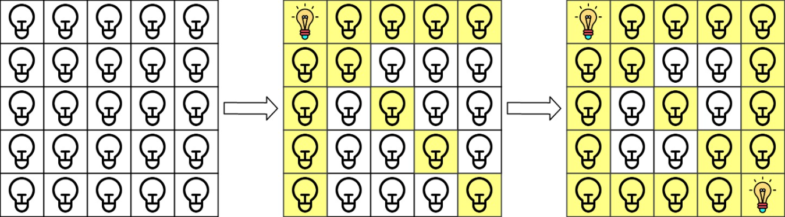
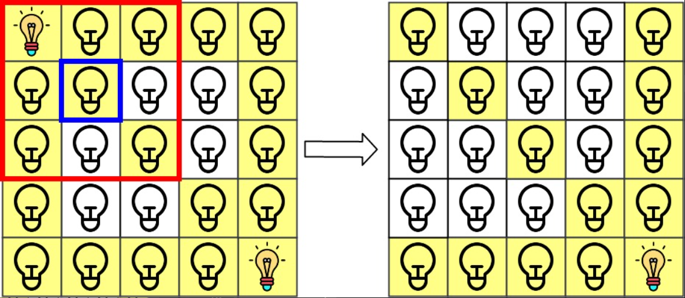
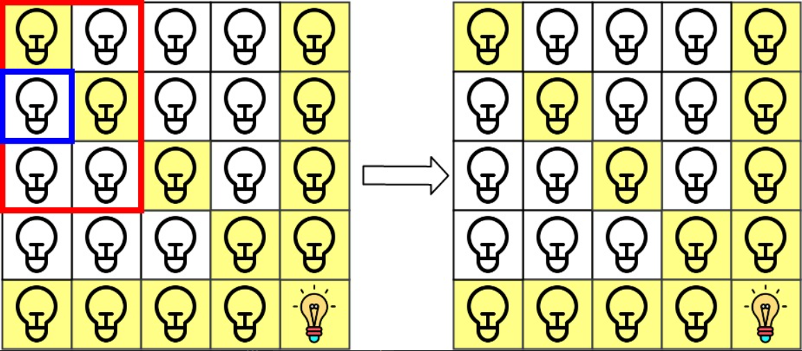

<!-- @import "[TOC]" {cmd="toc" depthFrom=1 depthTo=6 orderedList=false} -->

<!-- code_chunk_output -->

- [1332. 删除回文子序列（脑筋急转弯）](#1332-删除回文子序列脑筋急转弯)
- [1414. 和为 K 的最少斐波那契数字数目（贪心+精彩的证明）](#1414-和为-k-的最少斐波那契数字数目贪心精彩的证明)
- [1405. 最长快乐字符串（贪心）](#1405-最长快乐字符串贪心)
- [1001. 网格照明（哈希化信息）](#1001-网格照明哈希化信息)
- [540. 有序数组中的单一元素（二分+找规律）](#540-有序数组中的单一元素二分找规律)

<!-- /code_chunk_output -->

### 1332. 删除回文子序列（脑筋急转弯）

给你一个字符串 s，它仅由字母 'a' 和 'b' 组成。每一次删除操作都可以从 s 中删除一个回文 子序列。

返回删除给定字符串中所有字符（字符串为空）的最小删除次数。

「子序列」定义：如果一个字符串可以通过删除原字符串某些字符而不改变原字符顺序得到，那么这个字符串就是原字符串的一个子序列。

「回文」定义：如果一个字符串向后和向前读是一致的，那么这个字符串就是一个回文。

示例 1：
```
输入：s = "ababa"
输出：1
解释：字符串本身就是回文序列，只需要删除一次。
```

示例 2：
```
输入：s = "abb"
输出：2
解释："abb" -> "bb" -> "". 
先删除回文子序列 "a"，然后再删除 "bb"。
```

示例 3：
```
输入：s = "baabb"
输出：2
解释："baabb" -> "b" -> "". 
先删除回文子序列 "baab"，然后再删除 "b"。
```

提示：
- 1 <= s.length <= 1000
- s 仅包含字母 'a' 和 'b'

```cpp
class Solution {
public:
    int removePalindromeSub(string s) {
        /**
         * 思维题：只有两种 a 和 b
         * 因此至多删除两次
         * 删除一次的情况是本身就是回文
         */
        int n = s.size();
        for (int i = 0; i < n / 2; ++ i)
            if (s[i] != s[n - i - 1]) return 2;
        return 1;
    }
};
```

### 1414. 和为 K 的最少斐波那契数字数目（贪心+精彩的证明）

给你数字 k ，请你返回和为 k 的斐波那契数字的最少数目，其中，每个斐波那契数字都可以被使用多次。

斐波那契数字定义为：
- $F_1 = 1$
- $F_2 = 1$
- $F_n = F_{n-1} + F_{n-2}$ ， 其中 $n > 2$ 。

数据保证对于给定的 k ，一定能找到可行解。

示例 1：

```
输入：k = 7
输出：2 
解释：斐波那契数字为：1，1，2，3，5，8，13，……
对于 k = 7 ，我们可以得到 2 + 5 = 7 。
```

示例 2：

```
输入：k = 10
输出：2 
解释：对于 k = 10 ，我们可以得到 2 + 8 = 10 。
```

示例 3：

```
输入：k = 19
输出：3 
解释：对于 k = 19 ，我们可以得到 1 + 5 + 13 = 19 。
```

提示：
- $1 <= k <= 10^9$

```cpp
class Solution {
public:
    int findMinFibonacciNumbers(int k) {
        /**
         * 贪心：找到最接近 k 的斐波那契数列，然后减去
         */
        vector<int> p;
        p.push_back(1);
        int a = 1, b = 1;
        while (a + b <= k)
        {
            int c = a + b;
            p.push_back(c);
            a = b;
            b = c;
        }

        int res = 0;
        for (int i = p.size() - 1; i >= 0; -- i)
        {
            if (p[i] <= k) k -= p[i], ++ res;
            if (k == 0) break;
        }

        return res;
    }
};
```


如下是力扣的证明，三个结论，依次递进，很精彩。

首先，找到所有不超过 $k$ 的斐波那契数字，然后每次贪心地选取不超过 $k$ 的最大斐波那契数字，将 $k$ 减去该斐波那契数字，重复该操作直到 $k$ 变为 $0$，此时选取的斐波那契数字满足和为 $k$ 且数目最少。

为了证明上述方案选取的斐波那契数字数目最少，只需要证明存在一种选取斐波那契数字数目最少的方案，该方案选取了不超过 $k$ 的最大斐波那契数字。

**结论一：当选取斐波那契数字数目最少时，不可能选取两个相邻的斐波那契数。** 如下是证明。

假设选取了两个相邻的斐波那契数字 $F_x$ 和 $F_{x + 1}$ ，则根据斐波那契数字的定义，这两个斐波那契数字之和为后一个斐波那契数字：

$$F_{x+2} = F_{x} + F_{x+1}$$

因此可以用 $F_{x + 2}$ 代替 $F_x$ 和 $F_{x + 1}$ ，选取的斐波那契数字的总和不变，选取的斐波那契数字的数目减少 $1$ 个，比选取 $F_x$ 和 $F_{x + 1}$ 的方案更优。

**结论二：一定存在一种选取斐波那契数字数目最少的方案，使得选取的每个斐波那契数字各不相同。** 证明如下。

假设 $F_x$ 被选取了两次。当 $x \le 2$ 时，$F_x = 1$ ，可以用 $F_3 = 2$ 代替两个 $F_x$ ，此时选取的斐波那契数字的数目减少 $1$ 个。当 $x > 2$ 时，存在以下关系：

$$2 \times F_x = (F_{x - 2} + F_{x - 1}) + F_x = F_{x - 2} + (F_{x - 1} + F_x) = F_{x - 2} + F_{x + 1}$$

因此当 $x > 2$ 时，如果 $F_x$ 被选取了两次，则可以换成 $F_{x - 2}$ 和 $F_{x + 1}$ 。

**结论三：根据上述两个结论，必须选取不超过 k 的最大斐波那契数字，才能使得选取的斐波那契数字满足和为 k 且数目最少。** 证明如下。

用 $F_m$ 表示不超过 $k$ 的最大斐波那契数字。如果不选择 $F_m$，则考虑选取的斐波那契数字之和可能的最大值，记为 $N$。根据上述两个结论，选取的斐波那契数字中不存在相邻的斐波那契数字，也不存在重复的斐波那契数字，因此可以得到 $N$ 的表达式：

$$N = \begin{cases} F_{m - 1} + F_{m - 3} + \ldots + F_4 + F_2, &m~是奇数 \\ F_{m - 1} + F_{m - 3} + \ldots + F_3 + F_1, &m~是偶数 \end{cases}$$

当 $m$ 是奇数时，$N$ 的值计算如下：

$$\begin{aligned} N &= F_{m - 1} + F_{m - 3} + \ldots + F_4 + F_2 \\ &= F_{m - 1} + F_{m - 3} + \ldots + F_4 + F_2 + F_1 - F_1 \\ &= F_{m - 1} + F_{m - 3} + \ldots + F_4 + F_3 - F_1 \\ &= F_{m - 1} + F_{m - 3} + \ldots + F_5 - F_1 \\ &= \ldots \\ &= F_{m - 1} + F_{m - 2} - F_1 \\ &= F_m - 1 \\ &< F_m \end{aligned}$$

此时 $N < F_m$ ，由于 $F_m \le k$ ，因此 $N < k$ 。如果不选择 $F_m$ ，则选取的斐波那契数字之和一定小于 $k$，因此必须选择 $F_m$ 。

当 $m$ 是偶数时，$N$ 的值计算如下：

$$\begin{aligned} N &= F_{m - 1} + F_{m - 3} + \ldots + F_3 + F_1 \\ &= F_{m - 1} + F_{m - 3} + \ldots + F_3 + F_2 \\ &= F_{m - 1} + F_{m - 3} + \ldots + F_4 \\ &= \ldots \\ &= F_{m - 1} + F_{m - 2} \\ &= F_m \end{aligned}$$

此时 $N = F_m$ ，$\dfrac{m}{2}$ 个斐波那契数字之和等于 $F_m$ ，用一个 $F_m$ 替换 $\dfrac{m}{2}$ 个斐波那契数字，选取的斐波那契数字数目不变或减少（只有当 $m = 2$ 时，选取的斐波那契数字数目不变）。

综上所述，无论 $m$ 是奇数还是偶数，都需要选取 $F_m$，即不超过 $k$ 的最大斐波那契数字，才能使得选取的斐波那契数字满足和为 $k$ 且数目最少。

### 1405. 最长快乐字符串（贪心）

https://leetcode-cn.com/problems/longest-happy-string/

如果字符串中不含有任何 'aaa'，'bbb' 或 'ccc' 这样的字符串作为子串，那么该字符串就是一个「快乐字符串」。

给你三个整数 a，b ，c，请你返回 任意一个 满足下列全部条件的字符串 s：
- s 是一个尽可能长的快乐字符串。
- s 中 最多 有a 个字母 'a'、b 个字母 'b'、c 个字母 'c' 。
- s 中只含有 'a'、'b' 、'c' 三种字母。

如果不存在这样的字符串 s ，请返回一个空字符串 ""。

示例 1：

```
输入：a = 1, b = 1, c = 7
输出："ccaccbcc"
解释："ccbccacc" 也是一种正确答案。
```

示例 2：

```
输入：a = 2, b = 2, c = 1
输出："aabbc"
```

示例 3：

```
输入：a = 7, b = 1, c = 0
输出："aabaa"
解释：这是该测试用例的唯一正确答案。
```

提示：
- 0 <= a, b, c <= 100
- a + b + c > 0

```cpp
class Solution {
public:
    string longestDiverseString(int a, int b, int c) {
        string res;
        vector<pair<int, char>> arr = {
            {a, 'a'}, {b, 'b'}, {c, 'c'}
        };

        while (true)  // 找剩余最多的且合适的填上
        {
            sort(arr.begin(), arr.end(), [&](pair<int, char> t1, pair<int, char> t2) {
                return t1.first > t2.first;
            });
            bool f = false;
            for (auto& [freq, ch] : arr)  // 找合适的
            {
                if (freq <= 0) break;
                if (res.size() >= 2 && res[res.size() - 2] == ch && res[res.size() - 1] == ch)
                    continue;
                f = true;
                res.push_back(ch);
                freq -- ;
                break;
            }
            if (!f) break;
        }
        return res;
    }
};
```

### 1001. 网格照明（哈希化信息）

在大小为 n x n 的网格 grid 上，每个单元格都有一盏灯，最初灯都处于 关闭 状态。

给你一个由灯的位置组成的二维数组 lamps ，其中 lamps[i] = [rowi, coli] 表示 打开 位于 grid[rowi][coli] 的灯。即便同一盏灯可能在 lamps 中多次列出，不会影响这盏灯处于 打开 状态。

当一盏灯处于打开状态，它将会照亮 自身所在单元格 以及同一 行 、同一 列 和两条 对角线 上的 所有其他单元格 。

另给你一个二维数组 queries ，其中 queries[j] = [rowj, colj] 。对于第 j 个查询，如果单元格 [rowj, colj] 是被照亮的，则查询结果为 1 ，否则为 0 。在第 j 次查询之后 [按照查询的顺序] ，关闭 位于单元格 grid[rowj][colj] 上及相邻 8 个方向上（与单元格 grid[rowi][coli] 共享角或边）的任何灯。

返回一个整数数组 ans 作为答案， ans[j] 应等于第 j 次查询 queries[j] 的结果，1 表示照亮，0 表示未照亮。

示例 1：



```
输入：n = 5, lamps = [[0,0],[4,4]], queries = [[1,1],[1,0]]
输出：[1,0]
解释：最初所有灯都是关闭的。在执行查询之前，打开位于 [0, 0] 和 [4, 4] 的灯。第 0 次查询检查 grid[1][1] 是否被照亮（蓝色方框）。该单元格被照亮，所以 ans[0] = 1 。然后，关闭红色方框中的所有灯。
```



```
第 1 次查询检查 grid[1][0] 是否被照亮（蓝色方框）。该单元格没有被照亮，所以 ans[1] = 0 。然后，关闭红色矩形中的所有灯。
```



示例 2：

```
输入：n = 5, lamps = [[0,0],[4,4]], queries = [[1,1],[1,1]]
输出：[1,1]
```

示例 3：

```
输入：n = 5, lamps = [[0,0],[0,4]], queries = [[0,4],[0,1],[1,4]]
输出：[1,1,0]
```

提示：
- 1 <= n <= 10e9
- 0 <= lamps.length <= 20000
- 0 <= queries.length <= 20000
- lamps[i].length == 2
- 0 <= rowi, coli < n
- queries[j].length == 2
- 0 <= rowj, colj < n

```cpp
class Solution {
public:
    vector<int> gridIllumination(int n, vector<vector<int>> &lamps, vector<vector<int>> &queries) {
        unordered_map<int, int> row, col, diagonal, antiDiagonal;
        auto hash_p = [](const pair<int, int> &p) -> size_t {
            static hash<long long> hash_ll;
            return hash_ll(p.first + (static_cast<long long>(p.second) << 32));
        };
        unordered_set<pair<int, int>, decltype(hash_p)> points(0, hash_p);
        for (auto &lamp : lamps) {
            if (points.count({lamp[0], lamp[1]}) > 0) {
                continue;
            }
            points.insert({lamp[0], lamp[1]});
            row[lamp[0]]++;
            col[lamp[1]]++;
            diagonal[lamp[0] - lamp[1]]++;
            antiDiagonal[lamp[0] + lamp[1]]++;
        }
        vector<int> ret(queries.size());
        for (int i = 0; i < queries.size(); i++) {
            int r = queries[i][0], c = queries[i][1];
            if (row.count(r) > 0 && row[r] > 0) {
                ret[i] = 1;
            } else if (col.count(c) > 0 && col[c] > 0) {
                ret[i] = 1;
            } else if (diagonal.count(r - c) > 0 && diagonal[r - c] > 0) {
                ret[i] = 1;
            } else if (antiDiagonal.count(r + c) > 0 && antiDiagonal[r + c] > 0) {
                ret[i] = 1;
            }
            for (int x = r - 1; x <= r + 1; x++) {
                for (int y = c - 1; y <= c + 1; y++) {
                    if (x < 0 || y < 0 || x >= n || y >= n) {
                        continue;
                    }
                    auto p = points.find({x, y});
                    if (p != points.end()) {
                        points.erase(p);  // 集合中删除 p
                        row[x]--;
                        col[y]--;
                        diagonal[x - y]--;
                        antiDiagonal[x + y]--;
                    }
                }
            }
        }
        return ret;
    }
};
```

### 540. 有序数组中的单一元素（二分+找规律）

给你一个仅由整数组成的有序数组，其中每个元素都会出现两次，唯有一个数只会出现一次。

请你找出并返回只出现一次的那个数。

你设计的解决方案必须满足 O(log n) 时间复杂度和 O(1) 空间复杂度。

示例 1:

```
输入: nums = [1,1,2,3,3,4,4,8,8]
输出: 2
```

示例 2:

```
输入: nums =  [3,3,7,7,10,11,11]
输出: 10
```
 

提示:
- 1 <= nums.length <= 10e5
- 0 <= nums[i] <= 10e5

```cpp
class Solution {
public:
    int singleNonDuplicate(vector<int>& nums) {
        /**
         * x 为单独元素的下标
         * 如果 y 在 x 左边，且 y 是偶数，则一定有 nums[y] == nums[y+1] 否则 y 在 x 右边
         * 如果 y 在 x 右边，且 y 是奇数，则一定有 nums[y] == nums[y+1] 否则 y 在 x 左边
         * 因此总结出 y 在 x 左边的情况：y 偶数且 nums[y] == nums[y+1] 或者 y 奇数且 nums[y] == nums[y-1]
         * y 偶数时 y+1 == y ^ 1 ； y 奇数时 y-1 == y ^ 1
         */
         int l = 0, r = nums.size() - 1;
         while (l < r)
         {
             int mid = l + r >> 1;
             if (nums[mid ^ 1] == nums[mid])  // mid 在 x 左边
                l = mid + 1;
            else r = mid;
         }
         return nums[l];
    }
};
```
