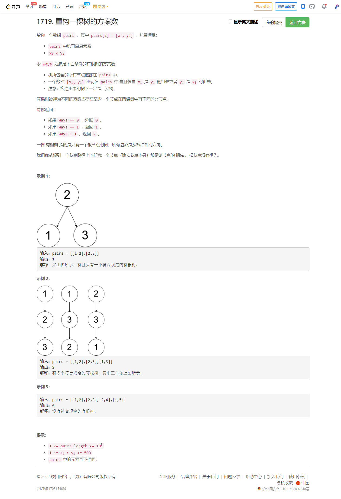
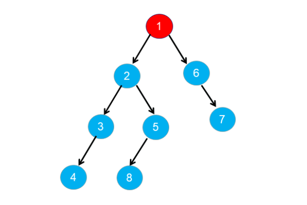
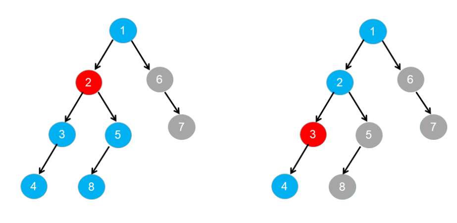
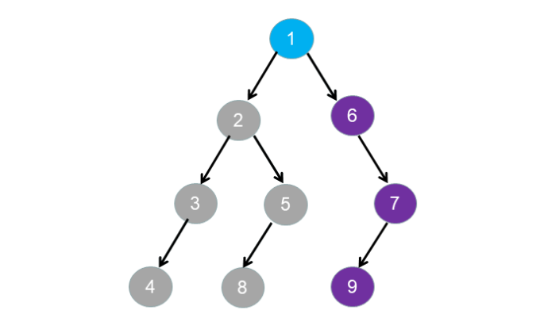
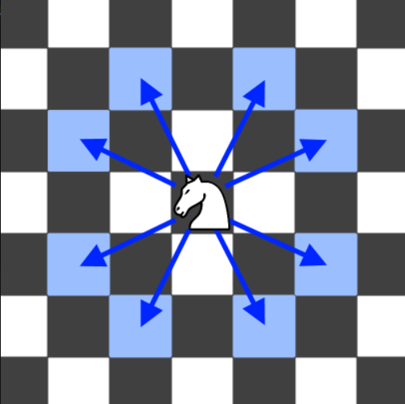

<!-- @import "[TOC]" {cmd="toc" depthFrom=1 depthTo=6 orderedList=false} -->

<!-- code_chunk_output -->

- [1719. 重构一棵树的方案数（思维题发现规律）](#1719-重构一棵树的方案数思维题发现规律)
- [688. 骑士在棋盘上的概率（记忆化搜索DP）](#688-骑士在棋盘上的概率记忆化搜索dp)
- [432. 全 O(1) 的数据结构（双向链表list的使用）](#432-全-o1-的数据结构双向链表list的使用)

<!-- /code_chunk_output -->

### 1719. 重构一棵树的方案数（思维题发现规律）



参考：https://leetcode-cn.com/problems/number-of-ways-to-reconstruct-a-tree/solution/zhong-gou-yi-ke-shu-de-fang-an-shu-by-le-36e1/

题目给定的数对 $\textit{pairs}[i] = [x_{i},y_{i}]$ ，且满足 $x_{i}$ 是 $y_{i}$ 的祖先或者 $y_{i}$ 是 $x_{i}$ 的祖先；树中所包含的所有节点值都在 $\textit{pairs}$ 中，即 $\textit{pairs}$ 包含树中所有可能构成祖先的数对。

设树中节点数目为 $n$，$\textit{pairs}$ 中包含节点 $x$ 的数对的数目为 $\textit{degree}[x]$ ，节点 $x$ 的祖先和后代的节点集合为 $\textit{adj}[x]$ 。

下面来研究 $\textit{degree}$ 的性质。

根节点为树中其余所有节点的祖先，根节点与其余所有节点都能构成数对。设根节点为 $\textit{root}$ ，由于 $\textit{pairs}$ 包含树中所有可能构成祖先的数对，因此 $\textit{degree}[\textit{root}] = n - 1$ 。如下图所示，根节点 1 为其余节点的祖先，蓝色节点组成了 $\textit{adj}[1]$ 。



对于 $\textit{pairs}$ 中的数对 $[x_{i},y_{i}]$ ，如果 $x_{i}$ 为 $y_{i}$ 的祖先，则一定满足 $\textit{degree}[x_{i}] \ge \textit{degree}[y_{i}]$ 。如果节点 $y_j$ 为节点 $y_{i}$ 的后代节点，则节点 $y_j$ 一定同时也是节点 $x_{i}$ 的后代节点；如果节点 $y_j$ 为节点 $y_{i}$ 的祖先节点，则节点 $y_j$ 要么是节点 $x_{i}$ 的祖先节点，要么是节点 $x_{i}$ 的后代节点，所以一定满足 $\textit{degree}[x_{i}] \ge \textit{degree}[y_{i}]$ 。此外，如果 $x_{i}$ 为 $y_{i}$ 的祖先，则一定满足 $\textit{adj}[y_{i}] \in \textit{adj}[x_{i}]$ 。如下图所示，含有节点 2 的数对数目一定大于含有节点 3 的数对数目。



对于 $\textit{pairs}$ 中的数对 $[x_{i},y_{i}]$，如果 $x_{i}$ 为 $y_{i}$ 的祖先，且满足 $\textit{degree}[x_{i}] = \textit{degree}[y_{i}]$ 和 $adj[x_{i}] = adj[y_{i}]$ ，则 $x_{i}$ 到 $y_{i}$ 途径的所有节点均只有一个孩子节点。此时 $x_{i}$ 到 $y_{i}$ 之间的节点包含的数对关系是一样的，$x_{i}$ 到 $y_{i}$ 之间的节点是可以进行互相交换而不影响树的结构，则此时构成树的方案数一定不是唯一的。如下图所示，节点 6,7,9 满足上述要求：



综上所述，对于 $\textit{pairs}$ 中的数对 $[x_{i},y_{i}]$：

- 若 $\textit{degree}[x_{i}] > \textit{degree}[y_{i}]$ ，则 $x_{i}$ 为 $y_{i}$ 的祖先节点；
- 若 $\textit{degree}[x_{i}] < \textit{degree}[y_{i}]$ ，则 $y_{i}$ 为 $x_{i}$ 的祖先节点；
- 若 $\textit{degree}[x_{i}] = \textit{degree}[y_{i}]$ ，则可能存在多种构造方法，$y_{i}$ 为 $x_{i}$ 的祖先或者 $x_{i}$ 为 $y_{i}$ 的祖先。

通过以上分析结论，我们可以尝试进行重新建树，并检查建成的树是否合法。

首先我们需要找到根节点 $\textit{root}$ ，通过上述结论，我们找到满足 $\textit{degree}[\textit{root}] = n - 1$ 的节点，如果不存在根节点，则认为其不能构成合法的树，返回 0。

我们需要利用上述的结论检测是构建的树是否合法，遍历每个节点 $\textit{node}_i$ ，找到 $\textit{node}_i$ 的祖先 $\textit{parent}_{i}$ ，检测集合 $\textit{adj}[\textit{node}_i]$ 是否为 $\textit{adj}[\textit{\textit{parent}}_i]$ 的子集。可以利用 $\textit{degree}[\textit{node}_i] \le \textit{degree}[\textit{parent}_{i}]$ 找到所有属于 $\textit{node}_i$ 的祖先节点，然后依次检测是否满足 $\textit{adj}[\textit{node}_i] \in \textit{adj}[\textit{\textit{parent}}_i]$ ，如果不满足要求，则认为构建的树为非法，返回 0。

实际检测过程中不必检测节点 $\textit{node}_i$ 的所有祖先节点，只需要检测节点 $\textit{node}_i$ 的父节点是否满足子集包含的要求即可。根据上述推论找到节点 $x$ 满足 $\textit{degree}[x]$ 最小且 $\textit{degree}[x] \ge \textit{degree}[\textit{node}_i]$ ，则此时找到的节点为节点 $\textit{node}_i$ 的父亲节点，此时只需检测父亲节点是否满足上述要求即可。

设 $\textit{node}_i$ 的父节点为 $\textit{parent}$ ，若满足 $\textit{degree}[\textit{node}_i] = \textit{degree}[\textit{parent}]$ 则树的构造方式可以有多个，返回 2。

```cpp
class Solution {
public:
    int checkWays(vector<vector<int>>& pairs) {
        unordered_map<int, unordered_set<int>> adj;
        for (auto &p : pairs) {
            adj[p[0]].emplace(p[1]);
            adj[p[1]].emplace(p[0]);
        }
        /* 检测是否存在根节点*/
        int root = -1;
        for (auto &[node, neighbours] : adj) {
            if (neighbours.size() == adj.size() - 1) {
                root = node;
                break;
            }
        }
        if (root == -1) {
            return 0;
        }

        int res = 1;
        for (auto &[node, neighbours] : adj) {
            if (node == root) {
                continue;
            }
            int currDegree = neighbours.size();
            int parent = -1;
            int parentDegree = INT_MAX;

            /* 根据 degree 的大小找到 node 的父节点 parent */
            for (auto &neighbour : neighbours) {
                if (adj[neighbour].size() < parentDegree && adj[neighbour].size() >= currDegree) {
                    parent = neighbour;
                    parentDegree = adj[neighbour].size();
                }
            }
            if (parent == -1) {
                return 0;
            }

            /* 检测 neighbours 是否是 adj[parent] 的子集 */
            for (auto &neighbour : neighbours) {
                if (neighbour == parent) {
                    continue;
                }
                if (!adj[parent].count(neighbour)) {
                    return 0;
                }
            }
            if (parentDegree == currDegree) {
                res = 2;
            }
        }
        return res;
    }
};
```

### 688. 骑士在棋盘上的概率（记忆化搜索DP）

在一个 n x n 的国际象棋棋盘上，一个骑士从单元格 (row, column) 开始，并尝试进行 k 次移动。行和列是 从 0 开始 的，所以左上单元格是 (0,0) ，右下单元格是 (n - 1, n - 1) 。

象棋骑士有8种可能的走法，如下图所示。每次移动在基本方向上是两个单元格，然后在正交方向上是一个单元格。



每次骑士要移动时，它都会随机从8种可能的移动中选择一种(即使棋子会离开棋盘)，然后移动到那里。

骑士继续移动，直到它走了 k 步或离开了棋盘。

返回 骑士在棋盘停止移动后仍留在棋盘上的概率 。

示例 1：
```
输入: n = 3, k = 2, row = 0, column = 0
输出: 0.0625
解释: 有两步(到(1,2)，(2,1))可以让骑士留在棋盘上。
在每一个位置上，也有两种移动可以让骑士留在棋盘上。
骑士留在棋盘上的总概率是0.0625。
```

示例 2：
```
输入: n = 1, k = 0, row = 0, column = 0
输出: 1.00000
``` 

提示:
- 1 <= n <= 25
- 0 <= k <= 100
- 0 <= row, column <= n

```cpp
class Solution {
    int dx[8] = {-2, -1, 1, 2, 2, 1, -1, -2};
    int dy[8] = {1, 2, 2, 1, -1, -2, -2, -1};
public:
    double knightProbability(int n, int k, int row, int column) {
        // 记忆化搜索 f[s][i][j] 从 i j 出发走 s 步时，留在板子上的概率
        // f[0] 都是 1 ； 不合法的 i j 其 f 都是 0 ，默认 f 也都是 0
        // 状态转移： f[s] = f[s-1][之前的位置] / 8
        double f[k + 1][n][n];
        memset(f, 0, sizeof f);
        for (int s = 0; s <= k; ++ s)
            for (int i = 0; i < n; ++ i)
                for (int j = 0; j < n; ++ j)
                    if (s == 0) f[s][i][j] = 1;
                    else for (int x = 0; x < 8; ++ x)
                    {
                        int a = dx[x] + i, b = dy[x] + j;
                        if (a >= 0 && a < n && b >= 0 && b < n)
                            f[s][i][j] += f[s - 1][a][b] / 8;
                    }
        return f[k][row][column];
    }
};
```

### 432. 全 O(1) 的数据结构（双向链表list的使用）

请你设计一个用于存储字符串计数的数据结构，并能够返回计数最小和最大的字符串。

实现 AllOne 类：
- AllOne() 初始化数据结构的对象。
- inc(String key) 字符串 key 的计数增加 1 。如果数据结构中尚不存在 key ，那么插入计数为 1 的 key 。
- dec(String key) 字符串 key 的计数减少 1 。如果 key 的计数在减少后为 0 ，那么需要将这个 key 从数据结构中删除。测试用例保证：在减少计数前，key 存在于数据结构中。
- getMaxKey() 返回任意一个计数最大的字符串。如果没有元素存在，返回一个空字符串 `""` 。
- getMinKey() 返回任意一个计数最小的字符串。如果没有元素存在，返回一个空字符串 `""` 。

示例：
```
输入
["AllOne", "inc", "inc", "getMaxKey", "getMinKey", "inc", "getMaxKey", "getMinKey"]
[[], ["hello"], ["hello"], [], [], ["leet"], [], []]
输出
[null, null, null, "hello", "hello", null, "hello", "leet"]

解释
AllOne allOne = new AllOne();
allOne.inc("hello");
allOne.inc("hello");
allOne.getMaxKey(); // 返回 "hello"
allOne.getMinKey(); // 返回 "hello"
allOne.inc("leet");
allOne.getMaxKey(); // 返回 "hello"
allOne.getMinKey(); // 返回 "leet"
```

提示：
- 1 <= key.length <= 10
- key 由小写英文字母组成
- 测试用例保证：在每次调用 dec 时，数据结构中总存在 key
- 最多调用 inc、dec、getMaxKey 和 getMinKey 方法 $5 * 10^4$ 次

```cpp
class AllOne {
    // list 容器的底层是以双向链表的形式实现的
    list<pair<unordered_set<string>, int>> lst;  // keys 与 count
    // 这里用 list<T>::iterator
    unordered_map<string, list<pair<unordered_set<string>, int>>::iterator> nodes;

public:
    AllOne() {}

    void inc(string key) {
        if (nodes.count(key)) {
            auto cur = nodes[key], nxt = next(cur);  // next 用法要注意
            if (nxt == lst.end() || nxt->second > cur->second + 1) {
                unordered_set<string> s({key});  // 插入新节点
                nodes[key] = lst.emplace(nxt, s, cur->second + 1);  // emplace(position, ele)
            } else {  // 下一个 count 就是 key
                nxt->first.emplace(key);
                nodes[key] = nxt;
            }
            cur->first.erase(key);  // 把 key 原来在的节点从中抹除
            if (cur->first.empty()) {
                lst.erase(cur);  // list 的 erase 用法
            }
        } else { // key 不在链表中
            if (lst.empty() || lst.begin()->second > 1) {
                unordered_set<string> s({key});
                lst.emplace_front(s, 1);
            } else {  // 如果链表头节点 count = 1
                lst.begin()->first.emplace(key);
            }
            nodes[key] = lst.begin();
        }
    }

    void dec(string key) {
        auto cur = nodes[key];
        if (cur->second == 1) {  // key 仅出现一次，将其移出 nodes
            nodes.erase(key);
        } else {
            auto pre = prev(cur);  // 注意 prev 用法
            if (cur == lst.begin() || pre->second < cur->second - 1) {
                unordered_set<string> s({key});
                nodes[key] = lst.emplace(cur, s, cur->second - 1);
            } else {  // 将 key 合并入 prev
                pre->first.emplace(key);
                nodes[key] = pre;
            }
        }
        cur->first.erase(key);  // 把老的 key 所在的位置删除
        if (cur->first.empty()) {
            lst.erase(cur);
        }
    }

    string getMaxKey() {
        return lst.empty() ? "" : *lst.rbegin()->first.begin();
    }

    string getMinKey() {
        return lst.empty() ? "" : *lst.begin()->first.begin();
    }
};
```

**经验：**
- C++ STL 中自带双向链表数据结构 `list` ，其中对于 `list<T>::iterator cur` ，用 `prev(cur)` 取其前一个节点，用 `next(prev)` 获取下一个节点；因为是双向链表，可以有 `emplace_front` 和 `emplace_back` ；此外，如果你想把新节点 `T node` 插入到节点 `cur` 前面，你可以 `lst.emplace(cur, node)` 。

对于 JavaScript 的写法：

```js
var AllOne = function() {
    this.root = new Node();
    this.root.prev = this.root;
    this.root.next = this.root; // 初始化链表哨兵，下面判断节点的 next 若为 root，则表示 next 为空（prev 同理）
    this.nodes = new Map();
};

AllOne.prototype.inc = function(key) {
    if (this.nodes.has(key)) {
        const cur = this.nodes.get(key);
        const nxt = cur.next;
        if (nxt === this.root || nxt.count > cur.count + 1) {
            this.nodes.set(key, cur.insert(new Node(key, cur.count + 1)));
        } else {
            nxt.keys.add(key);
            this.nodes.set(key, nxt);
        }
        cur.keys.delete(key);
        if (cur.keys.size === 0) {
            cur.remove();
        }
    } else {  // key 不在链表中
        if (this.root.next === this.root || this.root.next.count > 1) {
            this.nodes.set(key, this.root.insert(new Node(key, 1)));
        } else {
            this.root.next.keys.add(key);
            this.nodes.set(key, this.root.next);
        }
    }    
};

AllOne.prototype.dec = function(key) {
    const cur = this.nodes.get(key);
    if (cur.count === 1) {  // key 仅出现一次，将其移出 nodes
        this.nodes.delete(key);
    } else {
        const pre = cur.prev;
        if (pre === this.root || pre.count < cur.count - 1) {
            this.nodes.set(key, cur.prev.insert(new Node(key, cur.count - 1)));
        } else {
            pre.keys.add(key);
            this.nodes.set(key, pre);
        }
    }
    cur.keys.delete(key);
    if (cur.keys.size === 0) {
        cur.remove();
    }
};

AllOne.prototype.getMaxKey = function() {
    if (!this.root.prev) {
        return "";
    }
    let maxKey = "";
    for (const key of this.root.prev.keys) {
        maxKey = key;
        break;
    }
    return maxKey;
};

AllOne.prototype.getMinKey = function() {
    if (!this.root.next) {
        return "";
    }
    let minKey = "";
    for (const key of this.root.next.keys) {
        minKey = key;
        break;
    }
    return minKey;
};

class Node {
    constructor(key, count) {
        count ? this.count = count : 0;
        this.keys = new Set();
        key ? this.keys.add(key) : this.keys.add("");
    }

    insert(node) {  // 在 this 后插入 node
        node.prev = this;
        node.next = this.next;
        node.prev.next = node;
        node.next.prev = node;
        return node;
    }

    remove() {
        this.prev.next = this.next;
        this.next.prev = this.prev;
    }
}
```
