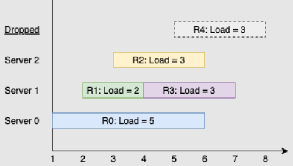

<!-- @import "[TOC]" {cmd="toc" depthFrom=1 depthTo=6 orderedList=false} -->

<!-- code_chunk_output -->

- [3745. 牛的学术圈 I（双指针）](#3745-牛的学术圈-i双指针)
- [1683. 困牛放牧（思维题+分类讨论）](#1683-困牛放牧思维题分类讨论)
- [1606. 找到处理最多请求的服务器](#1606-找到处理最多请求的服务器)

<!-- /code_chunk_output -->

### 3745. 牛的学术圈 I（双指针）

由于对计算机科学的热爱，以及有朝一日成为 「Bessie 博士」的诱惑，奶牛 Bessie 开始攻读计算机科学博士学位。

经过一段时间的学术研究，她已经发表了 $N$ 篇论文，并且她的第 $i$ 篇论文得到了来自其他研究文献的 $c_i$ 次引用。

Bessie 听说学术成就可以用 $h$ 指数来衡量。

$h$ 指数等于使得研究员有至少 $h$ 篇引用次数不少于 $h$ 的论文的最大整数 $h$。

例如，如果一名研究员有 $4$ 篇论文，引用次数分别为 $(1,100,2,3)$，则 $h$ 指数为 $2$，然而若引用次数为 $(1,100,3,3)$ 则 $h$ 指数将会是 $3$。

为了提升她的 $h$ 指数，Bessie 计划写一篇综述，并引用一些她曾经写过的论文。

由于页数限制，她至多可以在这篇综述中引用 $L$ 篇论文，并且<strong>她只能引用每篇她的论文至多一次</strong>。

请帮助 Bessie 求出在写完这篇综述后她可以达到的最大 $h$ 指数。

注意 Bessie 的导师可能会告知她纯粹为了提升 $h$ 指数而写综述存在违反学术道德的嫌疑；我们不建议其他学者模仿 Bessie 的行为。

<h4>输入格式</h4>

输入的第一行包含 $N$ 和 $L$。

第二行包含 $N$ 个空格分隔的整数 $c_1,…,c_N$。

<h4>输出格式</h4>

输出写完综述后 Bessie 可以达到的最大 $h$ 指数。

<h4>数据范围</h4>

- $1 \le N \le 10^5$,
- $0 \le c_i \le 10^5$,
- $0 \le L \le 10^5$

<h4>输入样例1：</h4>

```
4 0
1 100 2 3
```

<h4>输出样例1：</h4>

```
2
```

<h4>样例1解释</h4>

Bessie 不能引用任何她曾经写过的论文。上文中提到，$(1,100,2,3)$ 的 $h$ 指数为 $2$。

<h4>输入样例2：</h4>

```
4 1
1 100 2 3
```

<h4>输出样例2：</h4>

```
3
```

如果 Bessie 引用她的第三篇论文，引用数会变为 $(1,100,3,3)$。上文中提到，这一引用数的 $h$ 指数为 $3$。

```cpp
#include <iostream>
#include <cstring>
#include <algorithm>
using namespace std;

const int N = 1e5 + 10;
int n, L;
int q[N];

int main()
{
    scanf("%d%d", &n, &L);
    for (int i = 1; i <= n; ++ i) scanf("%d", &q[i]);
    sort(q + 1, q + n + 1, greater<int>());
    
    int res = 0;
    for (int h = 1, j = n; h <= n; ++ h)
    {
        // 找到最引用量最小的，但大于等于 h 的文献
        while (j && q[j] < h) -- j;
        // 如果此时第 h 小的文献引用量大于等于 h - 1
        // 并且需要额外引用的文献数量小于等于 L
        if (q[h] >= h - 1 && h - j <= L)
            res = h;
    }
    
    printf("%d\n", res);
}
```

### 1683. 困牛放牧（思维题+分类讨论）

Farmer John 的三头获奖奶牛 Bessie、Elsie 和 Mildred，总是会迷路走到农场上遥远的地方去！

他需要你帮助将她们一起赶回来。

农场的草地大体是一块狭长的区域——我们可以将其想象成一条数轴，奶牛可以占据数轴上的任意整数位置。

这 $3$ 头奶牛现在正位于不同的整数位置，Farmer John 想要移动她们，使得她们占据三个相邻的位置（例如，位置 $6、7、8$）。

不幸的是，奶牛们现在很困，Farmer John 要让她们集中精力听从命令移动并不容易。

任意时刻，他只能使得一头处在“端点”（在所有奶牛中位置最小或最大）位置的奶牛移动。

当他移动奶牛时，他可以命令她走到任意一个未被占用的整数位置，只要在新的位置上她不再是一个端点。

可以看到随着时间的推移，这样的移动可以使奶牛们趋向越来越近。

请求出使得奶牛们集中到相邻位置所进行的移动次数的最小和最大可能值。

<h4>输入格式</h4>

输入包含一行，包括三个空格分隔的整数，为 Bessie、Elsie 和 Mildred 的位置。

<h4>输出格式</h4>

输出的第一行包含 Farmer John 需要将奶牛们聚集起来所需进行的最小移动次数。

第二行包含他将奶牛聚集起来能够进行的最大移动次数。

<h4>数据范围</h4>

每个位置均为一个范围 $1…10^9$ 内的整数。

<h4>输入样例：</h4>

```
4 7 9
```

<h4>输出样例：</h4>

```
1
2
```

<h4>样例解释</h4>

最小移动次数为 $1$——如果 Farmer John 将位置 $4$ 的奶牛移动到位置 $8$，那么奶牛们就处在连续的位置 $7、8、9$。

最大移动次数为 $2$。例如，位置 $9$ 的奶牛可以被移动到位置 $6$，然后位置 $7$ 的奶牛可以被移动到位置 $5$。

```cpp
// 分类讨论，最小值的时候，如果三个挨着就是 0
// 如果两头牛差一个就是 1 ，否则是 2
// 最大值时候，一定有方法可以构造 max(x[2] - x[1] - 1, x[1] - x[0] - 1);
// （让两头牛贴着走）

#include <iostream>
#include <cstring>
#include <algorithm>
using namespace std;

int main()
{
    int x[3];
    for (int i = 0; i < 3; ++ i) cin >> x[i];
    
    if (x[2] - x[0] == 2) puts("0");
    else if (x[2] - x[1] == 2 || x[1] - x[0] == 2) puts("1");
    else puts("2");
    
    cout << max(x[2] - x[1] - 1, x[1] - x[0] - 1);
    return 0;
}
```

### 1606. 找到处理最多请求的服务器

你有 k 个服务器，编号为 0 到 k-1 ，它们可以同时处理多个请求组。每个服务器有无穷的计算能力但是 不能同时处理超过一个请求 。请求分配到服务器的规则如下：
- 第 i （序号从 0 开始）个请求到达。
- 如果所有服务器都已被占据，那么该请求被舍弃（完全不处理）。
- 如果第 `(i % k)` 个服务器空闲，那么对应服务器会处理该请求。
- 否则，将请求安排给下一个空闲的服务器（服务器构成一个环，必要的话可能从第 0 个服务器开始继续找下一个空闲的服务器）。比方说，如果第 i 个服务器在忙，那么会查看第 (i+1) 个服务器，第 (i+2) 个服务器等等。

给你一个 严格递增 的正整数数组 arrival ，表示第 i 个任务的到达时间，和另一个数组 load ，其中 load[i] 表示第 i 个请求的工作量（也就是服务器完成它所需要的时间）。你的任务是找到 最繁忙的服务器 。最繁忙定义为一个服务器处理的请求数是所有服务器里最多的。

请你返回包含所有 最繁忙服务器 序号的列表，你可以以任意顺序返回这个列表。

示例 1：



```
输入：k = 3, arrival = [1,2,3,4,5], load = [5,2,3,3,3] 
输出：[1] 
解释：
所有服务器一开始都是空闲的。
前 3 个请求分别由前 3 台服务器依次处理。
请求 3 进来的时候，服务器 0 被占据，所以它被安排到下一台空闲的服务器，也就是服务器 1 。
请求 4 进来的时候，由于所有服务器都被占据，该请求被舍弃。
服务器 0 和 2 分别都处理了一个请求，服务器 1 处理了两个请求。所以服务器 1 是最忙的服务器。
```

示例 2：
```
输入：k = 3, arrival = [1,2,3,4], load = [1,2,1,2]
输出：[0]
解释：
前 3 个请求分别被前 3 个服务器处理。
请求 3 进来，由于服务器 0 空闲，它被服务器 0 处理。
服务器 0 处理了两个请求，服务器 1 和 2 分别处理了一个请求。所以服务器 0 是最忙的服务器。
```

示例 3：
```
输入：k = 3, arrival = [1,2,3], load = [10,12,11]
输出：[0,1,2]
解释：每个服务器分别处理了一个请求，所以它们都是最忙的服务器。
```

示例 4：
```
输入：k = 3, arrival = [1,2,3,4,8,9,10], load = [5,2,10,3,1,2,2]
输出：[1]
```

示例 5：
```
输入：k = 1, arrival = [1], load = [1]
输出：[0]
```

提示：
- 1 <= k <= 10e5
- 1 <= arrival.length, load.length <= 10e5
- arrival.length == load.length
- 1 <= arrival[i], load[i] <= 10e9
- arrival 保证 严格递增 。

```cpp
class Solution {
public:
    vector<int> busiestServers(int k, vector<int> &arrival, vector<int> &load) {
        set<int> available;
        for (int i = 0; i < k; i++) {
            available.insert(i);
        }
        priority_queue<pair<int, int>, vector<pair<int, int>>, greater<>> busy;
        vector<int> requests(k);
        for (int i = 0; i < arrival.size(); i++) {
            while (!busy.empty() && busy.top().first <= arrival[i]) {
                available.insert(busy.top().second);
                busy.pop();
            }
            if (available.empty()) {
                continue;
            }
            auto p = available.lower_bound(i % k);  // 注意 set 使用自带的 lower_bound 才是 O(logn)
            if (p == available.end()) {
                p = available.begin();
            }
            requests[*p]++;
            busy.emplace(arrival[i] + load[i], *p);
            available.erase(p);  // 这里 set 的 iterator 用的非常精彩
        }
        int maxRequest = *max_element(requests.begin(), requests.end());
        vector<int> ret;
        for (int i = 0; i < k; i++) {
            if (requests[i] == maxRequest) {
                ret.push_back(i);
            }
        }
        return ret;
    }
};
```
