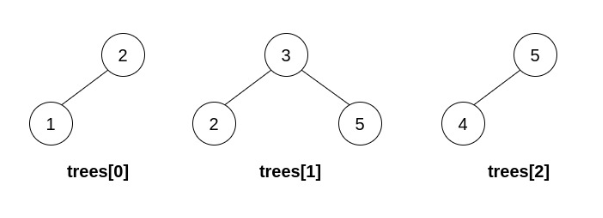
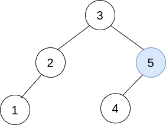
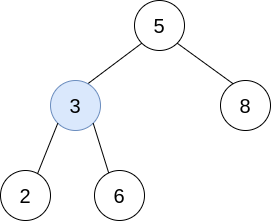
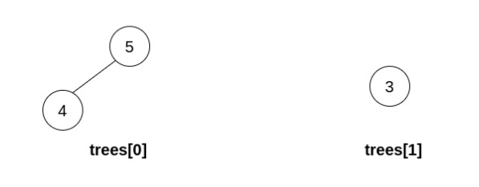

<!-- @import "[TOC]" {cmd="toc" depthFrom=1 depthTo=6 orderedList=false} -->

<!-- code_chunk_output -->

- [数组串联](#数组串联)
- [长度为 3 的不同回文子序列](#长度为-3-的不同回文子序列)
- [用三种不同颜色为网格涂色](#用三种不同颜色为网格涂色)
- [合并多棵二叉搜索树](#合并多棵二叉搜索树)

<!-- /code_chunk_output -->

### 数组串联

给你一个长度为 n 的整数数组 nums 。请你构建一个长度为 2n 的答案数组 ans ，数组下标 从 0 开始计数 ，对于所有 0 <= i < n 的 i ，满足下述所有要求：
- ans[i] == nums[i]
- ans[i + n] == nums[i]

具体而言，ans 由两个 nums 数组 串联 形成。

返回数组 ans 。

 

示例 1：
```
输入：nums = [1,2,1]
输出：[1,2,1,1,2,1]
解释：数组 ans 按下述方式形成：
- ans = [nums[0],nums[1],nums[2],nums[0],nums[1],nums[2]]
- ans = [1,2,1,1,2,1]
```

示例 2：
```
输入：nums = [1,3,2,1]
输出：[1,3,2,1,1,3,2,1]
解释：数组 ans 按下述方式形成：
- ans = [nums[0],nums[1],nums[2],nums[3],nums[0],nums[1],nums[2],nums[3]]
- ans = [1,3,2,1,1,3,2,1]
```

提示：

- `n == nums.length`
- `1 <= n <= 1000`
- `1 <= nums[i] <= 1000`

来源：力扣（LeetCode）
链接：https://leetcode-cn.com/problems/concatenation-of-array
著作权归领扣网络所有。商业转载请联系官方授权，非商业转载请注明出处。

```cpp
class Solution {
public:
    vector<int> getConcatenation(vector<int>& nums) {
        vector<int> res;
        for (int i = 0; i < 2; ++ i)
        {
            for (auto j: nums)
                res.push_back(j);
        }
        return res;
    }
};
```

### 长度为 3 的不同回文子序列

给你一个字符串 s ，返回 s 中 长度为 3 的不同回文子序列 的个数。

即便存在多种方法来构建相同的子序列，但相同的子序列只计数一次。

回文 是正着读和反着读一样的字符串。

子序列 是由原字符串删除其中部分字符（也可以不删除）且不改变剩余字符之间相对顺序形成的一个新字符串。

例如，"ace" 是 "abcde" 的一个子序列。
 

示例 1：
```
输入：s = "aabca"
输出：3
解释：长度为 3 的 3 个回文子序列分别是：
- "aba" ("aabca" 的子序列)
- "aaa" ("aabca" 的子序列)
- "aca" ("aabca" 的子序列)
```

示例 2：
```
输入：s = "adc"
输出：0
解释："adc" 不存在长度为 3 的回文子序列。
```

示例 3：
```
输入：s = "bbcbaba"
输出：4
解释：长度为 3 的 4 个回文子序列分别是：
- "bbb" ("bbcbaba" 的子序列)
- "bcb" ("bbcbaba" 的子序列)
- "bab" ("bbcbaba" 的子序列)
- "aba" ("bbcbaba" 的子序列)
```

提示：
- `3 <= s.length <= 105`
- `s 仅由小写英文字母组成`

来源：力扣（LeetCode）
链接：https://leetcode-cn.com/problems/unique-length-3-palindromic-subsequences
著作权归领扣网络所有。商业转载请联系官方授权，非商业转载请注明出处。

```cpp
class Solution {
    pair<char, char> p;
public:
    int countPalindromicSubsequence(string s) {
        map<char, int> table;
        int n = s.size();
        for (int i = 0; i < n - 2; ++ i)
        {
            if (table.count(s[i])) continue;
            for (int j = n; j > i + 1; -- j)
            {
                if (s[i] == s[j])
                {
                    table[s[i]] = 0;
                    set<char> sub_res;
                    for (int k = i + 1; k < j; k ++)
                    {
                        
                        if (sub_res.find(s[k]) != sub_res.end()) continue;
                        else
                        {
                            sub_res.insert(s[k]);
                            table[s[i]] += 1;
                        }
                    }
                    break;
                }
            }
        }
        
        int cnt = 0;
        for (auto s: table)
        {
            cnt += s.second;
        }
        return cnt;
    }
};
```

上面的代码是我写的，我的思路很直观，两边指针往中间夹逼：
- 左右两个指针相同时，派出第三个指针（如果左右两个指针遇到了之前遇到过的，则不派）
- 第三个指针在两个指针间走一遭，看看能碰到几个不同的字母

这道题我注意了以下几个知识点：
- 判断 `map<char, int> table` 是否存在键值，用 `table.count(key)`
- 判断 `set<char> sub_res` 是否存在值，用 `sub_res.find(s[k]) != sub_res.end()` ，存在的话，是不等于

大佬们似乎都先用前缀和和后缀和把数组优化一下，而且无需使用 STL ，使用 `bool vis[26][26]` 就好。 **题目中有关键信息：s 仅由小写英文字母组成。** 这有助于我们用 `vis[26][26]` 表示状态。

**我发现题目中的关键信息总藏在范围限定里。**

```cpp
const int N = 1e5 + 10, M = 26;
int lc[N][M], rc[N][M];  // 前缀和 后缀和
bool vis[M][M];  // vis[中间值][两边值]

class Solution {
public:
    int countPalindromicSubsequence(string s) {
        // 初始化
        for (int i = 0; i < s.size(); ++ i)
            for (int j = 0; j < M; ++ j)
                lc[i][j] = rc[i][j] = 0;
        
        // 前缀和
        for (int i = 0; i < s.size(); ++ i)
        {
            int c = s[i] - 'a';
            lc[i][c] = 1;
            if (i > 0)
                for (int j = 0; j < M; ++ j) lc[i][j] += lc[i - 1][j];
        }

        // 后缀和
        for (int i = s.size() - 1; i >= 0; -- i)
        {
            int c = s[i] - 'a';
            rc[i][c] = 1;
            if (i < s.size() - 1)
                for (int j = 0; j < M; ++ j) rc[i][j] += rc[i + 1][j];
        }
        
        memset(vis, false, sizeof vis);
        for (int i = 1; i < s.size() - 1; i ++)
            for (int j = 0; j < M; j ++)
                if (lc[i - 1][j] > 0 && rc[i + 1][j] > 0)
                    vis[s[i] - 'a'][j] = true;

        int res = 0;
        for (int i = 0; i < M; ++ i)
            for (int j = 0; j < M; ++ j)
                if (vis[i][j])
                    res += 1;

        return res;
    }
};
```

### 用三种不同颜色为网格涂色

给你两个整数 m 和 n 。构造一个 m x n 的网格，其中每个单元格最开始是白色。请你用 红、绿、蓝 三种颜色为每个单元格涂色。所有单元格都需要被涂色。

涂色方案需要满足：不存在相邻两个单元格颜色相同的情况 。返回网格涂色的方法数。因为答案可能非常大， 返回 对 $10^9 + 7$ 取余 的结果。

 

示例 1：


```
输入：m = 1, n = 1
输出：3
解释：如上图所示，存在三种可能的涂色方案。
```

示例 2：


```
输入：m = 1, n = 2
输出：6
解释：如上图所示，存在六种可能的涂色方案。
```

示例 3：
```
输入：m = 5, n = 5
输出：580986
```

提示：
- `1 <= m <= 5`
- `1 <= n <= 1000`

来源：力扣（LeetCode）
链接：https://leetcode-cn.com/problems/painting-a-grid-with-three-different-colors
著作权归领扣网络所有。商业转载请联系官方授权，非商业转载请注明出处。

```cpp
class Solution {
public:
    vector<vector<int>> states;
    
    typedef long long LL;
    int mod = 1e9 + 7;
    
    int generate_valid(int m)
    {
        if (m == 5)
            for (int i = 0; i < 3; i ++)
            for (int j = 0; j < 3; j ++)
            for (int k = 0; k < 3; k ++)
            for (int h = 0; h < 3; h ++)
            for (int l = 0; l < 3; l ++)
            if (i != j && j != k && k != h && h != l)
                states.push_back({i, j, k, h, l});
        
        if (m == 4)
            for (int i = 0; i < 3; i ++)
            for (int j = 0; j < 3; j ++)
            for (int k = 0; k < 3; k ++)
            for (int h = 0; h < 3; h ++)
            if (i != j && j != k && k != h)
                states.push_back({i, j, k, h});
        
        if (m == 3)
            for (int i = 0; i < 3; i ++)
            for (int j = 0; j < 3; j ++)
            for (int k = 0; k < 3; k ++)
            if (i != j && j != k)
                states.push_back({i, j, k});
        
        if (m == 2)
            for (int i = 0; i < 3; i ++)
            for (int j = 0; j < 3; j ++)
            if (i != j)
                states.push_back({i, j});
        
        if (m == 1)
            for (int i = 0; i < 3; i ++)
                states.push_back({i});

        return states.size();
    }
    
    bool is_valid(int st1, int st2, int m)
    {
        for (int i = 0; i < m; i ++)
            if (states[st1][i] == states[st2][i]) return false;
        return true;
    }

    int colorTheGrid(int m, int n) {
        int s = generate_valid(m);
        LL dp[n + 1][s];
        memset(dp, 0, sizeof dp);
        for (int i = 0; i < s; i ++)
        {
            dp[1][i] = 1;
        }
        if (n == 1) return s;
        for (int i = 2; i <= n; i ++)
        {
            for (int sti = 0; sti < s; sti ++)
            {
                for (int stj = 0; stj < s; stj ++)
                {
                    if (is_valid(sti, stj, m))
                        dp[i][sti] = (dp[i][sti] + dp[i - 1][stj]) % mod;
                }
            }
        }

        LL cnt = 0;
        for (int i = 0; i < s; i ++)
        {
            cnt = (cnt + dp[n][i]) % mod;
        }
        return (int) cnt;
    }
};
```

上面是我的题解：
- 非常可惜！思路完全正确，但是**考试时忘了加上 memset！！！** 说明对 C++ 二维数组初始化了解还不透彻！！！！
- 首先这道题肯定就是动态规划没跑了，其次我简单 `m <= 5` 便一下想到，肯定是把列作为状态传递，每列的状态数量是可以枚举出来的呀！因为每列长成什么样子，是数的过来的，两个列是否可挨着，决定了状态转移
- 因此这道题目就非常简单了，很经典的动态规划罢了，类似[蒙德里安的梦想](../../acwings/算法基础课/ybase16.md)

下面看看大佬的题解：
```cpp
typedef long long LL;
const int N = 1e3 + 10;
const int M = 250; // 3^5 = 243
const int mod = 1e9 + 7;

LL dp[N][M];
vector<int> edge[M];  // edge[状态] = {相邻合法状态/后继状态}
bool ava[M];  // 状态是否合法

// 三进制状态压缩，从1开始
int DIG[7] = {1, 3, 9, 27, 81, 243, 729};

class Solution {
public:

    int get(int st, int k)
    {
        return (st % DIG[k + 1]) / DIG[k];
    }

    int colorTheGrid(int m, int n) {
        // dp 必有初始化
        memset(dp, 0, sizeof dp);

        // lim = 3 ^ m
        int lim = 1;
        for (int i = 0; i < m; i ++) lim *= 3;

        // 求合法状态
        for (int i = 0; i < lim; i ++)
        {
            bool flag = true;
            for (int j = 0; j < m - 1; j ++)
                if (get(i, j) == get(i, j + 1))
                    flag = false;
            ava[i] = flag;
            edge[i].clear();
        }

        // 求后继状态
        for (int i = 0; i < lim; i ++)
        {
            if (ava[i] == false) continue;
            for (int j = 0; j < lim; j ++)
            {
                if (ava[j] == false) continue;
                bool flag = true;
                for (int k = 0; k < m; k ++)
                    if (get(i, k) == get(j, k))
                        flag = false;
                if (flag) edge[i].push_back(j);
            }
        }

        // dp
        for (int i = 0; i < lim; i ++)
            if (ava[i]) dp[1][i] = 1;
        for (int i = 2; i <= n; i ++)
            for (int j = 0; j < lim; j ++)
                for (int k: edge[j])
                    dp[i][k] = (dp[i][k] + dp[i - 1][j]) % mod;
        
        LL ans = 0;
        for (int i = 0; i < lim; i ++)
            ans = (ans + dp[n][i]) % mod;
        return (int) ans;
    }
};
```

大佬概括的好：就是个状态压缩的动态规划。我也想到要用进制压缩三进制信息，但是自己没这么干过，比赛时不敢用。以后没问题的，这下见过了。

### 合并多棵二叉搜索树

给你 n 个 二叉搜索树的根节点 ，存储在数组 trees 中（下标从 0 开始），对应 n 棵不同的二叉搜索树。trees 中的每棵二叉搜索树 最多有 3 个节点 ，且不存在值相同的两个根节点。在一步操作中，将会完成下述步骤：

- 选择两个 不同的 下标 `i` 和 `j` ，要求满足在 `trees[i]` 中的某个 叶节点 的值等于 `trees[j]` 的 根节点的值 。
- 用 `trees[j]` 替换 `trees[i]` 中的那个叶节点。
- 从 `trees` 中移除 `trees[j]` 。

如果在执行 n - 1 次操作后，能形成一棵有效的二叉搜索树，则返回结果二叉树的 根节点 ；如果无法构造一棵有效的二叉搜索树，返回 `null` 。

二叉搜索树是一种二叉树，且树中每个节点均满足下述属性：
- 任意节点的左子树中的值都 严格小于 此节点的值。
- 任意节点的右子树中的值都 严格大于 此节点的值。

叶节点是不含子节点的节点。

示例 1：



```
输入：trees = [[2,1],[3,2,5],[5,4]]
输出：[3,2,5,1,null,4]
解释：
第一步操作中，选出 i=1 和 j=0 ，并将 trees[0] 合并到 trees[1] 中。
删除 trees[0] ，trees = [[3,2,5,1],[5,4]] 。
```


```
在第二步操作中，选出 i=0 和 j=1 ，将 trees[1] 合并到 trees[0] 中。
删除 trees[1] ，trees = [[3,2,5,1,null,4]] 。
```


```
结果树如上图所示，为一棵有效的二叉搜索树，所以返回该树的根节点。
```

示例 2：


```
输入：trees = [[5,3,8],[3,2,6]]
输出：[]
解释：
选出 i=0 和 j=1 ，然后将 trees[1] 合并到 trees[0] 中。
删除 trees[1] ，trees = [[5,3,8,2,6]] 。
```



```
结果树如上图所示。仅能执行一次有效的操作，但结果树不是一棵有效的二叉搜索树，所以返回 null 。
```

示例 3：



```
输入：trees = [[5,4],[3]]
输出：[]
解释：无法执行任何操作。
```

示例 4：


```
输入：trees = [[2,1,3]]
输出：[2,1,3]
解释：trees 中只有一棵树，且这棵树已经是一棵有效的二叉搜索树，所以返回该树的根节点。
```
 

提示：
- `n == trees.length`
- $1 <= n <= 5 * 10^4$
- 每棵树中节点数目在范围 `[1, 3]` 内。
- `trees` 中不存在两棵树根节点值相同的情况。
- 输入中的所有树都是 有效的二叉树搜索树 。
- $1 <= TreeNode.val <= 5 * 10^4$.

来源：力扣（LeetCode）
链接：https://leetcode-cn.com/problems/merge-bsts-to-create-single-bst
著作权归领扣网络所有。商业转载请联系官方授权，非商业转载请注明出处。

```cpp
/**
 * Definition for a binary tree node.
 * struct TreeNode {
 *     int val;
 *     TreeNode *left;
 *     TreeNode *right;
 *     TreeNode() : val(0), left(nullptr), right(nullptr) {}
 *     TreeNode(int x) : val(x), left(nullptr), right(nullptr) {}
 *     TreeNode(int x, TreeNode *left, TreeNode *right) : val(x), left(left), right(right) {}
 * };
 */
#define PII pair<int, int>
#define MP(x, y) make_pair(x, y)

const int MAXN = 5e4 + 50;
TreeNode* lin[MAXN];  // lin[i] 根节点值为 i 对应哪棵树
bool vLeaf[MAXN];  // vLeaf[i] 值为 i 的叶子节点是否出现过
bool rUse[MAXN];  // rUse[i] 根节点值为 i 的树是否被用过了
bool failFlag;

class Solution {
public:
    // 递归建树
    void build(TreeNode* rt){
        // 输入根节点，代表一棵树
        // 根节点的值必须是没被用过的（即本树没被用过）
        rUse[rt->val] = true;
        if (rt->left){
            // 左边叶子节点与一棵树合并（如果有的话）
            if (lin[rt->left->val]) {
                // 叶子节点的值 rt->left->val 必须是没被用过的
                // 否则根值为 rt->left->val 的树会有两个及以上选择
                // 这样检出的二叉树会有重复元素，则不是二叉树搜索树
                if (!rUse[rt->left->val]){
                    rt->left = lin[rt->left->val];
                    build(rt->left);
                } else failFlag = true;
                
            }
        }
        if (rt->right){
            // 左边叶子节点与一棵树合并（如果有的话）
            if (lin[rt->right->val]) {
                if (!rUse[rt->right->val]){
                    rt->right = lin[rt->right->val];
                    build(rt->right);
                }else failFlag = true;
                
            }
        }
    }
    
    // 递归检查是不是二叉树
    // 如果有任何不合格，立马返回 MP(-1, -1)
    // 返回 MP(子树出现过的最小值, 子树出现过的最大值)
    // 检验时，用左子树的最大值和节点值比较；用右子树的最小值和节点值比较
    PII check(TreeNode* rt){
        int mi = rt->val, mx = rt->val;
        if (rt->left){
            PII left = check(rt->left);
            if (left.first == -1) return MP(-1, -1);
            if (left.second < rt->val){
                mi = min(left.first, mi);
            } else return MP(-1, -1);
        }
        if (rt->right){
            PII right = check(rt->right);
            if (right.first == -1) return MP(-1, -1);
            if (right.first > rt->val){
                mx = max(right.second, mx);
            } else return MP(-1, -1);
        }
        return MP(mi, mx);
    }
    
    TreeNode* canMerge(vector<TreeNode*>& trees) {
        // 第一步，找到出现过的最大值，用于初始化其他变量
        int n = 0;
        for (TreeNode* rt: trees){
            n = max(n, rt->val);
            if (rt->left) n = max(n, rt->left->val);  // 其实这句话可以不用
            // 因为输入中的所有树都是 有效的二叉树搜索树
            if (rt->right) n = max(n, rt->right->val);
        }
        
        // 第二步，根据 n 初始化变量
        for (int i = 0; i <= n; i++) {
            lin[i] = NULL;
            vLeaf[i] = false;
            rUse[i] = false;
        }

        // 第三步，更新 lin vLeaf rUse 这些变量
        for (TreeNode* rt: trees){
            // 有两棵树根节点值相同，显然不行
            if (lin[rt->val] != NULL) return NULL;
            lin[rt->val] = rt;
            if (rt->left) vLeaf[rt->left->val] = true;
            if (rt->right) vLeaf[rt->right->val] = true;
        }
        
        // 第四步，找根节点
        TreeNode* root = NULL;
        for (TreeNode* rt: trees){
            // 根节点满足一个条件就行
            // 没有叶子节点的值是这个根节点的值
            if (vLeaf[rt->val] == false) {
                // 如果有两个根节点的值都是独特的（不与任何叶子节点相等）
                // 那么则必有一棵树无法合并，因此不对
                // 表现为 root 可能被重复赋值
                if (root != NULL) return NULL;
                root = rt;
            }
        }
        // 找不到根节点也不对
        if (root == NULL) return NULL;
        
        // 第四步，建树
        failFlag = false;
        build(root);
        if (failFlag) return NULL;
        for (TreeNode* rt: trees)
            if (rUse[rt->val] == false) return NULL;
        
        // 第五步，检查树是否是 有效的二叉树搜索树
        PII cur = check(root);
        if (cur.first != -1) return root;
        return NULL;
    }
};
```

建树的过程是唯一的，如果出现一个根节点，面临两个值一样的叶子节点的情况，则无法建树。因此，先建树，再检查：
- 是否把所有树都包含了（等价于`n-1`次操作）
- 是否是二叉搜索树

这里要很明确一点：
- **二叉搜索树不会出现两个重复元素**
- 因此如果出现两个叶子节点值都与某个根节点值相同，则一定是不对的
