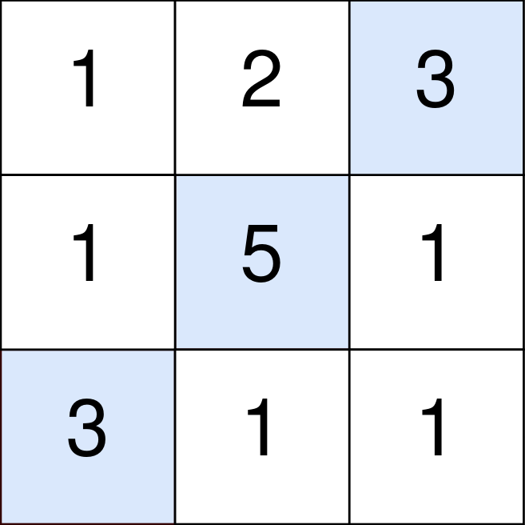

<!-- @import "[TOC]" {cmd="toc" depthFrom=1 depthTo=6 orderedList=false} -->

<!-- code_chunk_output -->

- [可以输入的最大单词数](#可以输入的最大单词数)
- [新增的最少台阶数](#新增的最少台阶数)
- [扣分后的最大得分（滚动数组+DP推导优化）](#扣分后的最大得分滚动数组dp推导优化)
- [查询最大基因差（字典树+主席树/离线）](#查询最大基因差字典树主席树离线)

<!-- /code_chunk_output -->

这次周赛前和老师开会。回来时都十一点了。

正确答案全都做出来了，但是后两道题目超时。

### 可以输入的最大单词数

键盘出现了一些故障，有些字母键无法正常工作。而键盘上所有其他键都能够正常工作。

给你一个由若干单词组成的字符串 text ，单词间由单个空格组成（不含前导和尾随空格）；另有一个字符串 brokenLetters ，由所有已损坏的不同字母键组成，返回你可以使用此键盘完全输入的 text 中单词的数目。

示例 1：

```
输入：text = "hello world", brokenLetters = "ad"
输出：1
解释：无法输入 "world" ，因为字母键 'd' 已损坏。
```

示例 2：

```
输入：text = "leet code", brokenLetters = "lt"
输出：1
解释：无法输入 "leet" ，因为字母键 'l' 和 't' 已损坏。
```

示例 3：

```
输入：text = "leet code", brokenLetters = "e"
输出：0
解释：无法输入任何单词，因为字母键 'e' 已损坏。
```

提示：
- 1 <= text.length <= $10^4$
- `0 <= brokenLetters.length <= 26`
- text 由若干用单个空格分隔的单词组成，且不含任何前导和尾随空格
- 每个单词仅由小写英文字母组成
- brokenLetters 由 互不相同 的小写英文字母组成

```cpp
const int N = 30;
bool broke[N];

class Solution {
public:
    int canBeTypedWords(string text, string brokenLetters) {
        
        for (int i = 0; i < N; ++ i) broke[i] = false;
        
        for (auto b : brokenLetters)
        {
            broke[b - 'a'] = true;
        }
        
        int ans = 0;
        bool flag = true;
        for (int i = 0; i < text.size(); ++ i)
        {
            if (text[i] == ' ')
            {
                if (flag) ans ++;
                flag = true;
            }
            else
            {
                if (broke[text[i] - 'a']) flag = false;
            }
        }
        if (flag) ans ++;
        return ans;
    }
};
```


**经验：**
- 如上图！！全局变量在作用域内部还是要初始化一下！！要不然 LeetCode 可能把上个用例的全局变量放到这个用例里面来！

### 新增的最少台阶数

给你一个 `严格递增` 的整数数组 rungs ，用于表示梯子上每一台阶的 `高度` 。当前你正站在高度为 0 的地板上，并打算爬到最后一个台阶。

另给你一个整数 dist 。每次移动中，你可以到达下一个距离你当前位置（地板或台阶）不超过 dist 高度的台阶。当然，你也可以在任何正 整数 高度处插入尚不存在的新台阶。

返回爬到最后一阶时必须添加到梯子上的 最少 台阶数。

示例 1：

```
输入：rungs = [1,3,5,10], dist = 2
输出：2
解释：
现在无法到达最后一阶。
在高度为 7 和 8 的位置增设新的台阶，以爬上梯子。 
梯子在高度为 [1,3,5,7,8,10] 的位置上有台阶。
```

示例 2：

```
输入：rungs = [3,6,8,10], dist = 3
输出：0
解释：
这个梯子无需增设新台阶也可以爬上去。
```

示例 3：

```
输入：rungs = [3,4,6,7], dist = 2
输出：1
解释：
现在无法从地板到达梯子的第一阶。 
在高度为 1 的位置增设新的台阶，以爬上梯子。 
梯子在高度为 [1,3,4,6,7] 的位置上有台阶。
```

示例 4：

```
输入：rungs = [5], dist = 10
输出：0
解释：这个梯子无需增设新台阶也可以爬上去。
```

提示：
- 1 <= rungs.length <= $10^5$
- 1 <= rungs[i] <= $10^9$
- 1 <= dist <= $10^9$
- rungs 严格递增

```cpp
/*
* 超时搜索版
*/
class Solution {
public:
    int addRungs(vector<int>& rungs, int dist) {
        vector<int> delta;
        delta.push_back(rungs[0]);
        for (int i = 0; i < rungs.size() - 1; ++ i)
        {
            delta.push_back(rungs[i + 1] - rungs[i]);
        }
        
        int loca = 0;
        int step = 0;
        int ans = 0;
        while (loca < rungs.back())
        {
            if (loca + dist >= rungs[step])
            {
                loca = rungs[step];
                step ++ ;
            }
            else
            {
                loca += dist;
                ans ++ ;
            }
        }
        return ans;
    }
};
```

上面的 TLE ，下面的没超时。

```cpp
class Solution {
public:
    int addRungs(vector<int>& rungs, int dist) {
    
        vector<int> delta;
        delta.push_back(rungs[0]);
        
        int ans = 0;
        for (int i = 0; i < rungs.size(); ++ i)
        {
            int height;
            if (i == 0)
                height = rungs[i] - 0;
            else
                height = rungs[i] - rungs[i - 1];

            ans += (height - 1) / dist;
        }
        
        return ans;
    }
};
```

**经验：**
- 能用数学推导的关系就用数学推导！要不然很容易 TLE ！！！

### 扣分后的最大得分（滚动数组+DP推导优化）

你一个 m x n 的整数矩阵 points （下标从 0 开始）。一开始你的得分为 0 ，你想最大化从矩阵中得到的分数。

你的得分方式为：每一行 中选取一个格子，选中坐标为 (r, c) 的格子会给你的总得分 增加 points[r][c] 。

然而，相邻行之间被选中的格子如果隔得太远，你会失去一些得分。对于相邻行 r 和 r + 1 （其中 0 <= r < m - 1），选中坐标为 (r, c1) 和 (r + 1, c2) 的格子，你的总得分 减少 abs(c1 - c2) 。

请你返回你能得到的 最大 得分。

abs(x) 定义为：
- 如果 x >= 0 ，那么值为 x 。
- 如果 x < 0 ，那么值为 -x 。

示例 1：



```
输入：points = [[1,2,3],[1,5,1],[3,1,1]]
输出：9
解释：
蓝色格子是最优方案选中的格子，坐标分别为 (0, 2)，(1, 1) 和 (2, 0) 。
你的总得分增加 3 + 5 + 3 = 11 。
但是你的总得分需要扣除 abs(2 - 1) + abs(1 - 0) = 2 。
你的最终得分为 11 - 2 = 9 。
```

示例 2：


```
输入：points = [[1,5],[2,3],[4,2]]
输出：11
解释：
蓝色格子是最优方案选中的格子，坐标分别为 (0, 1)，(1, 1) 和 (2, 0) 。
你的总得分增加 5 + 3 + 4 = 12 。
但是你的总得分需要扣除 abs(1 - 1) + abs(1 - 0) = 1 。
你的最终得分为 12 - 1 = 11 。
```

提示：
- m == points.length
- n == points[r].length
- 1 <= m, n <= $10^5$
- 1 <= m * n <= $10^5$
- 0 <= points[r][c] <= $10^5$

```cpp
/*
* 超时版本
*/
typedef long long LL;

class Solution {
public:
    long long maxPoints(vector<vector<int>>& points) {
        int m = points.size();
        int n = points[0].size();
        
        LL dp[m + 1][n + 1];
        memset(dp, 0, sizeof dp);
        
        for (int c = 0; c < n; ++ c) dp[0][c] = points[0][c];
        
        for (int r = 1; r < m; ++ r)
        {
            for (int c0 = 0; c0 < n; ++ c0)
            {
                for (int c1 = 0; c1 < n; ++ c1)
                {
                    dp[r][c1] = max(dp[r][c1], dp[r - 1][c0] + points[r][c1] - abs(c1 - c0));
                }
            }
        }
        
        LL ans = 0;
        for (int c = 0; c < n; ++ c) ans = max(dp[m - 1][c], ans);
        
        return ans;
    }
};
```

啊！超时！不用动态规划用什么呢？让我看看大佬的思路吧！

确实得用动态规划，但是动态规划在这里时间复杂度 $O(nm^2)$ ，咱们把其优化成 $O(nm*常数)$ 的，总结起来，其实使用了双层动态规划。

于是优化：

```cpp
dp[r][c1] = max(dp[r][c1], dp[r - 1][c0] + points[r][c1] - abs(c1 - c0));
// 上式中，观察 dp[r - 1][c0] + points[r][c1] - abs(c1 - c0)
// 可以化简为
dp[r - 1][c0] + points[r][c1] - c1 + c0;  // 当 c1 >= c0 时
dp[r - 1][c0] + points[r][c1] + c1 - c0;  // 当 c1 <= c0 时
// 即
(dp[r - 1][c0] + c0) + (points[r][c1] - c1);  // 当 c1 >= c0 时
(dp[r - 1][c0] - c0) + (points[r][c1] + c1);  // 当 c1 <= c0 时
```

如上，更新公式就被拆分成两项，前一项只与 c0 有关，后一项只与 c1 有关。这就可以再用动态规划来做！（本来需要遍历 `m * m` 个的，但是因为前一维度与后一维度有递推关系（`c1 \le 或者 \ge c0`），因此可以用动态规划！）

**经验：**
- 对于 `(dp[r - 1][c0] + c0) + (points[r][c1] - c1);  // 当 c1 >= c0 时` 这种前后状态有递推关系的式子，可以用动态规划来做

```cpp
for (int j = 0; j < m; j++) dp[0][j] = points[0][j];

    for (int i = 1; i < n; i++){
        // 滚动数组中， pi 上一行， ni 当前行
        int pi = (i - 1) & 1, ni = i & 1;
        for (int j = 0; j < m; j++) dp[ni][j] = -INF;

        LL best = -INF;
        for (int c1 = 0; c1 < m; ++ c1)
        {
            // best 里保存 dp[pi][c0] + c0, c0 <= c1
            best = max(best, dp[pi][c1] + c1);
            dp[ni][c1] = max(dp[ni][c1], best + points[i][c1] - c1);
        }
        best = -INF;
        for (int c1 = m - 1; c1 >= 0; -- c1)
        {
            // best 里保存 dp[pi][c0] - c0, c0 >= c1
            best = max(best, dp[pi][c1] - c1);
            dp[ni][c1] = max(dp[ni][c1], best + points[i][c1] + c1);
        }
    }
```

我这里是直接维护公式中前一项（`dp[r - 1][c0] ± c0`），[周植大佬](https://leetcode-cn.com/u/wnjxyk/)则维护了 `dp[r - 1][c0] + c0 - c1)` 或 `dp[r - 1][c0] - c0 + c1`，其实这个变量的意义更好想，直接 `mx = max(mx - 1LL, dp[pi][j]);` 就行，离我遍历过的前一项远一格，我就减一。严格的证明在代码中。

```cpp
#define LL long long
const LL INF = 1e10;
const int MAXN = 1e5 + 50;
LL dp[2][MAXN];

class Solution {
public:
    long long maxPoints(vector<vector<int>>& points) {
        int n = points.size(), m = points[0].size();

        for (int j = 0; j < m; j++) dp[0][j] = points[0][j];
        
        for (int i = 1; i < n; i++){
            int pi = (i - 1) & 1, ni = i & 1;
            for (int j = 0; j < m; j++) dp[ni][j] = -INF;
            
            LL mx = -INF;
            // mx = max(dp[i - 1][k] + k - j)
            // mx_{j - 1} = max(dp[i - 1][k] + k - j + 1), k <= j - 1
            // mx_{j}     = max(dp[i - 1][k] + k - j)    , k <= j
            // 所以 mx_{j}     = max(dp[i - 1][k], mx_{j - 1} - 1)
            for (int j = 0; j < m; j++){
                mx = max(mx - 1LL, dp[pi][j]);
                dp[ni][j] = max(dp[ni][j], mx + points[i][j]);
            }
            mx = -INF;
            // mx = max(dp[i - 1][k] - k + j)
            // mx_{j + 1} = max(dp[i - 1][k] - k + j + 1), k >= j + 1
            // mx_{j}     = max(dp[i - 1][k] - k + j)    , k >= j
            // 所以 mx_{j}     = max(dp[i - 1][k], mx_{j + 1} - 1)
            for (int j = m - 1; j >= 0; j--){
                mx = max(mx - 1LL, dp[pi][j]);
                dp[ni][j] = max(dp[ni][j], mx + points[i][j]);
            }
        }

        LL ans = -INF;
        for (int j = 0; j < m; j++)
            ans = max(ans, dp[(n - 1) & 1][j]);
        return ans;
    }
};
```

### 查询最大基因差（字典树+主席树/离线）

给你一棵 n 个节点的有根树，节点编号从 0 到 n - 1 。每个节点的编号表示这个节点的 独一无二的基因值 （也就是说节点 x 的基因值为 x）。两个基因值的 基因差 是两者的 异或和 。给你整数数组 parents ，其中 parents[i] 是节点 i 的父节点。如果节点 x 是树的 根 ，那么 parents[x] == -1 。

给你查询数组 queries ，其中 $queries[i] = [node_i, val_i]$ 。对于查询 i ，请你找到 $val_i$ 和 $p_i$ 的 最大基因差 ，其中 $p_i$ 是节点 $node_i$ 到根之间的任意节点（包含 $node_i$ 和根节点）。更正式的，你想要最大化 $val_i \; XOR \; p_i$ 。

请你返回数组 ans ，其中 ans[i] 是第 i 个查询的答案。

示例 1：


```
输入：parents = [-1,0,1,1], queries = [[0,2],[3,2],[2,5]]
输出：[2,3,7]
解释：查询数组处理如下：
- [0,2]：最大基因差的对应节点为 0 ，基因差为 2 XOR 0 = 2 。
- [3,2]：最大基因差的对应节点为 1 ，基因差为 2 XOR 1 = 3 。
- [2,5]：最大基因差的对应节点为 2 ，基因差为 5 XOR 2 = 7 。
```

示例 2：


```
输入：parents = [3,7,-1,2,0,7,0,2], queries = [[4,6],[1,15],[0,5]]
输出：[6,14,7]
解释：查询数组处理如下：
- [4,6]：最大基因差的对应节点为 0 ，基因差为 6 XOR 0 = 6 。
- [1,15]：最大基因差的对应节点为 1 ，基因差为 15 XOR 1 = 14 。
- [0,5]：最大基因差的对应节点为 2 ，基因差为 5 XOR 2 = 7 。
```

提示：
- 2 <= parents.length <= $10^5$
- 对于每个 不是 根节点的 i ，有 0 <= parents[i] <= parents.length - 1 。
- parents[root] == -1
- 1 <= queries.length <= 3 * $10^4$
- 0 <= nodei <= parents.length - 1
- 0 <= vali <= 2 * $10^5$

```cpp
// 超时，通过用例 50 / 58
class Solution {
public:
    vector<int> maxGeneticDifference(vector<int>& parents, vector<vector<int>>& queries) {
        
        vector<int> anses;
        
        for (auto q: queries)
        {
            int node = q[0];
            int val  = q[1];

            int ans = 0;
            while (parents[node] != -1)
            {
                ans = max(ans, val ^ node);
                node = parents[node];
            }
            ans = max(ans, val ^ node);
            
            anses.push_back(ans);
        }
        
        return anses;
    }
};
```

啊！让我看看大佬的思路吧！

```cpp
/*
* 维护字典树查找最大的基因差
* 主席树维护每个节点的字典树
*/
#define PII pair<int, int>
#define MP(x, y) make_pair(x, y)

const int MAXN = 2e5 + 50;
vector<int> edge[MAXN];
vector<PII> qey[MAXN];   // 每个查询
int ans[MAXN];

struct Node{
    int ch[2], siz;
}node[MAXN * 25];  // 每个数对应一条链，一条链顶多长度 25
int numn;
int initNode(){
    int x = ++numn;
    node[x].ch[0] = node[x].ch[1] = 0;
    node[x].siz = 0;
    return x;
}

class Solution {
public:
    void dfs(int x, int from, int rt){
        // x 是当值， from 是其父亲的值， rt 是父亲维护的字典树
        // x 是一个数，也就是 Trie 树中一条链
        // x 的数与其父亲对应的树差距顶多也就是一条链
        // root 是 x 对应的树
        int root = initNode();
        int cur = root;
        for (int i = 19; i >= 0; i--){
            int v = (x >> i) & 1;
            node[cur].siz = node[rt].siz + 1;  // 比父亲的节点 siz 多一个
            node[cur].ch[v ^ 1] = node[rt].ch[v ^ 1];  // 当前无关的分支是 v^1 ，因此抄父亲的分支
            node[cur].ch[v] = initNode();  // v 分支建立新节点
            rt = node[rt].ch[v];  // 沿着分支往下走
            cur = node[cur].ch[v];  // 沿着分支往下走
        }
        node[cur].siz += 1;
        
        for (PII &Q: qey[x]){
            int idx = Q.first, val = Q.second;
            cur = root;
            int ret = 0;
            for (int i = 19; i >= 0; i--){
                int v = ((val >> i) & 1) ^ 1;
                if (node[node[cur].ch[v]].siz > 0){
                    ret += (1<<i);
                    cur = node[cur].ch[v];
                }else cur = node[cur].ch[v ^ 1];
            }
            ans[idx] = ret;
        }
        
        for (int v: edge[x]){
            if (v == from) continue;
            dfs(v, x, root);
        }
        
    }
    
    vector<int> maxGeneticDifference(vector<int>& parents, vector<vector<int>>& queries) {
        int n = parents.size(), rt = -1;
        for (int i = 0; i <= n; i++) edge[i].clear(), qey[i].clear();
        for (int i = 0; i < n; i++){  // 建树，父节点指向子节点
            if (parents[i] == -1) rt = i; else{
                edge[parents[i]].push_back(i);
            }
        }
        
        int m = queries.size();
        for (int i = 0; i < m; i++){  // 记录查询
            int node = queries[i][0], val = queries[i][1];
            qey[node].push_back(MP(i, val));
        }
        
        // node[0] 是字典树的根节点
        numn = 0;
        node[0].ch[0] = node[0].ch[1] = 0;
        node[0].siz = 0;
        dfs(rt, -1, 0);        
        
        vector<int> ret;
        for (int i = 0; i < m; i++)
            ret.push_back(ans[i]);
        return ret;
    }
};
```

现在没太搞懂主席树，据说“离线”是更好的做法。

[LeetCode-Solution](https://leetcode-cn.com/problems/maximum-genetic-difference-query/solution/cha-xun-zui-da-ji-yin-chai-by-leetcode-s-sybl/)：

思路与算法

对于给定的询问 $(\textit{node}_i, \textit{val}_i)$ ，我们需要找出从根节点到节点 $\textit{node}_i$ 的路径中使得 $p_i \oplus \textit{val}_i$ 达到最大值的节点 $p_i$ ，其中 \oplus⊕ 表示按位异或运算。那么我们可以从根节点开始，对整棵树进行一次深度优先遍历，即：
- 当我们第一次遍历到某一节点 $i$ 时，我们将 $i$ 放入「数据结构」中；
- 当我们遍历完所有节点 $i$ 的子节点，即将回溯到 $i$ 的父节点前，我们将 $i$ 从「数据结构」中移除。

这样一来，我们就可以通过「离线」的思想将每一个询问 $(\textit{node}_i, \textit{val}_i)$ 在遍历到节点 $\textit{val}_i$ 时进行求解。这是因为，如果当前正在遍历节点 $\textit{val}_i$ ，那么数据结构中就存放着所有从根节点到节点 $\textit{val}_i$ 的路径上的所有节点。此时，我们只需要找出数据结构中使得 $p_i \oplus \textit{val}_i$ 达到最大值的节点 $p_i$ 即可。

一种满足要求的数据结构即为字典树。

在本题中，我们希望字典树能够：
- 添加一个数；
- 删除一个数；
- 查询与给定的 $\textit{val}_i$ 进行异或运算可以达到的最大值。

细节：由于字典树中存储的是每个数的二进制表示，因此我们需要确定题目中最大的数的二进制表示的位数。在本题中，节点的编号不超过 $10^5$ ，询问中的 $\textit{val}_i$ 不超过 $2\times 10^5$ ，由于 $2^{17} < 2\times 10^5 < 2^{18}$ ，那么最大的数的二进制表示不会超过 $18$ 位。

代码：

在下面的 $\texttt{C++}$ 代码中，我们没有对字典树进行析构操作。如果读者在面试中遇到了本题，对于是否进行析构这一问题，需要与面试官进行沟通。

```cpp
struct Trie {
    Trie* left;
    Trie* right;
    // 由于我们的字典树需要支持删除数的操作
    // 因此这里使用 cnt 变量进行记录该节点对应的数的个数
    int cnt;

    Trie(): left(nullptr), right(nullptr), cnt(0) {}
};

class Solution {
private:
    // 最大的数的二进制表示不会超过 18 位
    // 那么二进制位的下标范围为 [0, 17]
    static constexpr int MAXD = 17;

public:
    vector<int> maxGeneticDifference(vector<int>& parents, vector<vector<int>>& queries) {
        int n = parents.size();

        // 将 parents 存储为树的形式，方便进行深度优先遍历
        vector<vector<int>> edges(n);
        // 找出根节点
        int root = -1;
        for (int i = 0; i < n; ++i) {
            if (parents[i] == -1) {
                root = i;
            }
            else {
                edges[parents[i]].push_back(i);
            }
        }

        int q = queries.size();
        // 使用离线的思想，stored[i] 存储了所有节点 i 对应的询问
        vector<vector<pair<int, int>>> stored(n);
        vector<int> ans(q);
        for (int i = 0; i < q; ++i) {
            stored[queries[i][0]].emplace_back(i, queries[i][1]);
        }

        Trie* r = new Trie();

        // 向字典树添加一个数
        // https://docs.microsoft.com/en-us/cpp/cpp/lambda-expressions-in-cpp?redirectedfrom=MSDN&view=msvc-160
        auto trie_insert = [&](int x) {
            Trie* cur = r;
            for (int i = MAXD; i >= 0; --i) {
                if (x & (1 << i)) {
                    if (!cur->right) {
                        cur->right = new Trie();
                    }
                    cur = cur->right;
                }
                else {
                    if (!cur->left) {
                        cur->left = new Trie();
                    }
                    cur = cur->left;
                }
                ++cur->cnt;
            }
        };

        // 对于给定的 x，返回字典树中包含的数与 x 进行异或运算可以达到的最大值
        auto trie_query = [&](int x) -> int {
            int ret = 0;
            Trie* cur = r;
            for (int i = MAXD; i >= 0; --i) {
                if (x & (1 << i)) {
                    if (cur->left && cur->left->cnt) {
                        ret |= (1 << i);
                        cur = cur->left;
                    }
                    else {
                        cur = cur->right;
                    }
                }
                else {
                    if (cur->right && cur->right->cnt) {
                        ret |= (1 << i);
                        cur = cur->right;
                    }
                    else {
                        cur = cur->left;
                    }
                }
            }
            return ret;
        };

        // 从字典树中删除一个数
        auto trie_erase = [&](int x) {
            Trie* cur = r;
            for (int i = MAXD; i >= 0; --i) {
                if (x & (1 << i)) {
                    cur = cur->right;
                }
                else {
                    cur = cur->left;
                }
                --cur->cnt;
            }
        };

        // 深度优先遍历
        function<void(int)> dfs = [&](int u) {
            trie_insert(u);
            for (auto [idx, num]: stored[u]) {
                ans[idx] = trie_query(num);
            }
            for (int v: edges[u]) {
                dfs(v);
            }
            trie_erase(u);
        };

        dfs(root);
        return ans;
    }
};
```
