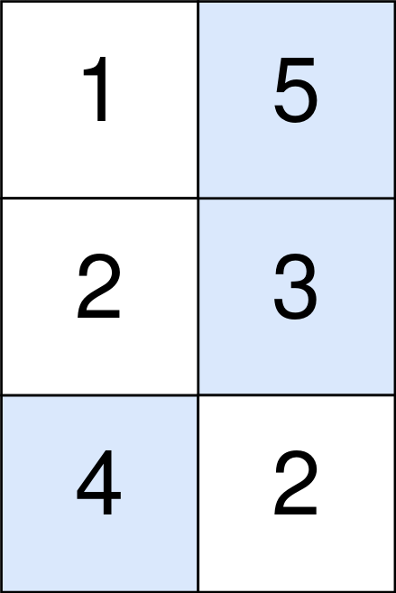

<!-- @import "[TOC]" {cmd="toc" depthFrom=1 depthTo=6 orderedList=false} -->

<!-- code_chunk_output -->

- [可以输入的最大单词数](#可以输入的最大单词数)
- [新增的最少台阶数](#新增的最少台阶数)
- [扣分后的最大得分](#扣分后的最大得分)
- [查询最大基因差](#查询最大基因差)

<!-- /code_chunk_output -->

这次周赛前和老师开会。回来时都十一点了。

正确答案全都做出来了，但是后两道题目超时。

### 可以输入的最大单词数

键盘出现了一些故障，有些字母键无法正常工作。而键盘上所有其他键都能够正常工作。

给你一个由若干单词组成的字符串 text ，单词间由单个空格组成（不含前导和尾随空格）；另有一个字符串 brokenLetters ，由所有已损坏的不同字母键组成，返回你可以使用此键盘完全输入的 text 中单词的数目。

示例 1：

```
输入：text = "hello world", brokenLetters = "ad"
输出：1
解释：无法输入 "world" ，因为字母键 'd' 已损坏。
```

示例 2：

```
输入：text = "leet code", brokenLetters = "lt"
输出：1
解释：无法输入 "leet" ，因为字母键 'l' 和 't' 已损坏。
```

示例 3：

```
输入：text = "leet code", brokenLetters = "e"
输出：0
解释：无法输入任何单词，因为字母键 'e' 已损坏。
```

提示：
- 1 <= text.length <= $10^4$
- `0 <= brokenLetters.length <= 26`
- text 由若干用单个空格分隔的单词组成，且不含任何前导和尾随空格
- 每个单词仅由小写英文字母组成
- brokenLetters 由 互不相同 的小写英文字母组成

```cpp
const int N = 30;
bool broke[N];

class Solution {
public:
    int canBeTypedWords(string text, string brokenLetters) {
        
        for (int i = 0; i < N; ++ i) broke[i] = false;
        
        for (auto b : brokenLetters)
        {
            broke[b - 'a'] = true;
        }
        
        int ans = 0;
        bool flag = true;
        for (int i = 0; i < text.size(); ++ i)
        {
            if (text[i] == ' ')
            {
                if (flag) ans ++;
                flag = true;
            }
            else
            {
                if (broke[text[i] - 'a']) flag = false;
            }
        }
        if (flag) ans ++;
        return ans;
    }
};
```


**经验：**
- 如上图！！全局变量在作用域内部还是要初始化一下！！要不然 LeetCode 可能把上个用例的全局变量放到这个用例里面来！

### 新增的最少台阶数

给你一个 `严格递增` 的整数数组 rungs ，用于表示梯子上每一台阶的 `高度` 。当前你正站在高度为 0 的地板上，并打算爬到最后一个台阶。

另给你一个整数 dist 。每次移动中，你可以到达下一个距离你当前位置（地板或台阶）不超过 dist 高度的台阶。当然，你也可以在任何正 整数 高度处插入尚不存在的新台阶。

返回爬到最后一阶时必须添加到梯子上的 最少 台阶数。

示例 1：

```
输入：rungs = [1,3,5,10], dist = 2
输出：2
解释：
现在无法到达最后一阶。
在高度为 7 和 8 的位置增设新的台阶，以爬上梯子。 
梯子在高度为 [1,3,5,7,8,10] 的位置上有台阶。
```

示例 2：

```
输入：rungs = [3,6,8,10], dist = 3
输出：0
解释：
这个梯子无需增设新台阶也可以爬上去。
```

示例 3：

```
输入：rungs = [3,4,6,7], dist = 2
输出：1
解释：
现在无法从地板到达梯子的第一阶。 
在高度为 1 的位置增设新的台阶，以爬上梯子。 
梯子在高度为 [1,3,4,6,7] 的位置上有台阶。
```

示例 4：

```
输入：rungs = [5], dist = 10
输出：0
解释：这个梯子无需增设新台阶也可以爬上去。
```

提示：
- 1 <= rungs.length <= $10^5$
- 1 <= rungs[i] <= $10^9$
- 1 <= dist <= $10^9$
- rungs 严格递增

```cpp
/*
* 超时搜索版
*/
class Solution {
public:
    int addRungs(vector<int>& rungs, int dist) {
        vector<int> delta;
        delta.push_back(rungs[0]);
        for (int i = 0; i < rungs.size() - 1; ++ i)
        {
            delta.push_back(rungs[i + 1] - rungs[i]);
        }
        
        int loca = 0;
        int step = 0;
        int ans = 0;
        while (loca < rungs.back())
        {
            if (loca + dist >= rungs[step])
            {
                loca = rungs[step];
                step ++ ;
            }
            else
            {
                loca += dist;
                ans ++ ;
            }
        }
        return ans;
    }
};
```

上面的 TLE ，下面的没超时。

```cpp
class Solution {
public:
    int addRungs(vector<int>& rungs, int dist) {
    
        vector<int> delta;
        delta.push_back(rungs[0]);
        
        int ans = 0;
        for (int i = 0; i < rungs.size(); ++ i)
        {
            int height;
            if (i == 0)
                height = rungs[i] - 0;
            else
                height = rungs[i] - rungs[i - 1];

            ans += (height - 1) / dist;
        }
        
        return ans;
    }
};
```

**经验：**
- 能用数学推导的关系就用数学推导！要不然很容易 TLE ！！！

### 扣分后的最大得分

你一个 m x n 的整数矩阵 points （下标从 0 开始）。一开始你的得分为 0 ，你想最大化从矩阵中得到的分数。

你的得分方式为：每一行 中选取一个格子，选中坐标为 (r, c) 的格子会给你的总得分 增加 points[r][c] 。

然而，相邻行之间被选中的格子如果隔得太远，你会失去一些得分。对于相邻行 r 和 r + 1 （其中 0 <= r < m - 1），选中坐标为 (r, c1) 和 (r + 1, c2) 的格子，你的总得分 减少 abs(c1 - c2) 。

请你返回你能得到的 最大 得分。

abs(x) 定义为：
- 如果 x >= 0 ，那么值为 x 。
- 如果 x < 0 ，那么值为 -x 。

示例 1：


```
输入：points = [[1,2,3],[1,5,1],[3,1,1]]
输出：9
解释：
蓝色格子是最优方案选中的格子，坐标分别为 (0, 2)，(1, 1) 和 (2, 0) 。
你的总得分增加 3 + 5 + 3 = 11 。
但是你的总得分需要扣除 abs(2 - 1) + abs(1 - 0) = 2 。
你的最终得分为 11 - 2 = 9 。
```

示例 2：



```
输入：points = [[1,5],[2,3],[4,2]]
输出：11
解释：
蓝色格子是最优方案选中的格子，坐标分别为 (0, 1)，(1, 1) 和 (2, 0) 。
你的总得分增加 5 + 3 + 4 = 12 。
但是你的总得分需要扣除 abs(1 - 1) + abs(1 - 0) = 1 。
你的最终得分为 12 - 1 = 11 。
```

提示：
- m == points.length
- n == points[r].length
- 1 <= m, n <= $10^5$
- 1 <= m * n <= $10^5$
- 0 <= points[r][c] <= $10^5$

```cpp
/*
* 超时版本
*/
typedef long long LL;

class Solution {
public:
    long long maxPoints(vector<vector<int>>& points) {
        int m = points.size();
        int n = points[0].size();
        
        LL dp[m + 1][n + 1];
        memset(dp, 0, sizeof dp);
        
        for (int c = 0; c < n; ++ c) dp[0][c] = points[0][c];
        
        for (int r = 1; r < m; ++ r)
        {
            for (int c0 = 0; c0 < n; ++ c0)
            {
                for (int c1 = 0; c1 < n; ++ c1)
                {
                    dp[r][c1] = max(dp[r][c1], dp[r - 1][c0] + points[r][c1] - abs(c1 - c0));
                }
            }
        }
        
        LL ans = 0;
        for (int c = 0; c < n; ++ c) ans = max(dp[m - 1][c], ans);
        
        return ans;
    }
};
```

啊！超时！不用动态规划用什么呢？让我看看大佬的思路吧！

```cpp
```

### 查询最大基因差

给你一棵 n 个节点的有根树，节点编号从 0 到 n - 1 。每个节点的编号表示这个节点的 独一无二的基因值 （也就是说节点 x 的基因值为 x）。两个基因值的 基因差 是两者的 异或和 。给你整数数组 parents ，其中 parents[i] 是节点 i 的父节点。如果节点 x 是树的 根 ，那么 parents[x] == -1 。

给你查询数组 queries ，其中 $queries[i] = [node_i, val_i]$ 。对于查询 i ，请你找到 $val_i$ 和 $p_i$ 的 最大基因差 ，其中 $p_i$ 是节点 $node_i$ 到根之间的任意节点（包含 $node_i$ 和根节点）。更正式的，你想要最大化 $val_i \; XOR \; p_i$ 。

请你返回数组 ans ，其中 ans[i] 是第 i 个查询的答案。

示例 1：


```
输入：parents = [-1,0,1,1], queries = [[0,2],[3,2],[2,5]]
输出：[2,3,7]
解释：查询数组处理如下：
- [0,2]：最大基因差的对应节点为 0 ，基因差为 2 XOR 0 = 2 。
- [3,2]：最大基因差的对应节点为 1 ，基因差为 2 XOR 1 = 3 。
- [2,5]：最大基因差的对应节点为 2 ，基因差为 5 XOR 2 = 7 。
```

示例 2：


```
输入：parents = [3,7,-1,2,0,7,0,2], queries = [[4,6],[1,15],[0,5]]
输出：[6,14,7]
解释：查询数组处理如下：
- [4,6]：最大基因差的对应节点为 0 ，基因差为 6 XOR 0 = 6 。
- [1,15]：最大基因差的对应节点为 1 ，基因差为 15 XOR 1 = 14 。
- [0,5]：最大基因差的对应节点为 2 ，基因差为 5 XOR 2 = 7 。
```

提示：
- 2 <= parents.length <= $10^5$
- 对于每个 不是 根节点的 i ，有 0 <= parents[i] <= parents.length - 1 。
- parents[root] == -1
- 1 <= queries.length <= 3 * $10^4$
- 0 <= nodei <= parents.length - 1
- 0 <= vali <= 2 * $10^5$

```cpp
// 超时，通过用例 50 / 58
class Solution {
public:
    vector<int> maxGeneticDifference(vector<int>& parents, vector<vector<int>>& queries) {
        
        vector<int> anses;
        
        for (auto q: queries)
        {
            int node = q[0];
            int val  = q[1];

            int ans = 0;
            while (parents[node] != -1)
            {
                ans = max(ans, val ^ node);
                node = parents[node];
            }
            ans = max(ans, val ^ node);
            
            anses.push_back(ans);
        }
        
        return anses;
    }
};
```

啊！让我看看大佬的思路吧！

```cpp

```
