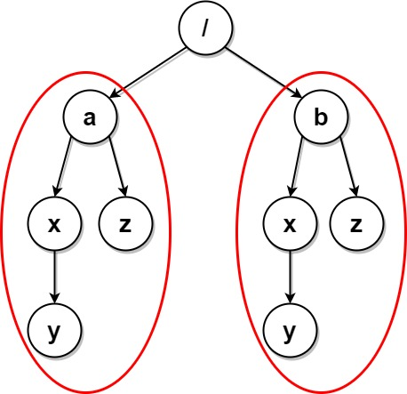

<!-- @import "[TOC]" {cmd="toc" depthFrom=1 depthTo=6 orderedList=false} -->

<!-- code_chunk_output -->

- [字符串转化后的各位数字之和](#字符串转化后的各位数字之和)
- [子字符串突变后可能得到的最大整数](#子字符串突变后可能得到的最大整数)
- [最大兼容性评分和（dfs暴搜）](#最大兼容性评分和dfs暴搜)
- [删除系统中的重复文件夹](#删除系统中的重复文件夹)

<!-- /code_chunk_output -->

这周借机，就做了一道题哈哈哈。

### 字符串转化后的各位数字之和

给你一个由小写字母组成的字符串 s ，以及一个整数 k 。

首先，用字母在字母表中的位置替换该字母，将 s 转化 为一个整数（也就是，'a' 用 1 替换，'b' 用 2 替换，... 'z' 用 26 替换）。接着，将整数 转换 为其 各位数字之和 。共重复 转换 操作 k 次 。

例如，如果 s = "zbax" 且 k = 2 ，那么执行下述步骤后得到的结果是整数 8 ：

- 转化："zbax" ➝ "(26)(2)(1)(24)" ➝ "262124" ➝ 262124
- 转换 #1：262124 ➝ 2 + 6 + 2 + 1 + 2 + 4 ➝ 17
- 转换 #2：17 ➝ 1 + 7 ➝ 8

返回执行上述操作后得到的结果整数。

示例 1：

```
输入：s = "iiii", k = 1
输出：36
解释：操作如下：
- 转化："iiii" ➝ "(9)(9)(9)(9)" ➝ "9999" ➝ 9999
- 转换 #1：9999 ➝ 9 + 9 + 9 + 9 ➝ 36
因此，结果整数为 36 。
```

示例 2：

```
输入：s = "leetcode", k = 2
输出：6
解释：操作如下：
- 转化："leetcode" ➝ "(12)(5)(5)(20)(3)(15)(4)(5)" ➝ "12552031545" ➝ 12552031545
- 转换 #1：12552031545 ➝ 1 + 2 + 5 + 5 + 2 + 0 + 3 + 1 + 5 + 4 + 5 ➝ 33
- 转换 #2：33 ➝ 3 + 3 ➝ 6
因此，结果整数为 6 。
```

提示：

- 1 <= s.length <= 100
- 1 <= k <= 10
- s 由小写英文字母组成

```python
class Solution:
    def getLucky(self, s: str, k: int) -> int:
        num = ""
        for c in s:
            num += str(ord(c) - ord('a') + 1)
        
        ans = num
        while k > 0:
            k -= 1
            tmp = 0
            for c in ans:
                tmp += int(c)
            ans = str(tmp)
        
        return int(ans)
```

因为一时想不到 C++ 如何把数字转换为字符串，所以就用 python 了。

看看大佬的 C++ ：

```cpp
class Solution 
{
public:
    int getLucky(string s, int k) 
    {
        string ss = "";
        for (char c : s)
        {
            int x = c - 'a' + 1;
            ss += to_string(x);
        }

        int res = 0;
        for (int _ = 0; _ < k; _ ++)
        {
            res = 0;
            for (char c : ss)
                res += c - '0';
            
            ss = to_string(res);
        }

        return res;
    }
};

// 作者：Hanxin_Hanxin
// 链接：https://leetcode-cn.com/problems/sum-of-digits-of-string-after-convert/solution/cpython3java-mo-ni-by-hanxin_hanxin-b13g/
```

**经验：**
- python 中字符减法返回数值用 `ord` ，比如 `num: int = ord(charObj) - ord('a')`
- C++ 中用 `to_string` 把数值转为字符

### 子字符串突变后可能得到的最大整数

给你一个字符串 num ，该字符串表示一个大整数。另给你一个长度为 10 且 下标从 0  开始 的整数数组 change ，该数组将 0-9 中的每个数字映射到另一个数字。更规范的说法是，数字 d 映射为数字 change[d] 。

你可以选择 突变  num 的任一子字符串。突变 子字符串意味着将每位数字 num[i] 替换为该数字在 change 中的映射（也就是说，将 num[i] 替换为 `change[num[i]]`）。

请你找出在对 num 的任一子字符串执行突变操作（也可以不执行）后，可能得到的 最大整数 ，并用字符串表示返回。

子字符串 是字符串中的一个连续序列。

示例 1：

```
输入：num = "132", change = [9,8,5,0,3,6,4,2,6,8]
输出："832"
解释：替换子字符串 "1"：
- 1 映射为 change[1] = 8 。
因此 "132" 变为 "832" 。
"832" 是可以构造的最大整数，所以返回它的字符串表示。
```

示例 2：

```
输入：num = "021", change = [9,4,3,5,7,2,1,9,0,6]
输出："934"
解释：替换子字符串 "021"：
- 0 映射为 change[0] = 9 。
- 2 映射为 change[2] = 3 。
- 1 映射为 change[1] = 4 。
因此，"021" 变为 "934" 。
"934" 是可以构造的最大整数，所以返回它的字符串表示。
```

示例 3：

```
输入：num = "5", change = [1,4,7,5,3,2,5,6,9,4]
输出："5"
解释："5" 已经是可以构造的最大整数，所以返回它的字符串表示。
```

提示：
- 1 <= num.length <= $10^5$
- num 仅由数字 0-9 组成
- change.length == 10
- 0 <= change[d] <= 9

```cpp
class Solution {
public:
    string maximumNumber(string num, vector<int>& change) {
        // O(n) 贪心,找最高位替换,然后 while 延长其
        int n = num.size();
        int st = 0, ed = 0;
        string sub;
        for (int i = 0; i < n; ++ i)
        {
            int c = num[i] - '0';
            // 这里是大于号,防止过早跳出循环但啥也没干
            if (change[c] > c)
            {
                st = ed = i;
                int c_ed = num[ed] - '0';
                // 这里是大于等于,防止字符串不够长
                while (ed < n && change[c_ed] >= c_ed)
                {
                    sub += to_string(change[c_ed]);
                    ed ++;
                    c_ed = num[ed] - '0';
                }
                break;
            }
        }
        string res = num.substr(0, st) + sub + num.substr(ed, n - ed);
        return res;
    }
};
```

### 最大兼容性评分和（dfs暴搜）

有一份由 n 个问题组成的调查问卷，每个问题的答案要么是 0（no，否），要么是 1（yes，是）。

这份调查问卷被分发给 m 名学生和 m 名导师，学生和导师的编号都是从 0 到 m - 1 。学生的答案用一个二维整数数组 students 表示，其中 students[i] 是一个整数数组，包含第 i 名学生对调查问卷给出的答案（下标从 0 开始）。导师的答案用一个二维整数数组 mentors 表示，其中 mentors[j] 是一个整数数组，包含第 j 名导师对调查问卷给出的答案（下标从 0 开始）。

每个学生都会被分配给 一名 导师，而每位导师也会分配到 一名 学生。配对的学生与导师之间的兼容性评分等于学生和导师答案相同的次数。

例如，学生答案为[1, 0, 1] 而导师答案为 [0, 0, 1] ，那么他们的兼容性评分为 2 ，因为只有第二个和第三个答案相同。

请你找出最优的学生与导师的配对方案，以 最大程度上 提高 兼容性评分和 。

给你 students 和 mentors ，返回可以得到的 最大兼容性评分和 。


示例 1：

```
输入：students = [[1,1,0],[1,0,1],[0,0,1]], mentors = [[1,0,0],[0,0,1],[1,1,0]]
输出：8
解释：按下述方式分配学生和导师：
- 学生 0 分配给导师 2 ，兼容性评分为 3 。
- 学生 1 分配给导师 0 ，兼容性评分为 2 。
- 学生 2 分配给导师 1 ，兼容性评分为 3 。
最大兼容性评分和为 3 + 2 + 3 = 8 。
```

示例 2：

```
输入：students = [[0,0],[0,0],[0,0]], mentors = [[1,1],[1,1],[1,1]]
输出：0
解释：任意学生与导师配对的兼容性评分都是 0 。
```

提示：
- m == students.length == mentors.length
- n == students[i].length == mentors[j].length
- 1 <= m, n <= 8
- students[i][k] 为 0 或 1
- mentors[j][k] 为 0 或 1


```cpp
class Solution {
public:
    int ans = 0;
    int n, m;
    bool used[10];
    int g[10][10];

    // 第 x 个学生匹配 0 ~ m-1 老师
    void dfs(int x, vector<vector<int>>& students, vector<vector<int>>& mentors, int score)
    {
        if (x == m)
        {
            ans = max(ans, score);
            return ;
        }

        for (int i = 0; i < m; ++ i)
        {
            if (used[i]) continue;
            used[i] = true;
            dfs(x + 1, students, mentors, score + g[x][i]);
            used[i] = false;
        }

        return ;
    }

    int maxCompatibilitySum(vector<vector<int>>& students, vector<vector<int>>& mentors) {
        m = students.size();
        n = students[0].size();

        memset(g, 0, sizeof g);
        memset(used, 0, sizeof used);

        for (int i = 0; i < m; ++ i)
            for (int j = 0; j < m; ++ j)
                for (int k = 0; k < n; ++ k)
                    if (students[i][k] == mentors[j][k]) g[i][j] += 1;
        
        ans = 0;
        dfs(0, students, mentors, 0);
        return ans;
    }
};
```

### 删除系统中的重复文件夹

由于一个漏洞，文件系统中存在许多重复文件夹。给你一个二维数组 paths，其中 paths[i] 是一个表示文件系统中第 i 个文件夹的绝对路径的数组。

例如，["one", "two", "three"] 表示路径 "/one/two/three" 。

如果两个文件夹（不需要在同一层级）包含 非空且相同的 子文件夹 集合 并具有相同的子文件夹结构，则认为这两个文件夹是相同文件夹。相同文件夹的根层级 不 需要相同。如果存在两个（或两个以上）相同 文件夹，则需要将这些文件夹和所有它们的子文件夹 标记 为待删除。

- 例如，下面文件结构中的文件夹 `"/a"` 和 `"/b"` 相同。它们（以及它们的子文件夹）应该被 全部 标记为待删除：
  - /a
  - /a/x
  - /a/x/y
  - /a/z
  - /b
  - /b/x
  - /b/x/y
  - /b/z
- 然而，如果文件结构中还包含路径 "/b/w" ，那么文件夹 "/a" 和 "/b" 就不相同。注意，即便添加了新的文件夹 "/b/w" ，仍然认为 "/a/x" 和 "/b/x" 相同。

一旦所有的相同文件夹和它们的子文件夹都被标记为待删除，文件系统将会 删除 所有上述文件夹。文件系统只会执行一次删除操作。执行完这一次删除操作后，不会删除新出现的相同文件夹。

返回二维数组 ans ，该数组包含删除所有标记文件夹之后剩余文件夹的路径。路径可以按 任意顺序 返回。

示例 1：


```
输入：paths = [["a"],["c"],["d"],["a","b"],["c","b"],["d","a"]]
输出：[["d"],["d","a"]]
解释：文件结构如上所示。
文件夹 "/a" 和 "/c"（以及它们的子文件夹）都会被标记为待删除，因为它们都包含名为 "b" 的空文件夹。
```

示例 2：


```
输入：paths = [["a"],["c"],["a","b"],["c","b"],["a","b","x"],["a","b","x","y"],["w"],["w","y"]]
输出：[["c"],["c","b"],["a"],["a","b"]]
解释：文件结构如上所示。
文件夹 "/a/b/x" 和 "/w"（以及它们的子文件夹）都会被标记为待删除，因为它们都包含名为 "y" 的空文件夹。
注意，文件夹 "/a" 和 "/c" 在删除后变为相同文件夹，但这两个文件夹不会被删除，因为删除只会进行一次，且它们没有在删除前被标记。
```

示例 3：


```
输入：paths = [["a","b"],["c","d"],["c"],["a"]]
输出：[["c"],["c","d"],["a"],["a","b"]]
解释：文件系统中所有文件夹互不相同。
注意，返回的数组可以按不同顺序返回文件夹路径，因为题目对顺序没有要求。
```

示例 4：



```
输入：paths = [["a"],["a","x"],["a","x","y"],["a","z"],["b"],["b","x"],["b","x","y"],["b","z"]]
输出：[]
解释：文件结构如上所示。
文件夹 "/a/x" 和 "/b/x"（以及它们的子文件夹）都会被标记为待删除，因为它们都包含名为 "y" 的空文件夹。
文件夹 "/a" 和 "/b"（以及它们的子文件夹）都会被标记为待删除，因为它们都包含一个名为 "z" 的空文件夹以及上面提到的文件夹 "x" 。
```

示例 5：


```
输入：paths = [["a"],["a","x"],["a","x","y"],["a","z"],["b"],["b","x"],["b","x","y"],["b","z"],["b","w"]]
输出：[["b"],["b","w"],["b","z"],["a"],["a","z"]]
解释：本例与上例的结构基本相同，除了新增 "/b/w" 文件夹。
文件夹 "/a/x" 和 "/b/x" 仍然会被标记，但 "/a" 和 "/b" 不再被标记，因为 "/b" 中有名为 "w" 的空文件夹而 "/a" 没有。
注意，"/a/z" 和 "/b/z" 不会被标记，因为相同子文件夹的集合必须是非空集合，但这两个文件夹都是空的。
```

提示：
- 1 <= paths.length <= 2 * $10^4$
- 1 <= paths[i].length <= 500
- 1 <= paths[i][j].length <= 10
- 1 <= sum(paths[i][j].length) <= 2 * $10^5$
- path[i][j] 由小写英文字母组成
- 不会存在两个路径都指向同一个文件夹的情况
- 对于不在根层级的任意文件夹，其父文件夹也会包含在输入中

```cpp
```
