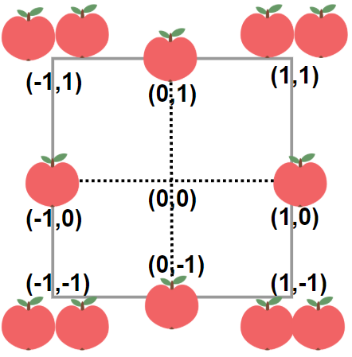

<!-- @import "[TOC]" {cmd="toc" depthFrom=1 depthTo=6 orderedList=false} -->

<!-- code_chunk_output -->

- [三除数（仔细读题）](#三除数仔细读题)
- [你可以工作的最大周数](#你可以工作的最大周数)
- [收集足够苹果的最小花园周长（二分+递推）](#收集足够苹果的最小花园周长二分递推)
- [统计特殊子序列的数目（动态规划）](#统计特殊子序列的数目动态规划)

<!-- /code_chunk_output -->

没参加。

### 三除数（仔细读题）

给你一个整数 n 。如果 n 恰好有三个正除数 ，返回 true ；否则，返回 false 。

如果存在整数 k ，满足 n = k * m ，那么整数 m 就是 n 的一个 除数 。


示例 1：

```
输入：n = 2
输出：false
解释：2 只有两个除数：1 和 2 。
```

示例 2：

```
输入：n = 4
输出：true
解释：4 有三个除数：1、2 和 4 。
```

提示：
- 1 <= n <= 104

```cpp
// 恰好 3 个除数！
class Solution {
public:
    bool isThree(int n) {
        if (n <= 3) return false;
        int cnt = 0;
        for (int i = 1; i <= n; ++ i)
        {
            if (n%i == 0) cnt ++ ;
        }
        if (cnt == 3) return true;
        return false;
    }
};
```

### 你可以工作的最大周数

给你 n 个项目，编号从 0 到 n - 1 。同时给你一个整数数组 milestones ，其中每个 milestones[i] 表示第 i 个项目中的阶段任务数量。

你可以按下面两个规则参与项目中的工作：
- 每周，你将会完成 某一个 项目中的 恰好一个 阶段任务。你每周都 必须 工作。
- 在 连续的 两周中，你 不能 参与并完成同一个项目中的两个阶段任务。

一旦所有项目中的全部阶段任务都完成，或者仅剩余一个阶段任务都会导致你违反上面的规则，那么你将 停止工作 。注意，由于这些条件的限制，你可能无法完成所有阶段任务。

返回在不违反上面规则的情况下你 最多 能工作多少周。

示例 1：

```
输入：milestones = [1,2,3]
输出：6
解释：一种可能的情形是：
​​​​- 第 1 周，你参与并完成项目 0 中的一个阶段任务。
- 第 2 周，你参与并完成项目 2 中的一个阶段任务。
- 第 3 周，你参与并完成项目 1 中的一个阶段任务。
- 第 4 周，你参与并完成项目 2 中的一个阶段任务。
- 第 5 周，你参与并完成项目 1 中的一个阶段任务。
- 第 6 周，你参与并完成项目 2 中的一个阶段任务。
总周数是 6 。
```

示例 2：

```
输入：milestones = [5,2,1]
输出：7
解释：一种可能的情形是：
- 第 1 周，你参与并完成项目 0 中的一个阶段任务。
- 第 2 周，你参与并完成项目 1 中的一个阶段任务。
- 第 3 周，你参与并完成项目 0 中的一个阶段任务。
- 第 4 周，你参与并完成项目 1 中的一个阶段任务。
- 第 5 周，你参与并完成项目 0 中的一个阶段任务。
- 第 6 周，你参与并完成项目 2 中的一个阶段任务。
- 第 7 周，你参与并完成项目 0 中的一个阶段任务。
总周数是 7 。
注意，你不能在第 8 周参与完成项目 0 中的最后一个阶段任务，因为这会违反规则。
因此，项目 0 中会有一个阶段任务维持未完成状态。
```

提示：

- n == milestones.length
- 1 <= n <= $10^5$
- 1 <= milestones[i] <= $10^9$

```cpp
class Solution {
public:
    long long numberOfWeeks(vector<int>& milestones) {
        long long sum = 0, mx = 0;
        for (auto t: milestones)
        {
            sum += t;
            mx = max(mx, t * 1LL);
        }
        // 1 是最长任务 0 是其他任务
        // 极端情况 1 0 1 0 1 0 1 ...
        // 1 的数量比 0 的数量 + 1 还大，不能全输出
        if (mx > sum - mx + 1LL) return (sum - mx) * 2LL + 1LL;
        return sum;
    }
};
```

**经验：**
- 用 `* 1LL` 转换 `int` 为 `long long`

### 收集足够苹果的最小花园周长（二分+递推）

给你一个用无限二维网格表示的花园，每一个 整数坐标处都有一棵苹果树。整数坐标 (i, j) 处的苹果树有 |i| + |j| 个苹果。

你将会买下正中心坐标是 (0, 0) 的一块 正方形土地 ，且每条边都与两条坐标轴之一平行。

给你一个整数 neededApples ，请你返回土地的 最小周长 ，使得 至少 有 neededApples 个苹果在土地 里面或者边缘上。

`|x|` 的值定义为：
- 如果 x >= 0 ，那么值为 x
- 如果 x < 0 ，那么值为 -x
 

示例 1：



```
输入：neededApples = 1
输出：8
解释：边长长度为 1 的正方形不包含任何苹果。
但是边长为 2 的正方形包含 12 个苹果（如上图所示）。
周长为 2 * 4 = 8 。
```

示例 2：
```
输入：neededApples = 13
输出：16
```

示例 3：

```
输入：neededApples = 1000000000
输出：5040
```

提示：
- 1 <= neededApples <= $10^{15}$

```cpp
// (0, 1) (1, 1)
// (0, 2) (1, 2) (2, 2)
// (0, 3) (1, 3) (2, 3) (3, 3)
// 二分 八分之一的周长 x
// 注意横向与纵向是独立的 |x| + |y|
// 分开求，且是对称的因此最后 2 * 横向就行
// 周长为 x 时，横向有 2 * (2 * x + 1) 个长度为 x + 1 的等差数列
// 首项 0 末项 x ，等差数列求和：(0 + x) * (x + 1) / 2
// 总结：2 * 2 * (2 * x + 1) * (0 + x) * (x + 1) / 2
// 2 * (2 * x + 1) * x * (x + 1)

class Solution {
public:
    long long calc(long long c)
    {
        return 2 * (2 * c + 1) * c * (c + 1);
    }

    long long minimumPerimeter(long long neededApples) {
        long long l = 0, r = 1e6;  // 15^{1/3}
        while (l < r)
        {
            long long mid = (l + r) >> 1;
            if (calc(mid) >= neededApples) r = mid;
            else l = mid + 1;
        }
        return r * 8;
    }
};
```

### 统计特殊子序列的数目（动态规划）

特殊序列 是由 正整数 个 0 ，紧接着 正整数 个 1 ，最后 正整数 个 2 组成的序列。

比方说，[0,1,2] 和 [0,0,1,1,1,2] 是特殊序列。
相反，[2,1,0] ，[1] 和 [0,1,2,0] 就不是特殊序列。
给你一个数组 nums （仅 包含整数 0，1 和 2），请你返回 不同特殊子序列的数目 。由于答案可能很大，请你将它对 $10^9 + 7$ 取余 后返回。

一个数组的 子序列 是从原数组中删除零个或者若干个元素后，剩下元素不改变顺序得到的序列。如果两个子序列的 下标集合 不同，那么这两个子序列是 不同的 。


示例 1：

```
输入：nums = [0,1,2,2]
输出：3
解释：特殊子序列为 [0,1,2,2]，[0,1,2,2] 和 [0,1,2,2] 。
```

示例 2：

```
输入：nums = [2,2,0,0]
输出：0
解释：数组 [2,2,0,0] 中没有特殊子序列。
```

示例 3：

```
输入：nums = [0,1,2,0,1,2]
输出：7
解释：特殊子序列包括：
- [0,1,2,0,1,2]
- [0,1,2,0,1,2]
- [0,1,2,0,1,2]
- [0,1,2,0,1,2]
- [0,1,2,0,1,2]
- [0,1,2,0,1,2]
- [0,1,2,0,1,2]
```

提示：
- 1 <= nums.length <= $10^5$
- 0 <= nums[i] <= 2

```cpp
// 动态规划
// f[i][t] 表示长度为 i+1 字符串以 t 为结尾的子序列个数
// t 仅可能是 0, 1, 2
// 如果第 i 位置上是 0 ，则
//  f[i][0] = f[i-1][0] * 2 + 1
//  乘 2 是因为， 有两种情况，这个新 0 计入和不计入子字符串
//  + 1 是因为这个新 0 可以作为一类新的子序列，即子序列开头
// 如果第 i 位置上是 1 或 2 ，则
//  f[i][1] = f[i-1][1] * 2 + f[i-1][0]  ①
//  f[i][2] = f[i-1][2] * 2 + f[i-1][1]  ②
//  ① 中 + f[i-1][0]是因为，这个新 1 可以作为一类新子序列
//      其中这个子序列的第一个 1 是这个 1 开头
class Solution {
public:
    int f[3], P = 1e9 + 7;
    int countSpecialSubsequences(vector<int>& nums) {
        for (auto t: nums)
        {
            if (t == 0)
            {
                f[t] = (f[t] * 2ll + 1) % P;
            }
            else
            {
                f[t] = (f[t] * 2ll + f[t-1]) % P;
            }
        }
        return f[2];
    }
};
```
