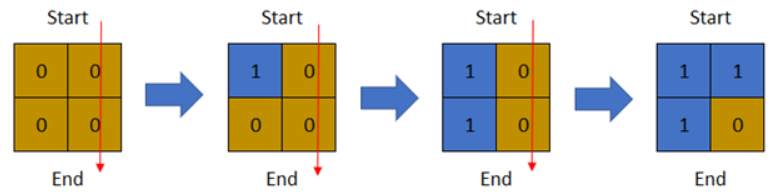
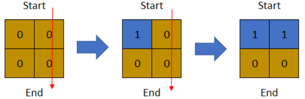
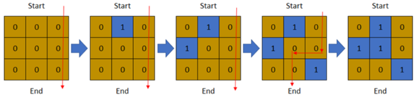

<!-- @import "[TOC]" {cmd="toc" depthFrom=1 depthTo=6 orderedList=false} -->

<!-- code_chunk_output -->

- [作为子字符串出现在单词中的字符串数目](#作为子字符串出现在单词中的字符串数目)
- [构造元素不等于两相邻元素平均值的数组](#构造元素不等于两相邻元素平均值的数组)
- [数组元素的最小非零乘积（指数运算中指数不能取模！）](#数组元素的最小非零乘积指数运算中指数不能取模)
- [你能穿过矩阵的最后一天（二分+BFS）](#你能穿过矩阵的最后一天二分bfs)

<!-- /code_chunk_output -->

T1 注意字符串长度！下标不要越界！

T2 犹豫很久！虽然不能给出严谨证明，但我这么做是对的！也通过了。而且给出严谨证明应该不难，对于严格单调递增的 $\{ a_i \}$ ， $a_{i - 1} < a_{i} < a_{i + 1}$ 则有 $a_{i - 1} < a_{i + 1} > a_{i}$ 。

最后一题感觉还行？不知道 bug 出在哪里。

倒数第二题 trie 树？让所有数都变成 `1 * p` ？没思路。

### 作为子字符串出现在单词中的字符串数目

给你一个字符串数组 patterns 和一个字符串 word ，统计 patterns 中有多少个字符串是 word 的子字符串。返回字符串数目。

子字符串 是字符串中的一个连续字符序列。

示例 1：
```
输入：patterns = ["a","abc","bc","d"], word = "abc"
输出：3
解释：
- "a" 是 "abc" 的子字符串。
- "abc" 是 "abc" 的子字符串。
- "bc" 是 "abc" 的子字符串。
- "d" 不是 "abc" 的子字符串。
patterns 中有 3 个字符串作为子字符串出现在 word 中。
```

示例 2：
```
输入：patterns = ["a","b","c"], word = "aaaaabbbbb"
输出：2
解释：
- "a" 是 "aaaaabbbbb" 的子字符串。
- "b" 是 "aaaaabbbbb" 的子字符串。
- "c" 不是 "aaaaabbbbb" 的字符串。
patterns 中有 2 个字符串作为子字符串出现在 word 中。
```

示例 3：
```
输入：patterns = ["a","a","a"], word = "ab"
输出：3
解释：patterns 中的每个字符串都作为子字符串出现在 word "ab" 中。
```

提示：
- 1 <= patterns.length <= 100
- 1 <= patterns[i].length <= 100
- 1 <= word.length <= 100
- patterns[i] 和 word 由小写英文字母组成

```cpp
class Solution {
public:
    bool check(string s, string w)
    {
        for (int i = 0; i < w.size() - s.size() + 1; ++ i)
        {
            for (int j = 0; j < s.size() + 1; ++ j)
            {
                if (j == s.size()) return true;
                if (w[i + j] != s[j]) break;
            }
        }
        return false;
    }
    int numOfStrings(vector<string>& patterns, string word) {
        int res = 0;
        for (auto s: patterns)
        {
            // s 有可能比 word 长！
            if (s.size() <= word.size() && check(s, word)) res += 1;
        }
        return res;
    }
};
```

### 构造元素不等于两相邻元素平均值的数组

给你一个 下标从 `0` 开始 的数组 `nums` ，数组由若干 互不相同的 整数组成。你打算重新排列数组中的元素以满足：重排后，数组中的每个元素都 不等于 其两侧相邻元素的 平均值 。

更公式化的说法是，重新排列的数组应当满足这一属性：对于范围 `1 <= i < nums.length - 1` 中的每个 `i` ，`(nums[i-1] + nums[i+1]) / 2` 不等于 `nums[i]` 均成立 。

返回满足题意的任一重排结果。

示例 1：
```
输入：nums = [1,2,3,4,5]
输出：[1,2,4,5,3]
解释：
i=1, nums[i] = 2, 两相邻元素平均值为 (1+4) / 2 = 2.5
i=2, nums[i] = 4, 两相邻元素平均值为 (2+5) / 2 = 3.5
i=3, nums[i] = 5, 两相邻元素平均值为 (4+3) / 2 = 3.5
```

示例 2：
```
输入：nums = [6,2,0,9,7]
输出：[9,7,6,2,0]
解释：
i=1, nums[i] = 7, 两相邻元素平均值为 (9+6) / 2 = 7.5
i=2, nums[i] = 6, 两相邻元素平均值为 (7+2) / 2 = 4.5
i=3, nums[i] = 2, 两相邻元素平均值为 (6+0) / 2 = 3
```

提示：
- 3 <= nums.length <= $10^5$
- 0 <= nums[i] <= $10^5$

```cpp
// 数组排好序然后穿插就行
class Solution {
public:
    vector<int> rearrangeArray(vector<int>& nums) {
        sort(nums.begin(), nums.end());
        vector<int> res;
        int n = (nums.size() + 1) / 2;
        for (int i = 0; i < nums.size(); ++ i)
        {
            if (i % 2 == 0) res.push_back(nums[i / 2]);
            else res.push_back(nums[n + i / 2]);
        }
        return res;
    }
};
```

### 数组元素的最小非零乘积（指数运算中指数不能取模！）

给你一个正整数 p 。你有一个下标从 1 开始的数组 nums ，这个数组包含范围 `[1, 2p - 1]` 内所有整数的二进制形式（两端都 包含）。你可以进行以下操作 任意 次：

从 nums 中选择两个元素 x 和 y  。
选择 x 中的一位与 y 对应位置的位交换。对应位置指的是两个整数 相同位置 的二进制位。
比方说，如果 `x = 1101` 且 `y = 0011` ，交换右边数起第 2 位后，我们得到 `x = 1111` 和 `y = 0001` 。

请你算出进行以上操作 任意次 以后，nums 能得到的 最小非零 乘积。将乘积对 $10^9 + 7$ 取余 后返回。

注意：答案应为取余 之前 的最小值。

示例 1：
```
输入：p = 1
输出：1
解释：nums = [1] 。
只有一个元素，所以乘积为该元素。
```

示例 2：
```
输入：p = 2
输出：6
解释：nums = [01, 10, 11] 。
所有交换要么使乘积变为 0 ，要么乘积与初始乘积相同。
所以，数组乘积 1 * 2 * 3 = 6 已经是最小值。
```

示例 3：
```
输入：p = 3
输出：1512
解释：nums = [001, 010, 011, 100, 101, 110, 111]
- 第一次操作中，我们交换第二个和第五个元素最左边的数位。
    - 结果数组为 [001, 110, 011, 100, 001, 110, 111] 。
- 第二次操作中，我们交换第三个和第四个元素中间的数位。
    - 结果数组为 [001, 110, 001, 110, 001, 110, 111] 。
数组乘积 1 * 6 * 1 * 6 * 1 * 6 * 7 = 1512 是最小乘积。
```

提示：
- 1 <= p <= 60

做法总结（参考[MrGuin](https://leetcode-cn.com/u/mrguin/)）：
- 两个互补的数（相与为全0，异或为全1，两数总共有p个0，p个1），交换组成`00...001`跟`11...110`，即1跟$2^p - 2$
- 这样两数之积是最小的，总共有 $(2^p - 2)/2$ 组 $2^p - 2$ 相乘，乘上最后的 $2^p - 1$。

严谨的证明参考[灵茶山艾府](https://leetcode-cn.com/u/endlesscheng/)：

首先，两个交换的比特必须是不同的，否则交换无影响。

不失一般性，假设 $x 参与交换的比特为 $0，$y 参与交换的比特为 $1，交换的位置为第 $k 位。

记 $y=y'+2^k$，则交换前两数的乘积为

$$x\cdot y = x\cdot (y'+2^k) = x\cdot y'+x\cdot 2^k$$

交换后两数的乘积为

$$(x+2^k)\cdot (y-2^k) = (x+2^k)\cdot y' = x\cdot y'+y'\cdot 2^k$$

对比两个等式可知，要使交换后乘积变小，需要满足

$$x>y'$$

这一不等式表明，对于一个数 $y$，如果我们不断地将其二进制中的 $1$ 与另一个满足该不等式的数交换，就可以将乘积不断减小。由于题目要求计算最小非零乘积，我们可以先将 $y$ 减小至 $0$，然后再寻找一个最低位为 $1$ 的数进行交换，从而让 $y$ 变成 $1$。

由于 $\textit{nums}$ 包含了 $[1, 2^p - 1]$ 内的所有整数，我们可以将其分为两组，小于 $2^{p-1}$ 的为一组，记作 $A$，其余的为另一组，记作 $B$。则 $B$ 组中除了 $2^p-1$ 之外，其余的数均可以和 $A$ 组中的数一一配对，要求配对的两个数之和为 $2^p-1$。每对配对的数就可以按照上述交换流程交换，交换后的结果为 $1$ 和 $2^p-2$ 。

交换后，每一对的乘积为 $2^p-2$，这一共有 $2^{p-1}-1$ 对，再算上不参与配对的 $2^p-1$ 得到最小乘积为 $(2^p-1)\cdot (2^p-2)^{2^{p-1}-1}$ 。

由于幂次很大，计算时需要用到快速幂。

```cpp
typedef long long LL;
const LL MOD = 1e9 + 7;

class Solution {
public:
    LL qmi(LL a, LL b)
    {
        LL res = 1;
        while (b)
        {
            if (b & 1)
                res = res * a % MOD;
            a = a * a % MOD;
            b = b >> 1;
        }
        return res % MOD;
    }

    int minNonZeroProduct(int p) {
        LL ans = qmi(2ll, (LL) p) - 1ll;
        ans = ans * qmi(qmi(2ll, (LL) p) - 2ll, qmi(2ll, (LL) p - 1ll) - 1ll) % MOD;
        return (int) ans;
    }
};

// 上述写法是错误的！
/*
* 当 p >= 30 时， 2^{p - 1} - 1 的结果会取模
* 而指数运算中 a^b ，并没有 a ^ b % MOD = a ^ {b % MOD}
* 因此这里 qmi(qmi(2ll, (LL) p) - 2ll, qmi(2ll, (LL) p - 1ll) - 1ll) 会出错
* 有高手证明了：指数并不需要取模，但并不是不能取模。
*    如果你要对指数取模，应对 10^9+6 取模，而不是
*    10^9+7 取模。
*/
```

上述代码错误：
```
输入
31
2
3
32

输出
444453535
6
1512
360568740

预期
138191773
6
1512
505517599
```

错在 **指数不能直接取模** ，参考[还没上岸的转码人](https://leetcode-cn.com/problems/minimum-non-zero-product-of-the-array-elements/solution/ckuai-su-mi-de-ji-ge-zhu-yi-dian-by-simo-yxgh/)：

首先若$m = k(p - 1) + n$，我们不难得到：

$$a^m = a^{k(p - 1) + n} = a^{k(p-1)} \cdot a^n = (a^{p - 1})^k \cdot a^n \equiv (a^{p - 1} \% p)^k \cdot a^n (mod\ p)$$

而在本题中，我们的取模对象$10^9+7$是一个质数，因此由费马小定理可知：

$$a^{p-1} \equiv 1 (mod\ p)$$

因此也就有：

$$a^m \equiv (a^{p - 1} \% p)^k \cdot a^n \equiv 1^k \cdot a^n \equiv a^n (mod\ p)$$

也就是说我们如果要对质数取模，应当对$p-1$进行取模，而不是对$p$取模。

```cpp
const int mod = 1000000007;
class Solution {
public:
    int minNonZeroProduct(int p) 
    {
        // 使用非递归的快速幂方法
        // ret为最终的返回值，初始值设为2^p - 1取模后的值
        // k为快速幂的指数
        long long ret = ((1LL << p) - 1) % mod , k = (1LL << p - 1) - 1;

        // 此写法multi最终额外乘了一次
        // 如果遇到卡常数的矩阵快速幂，有可能导致超时
        for(long long multi = ((1LL << p) - 2) % mod ; k ; k >>= 1)
        {
            if(k & 1) ret = ret * multi % mod;
            multi = multi * multi % mod;
        }
        return ret;
    }
};

// 作者：simon1024
// 链接：https://leetcode-cn.com/problems/minimum-non-zero-product-of-the-array-elements/solution/ckuai-su-mi-de-ji-ge-zhu-yi-dian-by-simo-yxgh/
```

**经验：**
- 这里面很多都是 $2^k$ 运算，直接 `1ll << k` 就好了

### 你能穿过矩阵的最后一天（二分+BFS）

给你一个下标从 1 开始的二进制矩阵，其中 0 表示陆地，1 表示水域。同时给你 row 和 col 分别表示矩阵中行和列的数目。

一开始在第 0 天，整个 矩阵都是 陆地 。但每一天都会有一块新陆地被 水 淹没变成水域。给你一个下标从 1 开始的二维数组 `cells` ，其中 `cells[i] = [ri, ci]` 表示在第 i 天，第 $r_i$ 行 $c_i$ 列（下标都是从 1 开始）的陆地会变成 水域 （也就是 0 变成 1 ）。

你想知道从矩阵最 上面 一行走到最 下面 一行，且只经过陆地格子的 最后一天 是哪一天。你可以从最上面一行的 任意 格子出发，到达最下面一行的 任意 格子。你只能沿着 四个 基本方向移动（也就是上下左右）。

请返回只经过陆地格子能从最 上面 一行走到最 下面 一行的 最后一天 。

示例 1：



```
输入：row = 2, col = 2, cells = [[1,1],[2,1],[1,2],[2,2]]
输出：2
解释：上图描述了矩阵从第 0 天开始是如何变化的。
可以从最上面一行到最下面一行的最后一天是第 2 天。
```

示例 2：



```
输入：row = 2, col = 2, cells = [[1,1],[1,2],[2,1],[2,2]]
输出：1
解释：上图描述了矩阵从第 0 天开始是如何变化的。
可以从最上面一行到最下面一行的最后一天是第 1 天。
```

示例 3：



```
输入：row = 3, col = 3, cells = [[1,2],[2,1],[3,3],[2,2],[1,1],[1,3],[2,3],[3,2],[3,1]]
输出：3
解释：上图描述了矩阵从第 0 天开始是如何变化的。
可以从最上面一行到最下面一行的最后一天是第 3 天。
```

提示：
- 2 <= row, col <= $2 * 10^4$
- 4 <= row * col <= $2 * 10^4$
- cells.length == row * col
- 1 <= $r_i$ <= row
- 1 <= $c_i$ <= col
- cells 中的所有格子坐标都是 唯一 的。

```cpp
class Solution {
private:
    static constexpr int dirs[4][2] = {{-1, 0}, {1, 0}, {0, -1}, {0, 1}};

public:
    int latestDayToCross(int row, int col, vector<vector<int>>& cells) {
        int left = 0, right = row * col, ans = 0;
        while (left < right) {  // 最外层是一个二分框架
            int mid = left + right + 1 >> 1;
            
            vector<vector<int>> grid(row, vector<int>(col, 1));
            for (int i = 0; i < mid; ++i) {
                grid[cells[i][0] - 1][cells[i][1] - 1] = 0;
            }

            queue<pair<int, int>> q;
            for (int i = 0; i < col; ++i) {
                if (grid[0][i]) {
                    q.emplace(0, i);
                    grid[0][i] = 0;
                }
            }
            bool found = false;
            while (!q.empty()) {
                auto [x, y] = q.front();
                q.pop();
                for (int d = 0; d < 4; ++d) {
                    int nx = x + dirs[d][0];
                    int ny = y + dirs[d][1];
                    if (nx >= 0 && nx < row && ny >= 0 && ny < col && grid[nx][ny]) {
                        if (nx == row - 1) {
                            found = true;
                            break;
                        }
                        q.emplace(nx, ny);
                        grid[nx][ny] = 0;
                    }
                }
            }
            if (found) {
                left = mid;
            }
            else {
                right = mid - 1;
            }
        }
        return left;
    }
};

// 作者：LeetCode-Solution
// 链接：https://leetcode-cn.com/problems/last-day-where-you-can-still-cross/solution/ni-neng-chuan-guo-ju-zhen-de-zui-hou-yi-9j20y/
```

非常简单一道题，没做出来有点可惜。
