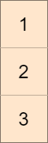

<!-- @import "[TOC]" {cmd="toc" depthFrom=1 depthTo=6 orderedList=false} -->

<!-- code_chunk_output -->

- [找出数组的最大公约数](#找出数组的最大公约数)
- [找出不同的二进制字符串](#找出不同的二进制字符串)
- [最小化目标值与所选元素的差](#最小化目标值与所选元素的差)

<!-- /code_chunk_output -->

没参加。

### 找出数组的最大公约数

给你一个整数数组 nums ，返回数组中最大数和最小数的 最大公约数 。

两个数的 最大公约数 是能够被两个数整除的最大正整数。

示例 1：
```
输入：nums = [2,5,6,9,10]
输出：2
解释：
nums 中最小的数是 2
nums 中最大的数是 10
2 和 10 的最大公约数是 2
```

示例 2：
```
输入：nums = [7,5,6,8,3]
输出：1
解释：
nums 中最小的数是 3
nums 中最大的数是 8
3 和 8 的最大公约数是 1
```

示例 3：
```
输入：nums = [3,3]
输出：3
解释：
nums 中最小的数是 3
nums 中最大的数是 3
3 和 3 的最大公约数是 3
```

提示：
- 2 <= nums.length <= 1000
- 1 <= nums[i] <= 1000

```cpp
```

### 找出不同的二进制字符串

给你一个字符串数组 nums ，该数组由 n 个 互不相同 的二进制字符串组成，且每个字符串长度都是 n 。请你找出并返回一个长度为 n 且 没有出现 在 nums 中的二进制字符串。如果存在多种答案，只需返回 任意一个 即可。

示例 1：
```
输入：nums = ["01","10"]
输出："11"
解释："11" 没有出现在 nums 中。"00" 也是正确答案。
```

示例 2：
```
输入：nums = ["00","01"]
输出："11"
解释："11" 没有出现在 nums 中。"10" 也是正确答案。
```

示例 3：
```
输入：nums = ["111","011","001"]
输出："101"
解释："101" 没有出现在 nums 中。"000"、"010"、"100"、"110" 也是正确答案。
```

提示：
- n == nums.length
- 1 <= n <= 16
- nums[i].length == n
- nums[i] 为 `'0'` 或 `'1'`

```cpp

```

### 最小化目标值与所选元素的差

给你一个大小为 m x n 的整数矩阵 mat 和一个整数 target 。

从矩阵的 每一行 中选择一个整数，你的目标是 最小化 所有选中元素之 和 与目标值 target 的 绝对差 。

返回 最小的绝对差 。

a 和 b 两数字的 绝对差 是 a - b 的绝对值。

示例 1：


```
输入：mat = [[1,2,3],[4,5,6],[7,8,9]], target = 13
输出：0
解释：一种可能的最优选择方案是：
- 第一行选出 1
- 第二行选出 5
- 第三行选出 7
所选元素的和是 13 ，等于目标值，所以绝对差是 0 。
```

示例 2：



```
输入：mat = [[1],[2],[3]], target = 100
输出：94
解释：唯一一种选择方案是：
- 第一行选出 1
- 第二行选出 2
- 第三行选出 3
所选元素的和是 6 ，绝对差是 94 。
```

示例 3：


```
输入：mat = [[1,2,9,8,7]], target = 6
输出：1
解释：最优的选择方案是选出第一行的 7 。
绝对差是 1 。
```

提示：
- m == mat.length
- n == mat[i].length
- 1 <= m, n <= 70
- 1 <= mat[i][j] <= 70
- 1 <= target <= 800

```cpp

```
