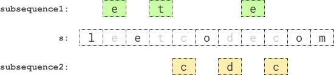

<!-- @import "[TOC]" {cmd="toc" depthFrom=1 depthTo=6 orderedList=false} -->

<!-- code_chunk_output -->

- [反转单词前缀](#反转单词前缀)
- [可互换矩形的组数（组合数与哈希表）](#可互换矩形的组数组合数与哈希表)
- [两个回文子序列长度的最大乘积（dfs）](#两个回文子序列长度的最大乘积dfs)
- [每棵子树内缺失的最小基因值](#每棵子树内缺失的最小基因值)

<!-- /code_chunk_output -->

T1 T2 简单， T3 自己想的 dfs 有漏洞，看了高手的恍然大悟。

### 反转单词前缀

给你一个下标从 0 开始的字符串 word 和一个字符 ch 。找出 ch 第一次出现的下标 i ，反转 word 中从下标 0 开始、直到下标 i 结束（含下标 i ）的那段字符。如果 word 中不存在字符 ch ，则无需进行任何操作。

例如，如果 word = "abcdefd" 且 ch = "d" ，那么你应该 反转 从下标 0 开始、直到下标 3 结束（含下标 3 ）。结果字符串将会是 "dcbaefd" 。

返回 结果字符串 。

示例 1：
```
输入：word = "abcdefd", ch = "d"
输出："dcbaefd"
解释："d" 第一次出现在下标 3 。 
反转从下标 0 到下标 3（含下标 3）的这段字符，结果字符串是 "dcbaefd" 。
```

示例 2：
```
输入：word = "xyxzxe", ch = "z"
输出："zxyxxe"
解释："z" 第一次也是唯一一次出现是在下标 3 。
反转从下标 0 到下标 3（含下标 3）的这段字符，结果字符串是 "zxyxxe" 。
```

示例 3：
```
输入：word = "abcd", ch = "z"
输出："abcd"
解释："z" 不存在于 word 中。
无需执行反转操作，结果字符串是 "abcd" 。
```

提示：
- 1 <= word.length <= 250
- word 由小写英文字母组成
- ch 是一个小写英文字母

```cpp
class Solution {
public:
    string reversePrefix(string word, char ch) {
        int t = -1;
        for (int i = 0; i < word.size(); ++ i)
        {
            if (word[i] == ch)
            {
                t = i;
                break;
            }
        }
        
        if (t == -1) return word;
        
        string res = word;
        for (int i = 0; i <= t; ++ i)
        {
            res[i] = word[t - i];
        }
        return res;
    }
};
```

### 可互换矩形的组数（组合数与哈希表）

用一个下标从 0 开始的二维整数数组 rectangles 来表示 n 个矩形，其中 $rectangles[i] = [width_i, height_i]$ 表示第 i 个矩形的宽度和高度。

如果两个矩形 i 和 j（i < j）的宽高比相同，则认为这两个矩形 可互换 。更规范的说法是，两个矩形满足 $width_i/height_i == width_j/height_j$（使用实数除法而非整数除法），则认为这两个矩形 可互换 。

计算并返回 rectangles 中有多少对 可互换 矩形。

示例 1：
```
输入：rectangles = [[4,8],[3,6],[10,20],[15,30]]
输出：6
解释：下面按下标（从 0 开始）列出可互换矩形的配对情况：
- 矩形 0 和矩形 1 ：4/8 == 3/6
- 矩形 0 和矩形 2 ：4/8 == 10/20
- 矩形 0 和矩形 3 ：4/8 == 15/30
- 矩形 1 和矩形 2 ：3/6 == 10/20
- 矩形 1 和矩形 3 ：3/6 == 15/30
- 矩形 2 和矩形 3 ：10/20 == 15/30
```

示例 2：
```
输入：rectangles = [[4,5],[7,8]]
输出：0
解释：不存在成对的可互换矩形。
```

提示：
- n == rectangles.length
- 1 <= n <= $10^5$
- rectangles[i].length == 2
- 1 <= widthi, heighti <= $10^5$

```cpp
class Solution {
public:
    static const int N = 1e5 + 10;
    long long f[N];
    
    int gcd(int a, int b)
    {
        return b ? gcd(b, a % b) : a;
    }
    
    long long dfs(int n)
    {
        if (f[n]) return f[n];
        
        // 之前这里忘了 long long 了
        f[n] = (long long) n * (n - 1) / 2;
        return f[n];
    }

    long long interchangeableRectangles(vector<vector<int>>& rectangles) {
        memset(f, 0, sizeof f);
        
        long long res = 0;
        unordered_map<double, int> hash;
        unordered_map<double, long long> table;
        for (int i = 0; i < rectangles.size(); ++ i)
        {
            auto rec = rectangles[i];

            int pub = gcd(rec[0], rec[1]);

            double x = (double) rec[0] / pub;
            double y = (double) rec[1] / pub;
            
            hash[x / y] ++ ;
            if (hash[x / y] > 1 && !table[x / y]) table[x / y] = dfs(2);
            else table[x / y] = dfs(hash[x / y]);
        }
        
        for (auto item: table)
        {
            res += item.second;
        }
        
        return res;
    }
};
```

以下是[大佬](https://leetcode-cn.com/u/wifiii/)写的代码，很棒的求 $C_n^2$ 的方式：

```cpp
class Solution {
public:
    long long interchangeableRectangles(vector<vector<int>>& a) {
        map<pair<int,int>, int> mp;
        long long ans = 0;
        for(auto &v : a) {
            int g = gcd(v[0], v[1]);  // 原来 stl 里有 gcd
            v[0] /= g;
            v[1] /= g;
            ans += mp[{v[0], v[1]}];
            ++mp[{v[0], v[1]}];
        }
        return ans;
    }
};
```

### 两个回文子序列长度的最大乘积（dfs）

给你一个字符串 s ，请你找到 s 中两个 不相交回文子序列 ，使得它们长度的 乘积最大 。两个子序列在原字符串中如果没有任何相同下标的字符，则它们是 不相交 的。

请你返回两个回文子序列长度可以达到的 最大乘积 。

子序列 指的是从原字符串中删除若干个字符（可以一个也不删除）后，剩余字符不改变顺序而得到的结果。如果一个字符串从前往后读和从后往前读一模一样，那么这个字符串是一个 回文字符串 。

示例 1：



```
输入：s = "leetcodecom"
输出：9
解释：最优方案是选择 "ete" 作为第一个子序列，"cdc" 作为第二个子序列。
它们的乘积为 3 * 3 = 9 。
```

示例 2：
```
输入：s = "bb"
输出：1
解释：最优方案为选择 "b" （第一个字符）作为第一个子序列，"b" （第二个字符）作为第二个子序列。
它们的乘积为 1 * 1 = 1 。
```

示例 3：
```
输入：s = "accbcaxxcxx"
输出：25
解释：最优方案为选择 "accca" 作为第一个子序列，"xxcxx" 作为第二个子序列。
它们的乘积为 5 * 5 = 25 。
```

提示：
- 2 <= s.length <= 12
- s 只含有小写英文字母。

以下是两段我的错误代码：

```cpp
// dfs
class Solution {
    const static int N = 15;
public:
    bool st[N];
    int n;
    int ans;  // 当前 s1 s2 能带来的最大乘积
    int len1, len2;
    int l1, r1, l2, r2;
    
    void dfs(string s, int s1, int s2)
    {
        int i1 = l1, j1 = r1, i2 = l2, j2 = r2;

        // cout << "len1 " << len1 << " len2 " << len2 << endl;

        // for (int i = 0; i < n; ++ i) printf("(%d %d) ", i, st[i] ? 1: 0);
        
        for (; l1 >= 0; -- l1)
            for (; r1 < n; ++ r1)
            {
                // printf("%d %d %d %d\n", l1, s[l1], r1, s[r1]);
                if (!st[l1] && !st[r1] && s[l1] == s[r1])
                {
                    st[l1] = st[r1] = true;
                    len1 += 2;
                    dfs(s, s1, s2);
                    len1 -= 2;
                    st[l1] = st[r1] = false;
                }
            }
        
        l1 = i1, r1 = j1;

        for (; l2 >= 0; -- l2)
            for (; r2 < n; ++ r2)
                if (!st[l2] && !st[r2] && s[l2] == s[r2])
                {
                    st[l2] = st[r2] = true;
                    len2 += 2;
                    dfs(s, s1, s2);
                    len2 -= 2;
                    st[l2] = st[r2] = false;
                }
        
        l2 = i2, r2 = j2;
        
        if (len1 * len2 > ans)
        {
            // printf("%d %d %d %d %d %d\n", l1, s1, r1, l2, s2, r2);
            ans = len1 * len2;
        }
    }
    
    int maxProduct(string s) {
        n = s.size();
        int res = -1;
        for (int i = 0; i < n - 1; ++ i)  // 枚举两个中心点 dfs
            for (int j = i + 1; j < n; ++ j)
            {
                memset(st, 0, sizeof st);
                len1 = len2 = 1;
                st[i] = true;
                st[j] = true;
                l1 = i - 1, r1 = i + 1;
                l2 = j - 1, r2 = j + 1;
                // cout << "i " << i << " j " << j << endl;
                dfs(s, i, j);
                st[i] = false;
                st[j] = false;
            }
        
        return ans;
    }
};

/*
input
"accbcaxxcxx"
"aabb"
"aaabbb"
"aaaabbbb"
"aaaaabbbbb"

output
9
1
9
9
9

错误在于：不能枚举中心点，因为回文未必是奇数字符的
*/
```

上面是我写的第一串错误代码。

```cpp
// dfs
class Solution {
    const static int N = 15;
public:
    bool st[N];
    int n;
    int ans;  // 当前 s1 s2 能带来的最大乘积
    int len1, len2;
    int l1, r1, l2, r2;
    
    void dfs(string s)
    {
        int i1 = l1, j1 = r1, i2 = l2, j2 = r2;

        // cout << "len1 " << len1 << " len2 " << len2 << endl;

        // for (int i = 0; i < n; ++ i) printf("(%d %d) ", i, st[i] ? 1: 0);
        
        for (; l1 >= 0; -- l1)
            for (; r1 < n; ++ r1)
            {
                // printf("%d %d %d %d\n", l1, s[l1], r1, s[r1]);
                if (!st[l1] && !st[r1] && s[l1] == s[r1])
                {
                    st[l1] = st[r1] = true;
                    len1 += 2;
                    dfs(s);
                    len1 -= 2;
                    st[l1] = st[r1] = false;
                }
            }
        
        l1 = i1, r1 = j1;

        for (; l2 >= 0; -- l2)
            for (; r2 < n; ++ r2)
                if (!st[l2] && !st[r2] && s[l2] == s[r2])
                {
                    st[l2] = st[r2] = true;
                    len2 += 2;
                    dfs(s);
                    len2 -= 2;
                    st[l2] = st[r2] = false;
                }
        
        l2 = i2, r2 = j2;
        
        // ERROR!!!!!!!!!!!!!!
        if (l1 == 0 && l2 == 0 && r1 == n - 1 && r2 == n - 1)
        {   // "aaaabbbb" 根本无法抵达这种情况
            printf("%d %d\n", len1, len2);
        }
        
        if (len1 * len2 > ans)
        {
            // printf("%d %d %d %d %d %d\n", l1, s1, r1, l2, s2, r2);
            ans = len1 * len2;
        }
    }
    
    int maxProduct(string s) {
        n = s.size();
        int res = -1;
        // start point number: (n + 1) + n, e.g.  a b a
        //                                       ^^^^^^^
        for (int i = 0; i < 2 * n + 1; ++ i)  // 枚举两个中心点 dfs
            for (int j = i; j < 2 * n + 1; ++ j)
            {
                memset(st, 0, sizeof st);
                len1 = len2 = 1;
                if (i % 2) st[i / 2] = true, l1 = i / 2 - 1, r1 = i / 2 + 1;
                else len1 = 0, l1 = i / 2, r1 = i / 2 + 1;
                if (i % 2) st[j / 2] = true, l2 = j / 2 - 1, r2 = j / 2 + 1;
                else len2 = 0, l2 = j / 2, r2 = j / 2 + 1;
                dfs(s);
            }
        
        return ans;
    }
};
```

上面是我写的第二串的错误代码，错在根本就没法完全转移状态，也没法抵达终止状态。

大佬们的思路是：**从左到右枚举每个字符，字符只有三种情况：被回文1使用，或，被回文2使用，或都未被使用，然后看什么情况下回文长度乘积最大就好。**

```cpp
class Solution {
public:
    int ans = 0;
    string str;
    void dfs(int u, string s1, string s2)
    {
        if (u == str.size())
        {
            int len1 = s1.size(), len2 = s2.size();
            if (len1 == 0 || len2 == 0) return ;
            for (int i = 0, j = len1 - 1; i < j; ++ i, -- j)
                if (s1[i] != s1[j]) return ;
            for (int i = 0, j = len2 - 1; i < j; ++ i, -- j)
                if (s2[i] != s2[j]) return ;
            if (len1 * len2 > ans) ans = len1 * len2;
            return ;
        }

        dfs(u + 1, s1 + str[u], s2);
        dfs(u + 1, s1, s2 + str[u]);
        dfs(u + 1, s1, s2);
    }
    int maxProduct(string s) {
        ans = 0;
        str = s;
        dfs(0, "", "");
        return ans;
    }
};
```

### 每棵子树内缺失的最小基因值

有一棵根节点为 0 的 家族树 ，总共包含 n 个节点，节点编号为 0 到 n - 1 。给你一个下标从 0 开始的整数数组 parents ，其中 parents[i] 是节点 i 的父节点。由于节点 0 是 根 ，所以 parents[0] == -1 。

总共有 $10^5$ 个基因值，每个基因值都用 闭区间 [1, $10^5$] 中的一个整数表示。给你一个下标从 0 开始的整数数组 nums ，其中 nums[i] 是节点 i 的基因值，且基因值 互不相同 。

请你返回一个数组 ans ，长度为 n ，其中 ans[i] 是以节点 i 为根的子树内 缺失 的 最小 基因值。

节点 x 为根的 子树 包含节点 x 和它所有的 后代 节点。

示例 1：

```
输入：parents = [-1,0,0,2], nums = [1,2,3,4]
输出：[5,1,1,1]
解释：每个子树答案计算结果如下：
- 0：子树包含节点 [0,1,2,3] ，基因值分别为 [1,2,3,4] 。5 是缺失的最小基因值。
- 1：子树只包含节点 1 ，基因值为 2 。1 是缺失的最小基因值。
- 2：子树包含节点 [2,3] ，基因值分别为 [3,4] 。1 是缺失的最小基因值。
- 3：子树只包含节点 3 ，基因值为 4 。1是缺失的最小基因值。
```

示例 2：

```
输入：parents = [-1,0,1,0,3,3], nums = [5,4,6,2,1,3]
输出：[7,1,1,4,2,1]
解释：每个子树答案计算结果如下：
- 0：子树内包含节点 [0,1,2,3,4,5] ，基因值分别为 [5,4,6,2,1,3] 。7 是缺失的最小基因值。
- 1：子树内包含节点 [1,2] ，基因值分别为 [4,6] 。 1 是缺失的最小基因值。
- 2：子树内只包含节点 2 ，基因值为 6 。1 是缺失的最小基因值。
- 3：子树内包含节点 [3,4,5] ，基因值分别为 [2,1,3] 。4 是缺失的最小基因值。
- 4：子树内只包含节点 4 ，基因值为 1 。2 是缺失的最小基因值。
- 5：子树内只包含节点 5 ，基因值为 3 。1 是缺失的最小基因值。
```

示例 3：
```
输入：parents = [-1,2,3,0,2,4,1], nums = [2,3,4,5,6,7,8]
输出：[1,1,1,1,1,1,1]
解释：所有子树都缺失基因值 1 。
```

提示：
- n == parents.length == nums.length
- 2 <= n <= $10^5$
- 对于 i != 0 ，满足 0 <= parents[i] <= n - 1
- parents[0] == -1
- parents 表示一棵合法的树。
- 1 <= nums[i] <= $10^5$
- nums[i] 互不相同。

```cpp

```
