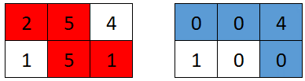

<!-- @import "[TOC]" {cmd="toc" depthFrom=1 depthTo=6 orderedList=false} -->

<!-- code_chunk_output -->

- [增量元素之间的最大差值](#增量元素之间的最大差值)
- [网格游戏（前缀和）](#网格游戏前缀和)
- [判断单词是否能放入填字游戏内（字符串匹配？）](#判断单词是否能放入填字游戏内字符串匹配)
- [解出数学表达式的学生分数](#解出数学表达式的学生分数)

<!-- /code_chunk_output -->

我去，前三题挺简单的。自己没想明白就写，还有很多地方马虎！就像最近的状态一样，极其不认真！可惜可惜！

T4 我想了个简单思路，但是写上 DFS 时发现并不好写。为了方便求值（主要是不会用 stack 求中缀表达式，基础十分不牢固），使用 Python `eval` 函数，耍赖了...

T4 值得学习，前三题值得反思。

我靠我没意识到 T4 这么难？可能我这种根本没有正确思路的人意识不到它的难度吧，坑神也没做出来，等题解估计要一阵子了。

### 增量元素之间的最大差值

给你一个下标从 0 开始的整数数组 nums ，该数组的大小为 n ，请你计算 nums[j] - nums[i] 能求得的 最大差值 ，其中 0 <= i < j < n 且 nums[i] < nums[j] 。

返回 最大差值 。如果不存在满足要求的 i 和 j ，返回 -1 。

示例 1：
```
输入：nums = [7,1,5,4]
输出：4
解释：
最大差值出现在 i = 1 且 j = 2 时，nums[j] - nums[i] = 5 - 1 = 4 。
注意，尽管 i = 1 且 j = 0 时 ，nums[j] - nums[i] = 7 - 1 = 6 > 4 ，但 i > j 不满足题面要求，所以 6 不是有效的答案。
```

示例 2：
```
输入：nums = [9,4,3,2]
输出：-1
解释：
不存在同时满足 i < j 和 nums[i] < nums[j] 这两个条件的 i, j 组合。
```

示例 3：
```
输入：nums = [1,5,2,10]
输出：9
解释：
最大差值出现在 i = 0 且 j = 3 时，nums[j] - nums[i] = 10 - 1 = 9 。
```

提示：
- n == nums.length
- 2 <= n <= 1000
- 1 <= nums[i] <= $10^9$

```cpp
class Solution {
public:
    int maximumDifference(vector<int>& nums) {
        int n = nums.size();
        int res = 0;
        for (int i = 0; i < n - 1; ++ i)
            for (int j = i + 1; j < n; ++ j)
                res = max(nums[j] - nums[i], res);
        return res == 0 ? -1 : res;
    }
};
```

### 网格游戏（前缀和）

给你一个下标从 0 开始的二维数组 grid ，数组大小为 2 x n ，其中 grid[r][c] 表示矩阵中 (r, c) 位置上的点数。现在有两个机器人正在矩阵上参与一场游戏。

两个机器人初始位置都是 (0, 0) ，目标位置是 (1, n-1) 。每个机器人只会 向右 ((r, c) 到 (r, c + 1)) 或 向下 ((r, c) 到 (r + 1, c)) 。

游戏开始，第一个 机器人从 (0, 0) 移动到 (1, n-1) ，并收集路径上单元格的全部点数。对于路径上所有单元格 (r, c) ，途经后 grid[r][c] 会重置为 0 。然后，第二个 机器人从 (0, 0) 移动到 (1, n-1) ，同样收集路径上单元的全部点数。注意，它们的路径可能会存在相交的部分。

第一个 机器人想要打击竞争对手，使 第二个 机器人收集到的点数 最小化 。与此相对，第二个 机器人想要 最大化 自己收集到的点数。两个机器人都发挥出自己的 最佳水平 的前提下，返回 第二个 机器人收集到的 点数 。

示例 1：



```
输入：grid = [[2,5,4],[1,5,1]]
输出：4
解释：第一个机器人的最佳路径如红色所示，第二个机器人的最佳路径如蓝色所示。
第一个机器人访问过的单元格将会重置为 0 。
第二个机器人将会收集到 0 + 0 + 4 + 0 = 4 个点。
```

示例 2：


```
输入：grid = [[3,3,1],[8,5,2]]
输出：4
解释：第一个机器人的最佳路径如红色所示，第二个机器人的最佳路径如蓝色所示。 
第一个机器人访问过的单元格将会重置为 0 。
第二个机器人将会收集到 0 + 3 + 1 + 0 = 4 个点。
```

示例 3：


```
输入：grid = [[1,3,1,15],[1,3,3,1]]
输出：7
解释：第一个机器人的最佳路径如红色所示，第二个机器人的最佳路径如蓝色所示。
第一个机器人访问过的单元格将会重置为 0 。
第二个机器人将会收集到 0 + 1 + 3 + 3 + 0 = 7 个点。
```

提示：
- grid.length == 2
- n == grid[r].length
- 1 <= n <= 5 * $10^4$
- 1 <= grid[r][c] <= $10^5$

```cpp
typedef long long LL;

class Solution {
public:
    long long gridGame(vector<vector<int>>& grid) {
        int n = grid[0].size();

        vector<LL> preS1(n + 1, 0);
        vector<LL> preS2(n + 1, 0);
        
        for (int i = 1; i <= n; ++ i)
        {
            preS1[i] = preS1[i - 1] + grid[0][i - 1];
            preS2[i] = preS2[i - 1] + grid[1][i - 1];
        }
        
        // 枚举机器人1的转折点
        vector<LL> ans;
        for (int i = 1; i <= n; ++ i)
        {
            // 机器人2走哪里合适
            LL a = 0;
            a = max(a, preS1[n] - preS1[i]);
            a = max(a, preS2[i - 1]);
            ans.push_back(a);
        }
        
        return *min_element(ans.begin(), ans.end());  // 经验：用 *min_element
    }
};
```

### 判断单词是否能放入填字游戏内（字符串匹配？）

给你一个 m x n 的矩阵 board ，它代表一个填字游戏 当前 的状态。填字游戏格子中包含小写英文字母（已填入的单词），表示 空 格的 `' '` 和表示 障碍 格子的 `'#'` 。

如果满足以下条件，那么我们可以 水平 （从左到右 或者 从右到左）或 竖直 （从上到下 或者 从下到上）填入一个单词：

该单词不占据任何 `'#'` 对应的格子。
每个字母对应的格子要么是 `' '` （空格）要么与 board 中已有字母 匹配 。
如果单词是 水平 放置的，那么该单词左边和右边 相邻 格子不能为 `' '` 或小写英文字母。
如果单词是 竖直 放置的，那么该单词上边和下边 相邻 格子不能为 `' '` 或小写英文字母。
给你一个字符串 word ，如果 word 可以被放入 board 中，请你返回 true ，否则请返回 false 。

示例 1：


```
输入：board = [["#", " ", "#"], [" ", " ", "#"], ["#", "c", " "]], word = "abc"
输出：true
解释：单词 "abc" 可以如上图放置（从上往下）。
```

示例 2：


```
输入：board = [[" ", "#", "a"], [" ", "#", "c"], [" ", "#", "a"]], word = "ac"
输出：false
解释：无法放置单词，因为放置该单词后上方或者下方相邻格会有空格。
```

示例 3：


```
输入：board = [["#", " ", "#"], [" ", " ", "#"], ["#", " ", "c"]], word = "ca"
输出：true
解释：单词 "ca" 可以如上图放置（从右到左）。
```

提示：
- m == board.length
- n == board[i].length
- 1 <= m * n <= $2 * 10^5$
- board[i][j] 可能为 `' '` ，`'#'` 或者一个小写英文字母。
- 1 <= word.length <= max(m, n)
- word 只包含小写英文字母。

```cpp
class Solution {
public:
    bool placeWordInCrossword(vector<vector<char>>& board, string word) {
        int n = board.size();
        int m = board[0].size();
        int len = word.size();
        
        vector<string> lines;
        for (int i = 0; i < n; ++ i)
        {
            int j = 0, k = -1;
            string line;
            while (j < m)
            {
                if (k == -1 && board[i][j] != '#') k = j;

                while (k != -1 && k < m && board[i][k] != '#')
                {
                    line += board[i][k] == ' ' ? '.' : board[i][k];
                    k ++ ;
                }

                if (k != -1)
                {
                    j = k;
                    k = -1;
                    if (line.size() == len) lines.push_back(line);
                    line = "";
                }
                else j ++ ;
            }
        }
        
        for (int i = 0; i < m; ++ i)
        {
            int j = 0, k = -1;
            string line;
            while (j < n)
            {
                if (k == -1 && board[j][i] != '#') k = j;

                while (k != -1 && k < n && board[k][i] != '#')
                {
                    line += board[k][i] == ' ' ? '.' : board[k][i];
                    k ++ ;
                }

                if (k != -1)
                {
                    j = k;
                    k = -1;
                    if (line.size() == len) lines.push_back(line);
                    line = "";
                }
                else j ++ ;
            }
        }
        
        for (auto&& line : lines)
        {
            for (int i = 0; i <= len; ++ i)
            {
                // cout << line[i] << " " << word[i] << "   ";
                if (i == len) return true;
                if (line[i] != word[i] && line[i] != '.') break;
            }
            // cout << endl;

            for (int i = len - 1; i >= -1; -- i)
            {
                // cout << line[i] << " " << word[len - i - 1] << "   ";
                if (i == -1) return true;
                if (line[i] != word[len - i - 1] && line[i] != '.') break;
            }
            // cout << endl;
        }
        // cout << endl;
        
        return false;
    }
};
```

### 解出数学表达式的学生分数

给你一个字符串 s ，它 只 包含数字 0-9 ，加法运算符 `'+'` 和乘法运算符 `'*'` ，这个字符串表示一个 合法 的只含有 个位数数字 的数学表达式（比方说 `3+5*2`）。有 n 位小学生将计算这个数学表达式，并遵循如下 运算顺序 ：
- 按照 从左到右 的顺序计算 乘法 ，然后
- 按照 从左到右 的顺序计算 加法 。

给你一个长度为 n 的整数数组 answers ，表示每位学生提交的答案。你的任务是给 answer 数组按照如下 规则 打分：
- 如果一位学生的答案 等于 表达式的正确结果，这位学生将得到 5 分。
- 否则，如果答案由 一处或多处错误的运算顺序 计算得到，那么这位学生能得到 2 分。
- 否则，这位学生将得到 0 分。

请你返回所有学生的分数和。


示例 1：

```
输入：s = "7+3*1*2", answers = [20,13,42]
输出：7
解释：如上图所示，正确答案为 13 ，因此有一位学生得分为 5 分：[20,13,42] 。
一位学生可能通过错误的运算顺序得到结果 20 ：7+3=10，10*1=10，10*2=20 。所以这位学生得分为 2 分：[20,13,42] 。
所有学生得分分别为：[2,5,0] 。所有得分之和为 2+5+0=7 。
```

示例 2：

```
输入：s = "3+5*2", answers = [13,0,10,13,13,16,16]
输出：19
解释：表达式的正确结果为 13 ，所以有 3 位学生得到 5 分：[13,0,10,13,13,16,16] 。
学生可能通过错误的运算顺序得到结果 16 ：3+5=8，8*2=16 。所以两位学生得到 2 分：[13,0,10,13,13,16,16] 。
所有学生得分分别为：[5,0,0,5,5,2,2] 。所有得分之和为 5+0+0+5+5+2+2=19 。
```

示例 3：

```
输入：s = "6+0*1", answers = [12,9,6,4,8,6]
输出：10
解释：表达式的正确结果为 6 。
如果一位学生通过错误的运算顺序计算该表达式，结果仍为 6 。
根据打分规则，运算顺序错误的学生也将得到 5 分（因为他们仍然得到了正确的结果），而不是 2 分。
所有学生得分分别为：[0,0,5,0,0,5] 。所有得分之和为 10 分。
```

提示：
- 3 <= s.length <= 31
- s 表示一个只包含 0-9 ，'+' 和 '*' 的合法表达式。
- 表达式中所有整数运算数字都在闭区间 [0, 9] 以内。
- 1 <= 数学表达式中所有运算符数目（'+' 和 '*'） <= 15
- 测试数据保证正确表达式结果在范围 [0, 1000] 以内。
- n == answers.length
- 1 <= n <= $10^4$
- 0 <= answers[i] <= 1000

```cpp

```
