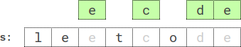

<!-- @import "[TOC]" {cmd="toc" depthFrom=1 depthTo=6 orderedList=false} -->

<!-- code_chunk_output -->

- [转换字符串的最少操作次数](#转换字符串的最少操作次数)
- [找出缺失的观测数据](#找出缺失的观测数据)
- [石子游戏 IX](#石子游戏-ix)
- [含特定字母的最小子序列](#含特定字母的最小子序列)

<!-- /code_chunk_output -->

T2 读样例不仔细，可惜。

T3 T4 太难，没思路，不纠结了，十一点停赛，去学别的。

### 转换字符串的最少操作次数

给你一个字符串 s ，由 n 个字符组成，每个字符不是 'X' 就是 'O' 。

一次 操作 定义为从 s 中选出 三个连续字符 并将选中的每个字符都转换为 'O' 。注意，如果字符已经是 'O' ，只需要保持 不变 。

返回将 s 中所有字符均转换为 'O' 需要执行的 最少 操作次数。

示例 1：
```
输入：s = "XXX"
输出：1
解释：XXX -> OOO
一次操作，选中全部 3 个字符，并将它们转换为 'O' 。
```

示例 2：
```
输入：s = "XXOX"
输出：2
解释：XXOX -> OOOX -> OOOO
第一次操作，选择前 3 个字符，并将这些字符转换为 'O' 。
然后，选中后 3 个字符，并执行转换。最终得到的字符串全由字符 'O' 组成。
```

示例 3：
```
输入：s = "OOOO"
输出：0
解释：s 中不存在需要转换的 'X' 。
```

提示：
- 3 <= s.length <= 1000
- s[i] 为 'X' 或 'O'

```cpp
class Solution {
public:
    int minimumMoves(string s) {
        int n = s.size();
        int ans = 0;
        for (int i = 0; i < n; ++ i)
        {
            if (s[i] == 'X')
            {
                ans ++ ;
                i = i + 2;
            }
        }
        return ans;
    }
};
```

### 找出缺失的观测数据

现有一份 n + m 次投掷单个 六面 骰子的观测数据，骰子的每个面从 1 到 6 编号。观测数据中缺失了 n 份，你手上只拿到剩余 m 次投掷的数据。幸好你有之前计算过的这 n + m 次投掷数据的 平均值 。

给你一个长度为 m 的整数数组 rolls ，其中 rolls[i] 是第 i 次观测的值。同时给你两个整数 mean 和 n 。

返回一个长度为 n 的数组，包含所有缺失的观测数据，且满足这 n + m 次投掷的 平均值 是 mean 。如果存在多组符合要求的答案，只需要返回其中任意一组即可。如果不存在答案，返回一个空数组。

k 个数字的 平均值 为这些数字求和后再除以 k 。

注意 mean 是一个整数，所以 n + m 次投掷的总和需要被 n + m 整除。

示例 1：
```
输入：rolls = [3,2,4,3], mean = 4, n = 2
输出：[6,6]
解释：所有 n + m 次投掷的平均值是 (3 + 2 + 4 + 3 + 6 + 6) / 6 = 4 。
```

示例 2：
```
输入：rolls = [1,5,6], mean = 3, n = 4
输出：[2,3,2,2]
解释：所有 n + m 次投掷的平均值是 (1 + 5 + 6 + 2 + 3 + 2 + 2) / 7 = 3 。
```

示例 3：
```
输入：rolls = [1,2,3,4], mean = 6, n = 4
输出：[]
解释：无论丢失的 4 次数据是什么，平均值都不可能是 6 。
```

示例 4：
```
输入：rolls = [1], mean = 3, n = 1
输出：[5]
解释：所有 n + m 次投掷的平均值是 (1 + 5) / 2 = 3 。
```

提示：
- m == rolls.length
- 1 <= n, m <= $10^5$
- 1 <= rolls[i], mean <= 6

```cpp
class Solution {
public:
    vector<int> missingRolls(vector<int>& rolls, int mean, int n) {
        int m = rolls.size();
        int sum = 0;
        for (int i = 0; i < m; ++ i) sum += rolls[i];
        int tot = mean * (n + m) - sum;
        // 把 tot 分为 n 份，数 a[i] ∈ [1, 6]
        /*
        6 6 6 1
        19 / 4 = 4.75
        5 5 5 4
        */
        vector<int> ans;
        if (tot > 6 * n || tot < n) return ans;
        int base = tot / n;
        int i = 0;  // n - i 个 base ； i 个 base + 1
        for ( ; i <= n; ++ i)
        {
            if (base * (n - i) + (base + 1) * i == tot) break;
        }
        for (int j = 0; j < i; ++ j)
        {
            ans.push_back(base + 1);
        }
        for (int j = 0; j < n - i; ++ j)
        {
            ans.push_back(base);
        }
        return ans;
    }
};
```

### 石子游戏 IX

Alice 和 Bob 再次设计了一款新的石子游戏。现有一行 n 个石子，每个石子都有一个关联的数字表示它的价值。给你一个整数数组 stones ，其中 stones[i] 是第 i 个石子的价值。

Alice 和 Bob 轮流进行自己的回合，Alice 先手。每一回合，玩家需要从 stones 中移除任一石子。
- 如果玩家移除石子后，导致 所有已移除石子 的价值 总和 可以被 3 整除，那么该玩家就 输掉游戏 。
- 如果不满足上一条，且移除后没有任何剩余的石子，那么 Bob 将会直接获胜（即便是在 Alice 的回合）。

假设两位玩家均采用 最佳 决策。如果 Alice 获胜，返回 true ；如果 Bob 获胜，返回 false 。

示例 1：
```
输入：stones = [2,1]
输出：true
解释：游戏进行如下：
- 回合 1：Alice 可以移除任意一个石子。
- 回合 2：Bob 移除剩下的石子。 
已移除的石子的值总和为 1 + 2 = 3 且可以被 3 整除。因此，Bob 输，Alice 获胜。
```

示例 2：
```
输入：stones = [2]
输出：false
解释：Alice 会移除唯一一个石子，已移除石子的值总和为 2 。 
由于所有石子都已移除，且值总和无法被 3 整除，Bob 获胜。
```

示例 3：
```
输入：stones = [5,1,2,4,3]
输出：false
解释：Bob 总会获胜。其中一种可能的游戏进行方式如下：
- 回合 1：Alice 可以移除值为 1 的第 2 个石子。已移除石子值总和为 1 。
- 回合 2：Bob 可以移除值为 3 的第 5 个石子。已移除石子值总和为 = 1 + 3 = 4 。
- 回合 3：Alices 可以移除值为 4 的第 4 个石子。已移除石子值总和为 = 1 + 3 + 4 = 8 。
- 回合 4：Bob 可以移除值为 2 的第 3 个石子。已移除石子值总和为 = 1 + 3 + 4 + 2 = 10.
- 回合 5：Alice 可以移除值为 5 的第 1 个石子。已移除石子值总和为 = 1 + 3 + 4 + 2 + 5 = 15.
Alice 输掉游戏，因为已移除石子值总和（15）可以被 3 整除，Bob 获胜。
```

提示：
- 1 <= stones.length <= $10^5$
- 1 <= stones[i] <= $10^4$

```cpp

```

### 含特定字母的最小子序列

给你一个字符串 s ，一个整数 k ，一个字母 letter 以及另一个整数 repetition 。

返回 s 中长度为 k 且 字典序最小 的子序列，该子序列同时应满足字母 letter 出现 至少 repetition 次。生成的测试用例满足 letter 在 s 中出现 至少 repetition 次。

子序列 是由原字符串删除一些（或不删除）字符且不改变剩余字符顺序得到的剩余字符串。

字符串 a 字典序比字符串 b 小的定义为：在 a 和 b 出现不同字符的第一个位置上，字符串 a 的字符在字母表中的顺序早于字符串 b 的字符。

示例 1：



```
输入：s = "leet", k = 3, letter = "e", repetition = 1
输出："eet"
解释：存在 4 个长度为 3 ，且满足字母 'e' 出现至少 1 次的子序列：
- "lee"（"leet"）
- "let"（"leet"）
- "let"（"leet"）
- "eet"（"leet"）
其中字典序最小的子序列是 "eet" 。
```

示例 2：
```
example-2

输入：s = "leetcode", k = 4, letter = "e", repetition = 2
输出："ecde"
解释："ecde" 是长度为 4 且满足字母 "e" 出现至少 2 次的字典序最小的子序列。
```

示例 3：
```
输入：s = "bb", k = 2, letter = "b", repetition = 2
输出："bb"
解释："bb" 是唯一一个长度为 2 且满足字母 "b" 出现至少 2 次的子序列。
```

提示：
- 1 <= repetition <= k <= s.length <= 5 * $10^4$
- s 由小写英文字母组成
- letter 是一个小写英文字母，在 s 中至少出现 repetition 次

```cpp

```
