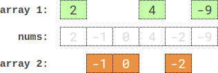

<!-- @import "[TOC]" {cmd="toc" depthFrom=1 depthTo=6 orderedList=false} -->

<!-- code_chunk_output -->

- [股票价格波动（接口）](#股票价格波动接口)
- [将数组分成两个数组并最小化数组和的差（折半枚举+排序+二分）](#将数组分成两个数组并最小化数组和的差折半枚举排序二分)

<!-- /code_chunk_output -->

T2 取中位数就行，**心中想象数轴，则本题各种条件迎刃而解。** WA 两次有点可惜。

T3 没什么难度，但是要记录一下，因为大佬写得实在太好了：
- `set()` 是有序的！ `map()` 是有序的！
- 合理利用 `begin()` 更要合理利用 `rbegin()` ！

T4 朴素 dfs 写出来了，然后就是跟各路大佬学学怎么优化。

### 股票价格波动（接口）

给你一支股票价格的数据流。数据流中每一条记录包含一个 时间戳 和该时间点股票对应的 价格 。

不巧的是，由于股票市场内在的波动性，股票价格记录可能不是按时间顺序到来的。某些情况下，有的记录可能是错的。如果两个有相同时间戳的记录出现在数据流中，前一条记录视为错误记录，后出现的记录 更正 前一条错误的记录。

请你设计一个算法，实现：
- 更新 股票在某一时间戳的股票价格，如果有之前同一时间戳的价格，这一操作将 更正 之前的错误价格。
- 找到当前记录里 最新股票价格 。最新股票价格 定义为时间戳最晚的股票价格。
- 找到当前记录里股票的 最高价格 。
- 找到当前记录里股票的 最低价格 。

请你实现 `StockPrice` 类：
- `StockPrice()` 初始化对象，当前无股票价格记录。
- `void update(int timestamp, int price)` 在时间点 `timestamp` 更新股票价格为 `price` 。
- `int current()` 返回股票 最新价格 。
- `int maximum()` 返回股票 最高价格 。
- `int minimum()` 返回股票 最低价格 。


示例 1：

```
输入：
["StockPrice", "update", "update", "current", "maximum", "update", "maximum", "update", "minimum"]
[[], [1, 10], [2, 5], [], [], [1, 3], [], [4, 2], []]
输出：
[null, null, null, 5, 10, null, 5, null, 2]

解释：
StockPrice stockPrice = new StockPrice();
stockPrice.update(1, 10); // 时间戳为 [1] ，对应的股票价格为 [10] 。
stockPrice.update(2, 5);  // 时间戳为 [1,2] ，对应的股票价格为 [10,5] 。
stockPrice.current();     // 返回 5 ，最新时间戳为 2 ，对应价格为 5 。
stockPrice.maximum();     // 返回 10 ，最高价格的时间戳为 1 ，价格为 10 。
stockPrice.update(1, 3);  // 之前时间戳为 1 的价格错误，价格更新为 3 。
                          // 时间戳为 [1,2] ，对应股票价格为 [3,5] 。
stockPrice.maximum();     // 返回 5 ，更正后最高价格为 5 。
stockPrice.update(4, 2);  // 时间戳为 [1,2,4] ，对应价格为 [3,5,2] 。
stockPrice.minimum();     // 返回 2 ，最低价格时间戳为 4 ，价格为 2 。
```

提示：
- 1 <= `timestamp`, `price` <= $10^9$
- `update`，`current`，`maximum` 和 `minimum` 总 调用次数不超过 $10^5$ 。
- `current`，`maximum` 和 `minimum` 被调用时，`update` 操作 至少 已经被调用过 一次 。

我的代码：
```cpp
// 两个优先队列，懒更新，map里键值存 `-timestamp` 方便取最大值

struct Stock
{
    int timestamp;
    int price;
    
    const bool operator< (const Stock& t) const
    {
        return price < t.price;
    }
    
    const bool operator> (const Stock& t) const
    {
        return price > t.price;
    }
};

class StockPrice {
public:

    map<int, int> right_price;
    priority_queue< Stock, vector<Stock>, less<Stock> >  max_stocks;
    priority_queue< Stock, vector<Stock>, greater<Stock> >  min_stocks;
    
    StockPrice() {
        right_price.clear();
        while (max_stocks.size()) max_stocks.pop();
        while (min_stocks.size()) min_stocks.pop();
    }
    
    void update(int timestamp, int price) {
        right_price[-timestamp] = price;
        max_stocks.push({-timestamp, price});
        min_stocks.push({-timestamp, price});
    }
    
    int current() {
        for (auto&& t: right_price)
            return t.second;
        return -1;
    }
    
    int maximum() {
        while (true)
        {
            auto t = max_stocks.top();
            if (right_price[t.timestamp] == t.price)
                return t.price;
            max_stocks.pop();
        }
    }
    
    int minimum() {
        while (true)
        {
            auto t = min_stocks.top();
            if (right_price[t.timestamp] == t.price)
                return t.price;
            min_stocks.pop();
        }
    }
};

/**
 * Your StockPrice object will be instantiated and called as such:
 * StockPrice* obj = new StockPrice();
 * obj->update(timestamp,price);
 * int param_2 = obj->current();
 * int param_3 = obj->maximum();
 * int param_4 = obj->minimum();
 */
```

[大佬](https://leetcode-cn.com/u/johnkram/)的：

```cpp
class StockPrice {
    map<int,int> m;
    set<pair<int,int>> s;
public:
    StockPrice() {
        m.clear();
        s.clear();
    }
    
    void update(int timestamp, int price) {
        if(m.count(timestamp))s.erase(make_pair(m[timestamp],timestamp));
        s.insert(make_pair(m[timestamp]=price,timestamp));
    }
    
    int current() {
        return m.rbegin()->second;
    }
    
    int maximum() {
        return s.rbegin()->first;
    }
    
    int minimum() {
        return s.begin()->first;
    }
};
```

### 将数组分成两个数组并最小化数组和的差（折半枚举+排序+二分）

给你一个长度为 2 * n 的整数数组。你需要将 nums 分成 两个 长度为 n 的数组，分别求出两个数组的和，并 最小化 两个数组和之 差的绝对值 。nums 中每个元素都需要放入两个数组之一。

请你返回 最小 的数组和之差。

示例 1：


```
输入：nums = [3,9,7,3]
输出：2
解释：最优分组方案是分成 [3,9] 和 [7,3] 。
数组和之差的绝对值为 abs((3 + 9) - (7 + 3)) = 2 。
```

示例 2：

```
输入：nums = [-36,36]
输出：72
解释：最优分组方案是分成 [-36] 和 [36] 。
数组和之差的绝对值为 abs((-36) - (36)) = 72 。
```

示例 3：



```
输入：nums = [2,-1,0,4,-2,-9]
输出：0
解释：最优分组方案是分成 [2,4,-9] 和 [-1,0,-2] 。
数组和之差的绝对值为 abs((2 + 4 + -9) - (-1 + 0 + -2)) = 0 。
```

提示：
- 1 <= n <= 15
- nums.length == 2 * n
- $-10^7$ <= nums[i] <= $10^7$

```cpp
class Solution {
public:
    vector<int> a;
    int n;
    int s1, s2, c1, c2;
    int ans;

    void dfs(int u, int v)
    {
        if (v) s1 += a[u], c1 += 1;
        else s2 += a[u], c2 += 1;

        if (u == n - 1)
            ans = min(abs(s1 - s2), ans);
        
        if (c1 < n / 2) dfs(u + 1, 1);
        if (c2 < n / 2) dfs(u + 1, 0);

        if (v) s1 -= a[u], c1 -= 1;
        else s2 -= a[u], c2 -= 1;

    }

    int minimumDifference(vector<int>& nums) {
        a = nums;
        n = a.size();
        s1 = 0, s2 = 0, ans = INT_MAX;
        c1 = 0, c2 = 0;
        
        dfs(0, 0);
        dfs(0, 1);
        
        return ans;
    }
};
```

以下是正确答案。大佬[灵茶山艾府](https://leetcode-cn.com/problems/partition-array-into-two-arrays-to-minimize-sum-difference/solution/zhe-ban-mei-ju-pai-xu-er-fen-by-endlessc-04fn/)和大佬[喂你脚下有坑](https://www.bilibili.com/video/BV1ZL41137pU?p=5)的思路几乎是一致的，只不过坑神管“折半枚举”叫 `Meet in the Middle` 。

```cpp
// 暴力前一半，记录所有可能（2^{15} 还是轻轻松松暴力的）
// 前一半可以分成 n+1 种情况：选 0-n 个在第一组中
// 然后暴力后一半，记录所有可能
// 对应前一半中 n+1 种情况：选 n-0 个在第二组中
// 用二分法可以找到 n+1 中情况中，哪两个相对最好
// 举个例子： n=5 前一半选 c=3 个，则后一半选 nc=2 个
// 对于后一半中每一个 nc=2 的情况，记其 array1-array2=d
// 在前一半的向量 delta[c] 中通过二分找到最接近 -d 的
// 则找到了当前情况下能得到的最优解值
// 时间复杂度：2^n * log{2^n/n} 枚举 * 二分

#define LL long long
vector<LL> delta[16];  // delta[i] 前一半中，第一组选了 i 个的各种情况下的 array1-array2
class Solution {
public:
    int minimumDifference(vector<int>& nums) {
        int N = nums.size();
        int n = N / 2;
        for (int i = 0; i <= n; i++) delta[i].clear();
        
        int lim = 1<<n;
        for (int s = 0; s < lim; s++){
            LL d = 0; int c = 0;
            for (int i = 0; i < n; i++){
                if ((s>>i)&1){
                    c += 1;
                    d += nums[i];
                }else d -= nums[i];
            }
            delta[c].push_back(d);
        }
        
        LL ans = 0; for (int i = 0; i < n; i++) ans += nums[i] - nums[n + i]; ans = abs(ans);
        for (int i = 0; i <= n; i++) sort(delta[i].begin(), delta[i].end());
        for (int s = 0; s < lim; s++){
            LL d = 0; int c = 0;
            for (int i = 0; i < n; i++){
                if ((s>>i)&1){
                    c += 1;
                    d += nums[n + i];
                }else d -= nums[n + i];
            }
            int nc = n - c;
            vector<LL>::iterator p = upper_bound(delta[nc].begin(), delta[nc].end(), -d);
            if (p != delta[nc].end()) ans = min(ans, abs(d + *p));
            if (p != delta[nc].begin()){
                p--;
                ans = min(ans, abs(d + *p));
            }
        }
        
        return ans;
    }
};
```
