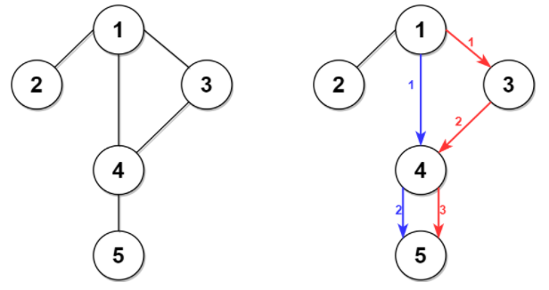
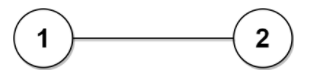

<!-- @import "[TOC]" {cmd="toc" depthFrom=1 depthTo=6 orderedList=false} -->

<!-- code_chunk_output -->

- [统计按位或能得到最大值的子集数目](#统计按位或能得到最大值的子集数目)
- [到达目的地的第二短时间](#到达目的地的第二短时间)

<!-- /code_chunk_output -->

T1 直接用 python3 的 `split` 和 `str.isdigit()` 最方便。

T2 把 `+=` 写成 `+-` 了，罚时两次，太智障了。

T3 在用 dfs 挣扎，无果。 T4 看起来像 A-star 。

### 统计按位或能得到最大值的子集数目

给你一个整数数组 `nums` ，请你找出 `nums` 子集 按位或 可能得到的 最大值 ，并返回按位或能得到最大值的 不同非空子集的数目 。

如果数组 `a` 可以由数组 `b` 删除一些元素（或不删除）得到，则认为数组 `a` 是数组 `b` 的一个 子集 。如果选中的元素下标位置不一样，则认为两个子集 不同 。

对数组 `a` 执行 按位或 ，结果等于 `a[0] OR a[1] OR ... OR a[a.length - 1]`（下标从 0 开始）。

示例 1：
```
输入：nums = [3,1]
输出：2
解释：子集按位或能得到的最大值是 3 。有 2 个子集按位或可以得到 3 ：
- [3]
- [3,1]
```

示例 2：
```
输入：nums = [2,2,2]
输出：7
解释：[2,2,2] 的所有非空子集的按位或都可以得到 2 。总共有 23 - 1 = 7 个子集。
```

示例 3：
```
输入：nums = [3,2,1,5]
输出：6
解释：子集按位或可能的最大值是 7 。有 6 个子集按位或可以得到 7 ：
- [3,5]
- [3,1,5]
- [3,2,5]
- [3,2,1,5]
- [2,5]
- [2,1,5]
```

提示：
- 1 <= nums.length <= 16
- 1 <= nums[i] <= $10^5$

```cpp

```

### 到达目的地的第二短时间

城市用一个 双向连通 图表示，图中有 n 个节点，从 1 到 n 编号（包含 1 和 n）。图中的边用一个二维整数数组 `edges` 表示，其中每个 `edges[i] = [ui, vi]` 表示一条节点 `ui` 和节点 `vi` 之间的双向连通边。每组节点对由 最多一条 边连通，顶点不存在连接到自身的边。穿过任意一条边的时间是 `time` 分钟。

每个节点都有一个交通信号灯，每 `change` 分钟改变一次，从绿色变成红色，再由红色变成绿色，循环往复。所有信号灯都 同时 改变。你可以在 任何时候 进入某个节点，但是 只能 在节点 信号灯是绿色时 才能离开。如果信号灯是  绿色 ，你 不能 在节点等待，必须离开。

第二小的值 是 严格大于 最小值的所有值中最小的值。

例如，`[2, 3, 4]` 中第二小的值是 `3` ，而 `[2, 2, 4]` 中第二小的值是 `4` 。
给你 `n` 、 `edges` 、 `time` 和 `change` ，返回从节点 1 到节点 n 需要的 第二短时间 。

注意：
- 你可以 任意次 穿过任意顶点，包括 1 和 n 。
- 你可以假设在 启程时 ，所有信号灯刚刚变成 绿色 。

示例 1：



```
输入：n = 5, edges = [[1,2],[1,3],[1,4],[3,4],[4,5]], time = 3, change = 5
输出：13
解释：
上面的左图展现了给出的城市交通图。
右图中的蓝色路径是最短时间路径。
花费的时间是：
- 从节点 1 开始，总花费时间=0
- 1 -> 4：3 分钟，总花费时间=3
- 4 -> 5：3 分钟，总花费时间=6
因此需要的最小时间是 6 分钟。

右图中的红色路径是第二短时间路径。
- 从节点 1 开始，总花费时间=0
- 1 -> 3：3 分钟，总花费时间=3
- 3 -> 4：3 分钟，总花费时间=6
- 在节点 4 等待 4 分钟，总花费时间=10
- 4 -> 5：3 分钟，总花费时间=13
因此第二短时间是 13 分钟。
```

示例 2：



```
输入：n = 2, edges = [[1,2]], time = 3, change = 2
输出：11
解释：
最短时间路径是 1 -> 2 ，总花费时间 = 3 分钟
最短时间路径是 1 -> 2 -> 1 -> 2 ，总花费时间 = 11 分钟
```

提示：
- 2 <= n <= $10^4$
- n - 1 <= edges.length <= $min(2 * 10^4, n * (n - 1) / 2)$
- edges[i].length == 2
- 1 <= ui, vi <= n
- ui != vi
- 不含重复边
- 每个节点都可以从其他节点直接或者间接到达
- 1 <= time, change <= $10^3$
