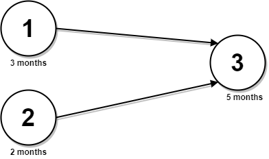

<!-- @import "[TOC]" {cmd="toc" depthFrom=1 depthTo=6 orderedList=false} -->

<!-- code_chunk_output -->

- [并行课程 III（拓扑序+动态规划）](#并行课程-iii拓扑序动态规划)

<!-- /code_chunk_output -->

AK 了，四道题目都很简单，而且最后一道不用拓扑排序也能做出来。

毛手毛脚是个严重问题，四次罚时就很扯：
- T1 罚时实在是不该，没有考虑单独出现标点也合法的情况，究其原因：脑子不清，根本没考虑到单独表点的情况
- T3 忘了开 `long long`
- T4 邻接表空间没给够，我太傻了

下个目前进前 100 。

但是不能强求，如果接下来只能做出来两道题也没必要气馁，因为确实实力还没到。而且这周题目确实实在太简单。

### 并行课程 III（拓扑序+动态规划）

给你一个整数 n ，表示有 n 节课，课程编号从 1 到 n 。同时给你一个二维整数数组 `relations` ，其中 `relations[j] = [prevCoursej, nextCoursej]` ，表示课程 `prevCoursej` 必须在课程 `nextCoursej` 之前 完成（先修课的关系）。同时给你一个下标从 0 开始的整数数组 `time` ，其中 `time[i]` 表示完成第 `(i+1)` 门课程需要花费的 月份 数。

请你根据以下规则算出完成所有课程所需要的 最少 月份数：
- 如果一门课的所有先修课都已经完成，你可以在 任意 时间开始这门课程。
- 你可以 同时 上 任意门课程 。

请你返回完成所有课程所需要的 最少 月份数。

注意：测试数据保证一定可以完成所有课程（也就是先修课的关系构成一个有向无环图）。

示例 1:



```
输入：n = 3, relations = [[1,3],[2,3]], time = [3,2,5]
输出：8
解释：上图展示了输入数据所表示的先修关系图，以及完成每门课程需要花费的时间。
你可以在月份 0 同时开始课程 1 和 2 。
课程 1 花费 3 个月，课程 2 花费 2 个月。
所以，最早开始课程 3 的时间是月份 3 ，完成所有课程所需时间为 3 + 5 = 8 个月。
```

示例 2：


```
输入：n = 5, relations = [[1,5],[2,5],[3,5],[3,4],[4,5]], time = [1,2,3,4,5]
输出：12
解释：上图展示了输入数据所表示的先修关系图，以及完成每门课程需要花费的时间。
你可以在月份 0 同时开始课程 1 ，2 和 3 。
在月份 1，2 和 3 分别完成这三门课程。
课程 4 需在课程 3 之后开始，也就是 3 个月后。课程 4 在 3 + 4 = 7 月完成。
课程 5 需在课程 1，2，3 和 4 之后开始，也就是在 max(1,2,3,7) = 7 月开始。
所以完成所有课程所需的最少时间为 7 + 5 = 12 个月。
```

提示：
- 1 <= n <= $5 * 10^4$
- $0 <= relations.length <= min(n * (n - 1) / 2, 5 * 10^4)$
- `relations[j].length == 2`
- `1 <= prevCoursej, nextCoursej <= n`
- `prevCoursej != nextCoursej`
- 所有的先修课程对 `[prevCoursej, nextCoursej]` 都是 互不相同 的。
- `time.length == n`
- 1 <= time[i] <= $10^4$
- 先修课程图是一个有向无环图。

我的思路：
- 假如所有顶点都汇集到最后一个点，则此题题意相当于从最后一个点出发，然后求最长路
- 因为我大概记得反证法证明 `dijkstra` 得到最小值的方法，因此断定魔改 `dijkstra` 是可以求最长路的

本题还需要注意的点有：
- 增加一个虚起点和虚终点，只不过边权为0，这样就转换成了单源最短路问题

所以本题很简单。我的代码如下。

```cpp
typedef pair<int, int> PII;

const int N = 1e6;
int h[N], e[N], ne[N], idx;
int d[N];

void add (int a, int b)
{
    e[idx] = b, ne[idx] = h[a], h[a] = idx ++ ;
}

class Solution {
public:
    int minimumTime(int n, vector<vector<int>>& relations, vector<int>& time) {
        idx = 0;
        memset(h, -1, sizeof h);
        memset(d, -0x3f, sizeof d);

        for (auto&& c: relations)
            add(c[1], c[0]);
        
        for (int i = 1; i <= n; ++ i)
        {
            add(i, 0);
            add(n+1, i);
        }

        priority_queue<PII, vector<PII>> q;
        q.push({0, n+1});
        while (q.size())
        {
            auto t = q.top();
            q.pop();
            int vec = t.second;
            int dist = t.first;
            for (int i = h[vec]; ~i; i = ne[i])
            {
                int j = e[i];
                if (d[j] < dist + (j > 0 ? time[j-1] : 0))
                {
                    d[j] = dist + (j > 0 ? time[j-1] : 0);
                    q.push({d[j], j});
                }
            }
        }
        
        return d[0];
    }
};
```

也是自己菜，想不到拓扑排序。按理说，想到拓扑排序加动态规划才是常规做法。

```cpp
const int N = 5e4 + 10;

int e[N], ne[N], h[N], idx;
int d[N], f[N];  // d 入度， f 完成 i 所需最短时间

void add(int u, int v)
{
    e[idx] = v, ne[idx] = h[u], h[u] = idx ++ ;
}

class Solution {
public:
    int minimumTime(int n, vector<vector<int>>& relations, vector<int>& time) {
        idx = 0;
        memset(h, -1, sizeof h);
        memset(d, 0, sizeof d);
        memset(f, 0, sizeof f);
        
        for (auto&& t: relations)
        {
            add(t[0], t[1]);
            d[t[1]] ++ ;
        }

        queue<int> q;

        for (int i = 1; i <= n; ++ i)
            if (!d[i])
            {
                q.push(i);
                f[i] = time[i - 1];
            }
        
        int ans = 0;

        while (q.size())
        {
            auto t = q.front();
            q.pop();
            ans = max(f[t], ans);

            for (int i = h[t]; ~i; i = ne[i])
            {
                int j = e[i];
                d[j] -- ;
                if (!d[j]) q.push(j);
                f[j] = max(f[t] + time[j - 1], f[j]);
            }
        }

        return ans;
    }
};
```

也很简单，但是效率很高：
- 拓扑排序： 356 ms 113.6 MB
- 狄克斯拉： 1032 ms 124.7 MB
