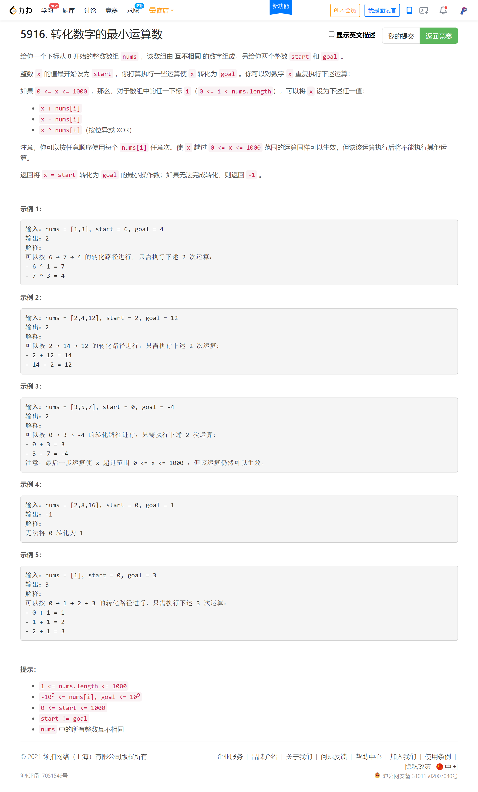
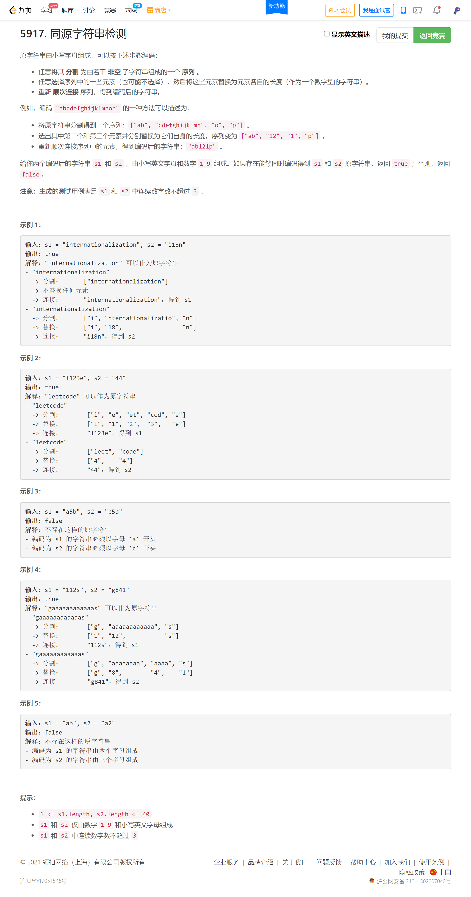

<!-- @import "[TOC]" {cmd="toc" depthFrom=1 depthTo=6 orderedList=false} -->

<!-- code_chunk_output -->

- [转化数字的最小运算数（转化为bfs问题）](#转化数字的最小运算数转化为bfs问题)
- [同源字符串检测](#同源字符串检测)

<!-- /code_chunk_output -->

T3 完全没思路，赛后看了大佬的代码，估计用 BFS ？毕竟允许的当作中介的数在 1000 以内。这都可以想到 BFS + 多终点最短路？

T4 有那么难吗？只有 45 个人做出来。我是有思路的，递归+剪枝。但是不知道哪里超时了。估计是 `string(i, '*')` 用得太多？还是 `equal` 没优化？

不管了，电脑快没电了。学校停电一天，来电了再复盘这周末三场比赛。

### 转化数字的最小运算数（转化为bfs问题）



```cpp
// bfs 因为一共只有 1000 个状态

class Solution {
public:
    int minimumOperations(vector<int>& nums, int start, int goal) {
        int ans = -1;
        queue<int> q;
        int d[1001];
        memset(d, 0x3f, sizeof d);

        q.push(start);
        d[start] = 0;
        while (q.size())
        {
            int t = q.front();
            q.pop();
            
            for (auto&& num: nums)
            {
                int x;
                for (int i = 0; i < 3; ++ i)
                {
                    if (i == 0) x = t + num;
                    else if (i == 1) x = t - num;
                    else x = t ^ num;
                    if (x == goal && ans == -1 || d[t] + 1 < ans) ans = d[t] + 1;
                    if (x < 0 || x > 1000) continue;
                    if (d[x] > d[t] + 1)
                    {
                        d[x] = d[t] + 1;
                        q.push(x);
                    }
                }
            }
        }
        return ans;
    }
};
```

### 同源字符串检测



**我的做法，超时了：**

```cpp
// 86 / 211 个通过测试用例
class Solution {
public:
    bool equal(string s1, string s2)
    {
        for (int i = 0; i < s1.size(); ++ i)
            if (s1[i] != s2[i] && s1[i] != '*' && s2[i] != '*')
                return false;
        return true;
    }
    
    bool flag;

    void dfs(string s1, string s2, int m1, int m2, string pre1, string pre2)
    {
        if (m1 == m2 && m1 != 0)
            if (!equal(pre1, pre2)) return ;
        
        if (s1.size() == 0 && s2.size() == 0)
        {
            if (m1 == m2)
                flag = true;
            return ;
        }
        
        int n1 = s1.size(), n2 = s2.size();
        int i1 = 0, i2 = 0;
        while (i1 < n1 && s1[i1] < '0' || s1[i1] > '9') ++ i1;
        while (i2 < n2 && s2[i2] < '0' || s2[i2] > '9') ++ i2;
        pre1 += s1.substr(0, i1);
        pre2 += s2.substr(0, i2);
        s1 = s1.substr(i1);
        s2 = s2.substr(i2);
        
        i1 = 0, i2 = 0;
        while (i1 < n1 && s1[i1] >= '0' && s1[i1] <= '9') ++ i1;
        while (i2 < n2 && s2[i2] >= '0' && s2[i2] <= '9') ++ i2;
        for (int i = 0; i < i1; ++ i)
            for (int j = 0; j < i2; ++ j)
            {
                string pre1_ = pre1;
                string pre2_ = pre2;
                pre1_ += string(atoi(s1.substr(0, i+1).c_str()), '*');
                pre2_ += string(atoi(s2.substr(0, j+1).c_str()), '*');
                dfs(s1.substr(i + 1), s2.substr(j + 1), pre1_.size(), pre2_.size(), pre1_, pre2_);
            }
        
        if (i1 == 0 && i2 != 0)
            for (int i = 0; i < i2; ++ i)
            {
                string pre2_ = pre2;
                pre2_ += string(atoi(s2.substr(0, i+1).c_str()), '*');
                dfs(s1, s2.substr(i + 1), pre1.size(), pre2_.size(), pre1, pre2_);
            }
        
        if (i2 == 0 && i1 != 0)
            for (int i = 0; i < i1; ++ i)
            {
                string pre1_ = pre1;
                pre1_ += string(atoi(s1.substr(0, i+1).c_str()), '*');
                dfs(s1.substr(i + 1), s2, pre1_.size(), pre2.size(), pre1_, pre2);
            }
        
        if (i1 == 0 && i2 == 0)
            dfs("", "", pre1.size(), pre2.size(), pre1, pre2);
        
        return ;
    }
    
    bool possiblyEquals(string s1, string s2) {
        flag = false;
        
        dfs(s1, s2, 0, 0, "", "");
        
        return flag;
    }
};
```