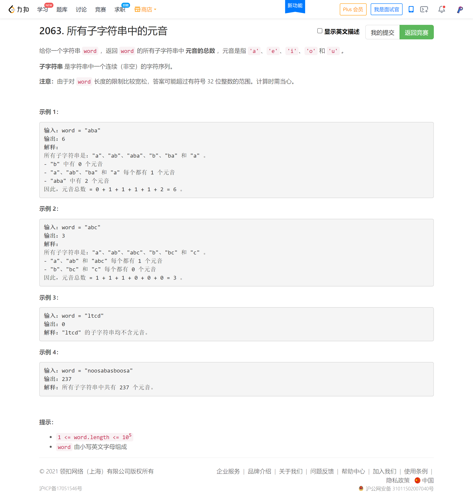
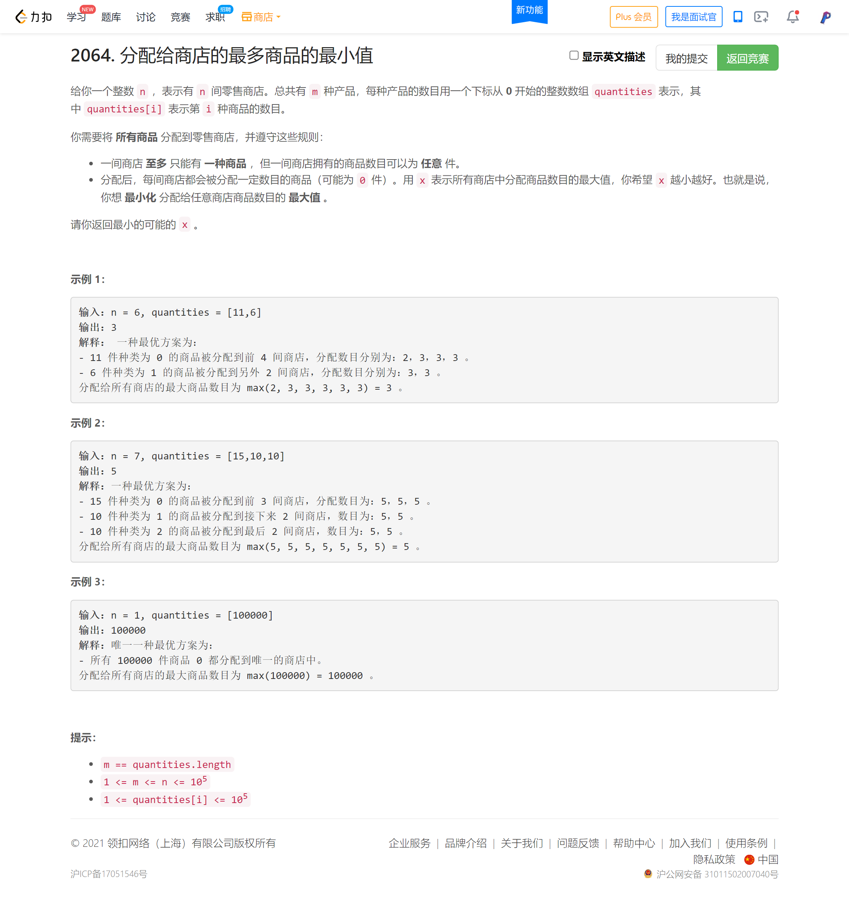
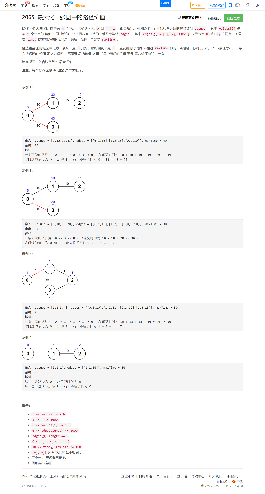

<!-- @import "[TOC]" {cmd="toc" depthFrom=1 depthTo=6 orderedList=false} -->

<!-- code_chunk_output -->

- [所有子字符串中的元音](#所有子字符串中的元音)
- [分配给商店的最多商品的最小值](#分配给商店的最多商品的最小值)
- [最大化一张图中的路径价值](#最大化一张图中的路径价值)

<!-- /code_chunk_output -->

被唬住了，其实题目很常规。基础不牢导致成绩不好。

T2 实际上，就是让我枚举各个子字符串，然后看各个位置出现次数，我当场找的规律，用数学推导推不出来，咱看看高手怎么做的。

T3 写了个动态规划，超时了，过了一些测试用例吧。

T4 没来得及做。

### 所有子字符串中的元音



比赛时现推导的过程如下：

```cpp
// 求各个位置在子字符串中出现次数
typedef long long ll;

class Solution {
public:
    long long countVowels(string word) {
        int n = word.size();
        vector<ll> a(n, 0);
        a[0] = n;
        int base = n - 2;
        for (int i = 1; i < n; ++ i)
        {
            a[i] = a[i - 1] + base;
            base -= 2;
        }

        ll res = 0;
        for (int i = 0; i < n; ++ i)
        {
            char c = word[i];
            if (c == 'a' || c == 'e' || c == 'i' || c == 'o' || c == 'u')
                res += a[i];
        }
        return res;
    }
};

/*
a
a b
a b a
  b
  b a
    a
3 4 3
+1, n=3

a
a b
a b c
a b c d
  b
  b c
  b c d
    c
    c d
      d
4 6 6 4
+2, n=4

a
a b
a b c
a b c d
a b c d e
  4 6 6 4
5 8 9 8 5
+3 +1, n=5

a
a b
a b c
a b c d
a b c d e
a b c d e f
  5 8 9 8 5
6 10 12 12 10 6
+4 +2, n=6

a
a b
a b c
a b c d
a b c d e
a b c d e f
a b c d e f g
  6 10 12 12 10 6
7 12 15 16 15 12 7
+5 +3 +1, n=7
*/
```

### 分配给商店的最多商品的最小值



考试时写的动态规划如下（没过，TLE）：

```cpp
// dp[i][j] 把前 i 个数分成 j 份的最小值

class Solution {
public:
    int get(int a, int b)
    {
        int res = a / b;
        if (res * b == a)
            return res;
        else return res + 1;
    }
    
    int minimizedMaximum(int n, vector<int>& q) {
        int m = q.size();
        
        int dp[m + 1][n + 1];
        memset(dp, 0x3f, sizeof dp);
        
        for (int i = 1; i <= min(q[0], n - m + 1); ++ i)
            dp[0][i] = get(q[0], i);

        for (int i = 1; i < m; ++ i)  // 零食下标从 0 开始，因此这里是 1 开始
            for (int j = i; j <= n; ++ j)  // 前 i - 1 至少已经分了 i 份
            {
                if (dp[i-1][j] == 0x3f3f3f3f) break;  // 没有前置状态
                for (int k = 1; k <= min(q[i], n - j); ++ k)
                {
                    if (n - (k + j) < m - i - 1) break;  // 没给后面的商品留够位置
                    int tmp = max(get(q[i], k), dp[i - 1][j]);
                    dp[i][j + k] = min(tmp, dp[i][j + k]);
                }
            }

        int res = 0x3f3f3f3f;
        for (int i = 0; i <= n; ++ i)
            res = min(dp[m - 1][i], res);

        return res;
    }
};
```

### 最大化一张图中的路径价值



```cpp
```
