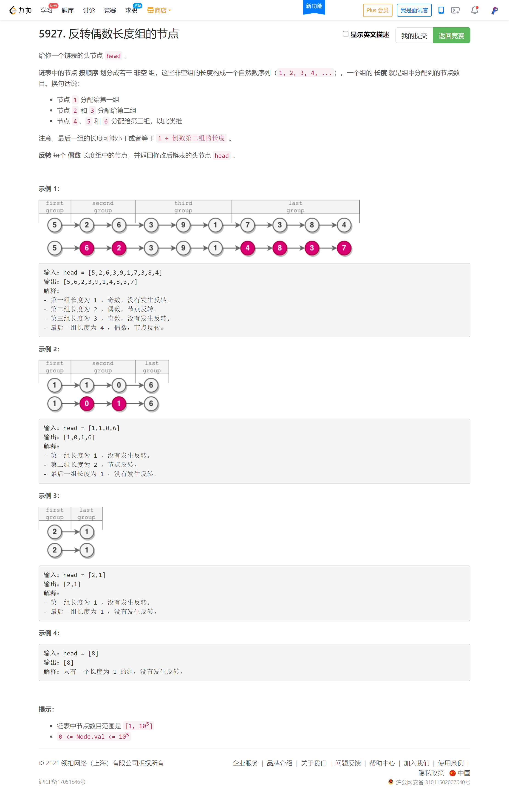
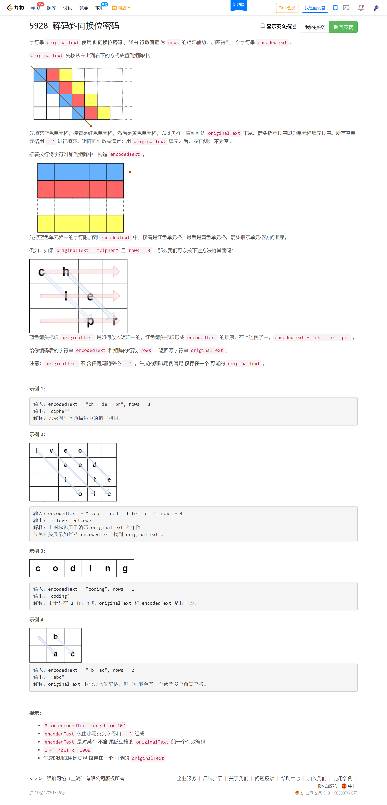
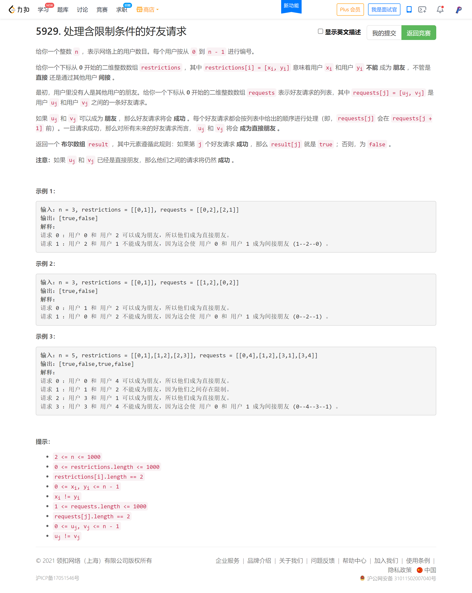

<!-- @import "[TOC]" {cmd="toc" depthFrom=1 depthTo=6 orderedList=false} -->

<!-- code_chunk_output -->

- [反转偶数长度组的节点](#反转偶数长度组的节点)
- [解码斜向换位密码](#解码斜向换位密码)
- [处理含限制条件的好友请求](#处理含限制条件的好友请求)

<!-- /code_chunk_output -->

我是傻逼。

链表心中完全没有章法，不会做。做了一个半小时，不对。

### 反转偶数长度组的节点

### 解码斜向换位密码

### 处理含限制条件的好友请求

