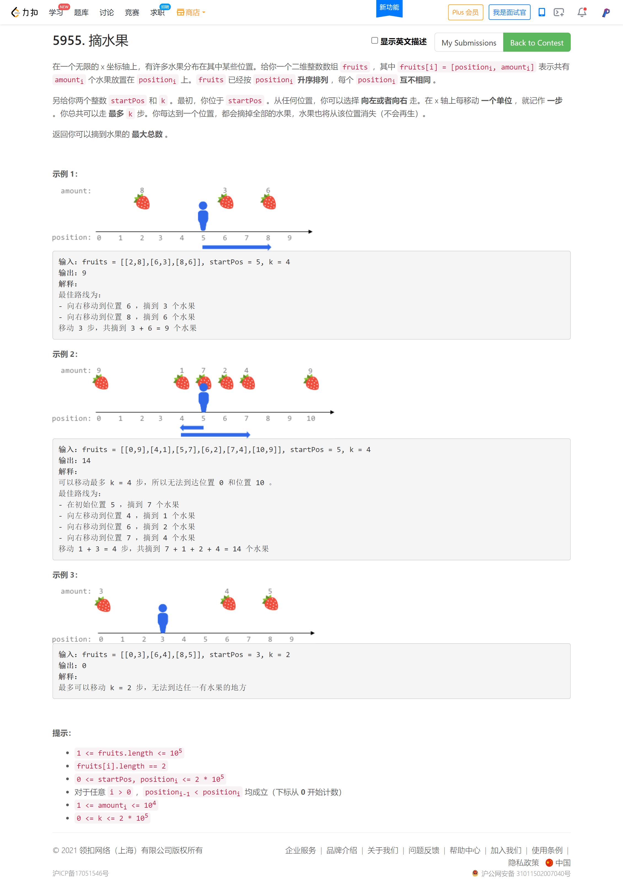

<!-- @import "[TOC]" {cmd="toc" depthFrom=1 depthTo=6 orderedList=false} -->

<!-- code_chunk_output -->

- [5955. 摘水果（前缀和/二分）](#5955-摘水果前缀和二分)

<!-- /code_chunk_output -->

除了 T2 做的都很顺，感觉 T4 现在考二分比较多？无非就是分析一下发现是个线段覆盖的问题，然后二分。

T2 我服了自己，又想复杂了。多思考了半个小时，既然是求`连续`子序列，那么一个 $O(n^2)$ 就可以解决，我还以为是 $O(n!)$ ... 迟迟不敢遍历。

### 5955. 摘水果（前缀和/二分）



简单分析一下，发现无非就是线段 `[l, r]` 覆盖了多少水果。

线段有多少种可能呢？假设人向左走 $y$ 步，然后回到原点，再向右走 $x$ 步，那么区间长度就是：$x + 2y$ ，其中 $x + 2y \le k$ ，区间表示为 `[startPos - y, startPos + x]` 。

同理，如果向右走 $y$ 步，然后回到原点，再向左走 $x$ 步，那么区间表示为 `[startPos - x, startPos + y]` 。

所以我们枚举 `y` 长度就可以把所有最长线段都枚举出来：
```cpp
for (int x = k; x >= 0; -- x)
{
    int y = (k - x) / 2;
    int l, r;
    // x + 2y = k
    l = startPos - x, r = startPos + y;
    ans = max(线段 [l, r] 覆盖了多少水果, ans)
    // 2y + x = k
    l = startPos - y, r = startPos + x;
    ans = max(线段 [l, r] 覆盖了多少水果, ans)
}
```

那么，如何求 `线段 [l, r] 覆盖了多少水果` ？

很容易想到 **前缀和预处理，累加一下各个水果节点数量，然后二分找 `l` 和 `r` 各自对应的水果节点。**

完整代码如下。

```cpp
class Solution {
public:
    int maxTotalFruits(vector<vector<int>>& fruits, int startPos, int k) {
        int n = fruits.size();
        
        // 前缀和，用于求区间 [l, r] 共有多少水果
        vector<int> sum;
        sum.push_back(0);
        for (int i = 1; i <= n; ++ i)
            sum.push_back(fruits[i - 1][1] + sum[i - 1]);

        vector<int> pos;
        for (int i = 0; i < n; ++ i)
            pos.push_back(fruits[i][0]);

        // 枚举可能抵达的区间
        int ans = 0;
        for (int x = k; x >= 0; -- x)
        {
            int y = (k - x) / 2;
            int l, r;
            // x + 2y = k
            l = startPos - x, r = startPos + y;
            auto pl = lower_bound(pos.begin(), pos.end(), l) - pos.begin(), pr = upper_bound(pos.begin(), pos.end(), r) - pos.begin();
            ans = max(ans, sum[pr] - sum[pl]);
            // 2y + x = k
            l = startPos - y, r = startPos + x;
            pl = lower_bound(pos.begin(), pos.end(), l) - pos.begin(), pr = upper_bound(pos.begin(), pos.end(), r) - pos.begin();
            ans = max(ans, sum[pr] - sum[pl]);
        }
        
        return ans;
    }
};
```
