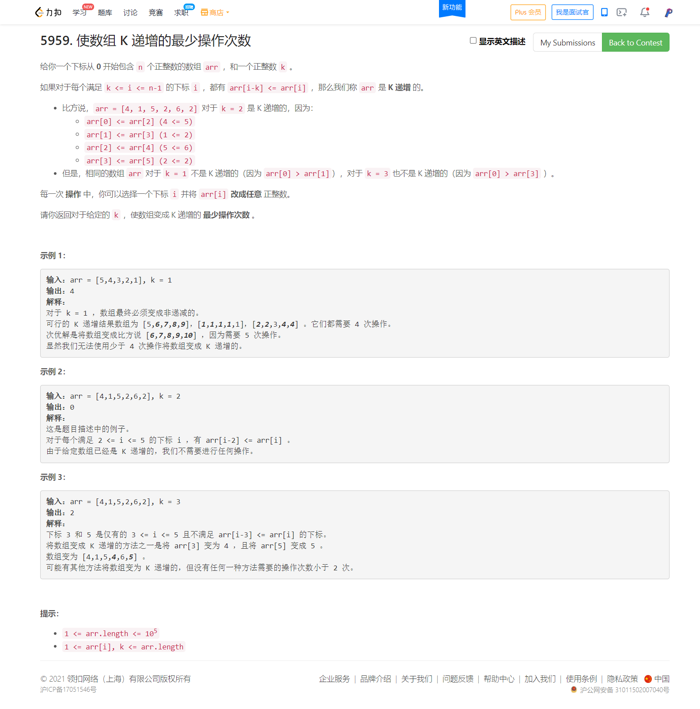

<!-- @import "[TOC]" {cmd="toc" depthFrom=1 depthTo=6 orderedList=false} -->

<!-- code_chunk_output -->

- [5959. 使数组 K 递增的最少操作次数](#5959-使数组-k-递增的最少操作次数)

<!-- /code_chunk_output -->

我必须给自己提个醒：已经进入瓶颈期，比如T2，大概知道怎么做，但是因为大脑的习惯下懒惰，从而不在头脑中复现整个算法的 **具体** 计算流程。

必须突破自己，克服惰性，仔细思考边界值、迭代开始和结束是什么条件会做什么。否则很难在简单题进步。

至于难题，还是多积累，没别的招式。

### 5959. 使数组 K 递增的最少操作次数



比赛时有思路，贪心，一个个比，不对。

唉！这题呀，不就是[周赛253T4](./253.md#找出到每个位置为止最长的有效障碍赛跑路线最长非降子序列)变种吗！ **最长非降子序列/最长递增子序列** 都学过一遍呀！咋就不进脑子呢！这题，白做！

其实也是冤枉了，因为我不知道：**一个数组修改成递增/非降子序列需要把最长的子序列找出来。**

```cpp
class Solution {
public:
    int kIncreasing(vector<int>& arr, int k) {
        int n = arr.size();
        int res = 0;
        for (int sta = 0, cnt = 0; sta < k; ++ sta)
        {
            vector<int> stk;
            cnt = 0;
            for (int i = sta; i < n; i += k)
            {
                auto it = upper_bound(stk.begin(), stk.end(), arr[i]);
                if (it == stk.end()) stk.push_back(arr[i]);
                else stk[it - stk.begin()] = arr[i];
                ++ cnt;
            }
            res += (cnt - stk.size());
        }
        return res;
    }
};
```
