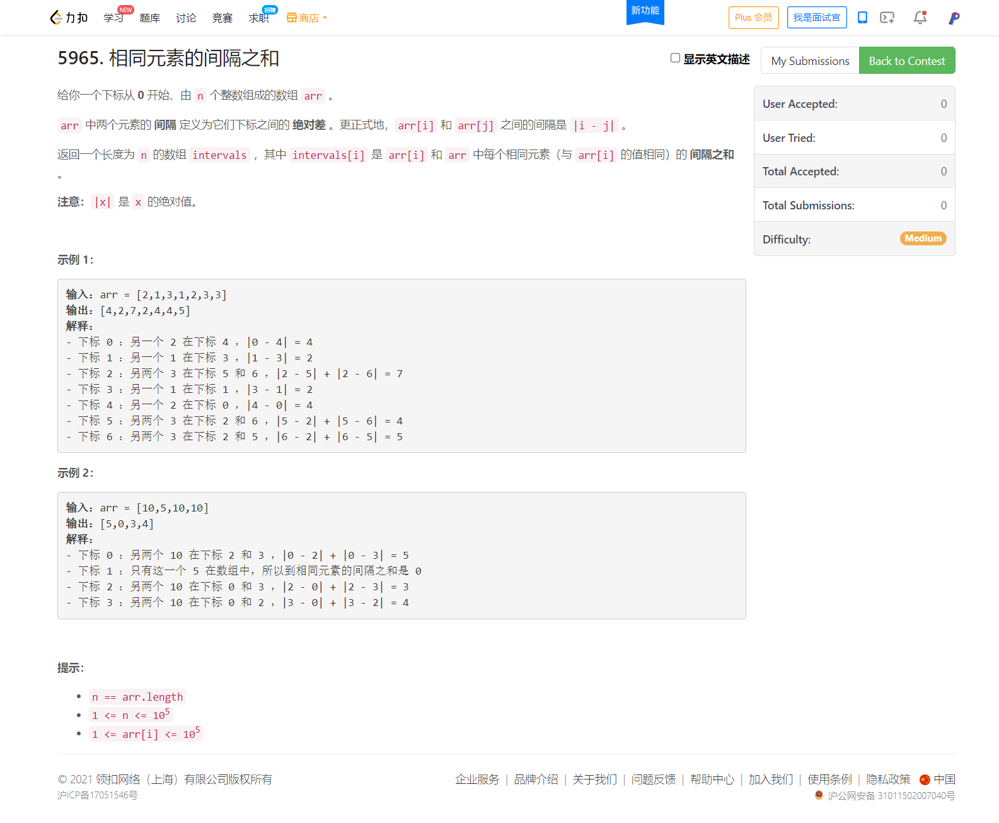
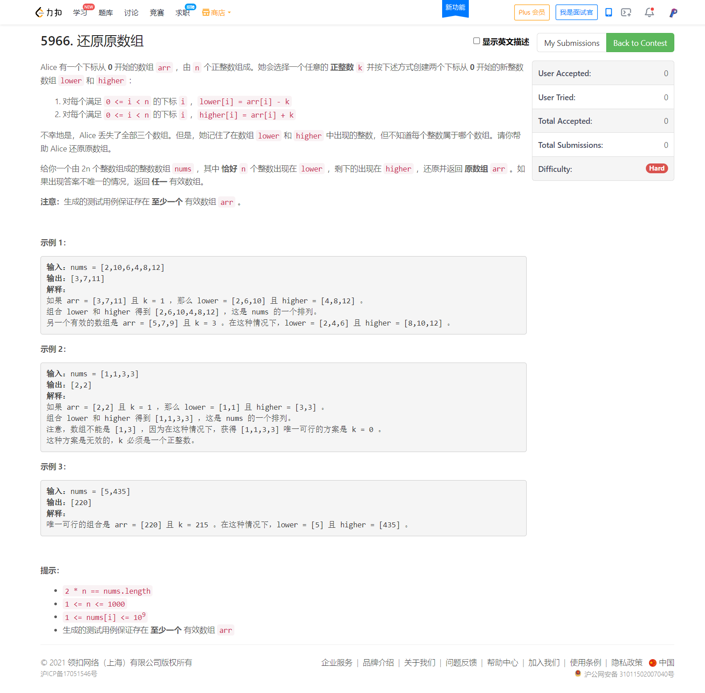

<!-- @import "[TOC]" {cmd="toc" depthFrom=1 depthTo=6 orderedList=false} -->

<!-- code_chunk_output -->

- [5964. 执行所有后缀指令（提交别带上cout）](#5964-执行所有后缀指令提交别带上cout)
- [5965. 相同元素的间隔之和（线段多点距离和/简单推导）](#5965-相同元素的间隔之和线段多点距离和简单推导)
- [5966. 还原原数组](#5966-还原原数组)

<!-- /code_chunk_output -->

### 5964. 执行所有后缀指令（提交别带上cout）

题目是啥不重要。

加了 `cout` 力扣给 TLE 。

```cpp
class Solution {
public:
    vector<int> executeInstructions(int n, vector<int>& startPos, string s) {
        int len = s.size();
        vector<int> ans(len);
        
        map<char, int> dx = {
            {'L', -1}, {'R', 1}, {'U', 0}, {'D', 0}
        };
        map<char, int> dy = {
            {'L', 0}, {'R', 0}, {'U', -1}, {'D', 1}
        };

        for (int i = 0; i < len; ++ i)
        {
            int step = 0;
            int x = startPos[1], y = startPos[0];
            for (int j = i; j < len; ++ j)
            {
                x = x + dx[s[j]], y = y + dy[s[j]];
                if (x < 0 || x >= n || y < 0 || y >= n) break;
                // cout << x << " " << y << endl;
                // ............如果有 cout 会超时
                step ++ ;
            }
            // cout << endl;
            ans[i] = step;
        }
        
        return ans;
    }
};
```

### 5965. 相同元素的间隔之和（线段多点距离和/简单推导）



为了不 $O(n^2)$ 临场推导了一阵子，分析如下：

首先明确我们只考虑相同数值的点之间的关系，因此对各个数值分别处理。

假设数值 `X` 分别处于五个位置 `p0 p1 p2 p3 p4` （下标从 0 开始），那么可视化如下：

```
    p0      p1      p2      p3      p4
        a       b       c       d
```

`a b c d` 分别是这五个点之间的间距： `a = p1 - p0` `b = p2 - p1` `c = p3 - p2` `d = p4 - p3`

因此你可以用最直观的办法，看看 `p0` 位置对应的本题答案是多少：
- `ans[p0]` = `(p4 - p0)` + `(p3 - p0)` + `(p2 - p0)` + `(p1 - p0)`
- `ans[p0]` = `4 * a + 3 * b + 2 * c + 1 * d`

因此对于数 `X` ，我们对应的答案就是：
- `ans[p0] =` `4 * a + 3 * b + 2 * c + 1 * d`
- `ans[p1] =` `1 * a` `+` `3 * b + 2 * c + 1 * d`
- `ans[p2] =` `1 * a + 2 * b` `+` `2 * c + 1 * d`
- `ans[p3] =` `1 * a + 2 * b + 3 * c` `+` `1 * d`
- `ans[p4] =` `1 * a + 2 * b + 3 * c + 4 * d`

发现规律了吗？

这里我有意把 `ans` 分成两个部分，记为左手边 `lhs` 和右手边 `rhs` 。对于最左边的 `p0` ，其 `lhs = 0` ， `rhs = 4 * a + 3 * b + 2 * c + 1 * d` ；而对于 `p1` ，其 `lhs = 1 * a` ， `rhs = 3 * b + 2 * c + 1 * d` 。

我们再重新整理一下符号，对于 `n` 个点：
- 其位置记为 `p[0], p[1], ..., p[n - 1]`
- 相邻下标举例 `segs[0], segs[1], ..., segs[n - 2]`

因此有：
- `lhs[0] = 0`
- `lhs[i] = lhs[i] + i * segs[i - 1]`
- `rhs[0] = (n - 1) * segs[0] + ... + 1 * segs[n - 2]`
- `rhs[i] = rhs[i] - (n - i) * segs[i - 1]`

完整代码如下：

```cpp
typedef long long LL;

class Solution {
public:
    vector<long long> getDistances(vector<int>& arr) {
        int n = arr.size();
        vector<LL> ans(n);
        unordered_map<int, vector<int>> pos;
        for (int i = 0; i < n; ++ i)
            pos[arr[i]].push_back(i);
        for (auto&& [k, v]: pos)
        {
            LL lhs = 0, rhs = 0;
            int m = v.size();
            vector<LL> segs(m - 1);
            for (int i = 0; i < m - 1; ++ i)
                segs[i] = v[i + 1] - v[i];
            for (int i = 0; i < m - 1; ++ i)
                rhs = rhs + segs[i] * (m - 1 - i);
            ans[v[0]] = rhs;
            for (int i = 1; i < m; ++ i)
            {
                lhs = lhs + segs[i - 1] * i;
                rhs = rhs - segs[i - 1] * (m - i);
                ans[v[i]] = lhs + rhs;
            }
        }
        return ans;
    }
};
```

### 5966. 还原原数组



考试时写了个很丑的 dfs ，过了短的测试点，其他店 TLE 了。

后来分析出：对 `nums` 排序，只枚举较小的数组就行，较大的数组之间的位置间隔，一定是与较小的数组之间的位置间隔相同的。因为一个大数对应一个小数。可惜时间已经不够了，而且没有特别明确的代码思路。

看看高手咋做的吧。

```cpp

```
